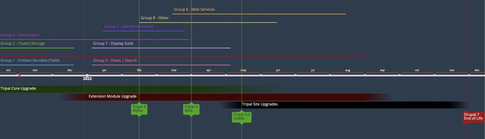

# Tripal 4 Drupal 9

## UNDER ACTIVE DEVELOPMENT

This project acts as the home of Tripal 4 development. Once Tripal 4 is stable, it will be merged back into the [Core Tripal Repository](https://github.com/tripal/tripal).

**All PRs should be made against branch 9.x-4.x which is compatible with Drupal 9.0.x and 9.1.x**

## Documentation

[Documentation for Tripal 4 has begun on ReadtheDocs](https://tripal4.readthedocs.io/en/latest/dev_guide.html). **Please keep in mind the URL for this documentation will change once Tripal 4 is released.**

  - [Installation](https://tripal4.readthedocs.io/en/latest/install.html)
  - [Automated Testing](https://tripal4.readthedocs.io/en/latest/dev_guide/testing.html)
  - [Developer Guide](https://tripal4.readthedocs.io/en/latest/dev_guide.html)
  - [Contribution Guide](https://tripal4.readthedocs.io/en/latest/contributing.html)

## Tripal Docker

Tripal Docker is currently focused on Development and Unit Testing. There will be a production focused Tripal Docker soon and if you're interested in helping or providing tips -please join us on our Slack channel!

For more information about how to use our fully functional development docker, see [our documentation on ReadtheDocs!](https://tripal4.readthedocs.io/en/latest/install/docker.html)

# Upgrade Progress

### How to get involved!

This upgrade to Drupal 9 is a community effort. As such, we NEED YOUR HELP!

  - To get involved, please join [our Tripal Slack](http://tripal.info/join/slack) and comment in the #core-dev channel.
    - Alternatively, feel free to contact Lacey-Anne Sanderson through Slack direct message.
    - We can use help both with programming, documentation, outreach and welcome all individuals from all backgrounds!
  - We prefer [automated testing](https://tripal4.readthedocs.io/en/latest/dev_guide/testing.html) for all Pull Requests (PRs) and are happy to guide you through the process!
    - Just comment on the issue if you need help designing tests
    - If you need help implementing tests see our [documentation](https://tripal4.readthedocs.io/en/latest/dev_guide/testing.html)
  - If more documentation would be helpful, [let us know what is missing here](https://github.com/tripal/t4d8/issues/16) and we'll add it

# Timeline

