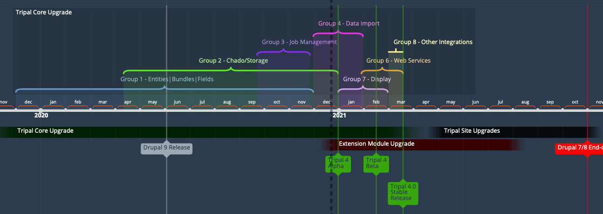

# Tripal 4 Drupal 9

## UNDER ACTIVE DEVELOPMENT

This project acts as the home of Tripal 4 development. Once Tripal 4 is stable, it will be merged back into the [Core Tripal Repository](https://github.com/tripal/tripal).

**All PRs should be made against branch 9.x-4.x which is compatible with Drupal 8.8.x, 8.9.x and 9.0.x**

## Documentation

[Documentation for Tripal 4 has begun on ReadtheDocs](https://tripal4.readthedocs.io/en/latest/dev_guide.html). **Please keep in mind the URL for this documentation will change once Tripal 4 is released.**

  - [Installation](https://tripal4.readthedocs.io/en/latest/install.html)
  - [Automated Testing](https://tripal4.readthedocs.io/en/latest/dev_guide/testing.html)
  - [Developer Guide](https://tripal4.readthedocs.io/en/latest/dev_guide.html)
  - [Contribution Guide](https://tripal4.readthedocs.io/en/latest/contributing.html)

# Upgrade Progress

### How to get involved!

This upgrade to Drupal 8 is a community effort. As such, we NEED YOUR HELP!

  - [Current issues sorted by priority](https://github.com/tripal/t4d8/projects/1)
  - To take one on, just comment with your intent!
  - If a given issue feels too large for you, include what portion you will be taking on in your intention comment :-)
  - We are happy to provide more guidance, so if you want to take on a given issue but are uncertain how to start -just ask!
  - We prefer [automated testing](https://tripal4.readthedocs.io/en/latest/dev_guide/testing.html) for all Pull Requests (PRs) and are happy to guide you through the process!
    - Just comment on the issue if you need help designing tests
    - If you need help implementing tests see our [documentation](https://tripal4.readthedocs.io/en/latest/dev_guide/testing.html)
  - If more documentation would be helpful, [let us know what is missing here](https://github.com/tripal/t4d8/issues/16) and we'll add it

# Timeline

