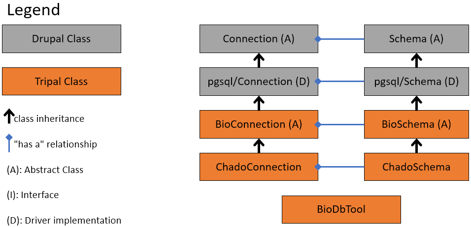
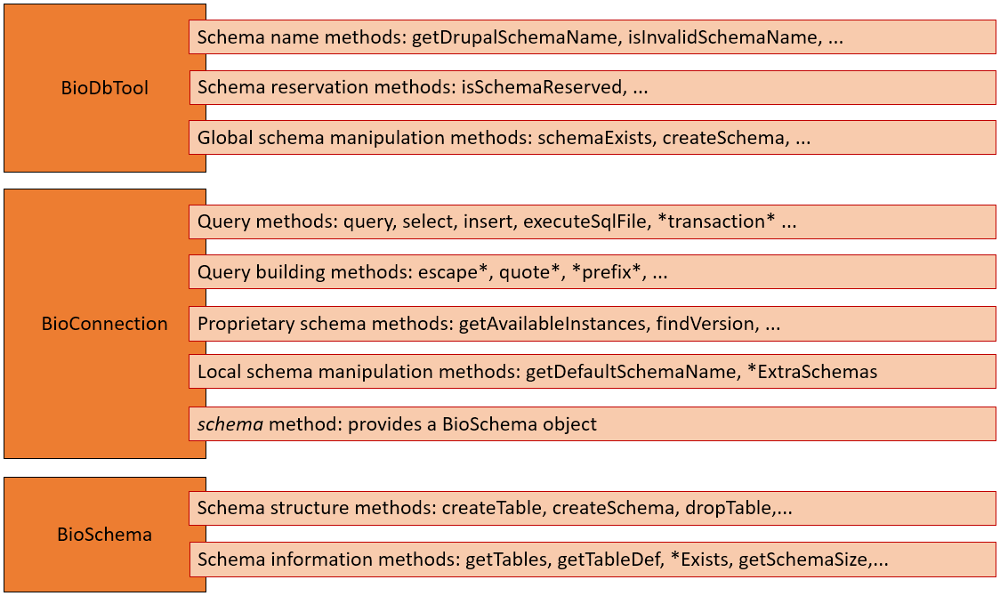
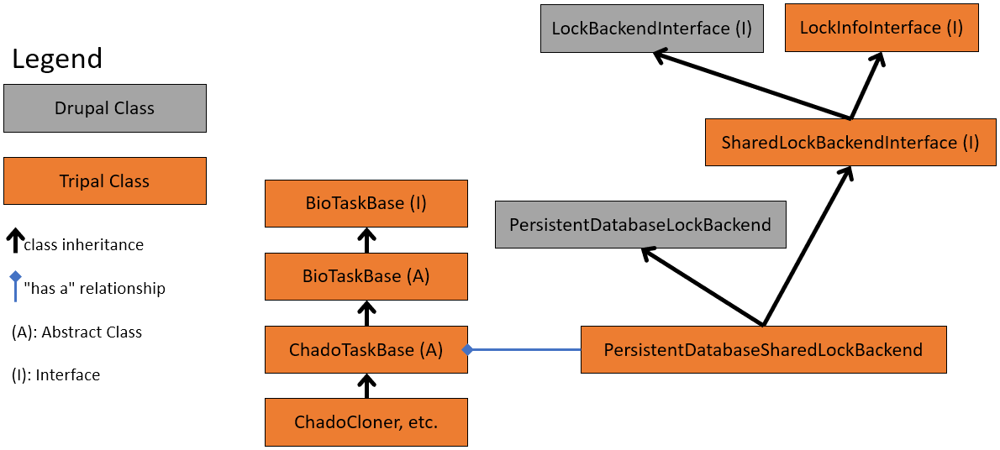
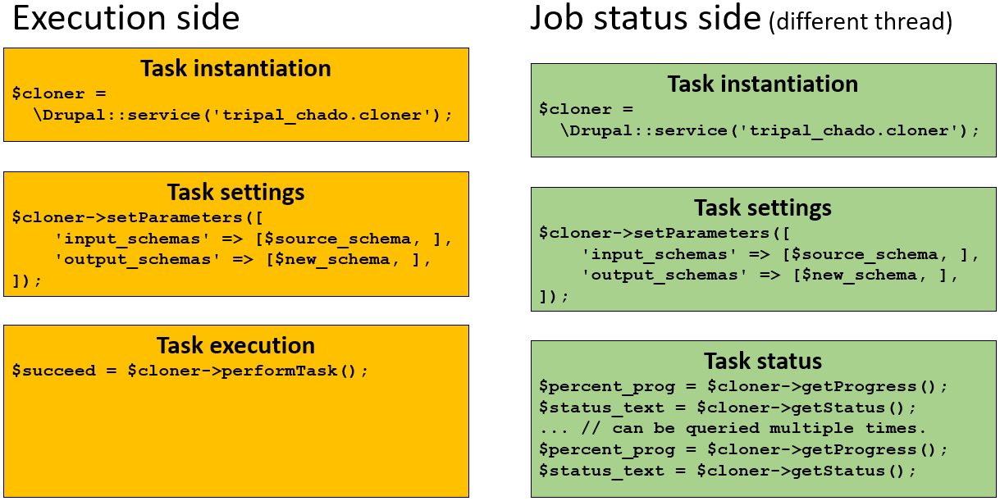

Design Summary
==============

The Biological Database API provides an API for biological databases but also
an API to manage concurrent data manipulation tasks: a Task API. This API is
composed by a Task interface (and base implementation) and an extension of
Drupal Lock API that supports shared locks. Finally, a set of exception classes
has been added in order to finely manage thos new API exceptions.

Biological Database API
-----------------------

The following figure gives a high-level overview of the classes provided by the
Biological Database API and their relationship to the Drupal API:

This next figure shows which types of methods are provided by which class.

As shown above, BioConnection and BioSchema classes inherit from Drupal classes.
You can find inherited methods from Drupal official documentation:

 - `Connection class <https://api.drupal.org/api/drupal/core!lib!Drupal!Core!Database!Connection.php/class/Connection/9.3.x>`_
 - `Schema class <https://api.drupal.org/api/drupal/core!lib!Drupal!Core!Database!Schema.php/class/Schema/9.3.x>`_

Many other methods are available and described in the source code of
BioConnection, BioSchema and BioDbTool.

Task API
--------

The purpose of the task API is to provide a common class interface for all
database-related tasks. Thus, all tasks can be managed from a same user
interface or command line tool the same way.

Obviously, sometimes, some database task may require more than a couple of
seconds to perform their job. During that time, no other task should be allowed
to modify the database concurrently to avoid data corruption. That's why a
Lock API has been added in order to lock a database schema during a task and 
avoid data corruption issues.

While using an exclusive lock on a schema for a task that modifies the data, to
prevent other tasks accessing that data, perfectly makes sense, tasks that just
require the data to remain unchanged while they are completing their job could
share a same "read-only" lock. Therefore, the lock API provides 2 lock flavors:

 - exclusive locks for modified schemas
 - shared locks for schemas only used for reading

Those two flavors are provided by the PersistentDatabaseLockBackend class
through the methods ::acquire() and ::acquireShared().

The following figure gives an overview of the classes provided by the Task
API:

The task life cycle is displayed in the figure below with the example of a
database schema cloner task.

On the left side (yellow), the life cycle of a cloner task execution is
described as follow:

 1. First, a cloner task object is instanciated using Drupal services.
 2. Then, its parameters are set. ``$source_schema`` would be the name of the
    schema to clone which will be locked with a shared lock (read only).
    ``$new_schema`` would be the name of the new schema that will receive a copy
    of ``$source_schema``. ``$new_schema`` will be locked for exclusive use and
    no other task would be able to use it until the exclusive lock is released.
 3. Finaly, the task is performed and an execution status is returned.

On the right side (green), the life cycle of a cloner task status tracking. In
that part, a task is created and setup using the exact same steps 1. and 2. of
the executed task. However, the third step differs since we just want the status
of another task with the same parameters currenlty running. Two methods can be
used:

 - getProgress: to get the percent of task completion (returns a float number
   between 0 and 1).
 - getStatus: to get a human readable text status of the current task.
