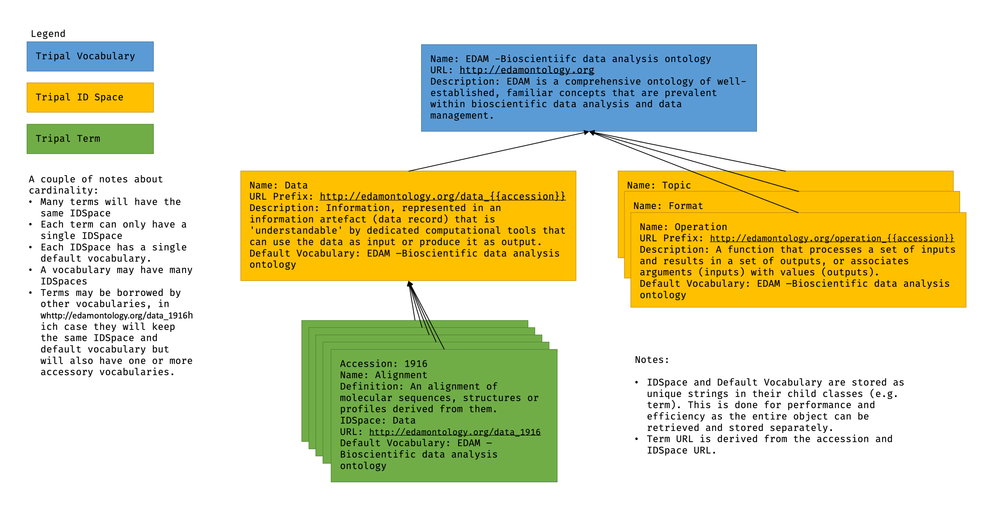
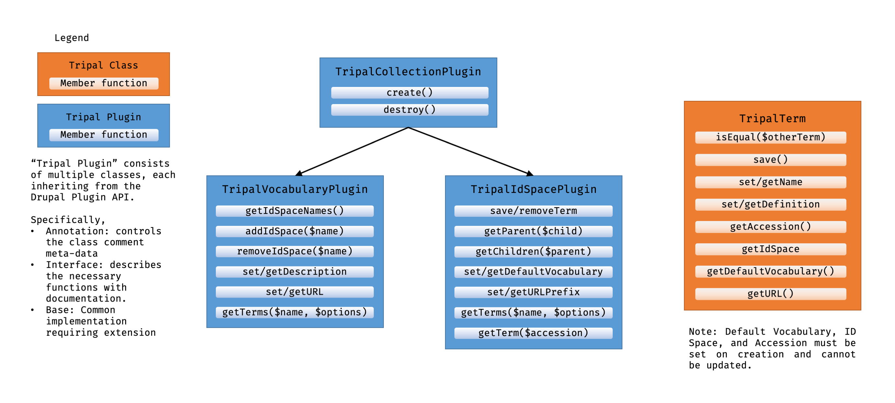

Design Summary
================

The following figure provides an example of the relationships between Tripal Vocabularies, ID Spaces, and Terms:

With the above figure in mind, here is a breif summary of the overall plan:

 - Vocabulary and IDSpaces will be implemented using the Drupal Plugin API.
 - Terms will not be plugins and their storage will be handled by their IDSpace.
 - Using plugins ensures that alternate storage backends are supported and easy to implement.
 - You can retrieve a term (or list of terms) flexibly depending on the information you have (see table below).
 - This model supports a term existing in multiple vocabularies (accessory) while ensuring attribution is given to the original vocabulary (default).

.. table:: Ways to search for TripalTerms

	+------------------+----------------+------------+-----------------+----------+-------------+
	| Class            | Method         | Return     | Search Property | IDSpace* | Vocabulary* |
	+==================+================+============+=================+==========+=============+
	| TripalTerm       | suggestTerms+  | array      | name            | No       | No          |
	+------------------+----------------+------------+-----------------+----------+-------------+
	| TripalVocabulary | getTerms       | array      | name            | No       | Yes         |
	+------------------+----------------+------------+-----------------+----------+-------------+
	| TripalIdSpace    | getTerms       | array      | name            | Yes      | Yes         |
	+------------------+----------------+------------+-----------------+----------+-------------+
	| TripalIdSpace    | getTerm        | TripalTerm | accession       | Yes      | Yes         |
	+------------------+----------------+------------+-----------------+----------+-------------+
	| TripalIdSpace    | getParent      | TripalTerm | TripalTerm      | Yes      | Yes         |
	+------------------+----------------+------------+-----------------+----------+-------------+
	| TripalIdSpace    | getChildren    | array      | TripalTerm      | Yes      | Yes         |
	+------------------+----------------+------------+-----------------+----------+-------------+

| *\* These two columns indicate information which is required for the search.*
| *\+ This is a static method of TripalTerm.*

The following figure gives a high-level overview of the planned classes and their relationship to each other and the Drupal API:

