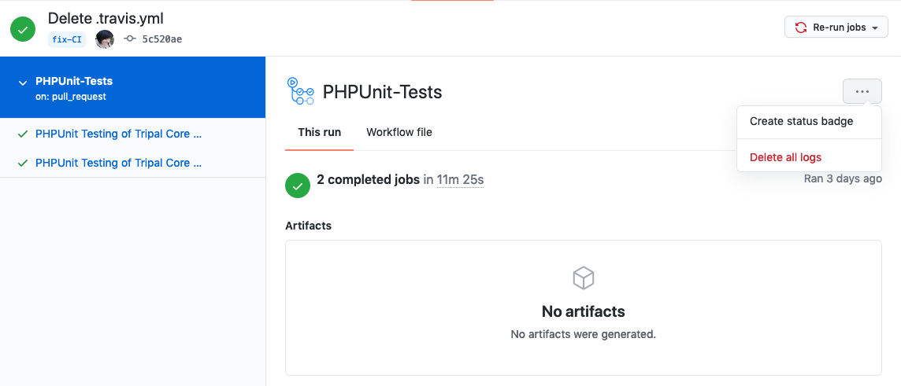

Continuous Integration
========================

Continuous integration refers to an active code base where multiple developers are integrating their changes continuously into a single cohesive project. One of the biggest keys to making continuous integration work is testing before integrating! Tripal Test Suite makes developing tests using PHPUnit much easier and this tutorial will show you how to ensure those tests are run every time you push to GitHub!

Using GitHub Workflows
------------------------

First, what is a GitHub Workflow? From GitHub, "a workflow is a configurable automated process made up of one or more jobs". I like to think of it as configuring a bioinformatics pipeline. For the purposes of this tutorial, we are telling GitHub how to execute our PHPUnit tests automatically.

You can learn more about `GitHub Action Workflows from GitHub directly <https://docs.github.com/en/free-pro-team@latest/actions/learn-github-actions/introduction-to-github-actions>`_. We will cover it breifly here specifically for Tripal PHPUnit testing but the official tutorial is still recommended.

Telling GitHub about your workflow
^^^^^^^^^^^^^^^^^^^^^^^^^^^^^^^^^^^^

This is as simple as creating your workflow file in the right place. You want to create a new file named `phpunit.yml` at `.github/workflows/` in your repository. GitHub will automatically know this file describes a workflow and will execute the workflow based on the configuration you provide.

Configuring a workflow to run PHPUnit tests
^^^^^^^^^^^^^^^^^^^^^^^^^^^^^^^^^^^^^^^^^^^^^^^^^^

All configuration will be done in the file created in step 1.

First we provide the name, when we want to run the workflow (i.e. on push and PRs) and the basic structure of a workflow:

.. code-block:: yaml

  name: PHPUnit

  # Controls when the workflow will run.
  # Run this workflow every time a new commit is pushed to your repository
  on: [push, pull_request]

  jobs:
    # This key is the name of the job.
    run-tests:
      # The type of system that the job will run on.
      runs-on: ubuntu-latest

We want our tests to be run twice, one for PHP 7.1 and another for PHP 7.1. This is done by specifing a matrix build which can be done as follows:

.. code-block:: yaml

  jobs:
    # This key is the name of the job.
    run-tests:
      # The type of system that the job will run on.
      runs-on: ubuntu-latest

      # Matrix Build for this job.
      strategy:
        matrix:
          php-versions: ['7.1', '7.2']

      # Name the matrix build so we can tell them apart.
      name: PHPUnit Testing (PHP ${{ matrix.php-versions }})

We also want to tell GitHub to setup a PostgreSQL server for us. This is done using services:

.. code-block:: yaml

  jobs:
    # This key is the name of the job.
    run-tests:
      # The type of system that the job will run on.
      runs-on: ubuntu-latest

      # Service containers to run with `run-tests`
      services:
        # Label used to access the service container
        postgres:
          # Docker Hub image
          image: postgres
          env:
            POSTGRES_USER: tripaladmin
            POSTGRES_PASSWORD: somesupersecurepassword
            POSTGRES_DB: testdb
          # Set health checks to wait until postgres has started
          options: >-
            --health-cmd pg_isready
            --health-interval 10s
            --health-timeout 5s
            --health-retries 5
          ports:
            # Maps tcp port 5432 on service container to the host
            - 5432:5432

Finally we can actually tell GitHub what steps we want to run using this beautiful container we have setup! We want to:

.. code-block:: yaml

  jobs:
    # This key is the name of the job.
    run-tests:
      # The type of system that the job will run on.
      runs-on: ubuntu-latest

      steps:
      # 1) Checkout the repository and setup workspace.
      - uses: actions/checkout@v2

      # 2) Setup PHP according to the version passed in.
      - name: Setup PHP
        uses: shivammathur/setup-php@v2
        with:
          php-version: ${{ matrix.php-versions }}
          extensions: mbstring, intl, php-pgsql, php-gd, php-xml
          ini-values: memory_limit=2G
          coverage: xdebug
          tools: composer, phpunit

      # 3) Install Drush/Drupal/Tripal
      - name: Setup Drush, Drupal 7.x, Tripal 3.x
        id: tripalsetup
        uses: tripal/setup-tripal-action@7.x-3.x-1.0
        with:
          postgres_user: tripaladmin
          postgres_pass: somesupersecurepassword
          postgres_db: testdb

      # 4) Install Tripal Extension Module.
      - name: Install Tripal Extension Module
        id: installextension
        env:
          DRUSH: ${{ steps.tripalsetup.outputs.drush_path }}
          DRUPAL_ROOT: ${{ steps.tripalsetup.outputs.drupal_root }}
        run: |
          mkdir -p $DRUPAL_ROOT/sites/all/modules/example_module
          cp -R * $DRUPAL_ROOT/sites/all/modules/example_module
          cd $DRUPAL_ROOT
          $DRUSH en -y example_module

      # 5) Runs the PHPUnit tests.
      # https://github.com/mheap/phpunit-github-actions-printer is used
      # to report PHPUnit fails in a meaningful way to github in PRs.
      - name: PHPUnit Tests
        env:
          DRUSH: ${{ steps.tripalsetup.outputs.drush_path }}
          DRUPAL_ROOT: ${{ steps.tripalsetup.outputs.drupal_root }}
        run: |
          cd $DRUPAL_ROOT/sites/all/modules/example_module
          composer require --dev mheap/phpunit-github-actions-printer --quiet
          composer update --quiet
          ./vendor/bin/phpunit --printer mheap\\GithubActionsReporter\\Printer

In step 4 above, I have provided an example of what installing your extension module might look like. The run section will need to be modified according to your module and should include downloading and installing any dependencies, applying any patches and installing your module. If your tests require configuration then that should also be included here.

In step 5 we run our PHPUnit tests! All you need to change here is the directory name for your module. The `mheap\\GithubActionsReporter\\Printer` will ensure any errors reported by PHPUnit are shown on your PR and Action summary.

All steps before step 4 should be generic for any extension module! You can find the full configuration file on the `README of the SetupTripalAction <https://github.com/tripal/setup-tripal-action#usage>`_.

Checking your Action
----------------------

Everytime you push commits to your repository and when you create a pull request, your action will be run. Thus to test your action, commit your phpunit.yml file created above to trigger the GitHub action. Then click on "Actions" at the top of your repository to see it in progress.

If you created a pull request, you will see your workflow action in the checks section at the bottom of your pull request. From here you can click on Details to see the full running of the job.

Adding the Badge to your README
---------------------------------

Click on Actions at the top of your repository, then click on one of the PHPUnit jobs which have already been submitted. This brings you to the job summary page where you will see a button with three dots in the top right corner. Click on this and then "Create status badge" to get the markdown to add to your README.

