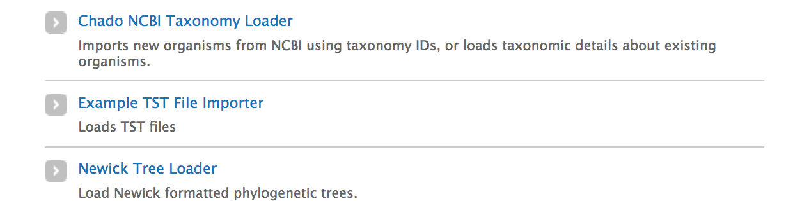
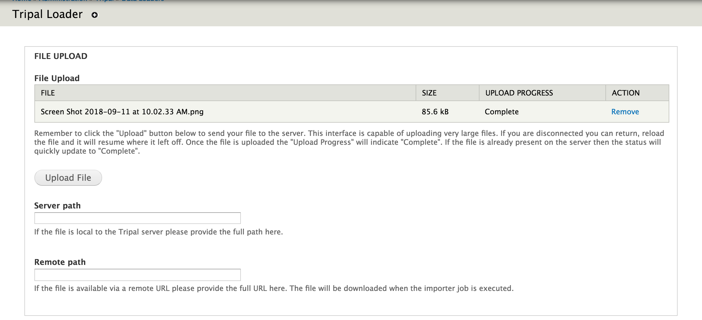
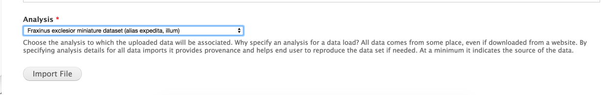
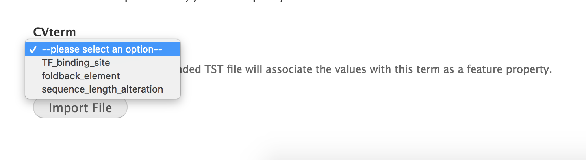

Creating Custom Data Loaders
==============================


.. note::

  This documentation is currently being developed.  There is a corresponding walkthrough on youtube that will be posted soon.


The ``TripalImporter`` class can be extended to create your own data loader.  This class provides many conveniences: for example, it handles file input, job submission.

Create the File
----------------
To create your own Importer, you simply need to define a new class that extends ``TripalImporter``.  You should place this class in its own ``.inc`` file at ``includes/TripalImporter/``.  For our example, we'll place the following file at ``tripal_example_importer/includes/TripalImporter/ExampleImporter.inc``.

.. code-block:: php

  class ExampleImporter extends TripalImporter {
  }

There is no need to include the importer in your module: simply placing it in the ``/includes/TripalImporter/`` folder of your module is enough: it will appear at ``admin -> Tripal -> Data Loaders``.  If Tripal cannot find your importer, double check that the file path is correct, and clear your cache (``drush cc all``).


Static Variables
-----------------

Your importer should overwrite any of the ``public static`` variables that should be different from the default.

.. note::

  For the sake of simplicity, we do not override many of the default settings, and we do not include the full inline code documentation.  Please see the class documentation for a full list of options.


.. code-block:: php


  /**
   * @see TripalImporter
   */
  public static $name = 'Example TST File Importer';

  public static $machine_name = 'tripal_tst_loader';

  public static $description = 'Loads TST files';

  public static $file_types = ['txt', 'tst', 'csv'];

  public static $upload_description = 'TST is a fictional format.  Its a 2-column, CSV file.  The columns should be of the form featurename, and text';

  public static $methods = [
    // Allow the user to upload a file to the server.
    'file_upload' => TRUE,
    // Allow the user to provide the path on the Tripal server for the file.
    'file_local' => TRUE,
    // Allow the user to provide a remote URL for the file.
    'file_remote' => TRUE,
  ];

The variables that are ``private static`` **should not** be changed.


Now that we've given our importer a name and description, it will show up at ``/admin/tripal/loaders``:




Form Components
-----------------

We next need to create an interface for users to fill out additional information for their data.

There are three standard Drupal form hooks: ``form``, ``form_validate``, ``form_submit``. The **TripalImporter** wraps these for us as ``form`` and ``formValidate``: typically the base class's ``formSubmit`` does not need to be modified.

.. note::

  Please see the Drupal documentation for the Form API reference, available `here for Drupal 7 <https://api.drupal.org/api/drupal/developer%21topics%21forms_api_reference.html/7.x>`_.  This tutorial will only scratch the surface of the Form API.


form
^^^^^^^^^

This function will provide all of the input widgets required for the user to run the form.  The global settings above ::ref:`<Static Variables>`_ provide some elements "out of the box".  A totally empty TripalImporter class can provide the tow below components: the **files** section, and an **analysis** selector.

The **File Upload** area lets users choose to upload a file manually using the interface, or, to provide a **Server path** or **Remote path** for the file.





Our overly simplistic TST reader example only needs to do one thing: let the user pick a CVterm.  The importer will then read the file, split it into feature and values, and insert into featureprop using the ``type_id`` the user specified in the form.

Our form might therefore be something as simple as this:

.. code-block:: php
  :name: ExampleImporter::form


  public function form($form, &$form_state) {
  $options = [];

      #an array of random sequence ontology terms the user can select from.
      $terms = [array('id' => 'SO:0000235'), ['id' => 'SO:0000238'], ['id' => 'SO:0000248'] ];

      $options[0] = '--please select an option--';

      foreach ($terms as $term){
        $term_object = chado_get_cvterm($term);
        $id = $term_object->cvterm_id;
        $options[$id] = $term_object->name;
      }

          $form['pick_cvterm'] =  [
            '#title' => 'CVterm',
            '#description' => 'Please pick a CVterm.  The loaded TST file will associate the values with this term as a feature property.',
            '#type' => 'select',
            '#default_value' => '0',
            '#options' => $options
            ];

    return $form;
  }

Our form now has a select box!




What about responsive form elements?
"""""""""""""""""""""""""""""""""""""

.. note::

  This section coming soon. For now, check out the Drupal AJAX guide https://api.drupal.org/api/drupal/includes%21ajax.inc/group/ajax/7.x


formValidate
^^^^^^^^^^^^^^^

This function is responsible for verifying that required fields are filled out, and that supplied values are valid.  If something is invalid, use ``form_set_error()`` provide an error message and Drupal will mark that piece of the form in red.
In our example code, we should check that the user picked a CVterm in the ``pick_cvterm`` element.


.. code-block:: php

  public function formValidate($form, &$form_state) {
    parent::formValidate($form, $form_state);

    $chosen_cvterm = $form_state['values']['pick_cvterm'];
    if ($chosen_cvterm == 0) {
      form_set_error('pick_cvterm', 'Please choose a CVterm.');
    }
  }

This very simple validation function looks for the ``pick_cvterm`` element of the ``$form_state`` and ensures the user selected something.  Your own validation may be more complex (for example, ensuring a regular expression is valid, or that a term exists in the database) but the principle will be the same.


Importer Logic
---------------

run
^^^^^^^^^^^^

If ``formValidate`` did not encounter any ``form_set_error``, the importers ``run`` function will execute.  Between the ``formValidate`` and the ``run``, other things have happened: for example, the file was downloaded if a remote URL was given.

The run function should collect the arguments from the importer, and perform the logic of loading your file.


.. code-block:: php

    /**
     * @see TripalImporter::run()
     */
    public function run() {

      $arguments = $this->arguments['run_args'];
      $file_path = $this->arguments['files'][0]['file_path'];

      $analysis_id = $arguments['analysis_id'];
      $cvterm = $arguments['pick_cvterm'];

      $this->loadMyFile($analysis_id, $file_path, $cvterm);
    }

Loading the File
^^^^^^^^^^^^^^^^^^

We've constructed a form and passed the form arguments to our loader.  Now we need to run the logic that will read the file and load the data into the database.

For starters, lets examine how TripalImporters uses Tripal Jobs.  If we make the below our ``loadMyFile`` function, we can confirm that our job runs with all of the expected variables.


.. code-block:: php

  public function loadMyFile($analysis_id, $file_path, $cvterm){
    var_dump(["this is running!", $analysis_id, $file_path, $cvterm]);
  }


Fill out the form and press submit.  If there are no validation errors, we'll receive notice that our job was submitted and given a command (on my site its: ```drush trp-run-jobs --username=admin --root=/Users/chet/UTK/tripal
``) to run the job with drush.  Let's run it and see what happens.

.. code-block:: bash

    Calling: tripal_run_importer(146)

    Running 'Example TST File Importer' importer
    NOTE: Loading of file is performed using a database transaction.
    If it fails or is terminated prematurely then all insertions and
    updates are rolled back and will not be found in the database

    array(4) {
      [0]=>
      string(16) "This is running!"
      [1]=>
      string(3) "147"
      [2]=>
      string(3) "695"
      [3]=>
      string(72) "/Users/chet/UTK/tripal/sites/default/files/tripal/users/1/expression.tsv"
    }

    Done.

    Remapping Chado Controlled vocabularies to Tripal Terms...


As you can see, running the job executes our run script, and we have all the variables we need to load the data.  All we need to do now is write the code!

The below code is nothing special: it uses ``chado_select_record`` to match the featurename in the input file to the database, and ``chado_insert_property`` to add the property value.


.. code-block:: php

  public function loadMyFile($analysis_id, $file_path, $cvterm){

    //Loop through lines of file
    while ($line = fgets($file_path)) {

          //split line on ,
          $cols = explode(",", $line);

          $feature_name = $cols[0];
          $this_value = $cols[1];

          //skip headers
          if ($feature_name == 'Feature name'){
            continue;
          }

          //Fetch feature ID
          $feature_record = chado_select_record('feature', ['feature_id'], ['uniquename' => $feature_name]);

          //prepare and insert the property
          $record = ['table' => 'feature', 'id' => $feature_record];
          $property = [
            'type_id' => $cvterm_id,
            'value' => $this_value,
          ];

          $options = ['update_if_present' => TRUE];
          chado_insert_property($record, $property, $options);
    }
  }


Testing Importers
------------------


If you haven't already, look into Tripal Test Suite for adding tests to your Tripal module.  It will automatically set up and bootstrap Drupal and Tripal for your testing environment, as well as provide things like DB Transactions for your tests, factories to quickly generate data.  This demo will use Tripal Test Suite.

.. note::
  Before continuing, please install and configure Tripal Test Suite.

  For instructions on how to install, configure, and run Tripal Test Suite, `please see the Tripal Test Suite documentation. <https://tripaltestsuite.readthedocs.io/en/latest/>`_


Example file
^^^^^^^^^^^^^^^^

Including a small example file is good practice both to ensure that your loader works as intended, and for new developers to easily see what the expected file format is.  For our ExampleImporter, I'll include this sample file with the module at ``tests/data/example.txt``.

.. csv-table:: Example input file
  :header: "Feature name", "CVterm value"

  "test_gene_1", "blue"
  "test_gene_2", "red"


Loading the Importer
^^^^^^^^^^^^^^^^^^^^^^^^^

Because TripalImporters are not explicitly loaded in your module (note that we never use ``include_once()`` in our ``.module`` file or anything similar), we must add it to our test class explicitly.

The below code loads the Importer class, creates a new instance, prepares the files (important to support all file types) and then runs the job.

.. note::

  We highly recommend you make use of database transactions in your tests, especially when running loaders.  Simply add ``use DBTransaction;`` at the start of your test class.  Please see the `Tripal Test Suite documentation for more information <https://tripaltestsuite.readthedocs.io/en/latest/>`_.


.. code-block:: php

  private function run_loader(){

    $run_args = [
      'analysis_id' => $some_analysis_id,
      'cvterm' => $some_cvterm_id
  ];
    $file = ['file_local' => __DIR__ . '/../data/exampleFile.txt'];

    module_load_include('inc', 'tripal_example_importer', 'includes/TripalImporter/ExampleImporter');
     $importer = new \ExampleImporter();
     $importer->create($run_args, $file);
     $importer->prepareFiles();
     $importer->run();
   }


Now, when we write our test, we can use this helper function to run the importer and check the database that our property was added.

Alternatively, we can run sub-methods explicitly.  For example, let's ensure that our validator is working properly by passing it an **invalid** ``form_state``.

.. code-block:: php

  <code>

Test Data
^^^^^^^^^^

You'll note that our test has a few requirements to run.  It needs the features (test_gene_1 and test_gene_2) and the analysis.  You could load this data separately, but then the test will fail for new developers until they also create the features and analysis.

Instead, you can use **Chado Factories** to quickly and easily provide unique features, analyses, or whatever else you may need for your test to run.  This data is created for each test, and, if wrapped in a DBTransaction, is removed when the test finishes.

.. note::
  To learn more about Chado Factories, please see the `Tripal Test Suite documentation <https://tripaltestsuite.readthedocs.io/en/latest/>`_.


We could use factories for ``$some_cvterm_id`` as well, but because our form actually forces the user to choose from predefined cvterms, let's pick one of those instead.


Using factories, our test might look something like this now.

  .. code-block:: php

    private function run_loader(){
      $some_analysis_id = factory('chado.analysis')->create()->analysis_id;
      factory('chado.feature')->create(['uniquename' => 'test_gene_1', 'name' => 'test_gene_1']);
      factory('chado.feature')->create(['uniquename' => 'test_gene_2', 'name' => 'test_gene_2']);

      $some_cvterm_id = chado_get_cvterm(['id' => 'SO:0000235']);

      $run_args =
        'analysis_id' => $some_analysis_id,
        'cvterm' => $some_cvterm_id
      ];
      $file = ['file_local' => __DIR__ . '/../data/exampleFile.txt'];

      module_load_include('inc', 'tripal_example_importer', 'includes/TripalImporter/ExampleImporter');
       $importer = new \ExampleImporter();
       $importer->create($run_args, $file);
       $importer->prepareFiles();
       $importer->run();
    }


Writing the Test
^^^^^^^^^^^^^^^^^

Below is an example test.  Note that it runs the importer, then uses the values in the ``run_loader`` method to retrieve the property that loader inserted.

.. code-block:: php

  /**
   * Test that the loader runs and adds a property.
   * The test file will associate "blue" with test_gene_1
   *
   * @group test_ExampleImporter
   * @group chado
   *
   */
  public function test_ExampleImporter_adds_test_props(){

    $this->run_loader();

    $type = chado_get_cvterm(['id' => 'SO:0000235'])->cvterm_id;

    $query = db_select('chado.featureprop', 'fp');
    $query->join('chado.feature', 'f', 'f.feature_id = fp.feature_id');
    $query->condition('f.uniquename', 'test_gene_1');
    $query->condition('fp.type_id', $type);
    $query->fields('fp', ['value']);
    $result = $query->execute()->fetchField();
    $this->assertEquals('blue', $result);


  }

Note that the test name begins with ``test_``.  This tells Tripal Test Suite that this function is a test and should be run as such.  The test itself runs the loader, then queries the db to retrieve the ``featureprop`` record that should have been created in the first line of the example file.  It then uses an **assertion** to check that the value retrieved is, in fact, the same value in the test file.  PHPUnit has many assertions: please `read the documentation <https://phpunit.de/manual/>`_ for more information on the many assertion types available.

Note also that we use the ``@group`` tag: this lets us run specific subsets of tests.

To run the test from the command line, we can ``phpunit --group test_exampleImporter`` to **just run tests associated with this importer!**  This is very helpful if you have many tests.

Once the test is passing, we can refactor the importer as much as we'd like.  So long as the test passes, we have confidence that our refactoring has not broken the code.
