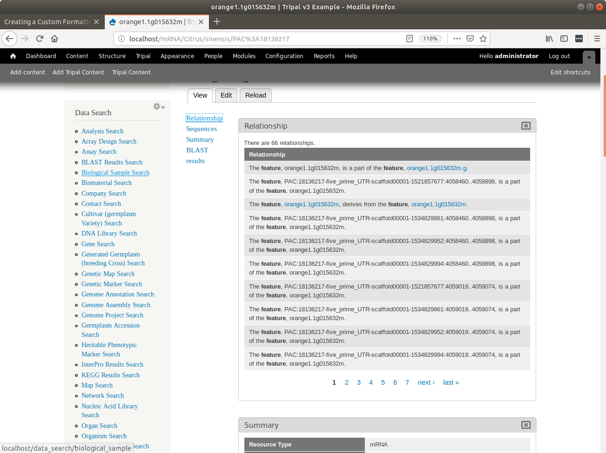
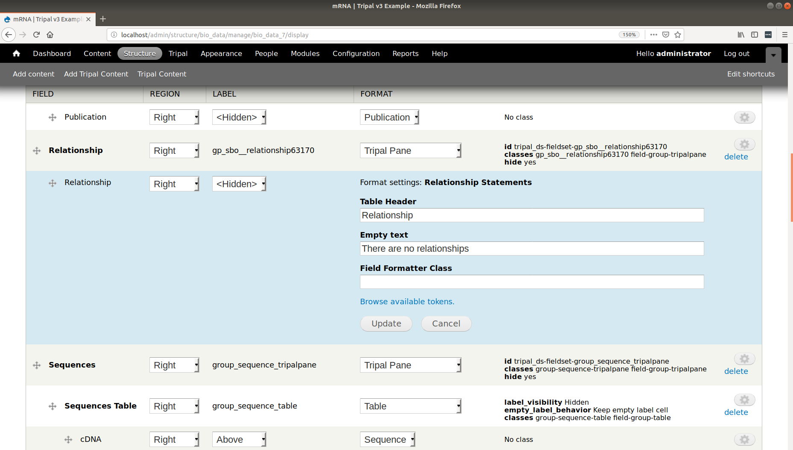
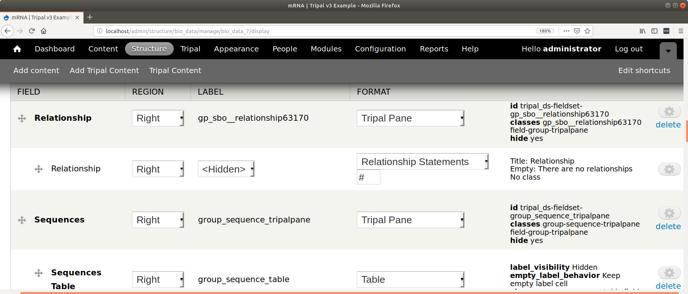

Creating a Custom Formatter
===========================
The third component of a field is the formatter.  Thus far we have introduced how to create a field class and a widget class for a field.  The field class is responsible for describing the field, loading data into it, and providing search support.  The widget class provided a Drupal form for online editing of the field.  Finally, the formatter is responsible for display of the field on a Tripal site.  
 
.. note::
  This guide assumes you already have your formatter class file created. For more information, see :doc:`manual_field_creation` or, :doc:`tripal_field_generator`. 
  
The formatter class is the simplest of all the Tripal field classes.  Here we will again use the **obi__organism** field that comes with the ``tripal_chado`` module.  

The view() function.
~~~~~~~~~~~~~~~~~~~~
In most cases the only function you need to implement is the ``view()`` function. This function is called whenever your field needs to be displayed on a page. The following code is from the ``obi__organism_formatter.inc`` class file.  

.. code-block:: php
  :linenos:

  public function view(&$element, $entity_type, $entity, $langcode, $items, $display) {
  
    if ($items[0]['value']) {
      $content = $items[0]['value']['rdfs:label'];
      if (array_key_exists('entity', $items[0]['value'])) {
        list($entity_type, $entity_id) = explode(':', $items[0]['value']['entity']);
        $content = l(strip_tags($items[0]['value']['rdfs:label']), 'bio_data/' . $entity_id);
      }

      // The cardinality of this field is 1 so we don't have to
      // iterate through the items array, as there will never be more than 1.
      $element[0] = array(
        '#type' => 'markup',
        '#markup' => $content,
      );
    }
  }
  
In the code above the input arguments have the following meaning:
  - ``$element`` is the first argument. It is an array into which you should set the contents to be displayed.  
  - ``$entity_type`` will always have the value ``Tripal Entity``.
  - ``$entity`` is the entity object which contains all information about the entity including the loaded data values.
  -  ``$langcode`` is the language. This is used by Drupal to provide translations of data into other spoken languages. By default, Tripal does not use a language, as biological data is generally language agnostic.  Consider for example a gene sequence or a feature coordinate.
  - ``$items`` is an array containing all of the loaded data for this field.  
  - ``$display`` is the name of the display such as full page, a teaser, etc. Currently, Tripal does not distinguish between displays.
  
The purpose of the ``view()`` function is to iterate through the values in the ``$items`` array, and format them into an appropriate display for viewing.  Here you must remember the structure of the data in the ``$items`` array.  
 
To demonstrate this function, let's look at what we expect in our ``$items`` array. Using the `Citrus sinesis` organism from the User's Guide. We would expect an items array to look like the following:
 
.. code::

  $items = [
    0 => [
      "value" => [
        "rdfs:label" =>  "Citrus sinensis",
        "rdfs:type" =>  "Organism",
        "local:abbreviation" =>  "C. sinensis",
        "TAXRANK:0000005" => "Citrus",
        "TAXRANK:0000006" => "sinensis",
        "entity" => "TripalEntity:3",
      ],
      "chado-feature__organism_id" => 12,
    ],    
  ];
  
You may recall that the ``$items`` array structure is the same as that created by the ``load()`` function described in the :doc:`manual_field_creation` page. Note that each key in the ``value`` array is an accession for a controlled vocabulary term.  These accessions are used to unambiguously describe the value. To display the organism on a page we need the element named ``rdfs:label``.  Thus, we set the ``$content`` variable to contain this value as shown on line 4 of the ``view()`` function above.

Because our organisms are also published entities we want to link to their respective pages each time an organism is displayed.  Because the ``value`` array has an element named ``entity`` we know that this item is published.  Lines 5-6 of the ``view()`` function shown above use this information to create a clickable link to the organism page.   Finally, the ``$element`` argument is set to provide content of type ``markup``.  This ``$element`` array is a `Drupal renderable array <https://www.drupal.org/docs/7/api/render-arrays/render-arrays-overview>`_.

Lastly, notice the element named ``chado-feature__organism_id``.  This element is at the same level as the ``value`` element.  This data is meant to be used internally by the field. It maps this fields values to the appropriate table in Chado where the data is stored.  

.. warning:: 

  You should never show the user any data that is outside of ``value`` element.  Remember that your field can be shown by other viewers, including web services.  By ensuring that data in the ``value`` element is mean to be displayed we ensure that information on the web page, web services, or any other future form of display is always consistent.

In summary, the following should be observed when processing the ``$items`` array for viewing:

  - A field with only one value (a cardinality of 1) will always have only one element in the ``$items`` array and can use the index 0. This is what has been done in this example code. 
  - A field with more than one value can have any number of elements in the ``$items`` array.  You should therefore iterate through all of them.
  - For every index in ``$item`` you should create a matching index in ``$element`` to display the data found in that ``$item``.
  - If there are no items, then nothing you return will be displayed.
  - For each element in the ``$items`` array there is a ``value`` key.  Only the data in the ``value`` key should be shown to the user.
  - Each element in the ``$items`` array may have more than a ``value`` key.  These values are meant to help manage the data. 

.. warning::

  You should never have SQL statements or any API calls that retrieve data in the formatter ``view()`` function. The formatter should strictly format data for viewing.
  
Creating Pagers
~~~~~~~~~~~~~~~
The example shown in the previous section was for a field that will always only contain a single element.  However some fields may contain a large number of elements.  Consider an mRNA and it's relationships to subfeatures: exons, 5' UTRs, 3'UTRs, CDS, etc.).  A large mRNA can have many relationships.  Alternatively, consider the case where a genetic map content type may have a field that lists all of the markers on the map.  Such a list could become extremely long on the page.  In these cases it may be best to only list a few items at a time and to provide a pager to let the user cycle through the items.  An example of a pager added to the bottom of relationships is shown in the example below.

To create a pager we first need to calculate the number of items we want to display per page and the total number of pages required to display all of the data.  

.. code-block:: php
  
  $items_per_page = 10;
  $total_records = count($items);
  $total_pages = (int) ($total_records / $items_per_page) + 1;
  
Next, we must initialize the pager by calling the ``pager_default_initialize`` function.  We pass it the total number of records, the number of items per page and the index (i.e. ``$pelement``) for this pager on the page.  

.. code-block:: php

  $pelement = 0; 
  $current_page = pager_default_initialize($total_records, $items_per_page, $pelement);
  
The call to ``pager_default_initialize`` will return the current page.  The current page is a numeric number indicating which page the pager is currently showing. The first time the page is loaded this will always be the first page.  Each time the user navigates to other pages by clicking the "next" link or the numeric links then this ``view()`` function is called and the current page is set to the page being viewed. Next, we must theme the pager so that it follows the look-and-feel prescribed for the site. For this we use the Drupal ``theme()`` function.

.. code-block:: php

  $pager = theme('pager', array(
    'tags' => array(),
    'element' => $pelement,
    'parameters' => array(),
    'quantity' => $total_pages,
  ));
  
By default, all links in the pager cause the page to reload.  We do not want the page to reload, rather we only want to update the contents of the field.  The TripalFieldFormatter class provides a function named ``ajaxifyPager`` to convert a pager into an AJAX pager:

.. code-block:: php

  $pager = $this->ajaxifyPager($pager, $entity);
  
Now that we have a pager, it has been setup for AJAX and we know the current page that the user is viewing we can now display only the items from the ``$items`` array that are appropriate for the page being viewed. A common way to provide multiple items on a page is within a table. When we set the ``$element`` array we need to be sure to provide both the content and the pager:

.. code-block:: php

    $element[0] = array(
      '#type' => 'markup',
      '#markup' => $content . $pager,
    );
    
The settingsForm() Function.
~~~~~~~~~~~~~~~~~~~~~~~~~~~
Sometimes you may want to provide some control to the site developer for the formatter.  For example, the ``sbo__relationship_formatter`` allows the site developer to customize the title that appears above the table that houses relationships and the text the appears if there are no relationships.  By default the title is "Relationships" and the empty text indicates there are no relationships. Both are a bit too generic.  The ``settingsForm()`` function allows you to provide a Drupal form for the field that appears on the **Administer > Structure > Tripal Content Types** on any content type's **manage display** page:

The form shown in the screenshot above is provided by the ``settingsForm()`` function.  The following code generates this form:

.. code-block:: php
  :linenos:
  
  public function settingsForm($view_mode, $form, &$form_state) {

    $display = $this->instance['display'][$view_mode];
    $settings = $display['settings'];
    $element = array();
    $element['title'] = array(
      '#type' => 'textfield',
      '#title' => 'Table Header',
      '#default_value' => array_key_exists('title', $settings) ? $settings['title'] : 'Relationship',
    );
    $element['empty'] = array(
      '#type' => 'textfield',
      '#title' => 'Empty text',
      '#default_value' => array_key_exists('empty', $settings) ? $settings['empty'] : 'There are no relationships',
    );
  
    return $element;
  }
  
The form is typical of any form.  Note, however that the ``#default_value`` is set using the current settings values.

A settings form is useful but it only works when Drupal knows what settings you want for your field.  You must provide the settings names (e.g. "title" and "empty" in this case) when you  attach your field to a given content type (i.e. bundle).  You tell Drupal to attach this field to a content type using the ``hook_bundle_instances_info`` function.  See 
the :doc:`create_instance` to learn more about this function.  Briefly, the ``display`` section of the info array for the ``sbo__relationship`` field contains the following settings for the ``display``:

.. code-block:: php

    'display' => array(
      'default' => array(
        'label' => 'hidden',
        'type' => 'sbo__relationship_formatter',
        'settings' => array(
          'title' => 'Relationships',
          'empty' => 'There are no relationships'
        ),
      ),
    ),

.. warning::

    In order for the ``settingsForm()`` implemented to be available on the "Manage Display" page, you must also implement ``settingsSummary()`` as described below.
The settingsSummary() Function.
~~~~~~~~~~~~~~~~~~~~~~~~~~~~~~~
The ``settingsSummary()`` function provides a summary of the current settings values for a field on the **manage display** page.  The following shows the same relationship field from the previous section, but with the settings form closed, and a summary of the current values shown:

An example of the ``settingsSummary()`` function that generates the summary in the image above is as follows:

.. code-block:: php
  :linenos:
  
  public function settingsSummary($view_mode) {
    $display = $this->instance['display'][$view_mode];
    $settings = $display['settings'];

    $summary = t('Title: @title Empty: @empty',
        array(
          '@title' => $settings['title'],
          '@empty' => $settings['empty'])
        );

    return $summary;
  }

  
