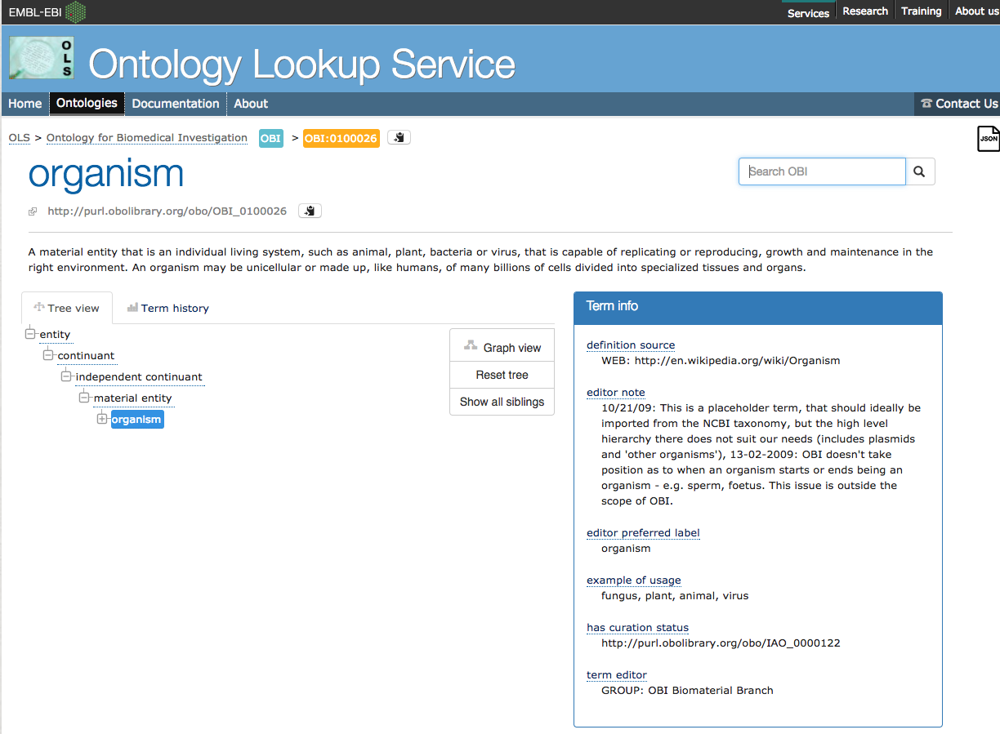
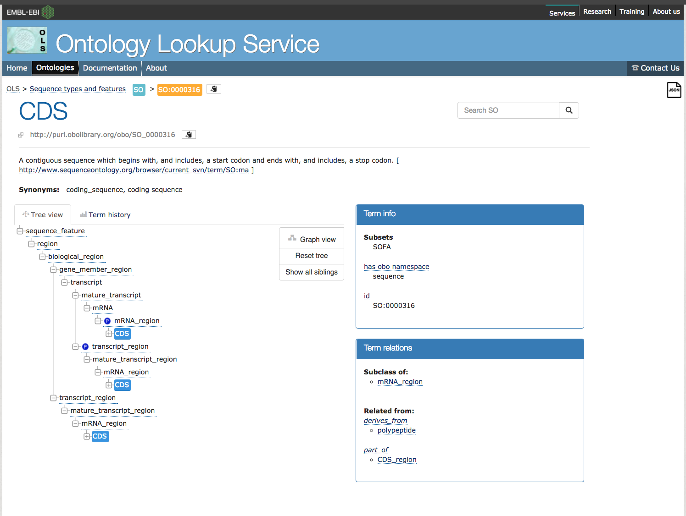
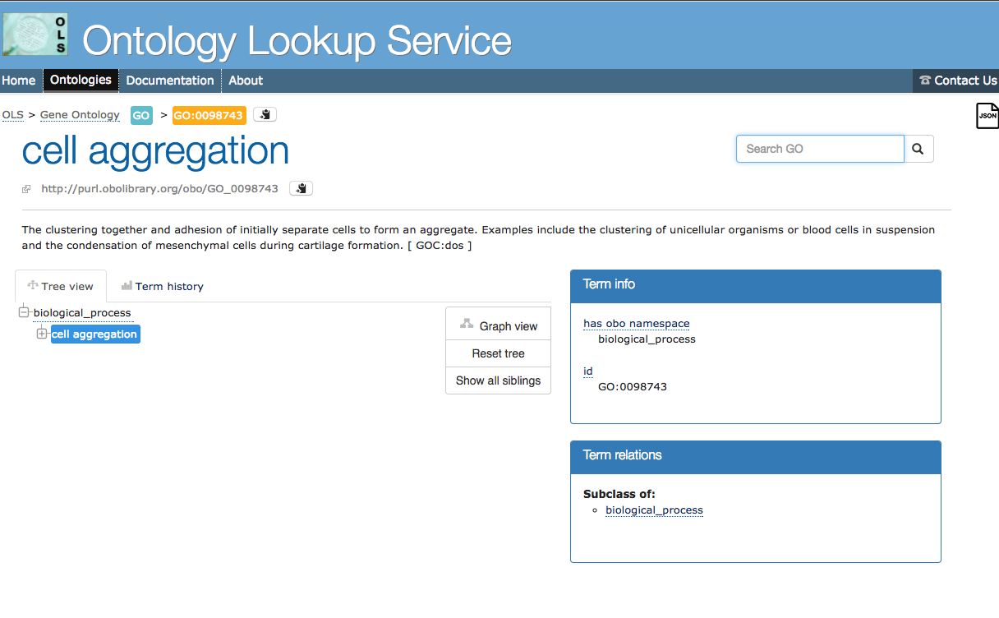
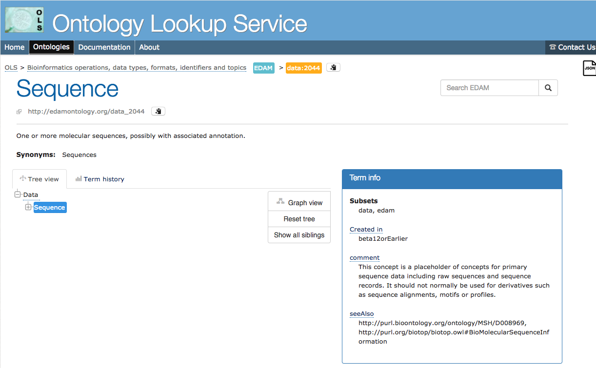

Selecting Vocabulary Terms
==========================

Ontologies: what and why?
-------------------------

Tripal 3 requires all bundles and fields to be associated with a Controlled Vocabulary (CV). CVs are dictionaries of defined terms (CV terms) that make data machine-accessible, ensuring uniform terms are used across experiments, organisms and websites. Without CVterms, our scientific knowledge might be split by "dialects". Plant biologists might study temperature stress, while animal biologists study heat shock. Each group might benefit from the knowledge of the other, but they use a different vocabulary to describe the same thing, creating challenges for data discovery and exchange. CV terms make this easier not just for people, but especially for machines. Ontologies take this a step further. Where CVs are controlled lists of CVterms, ontologies are a controlled language, that include hierarchical relationships of terms.

Tripal leverages vocabularies to make use of the `Semantic Web <https://en.wikipedia.org/wiki/Semantic_Web>`_. Every bundle and field defined in Tripal will be associated with a CVterm. Therefore, it is important to find community developed terms.  The `EMBL EBI Ontology Lookup Service <http://www.ebi.ac.uk/ols/index>`_ provides an easy location to search for and identify terms.  When choosing terms for new Bundles and Fields, think carefully about the terms you will use to describe your objects. Selecting the proper CV term that best describes the data may be the most challenging part of creating custom Bundles and Fields!

Before you can create a new Bundle or Field  the vocabulary term must be present in your local Tripal site.  You can check if a term exists by using the Tripal lookup service on your local site using the URL path cv/lookup (e.g. http://your-site/cv/lookup).  If the term is not present then you'll need to add it.  You can do so manually by using Tripal's controlled vocabulary admin pages.  For creating new bundles this is all you need to do.  However, when creating Fields you will want to programmatically add the term.  This is important because Fields are meant to be shared. If you create an awesome field that you want to share with others then you need to make sure the terms get added programmatically.   The following sections describe how terms are stored in Chado and how you can add them using Tripal API calls.

Storage of Terms in Chado
-------------------------

In Chado, CVs are stored by two tables: the **db** and **cv** tables. Chado was designed to store a record for the online database that a vocabulary lives at in the **db** table, and the namespace of a vocabulary in the **cv** table.  For example, the sequence ontology uses the namespace, sequence, which is stored in the **cv** table but uses the short name of SO which is stored in the **db** table.  As we'll see later, sometimes the distinction between what gets stored in the **cv** vs the **db** tables can get a bit fuzzy with some vocabularies. The terms themselves are stored in the cvterm table. The cvterm table has a foreign key to the **cv** table via the **cv_id** field.  Every controlled vocabulary term has an accession. For example the term gene in the Sequence Ontology has an accession number of SO:0000704.  Accession numbers consist of two parts: a vocabulary "short name", followed by a unique identifier separated by a colon.  Within Chado, the accession for any term is stored in the dbxref table.  This table has a foreign key to the **db** table via the **db_id** as well as a foreign key to the cvterm table via the **dbxref_id** field.

Vocabulary Short Names and Namespaces
-------------------------------------

How can you tell what the **short name** and **namespace** values will be for a vocabulary term that you want to insert into Chado for your custom Bundle or Field? Hint: use the information is in the EMBL-EBI `Ontology Lookup Service <http://www.ebi.ac.uk/ols/index>`_ (OLS).  The following sections provide three examples for different cases.

Case 1:  Ontologies without a defined namespace
~~~~~~~~~~~~~~~~~~~~~~~~~~~~~~~~~~~~~~~~~~~~~~~

Consider the term for `organism <http://www.ebi.ac.uk/ols/ontologies/obi/terms?iri=http%3A%2F%2Fpurl.obolibrary.org%2Fobo%2FOBI_0100026>`_.

Notice how the teal box (the **short name**) is OBI, and the orange box contains the **full accession**, OBI:0100026 which includes but the **short name** and the unique term **accession** value.  Unfortunately, the OLS does not indicate the **namespace** terms.   So, as a rule we will use the short name converted to lower case.  Before using this term in a Tripal Bundle or Field you may need to insert this term into Chado.  You can do so in your custom module code using the **tripal_insert_cvterm** function. The following provides a demonstration:

.. code-block:: php

	

   $term= tripal_insert_cvterm([
            'id' => 'OBI:0100026',
            'name' => 'organism',
            'cv_name' => 'OBI',
            'definition' => 'A material entity that is an individual living system, such as animal,
            plant, bacteria or virus, that is capable of replicating or reproducing, growth and maintenance
                  in the right environment. An organism may be unicellular or made up, like humans, of many
               billions of cells divided into specialized tissues and organs.',
        ]);

Note that in the code above the namespace is provided as the **cv_name** element and the full accessions (including the short name) is provided as the **id** element.  In this case the OBI CV already exists by default in the Tripal database, so we did not need to add the vocabulary record.  If the OBI did not exist we could have added it using the following API calls.  First we insert the "database" record for the ontology.

.. code-block:: php

  
  tripal_insert_db(array(
    'name' => 'obi',
    'description' => 'The Ontology for Biomedical Investigation.',
    'url' => 'http://obi-ontology.org/page/Main_Page',
    'urlprefix' => 'http://purl.obolibrary.org/obo/{db}_{accession}',
  ));

Notice here that the **name** element is the **namespace** (short name converted to lower case) for the vocabulary.  The url is the web address for the ontology online. The urlprefix is a URL that can be used to construct a link that when clicked will take the user to any term in the vocabulary.  Almost all vocabularies will have a common URL for all terms.  Tripal will automatically substitute the short name into the **{db}** token and the term **accession** in to the **{accession}** token to generate the URL.

Second, we insert the record for the controlled vocabulary.
​

.. code-block:: php

  
 	tripal_insert_cv(
    	'OBI',
    	'Ontology for Biomedical Investigation. The Ontology for Biomedical Investigations (OBI) is build in a collaborative, international effort and will serve as a resource for annotating biomedical investigations, including the study design, protocols and instrumentation used, the data generated and the types of analysis performed on the data. This ontology arose from the Functional Genomics Investigation Ontology (FuGO) and will contain both terms that are common to all biomedical investigations, including functional genomics investigations and those that are more domain specific.'
  );

Case 2:  Ontologies with a defined namespace
~~~~~~~~~~~~~~~~~~~~~~~~~~~~~~~~~~~~~~~~~~~~

Consider the entry for `CDS <https://www.ebi.ac.uk/ols/ontologies/so/terms?iri=http%3A%2F%2Fpurl.obolibrary.org%2Fobo%2FSO_0000316>`_.

Notice that in the Term Info box on the right there is the term **has_obo_namespace** which is defined as the word: sequence.  This is much better than the organism example from the OBI.  We now know the correct namespace for the term! By default, Tripal loads the Sequence Ontology during install.  However, suppose we did not have this term loaded we could do so with the following:

.. code-block:: php

  
    $term= tripal_insert_cvterm([
            'id' => 'SO:0000316',
            'name' => 'CDS',
            'cv_name' => 'sequence',
            'definition' => 'A contiguous sequence which begins with, and includes, a start codon and ends with, and includes, a stop codon. [ http://www.sequenceontology.org/browser/current_svn/term/SO:ma ].',
        ]);

Notice in the code above we can properly set the cv_name to sequence.

Case 3: Ontologies with multiple namespaces
~~~~~~~~~~~~~~~~~~~~~~~~~~~~~~~~~~~~~~~~~~~

Some ontologies are b into sub-ontologies. This includes the Gene Ontology (GO).  Let's consider the example GO term `cell aggregation <http://www.ebi.ac.uk/ols/ontologies/go/terms?iri=http%3A%2F%2Fpurl.obolibrary.org%2Fobo%2FGO_0098743>`_. Looking at the EBI entry, the teal box is GO, the orange box is GO:0098743, and the has_obo_namespace is biological_process. However, the GO provides two other namespaces:  cellular_component and molecular_function.  Be sure to pay attention to these different namespaces if you ever need to manually insert a term.

Case 4: Ontologies with multiple short names
~~~~~~~~~~~~~~~~~~~~~~~~~~~~~~~~~~~~~~~~~~~~

The EDAM ontology builds its term accessions using different short names instead of the ontology. Consider the EDAM term for `Sequence <http://www.ebi.ac.uk/ols/ontologies/edam/terms?iri=http%3A%2F%2Fedamontology.org%2Fdata_2044>`_. The teal box is EDAM, the orange box is data:2044, and there is no **namespace**.

For this case, the **namespace** is EDAM, the short name is **data**, and the accession is 2044.  Unfortunately, this breaks the paradigm that Chado expects. Typically the **short name** is the teal box (EDAM).  In order to force Chado to properly handle ontologies like this we are forced to reverse the short name and **namespace** values when creating our record:

.. code-block:: php

  
	$term= tripal_insert_cvterm([
	  'id' => 'data:2044',
	  'name' => 'sequence',
	  'cv_name' => 'EDAM',
	  'definition' => 'One or more molecular sequences, possibly with associated annotation.',
	]);

	tripal_insert_db(array(
	    'name' => 'data',
	    'description' => 'Bioinformatics operations, data types, formats, identifiers and topics.',
	    'url' => 'http://edamontology.org/page',
	    'urlprefix' => 'http://edamontology.org/{db}_{accession}',
	));

	tripal_insert_cv(
	    'EDAM',
	    'EDAM is an ontology of well established, familiar concepts that are prevalent within bioinformatics, including types of data and data identifiers, data formats, operations and topics. EDAM is a simple ontology - essentially a set of terms with synonyms and definitions - organised into an intuitive hierarchy for convenient use by curators, software developers and end-users. EDAM is suitable for large-scale semantic annotations and categorization of diverse bioinformatics resources. EDAM is also suitable for diverse application including for example within workbenches and workflow-management systems, software distributions, and resource registries.'
	);

Case 5: You really cant find a term!
~~~~~~~~~~~~~~~~~~~~~~~~~~~~~~~~~~~~

Sometimes a good CVterm just doesn't exist for what you want to describe. If you can't find a CV term, you can insert a term into the "local" CV. This is meant to be used as a last resort. In these cases, before you use a local term, consider contributing the term to an existing CV or ontology. Any terms that are invented for a local site may mean that the data exposed by your site cannot be discovered by other sites or tools.  In this case, the accession will not be numeric,  but is the same as the term name.

.. code-block:: php

	
	$term= tripal_insert_cvterm([
	   'id' => 'local:shame_on_you',
	   'name' => 'shame_on_you',
	   'cv_name' => 'local',
	   'definition' => 'You should really find a good CVterm.',
	]);

Notice in the above code the **short name** and **namespace** are both "local" as this is a local term on the site.
