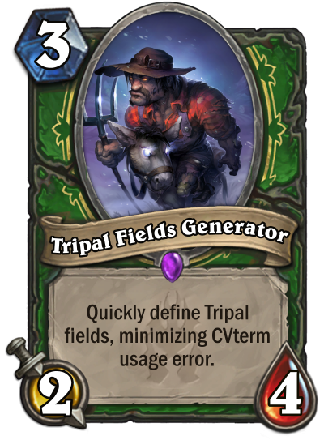

Easier Field Creation: Tripal Field Generator
==============================================

The Staton Lab has created a `specialized tool <https://github.com/statonlab/fields_generator>`_ for automatically generating a ChadoField or TripalField and populating them with the basic controlled vocabulary and database information.  Instructions are available at https://github.com/statonlab/fields_generator.

