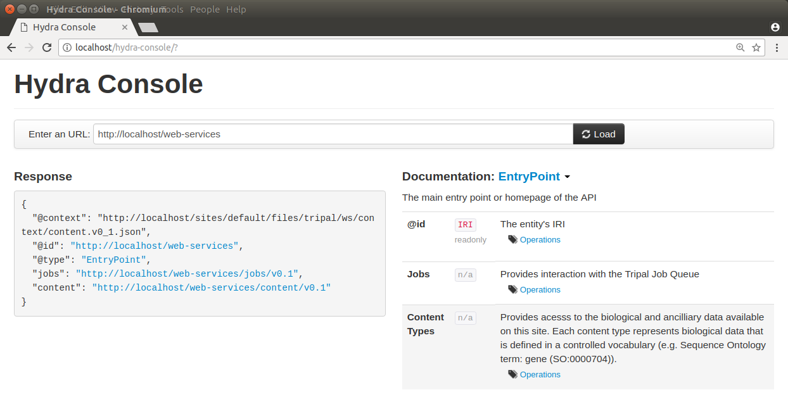
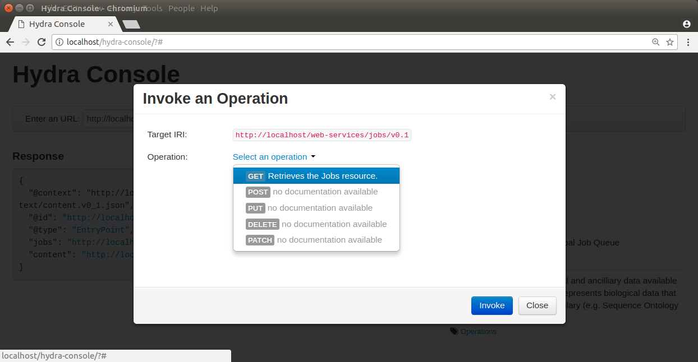
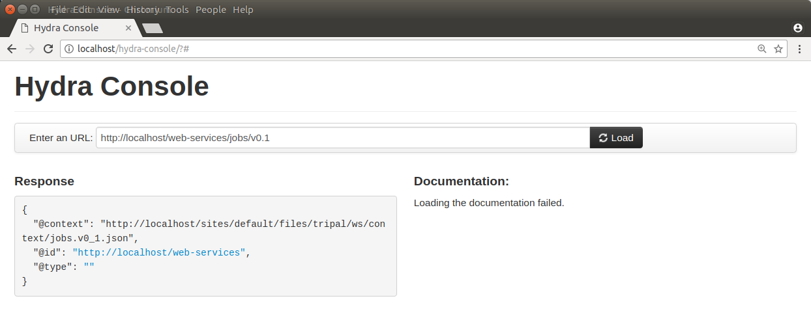
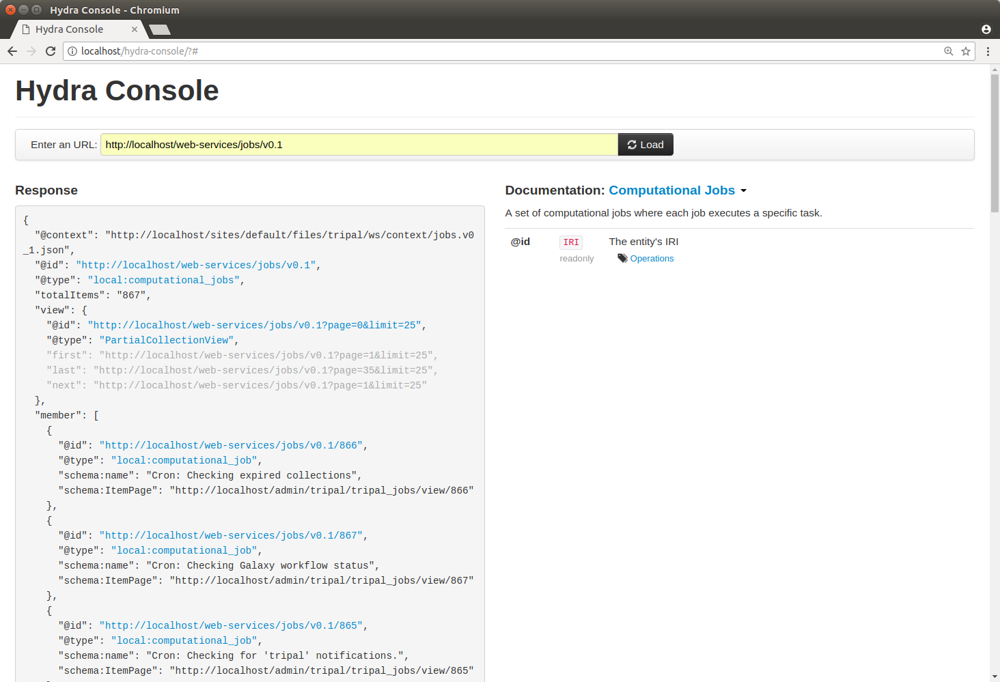

Creating Custom Web Services
==============================

Introduction
-------------

New in Tripal v3 are `RESTful web services <https://en.wikipedia.org/wiki/Representational_state_transfer>`_.  These web-services are designed to allow end-users to access data programmatically using any programming language of their choice.  Web services in Tripal v3 are provided by the **tripal_ws** module.  By default the module provides the "content" service.  This service provides access via a RESTful interface to all of the content published on a Tripal site.  It is meant to respond immediately as the site admin makes changes to published data and is expected to always provide access to the same data displayed on the site (nothing more and nothing less). 

Tripal v3 has been redesigned from Tripal v2 to be fully organized around controlled vocabularies.  All data made available via Tripal is expected to be described by the terms of a controlled vocabulary or ontology.  For example, all content types in Tripal are assigned a controlled vocabulary term that describes what the content is.  Additionally, each field of data attached to a content type also is described using a controlled vocabulary term.  If a field provides more than just a single data value (i.e. it provides a list or nested structured array of data of key/value pairs) then each of the keys for those pairs must also be a controlled vocabulary term.  This requirement allows Tripal to fully describe the data it houses to any other Tripal site and any other script or service that can read the web services.  As long as the client application understands the vocabulary term it will understand the meaning of the data.  Using controlled vocabulary terms to describe all data allows a Tripal site to participate in the `Semantic Web <https://en.wikipedia.org/wiki/Semantic_Web>`_. 

Finally, the Tripal RESTful services are meant to be discoverable.  In some cases, when a web services is designed, the only way to understand the structure of it and the operations that it provides are for a programmer to read online documentation for the service before she can write the client application.  However, to better support automatic data discovery without human intervention by a client the Tripal web services have been designed to be discoverable.  To this end, Tripal uses the  `Hydra Core Vocabulary <https://www.hydra-cg.com/spec/latest/core/>`_ specification.  It fully describes all of the services, their operations, and the resulting value.  A client application that understands the Hydra language can therefore learn  to use the web service without human intervention.  However, in practice, its a good idea to continue to provide online documentation for humans.  And this User's Guide :doc:`provides those instructions </user_guide/web_services>` for the default Tripal content service.  

This documentation provides instructions to construct your own custom web services and making that service available through Tripal's existing web service infrastructure.  This will enable your web service to be discoverable and to provide a consistent experience to end-users.  Before proceeding with the following instructions, please review the **Structure of a Web Service Response** section on the User's Guide :doc:`Web Services page </user_guide/web_services>`.

Getting Started
----------------
Before creation of your new web services you must first consider the following in your design:

1.  What functionality will your service provide.  This will dictate the URL paths that you will need and what operations (Create, Read, Update, Delete) your service will support.
2.  What controlled vocabularies do you need to use to describe the data that your service may provide.
3.  What human-readable label can you give to your service.
4.  What one-word describes the type of service you are creating.
5.  What human-readable description should you provide to users of your service.

When you are ready to begin construction of your web service, you must first create a custom Drupal module.  The assumption is that you already know how to create new Drupal modules, or you have access to an existing one into which you can add your new web services.   Prepare your custom module by creating the following directory structure:

  .. code-block:: bash

	[module_name]/includes/TripalWebService

Where [module_name] is the name of your custom module.  It is inside of this directory that you will place the code for your new web services.  Tripal is designed to recognize this directory, discover the web services described inside of it and to automatically make them available!  You need only program the service and Tripal does the rest.  

**Note:** When selecting a version number it is best practice to start with 0.1.  The first number represents the  "major" number and the second number is the "minor" number.  When minor bug fixes or changes to the service occur the minor number should be incremented. When major changes occur that affect the structure of the web service or it's operations then the major number should be incremented.    The service can be named whatever you like.   This class file should be named according to this schema with a **.inc** extension. 

For this tutorial, suppose we wanted to create a web service that allowed someone to interact with the Tripal Job queue.  We could name our new class the **TripalJobService_v0.1** class and we would create this class in the file: 

.. code-block:: bash

	[module_name]/includes/TripalWebService/TripalJobService_v0_1.inc

Within this file we will implement our class with the following structure:

.. code-block:: php

	
	class TripalJobService_v0_1 extends TripalWebService {

	  /**
	   * The human-readable label for this web service.
	   */
	  public static $label = 'Jobs';

	  /**
	   * A bit of text to describe what this service provides.
	   */
	  public static $description = 'Provides interaction with the Tripal Job Queue';

	  /**
	   * A machine-readable type for this service. This name must be unique
	   * among all Tripal web services and is used to form the URL to access
	   * this service.
	   */
	  public static $type = 'jobs';

	  /**
	   * Implements the constructor
	   */
	  public function __construct($base_path) {
	    parent::__construct($base_path);
	  }
	}

This is all we need for Tripal to recognize our new service!  Notice that the class implementation extends the TripalWebSerivce class and it sets a few static variables that defines the label, description and name for this service.  Finally, this class defines the constructor which simply calls the parent class constructor. Be sure to always call the parent constructor when you implement your own service.  We can now use the `Hydra console <http://www.markus-lanthaler.com/hydra/console/>`_ to see our service.  Note, that the hydra console must be able to have access to your site. For this tutorial, the Tripal site is temporarily hosted on the local machine, and hence Hydra has been installed locally.    To see if your new service shows up, enter the URL for your site into the Hydra console and you should see it appear:

Notice in the above screen shot that our **jobs** service is now present in the **Response** section, and in the **Documentation** section!   The **Response** section shows the JSON array returned by Tripal and the **Documentation** section displays the information about our service.

Documenting the Services
-------------------------

Our service appears in the Hydra console but if we try to use Hydra to perform a **GET** operation on our Jobs service there will be no interesting response and no documentation.  Try this by clicking on the link in the **Response** section for our Jobs service, and selecting the GET operation.

You will see that our service provides nothing:

Before we create our service we should have planned the design of our service. Suppose for now we just wanted to provide read-only access to job information.  Our design for the web service is quite simple and consists of the these resources (URLs and operations):

TABLE!

Before we begin implementation of our web service we must first document these resources.  To do this we must add a new function to our TripalJobService_v0_1 class named **getDocumentation**.  The following code shows this initial implementation of that function in our class:

.. code-block:: php

	 /**
	     * @see TripalWebService::getDocumentation()
	     */
	    public function getDocumentation() {
	        return parent::getDocumentation();
	    }

Notice currently all this function does is call the parent getDocumentation function.  Now, the first thing we need to document is our web service classes.  A web service class (not to be confused with the PHP class) simply refers to a resource.  A resource is any distinct URL within web services.  So, according to our design above we have two resources and hence two classes:  a jobs collection resource and a job resource.  Tripal must describe all of the classes (i.e. resources) using the Hydra method.  This makes the web service discoverable.   For example, with the content web service, Tripal provides a resource for each content type.  The Gene content type that Tripal provides is  described using the Hydra method in a JSON array with the following:

.. code-block:: json

	{
	  "@id": "http://www.sequenceontology.org/browser/current_svn/term/SO:0000704",
	  "@type": "hydra:Class",
	  "hydra:title": "Gene",
	  "hydra:description": "A region (or regions) that includes all of the sequence elements necessary to encode a functional transcript. A gene may include regulatory regions, transcribed regions and\/or other functional sequence regions. [SO:immuno_workshop]",
	  "subClassOf": "hydra:Resource",
	  "supportedOperation": [
	    {
	      "@id": "_:gene_retrieve",
	      "@type": "hydra:Operation",
	      "method": "GET",
	      "label": "Retrieves the Gene resource.",
	      "description": null,
	      "statusCodes": [],
	      "expects": null,
	      "returns": "http://www.sequenceontology.org/browser/current_svn/term/SO:0000704"
	     }
	  ]
	}

In the above array, notice the @id is URL that represents a unique identifier for the class.   The @type will always be 'hydra:Class' because we are documenting a resource.  Then there is information about the class defined using the 'hydra:title' and 'hydra:description'.  The 'subclassOf' is always set to 'hydra:Resource'.  Next is the list of supported operations for this resource.  Remember, in our design we only want to support the GET operation for our Jobs service, so just like in the example above, the method we will support is GET.  The key/value pairs for the GET method are described using Hydra terms.  

For our services we need to provide the information to Tripal so that it can generate these Hydra JSON arrays that document our service.  Tripal provides some easy API functions to help with this.  The first is the **addDoc** member function.  This function will take as input the class details, operations and properties necessary to generate the documentation for our class.  First, lets use this function to document our Jobs Collection resource.  Below is sample code that will do this for us.

.. code-block:: php

	

 	public function getDocumentation() {
        $term = tripal_get_term_details('local', 'computational_jobs');
        $details = array(
            'id' => $term['url'],
            'title' => $term['name'],
            'description' => $term['definition'],
        );
        $operations = array(
            'GET' => array(
                'label' => 'Computational Jobs',
                'description' => 'Retrieves the list of computational jobs that have been submitted on this site.',
                'returns' => $term['url'],
                'type' => '_:computational_jobs_retrieve',
            ),
        );
        $properties = array(
        );
        $this->addDocClass($details, $operations, $properties);
        return parent::getDocumentation();
    

In the code above we add the documentation for our Job Collection class. There are three different arrays, one for the class details, one for the operations that the class supports and the third for properties. For now, the properties array is left empty. We'll come back to that later.  All classes must use a controlled vocabulary term.  Notice that the term used for this class is a term local to the database named 'computational_jobs'.   Normally when creating a class we would try to use a term from a published controlled vocabulary.  A large number of these vocabularies can be searched using `the EBI Ontology Lookup Service <https://www.ebi.ac.uk/ols/index>`_.  Unfortunately, an appropriate term could not be found in a published vocabulary, so we had to create a local term.  We can use Tripal's API functions to easily add new terms.  The following code should be placed in the install() function of your module to ensure the term is available:

.. code-block:: php

    $term = tripal_insert_cvterm(array(
            'id' => 'local:computational_job',
            'name' => 'Computational Job',
            'cv_name' => 'local',
            'definition' => 'A computational job that executes a specific task.',
        ));
        $term = tripal_insert_cvterm(array(
            'id' => 'local:computational_jobs',
            'name' => 'Computational Jobs',
            'cv_name' => 'local',
            'definition' => 'A set of computational jobs where each job executes a specific task.',
        ));

You'll notice in the code above that the @id of the Class is the URL of the term.  Using the **tripal_get_term_details** function we can get the URL for the term.  The URL serves as the unique identifier for this term.  We simply set the title and description for the class using the term details.  For the operation, we can specify any of the HTTP protocols (e.g. GET, PUT, PUSH, DELETE and PATCH).  Here we are currently only supporting read-only operations so we only need to provide a 'GET' operation.    Our jobs collection resource is now documented!

Implementing a Collection Resource
--------------------------------------

Now that our job collection resource is documented we can implement the resource using the **handleRequest** function.  We currently only support two paths for our web services as indicated in our design table above. Those include the default path where our job collection resource is found and an additional path with the job ID appended where individual job resources are found.  First, we will implement the Job Collections resource:

.. code-block:: php

    /**
     * @see TripalWebService::handleRequest()
     */
    public function handleRequest() {

        // Get the content type.
        $job_id = (count($this->path) > 0) ? $this->path[0] : '';

        // If we have a content type then list all of the entities that belong
        // to it.
        if (!$job_id) {
            $this->doJobsList();
        }
    }

in the code above need to determine if the resource is a job collection or a job resource.  To do that we can check to see if a job_id was provided.  The TripalWebService class provides as a member element the full URL path broken into an array of elements.  Because our job_id would always be in the first element of the path (after our base path for the service) we can use **$this->path[0]** to look for a job_id.  If one is not provided then we can execute a function called **doJobsList** and the code for that is as follows:

.. code-block:: php

	

    /**
     * Generates the job collection resource.
     */

    private function doJobsList() {
        // If the user has specified a limit or page number then use those to
        // get the specific jobs.
        $limit = isset($this->params['limit']) ? $this->params['limit'] : '25';
        $page = isset($this->params['page']) ? $this->params['page'] : 0;

        // Get the list of jobs for the given page, and the total number.
        $offset = $page * $limit;
        $jobs = tripal_get_jobs($offset, $limit);
        $num_records = tripal_get_jobs_count();

        // Set the current resource to be a new TripalWebServiceCollection resource,
        // and pass in the current service path, and set the pager.
        $service_path = $this->getServicePath();
        $this->resource = new TripalWebServiceCollection($service_path, $this->params);
        $this->resource->setType('local:computational_jobs');
        $this->resource->initPager($num_records, $limit, $page);

        // Now add the jobs as members
        foreach ($jobs as $job) {
            $member = new TripalWebServiceResource($service_path);
            $member->setID($job->job_id);
            $member->setType('local:computational_job');
            $member->addProperty('schema:ItemPage', url('admin/tripal/tripal_jobs/view/' . $job->job_id, array('absolute' => TRUE)));
            $this->resource->addMember($member);
        }
    }

The first few lines of code above are as follows:  

.. code-block:: php

        $limit = isset($this->params['limit']) ? $this->params['limit'] : '25';
        $page = isset($this->params['page']) ? $this->params['page'] : 0;

Remember, that we wanted to allow for paging of our job collection.  We could have hundreds or thousands of jobs over time and we do not want to slow the page load by loading all of those jobs.  Therefore the page and limit parameters that can be added to the URL are available via the params member as a set of key/value pairs.  Next, using Tripal API function calls, we get the list of jobs that the user has requested to see (or the first page by default):

.. code-block:: php

      $offset = $page * $limit;
        $jobs = tripal_get_jobs($offset, $limit);
        $num_records = tripal_get_jobs_count();

Now that we have our list of jobs to use in the collection we next need to build the resource.  We do this by setting the resource member of our TripalJobService_v0_1 class.  Tripal provides an easy way for constructing a collection via a class named TripalWebServiceCollection.  This class provides the necessary functions to easily create a collection resource that in the end will generate the appropriate JSON for us.  To create a collection we first instantiate a new instance of the TripalWebServiceCollection class and pass it the URL path that it corresponds to (in this case our base service path for the service).  We assign this new object to the resource member of our class.

.. code-block:: php

        $service_path = $this->getServicePath();
        $this->resource = new TripalWebServiceCollection($service_path, $this->params);

Next we need to indicate what type of collection this is.  Remember the controlled vocabulary terms we created previously?  We need to use those again to set the type.  Our term for a job collection is: local:computational_jobs.  So, we need to use this to set the type:

.. code-block:: php

        $this->resource->setType('local:computational_jobs');

Now, because we have instantiated a TripalWebServiceCollection object it can handle creation of the pager for us. We just need to tell it how many total records there are, the page and number of records per page (i.e. limit):

.. code-block:: php

        $this->resource->initPager($num_records, $limit, $page);

Lastly, we need to add our "members" of the collection.  These are the jobs from our query.  The following for loop iterates through all of our jobs and creates new member objects that are added to our collection:

.. code-block:: php

	

        foreach ($jobs as $job) {
            $member = new TripalWebServiceResource($service_path);
            $member->setID($job->job_id);
            $member->setType('local:computational_job');
            $member->addProperty('schema:name', $job->job_name);
            $member->addProperty('schema:ItemPage', url('admin/tripal/tripal_jobs/view/' . $job->job_id, array('absolute' => TRUE)));
            $this->resource->addMember($member);
        }

Notice in the code above that each job is an instance of the class called TripalWebServiceResource.  We use this class because each element of the collection is a reference to a resource and we reference the ID and the type.   In the code above we create the new member resource, we set it's type to be the vocabulary term 'local:computational_job' and eventually, use the addMember function of our TripalWebServiceCollection to add it to the collection. 

Also in the code above is a new function named addProperty.   We want to add some additional information about the job to help the end-user understand what each job is and how to get to it.  Here we add two properties, one that is the job name and another that is the page URL for the job on our Tripal site.  With these properties the client can quickly see the title and can go see the job on the Tripal site by following the given URL.  Note, a resource always has two identifying pieces of information: the ID and the Type.  So, everything else is added as a property of the resource.   Also notice that the first argument when using the addProperty function is a controlled vocabulary term.  Here we've used the terms **schema:name** and **schema:ItemPage**.  These terms are from the Schema.org vocabulary and the define what these properties are: a name and an item's page.

Now that we have what looks like enough code to handle the job collection resource, we can return to Hydra to test if our new resource is working.  The screenshot below shows the results:

It's clear that our resource is working!  However, there are some issues.  The URL for the ItemPage does not show as clickable, and we're missing descriptions of the properties in the Documentation column on the right. We'll fix that issue a bit later.  For now, this looks good.

Simplifying the Property Keys
-----------------------------

.. note::

	The rest of the guide is under construction

Implementing a Resource
------------------------
 
Documenting Properties
------------------------

More on Parameters
------------------------

Implementing Other Operations
------------------------------

Controlling Access to Resources
---------------------------------

 

Debugging and Troubleshooting