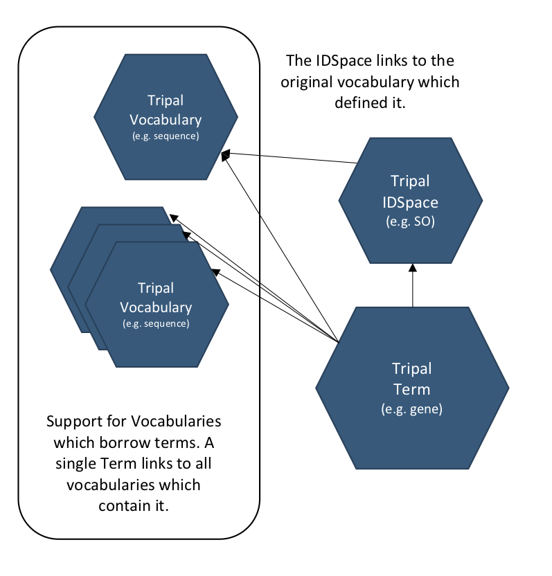

Controlled Vocabularies (CVs)
==============================

Controlled vocabularies are simply a collection of agreed upon names (knowns as terms) for items of interest. Within biology this may mean we have a controlled vocabulary describing the parts of a gene or the types of germplasm. And ontology is a specialized type of controlled vocabulary with additional structure including relationships between terms (i.e. the sequence ontology).

Tripal and Chado both use controlled vocabularies extensively to categorize data and metadata. The use of controlled vocabulary terms also allows both Tripal and Chado to be extremely flexible while also remaining very descriptive with rich metadata.

In Tripal, controlled vocabularies and their terms are Drupal content entities. This means they are managed similar to Tripal content (i.e. biological data) and will not be sync'd between production and development instances.

In Tripal 4 specifically, Tripal Controlled Vocabularies and their terms are completely independent of Chado. However, for sites which choose to use Chado for controlled vocabularies (recommended) there is tight cross-linking available. This ensures we remain database agnostic while also encouraging close interaction between Tripal and Chado.

How are CVs used in Tripal?
-----------------------------

Controlled vocabulary terms are used to define Tripal Content Types. Additionally, all Tripal Fields are defined using a controlled vocabulary term. As such, all biological content managed by Tripal is associated with a categorizing controlled vocabulary term and each piece of metadata defining a single piece of content is also defined using a controlled vocabulary. This ensures that Tripal content is `semantic web ready <https://www.w3.org/standards/semanticweb/>`_, as well as, ensuring it is well organized for both researchers and computer software.

IDSpace and Accession
----------------------

Because the human readable names of controlled vocabularies and their terms often conflict with other vocabularies and terms in biology, additional values must be defined that are always unique. For a controlled vocabulary that value is its IDSpace. For a controlled vocabulary's term that value is its accession.

How are CVs modelled in Tripal?
--------------------------------

Vocabulary with multiple IDSpaces (e.g. EDAM)
^^^^^^^^^^^^^^^^^^^^^^^^^^^^^^^^^^^^^^^^^^^^^^^

Now let's think about the EDAM vocabulary which has multiple IDspaces. We would have multiple terms (TripalTerm), each attached to a single IDspace (TripalVocabSpace). Each IDSpace references a single namespace (TripalVocab). This results in a single namespace (TripalVocab; EDAM) referenced by multiple IDspaces (TripalVocabSpace; Data, Operation, Format, etc.).

Vocabulary with borrowed terms
^^^^^^^^^^^^^^^^^^^^^^^^^^^^^^^^

Now lets think about the borrowed term situation. We would have a single term (TripalTerm) attached to a single IDspace (TripalVocabSpace) and included in multiple vocabularies (TripalVocab) with one being the originator namespace and the rest being accessory namespaces.

Finding a CVterm
------------------

Before creating a new content type for your site you must identify a CV term that best matches the content type you would like to create.  CVs are plentiful and at times selection of the correct term from the right vocabulary can be challenging. If there is any doubt about what term to use, then it is best practice to reach out to others to confirm your selection. The Tripal User community is a great place to do this by posting a description of your content type and your proposed term on the `Tripal Issue Queue <https://github.com/tripal/tripal/issues>`_.  Confirming your term with others will also encourage re-use across Tripal sites and improve data exchange capabilities.

The `EBI's Ontology Lookup Service <http://www.ebi.ac.uk/ols/index>`_ is a great place to locate terms from public vocabularies. At this site you can search for terms for your content type.  If you can not find an appropriate term in a public vocabulary or via discussion with others then you create a new **local** term within the **local** vocabulary that comes with Tripal.

.. warning::

  Creation of **local** terms is discouraged but sometimes necessary.  When creating local terms, be careful in your description.

Chado CV module
-----------------

In Chado, controlled vocabularies and ontologies are stored in the `CV Module <http://gmod.org/wiki/Chado_CV_Module>`_. This module provides flexible storage of the individual terms, as well as, the relationships between them.

Hands-on Training
------------------

 - :doc:`/dev_guide/lessons/create_cvterms`
