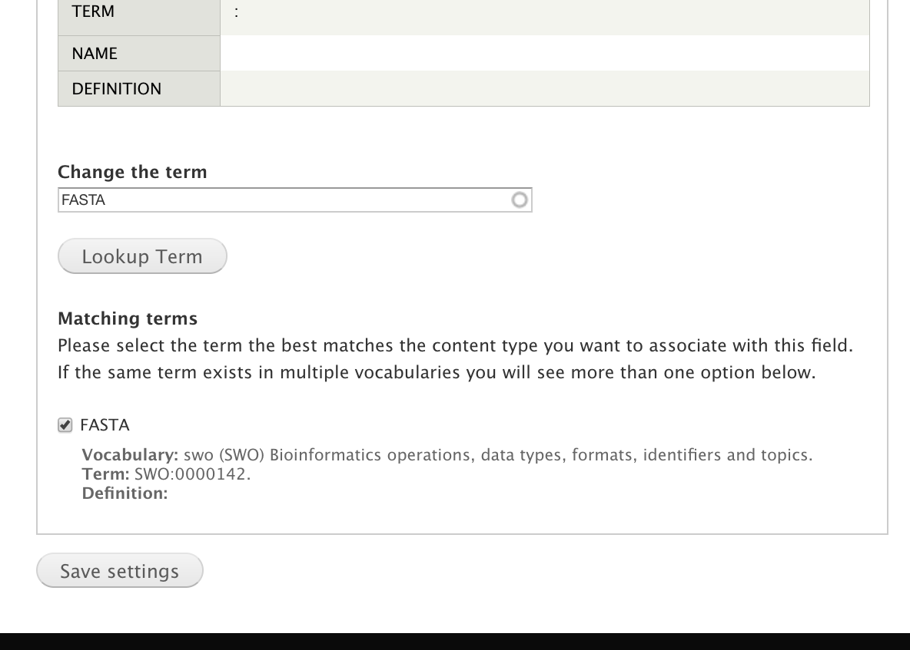
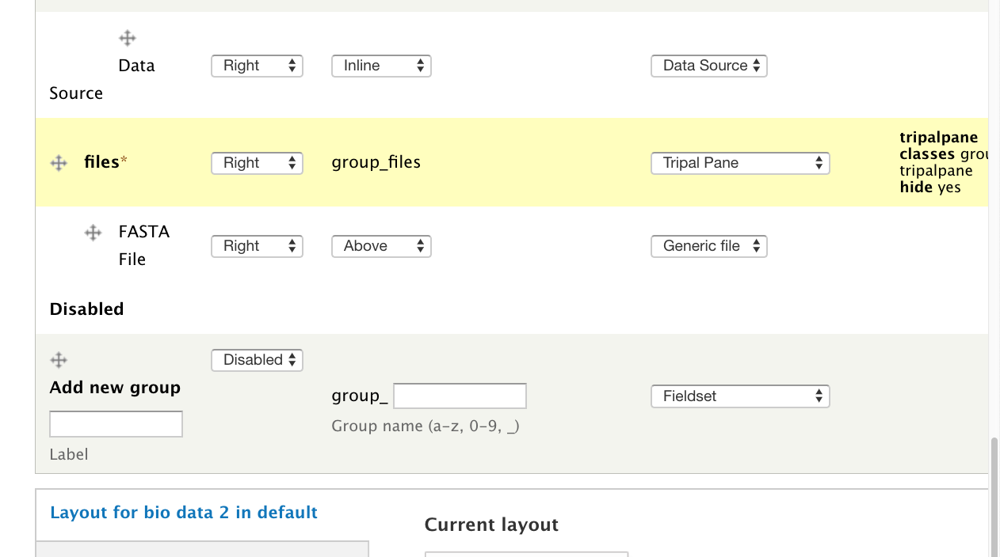
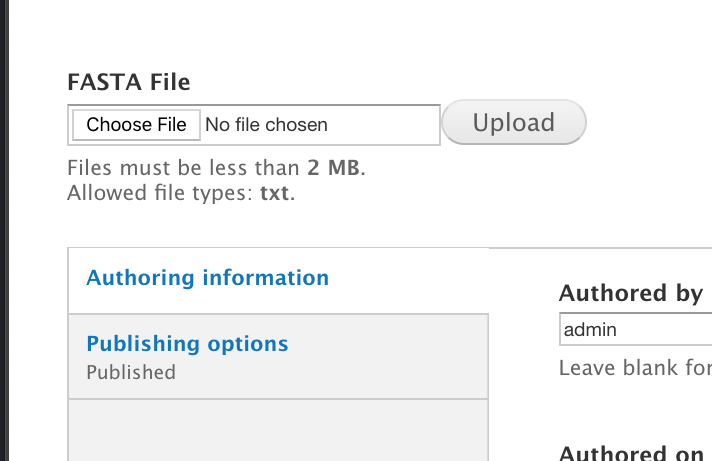
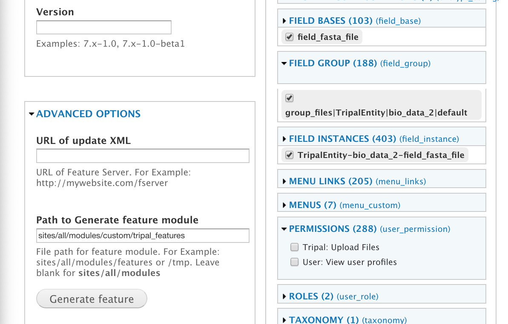
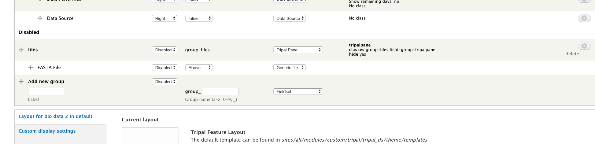
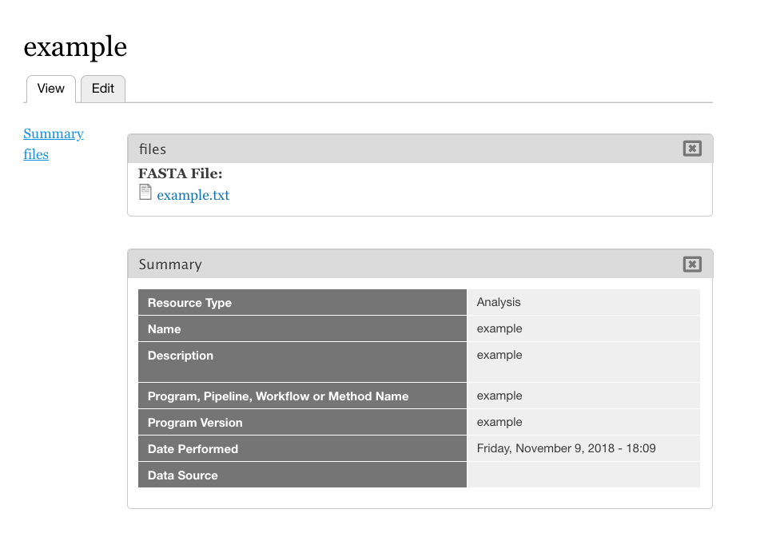

Exporting Field Settings With Drupal Features
================================================

This guide will demonstrate using the `Drupal Features <https://www.drupal.org/docs/7/modules/features>`_ to export and import Tripal Bundle Field settings.

Why Drupal Features?
---------------------

Consider a case where we have a development site where we configure a bundle (let's say the vanilla Analysis bundle) to have a custom set of Tripal Panes, with fields carefully reorganized into the panes.  In particular, we attach a Drupal File field to it, so we can host FASTA files easily.

Once we've configured the field settings, how do we get them to the live site?  One option is to open our field configuration admin UI on both sites, and copy the details one at a time.  This method is `time consuming and error prone <https://www.drupal.org/docs/7/modules/features/features-moving-site-configuration-to-code>`_, although it is relatively safe: we aren't liable to accidentally break our database this way.  Alternatively, trying to transfer via writing database exports is dangerous, and liable to accidentally break our site.

Is there a better way?  By exporting the field configuration as a feature!

.. note::

  Drupal 8 has a `feature designed to handle development deployment <https://www.phase2technology.com/blog/drupal-8-configuration-management>`_: Configuration Management!  Drupal Features remains relevant for sharing field configurations across sites, so this guide may remain useful when Tripal moves to Drupal 8.

.. warning::

  Note that I'm going to talk about features a lot in this post.  **In the context of the Feature module, features are exported configurations within your site**.  It's important that we don't confuse this with Chado features, which are genes, mRNAs, polypeptides, etc.

Version control
~~~~~~~~~~~~~~~~

Because features get exported as their own module, this means you can treat them as such.  You can initialize a git repo, store them on GitHub, make discrete versions, and in general benefit from version control for something which otherwise would only be done via the UI.

How many Features?
~~~~~~~~~~~~~~~~~~~

The features documentation links to a great article about `how to manage multiple features <http://kerasai.com/blog/2014/04/08/organizing-features-configuration-managment>`_.  The suggestion that each bundle be its own module is particularly helpful for Tripal, since we have so many bundles and its a reasonable, discrete way to manage and deploy configuration.  This means that mRNA and gene should be separate feature modules even though they are both ``chado.feature`` content types.

A Hazard: Mapping bundle IDs
~~~~~~~~~~~~~~~~~~~~~~~~~~~~~~

The main hurdle to overcome when mapping features is converting the field machine names across site.  This is because each field instance is specific to the bundle it's attached to, and bundle machine-names are from the bundle ID.  We can't assume bundle IDs are consistent across sites!

So what do we do?  Interestingly, roles have a similar problem, and a guide is `available <https://www.drupal.org/docs/7/modules/features/exportables-and-user-role-ids-in-features>`_ for dealing with them.

The general strategy is:

-   remove the exported id value from the ``features.inc`` file
-   use hook alter to fetch the ID on the target deployment setup

In our example below, the bundle ID's match on our site.  For default Tripal bundles, this should generally be the case.

Drupal Features Tutorial
-------------------------

In this tutorial, we'll add a FASTA file field to the Analysis bundle, and export the configuration.

Configuring the bundle fields
~~~~~~~~~~~~~~~~~~~~~~~~~~~~~~

To begin, let's quickly configure a bundle.  Navigate to the structure of your site and select Analysis (**Admin ->Structure -> Tripal Content -> Analysis -> Manage Fields**).  Scroll to the bottom and add a new field of type File, with a machine name of ``field_fasta_file‎``, and click **Save**. Be sure to change the **Allowed extensions** parameter to accept ``.fasta``, otherwise, it will only allow `.txt` files to be uploaded.  You may also want to increase the file size limit, as the default 2MB can be too small for many FASTA files.

We now have to pick a CV term for our field.  Because we are providing a FASTA file field, we can use a term such as FASTA (`SWO:0000142 <https://www.ebi.ac.uk/ols/ontologies/ero/terms?iri=http%3A%2F%2Fwww.ebi.ac.uk%2Fefo%2Fswo%2FSWO_0000142>`_).  Please see  :ref:`adding_a_cvterm` for help loading a term.  Once the term is in our DB, we can assign it to this field.

Now lets configure our field display.  Click the **Manage Display Tab** at the top, and create and enable a "Files" Tripal Pane, placing our new field in the Pane.

You can verify your new field is enabled and working by creating a new Analysis and inspecting the "FASTA file" field.

Exporting the bundle field displays
~~~~~~~~~~~~~~~~~~~~~~~~~~~~~~~~~~~
Once we are happy with our bundle field configuration, we can export the display settings using the Drupal Features module.

First, we enable the Features module using drush: ``drush pm-enable features -y``.  This adds a Features area under **Admin -> Structure**.  Navigate there and choose **Create Feature**.

The field information we're looking for is in **Field Bases**, **Field Group**, and **Field Instances**.  We can search for FASTA to find the field base and instance, and "files" (the name of our group) to find the field group.

.. note::

  Both **Field Bases** and **Field Instances** will contain the machine name of the field you want to export. **Field Bases** contains the site-wide information for a field and **Field Instances** contains the bundle-specific (i.e. Tripal Content Type) settings.

  **Field Group** will contain the machine name of the Tripal Pane and allows you to export the grouping settings you set on the **Manage Display Tab**.
  
I've also specified a custom path to keep all my Tripal features together under advanced options.

If we download and unzip our feature module, we can see it includes all the trappings of a Drupal module.

.. image:: ./exporting_field_settings.5.png

.. warning::

	As you can see, it makes the assumption that ``bio_data_2``, the bundle ID for Analysis on our source site, is the correct bundle to configure fields for.  However, Tripal makes no guarantee that will hold true on our target site.  One solution would be to manually relabel ``bio_data_x`` to the correct bundle ID.  On a smaller scale, this is a reasonable solution.  If you aren't sure what your bundle ID is, look in the URL when configuring the fields for it:  my constructed URL for example was ``admin/structure/bio_data/manage/bio_data_2/fields``.

  In our case, the site we want to import to has the same Analysis bundle ID, so no further action is necessary.

Importing the feature configuration
~~~~~~~~~~~~~~~~~~~~~~~~~~~~~~~~~~~

Go to our target site, all we need to do is download and unpack the ``.tar`` file we generated and enable the module (assuming the bundle ID issue is addressed).  I downloaded my file to ``/var/www/html/sites/all/modules/custom/analysis_configuration.tar``, decompressed it (``tar -xvf analysis_configuration.tar``), and enabled it (``drush pm-enable tripal_configuration``).

The field should now appear when you go to create a new analysis on your target site.  To check for yourself, create a new Analysis with dummy information: you'll be able to upload a file for the new file field.

Unfortunately, the field still gets imported **disabled** due to Tripal preference, so we have to go to the display settings on our target site and enable the tripal pane/field.

Drag the disabled Tripal pane/field group out of the disabled area, click save, and re-visit your newly created Analysis.  The files pane and uploaded FASTA file will now appear.

