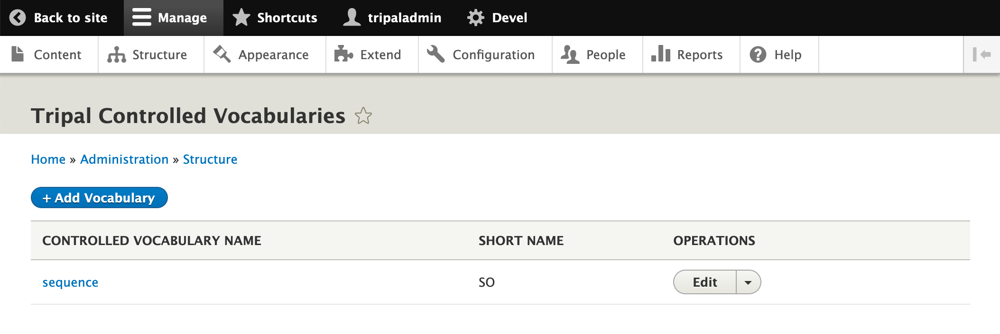
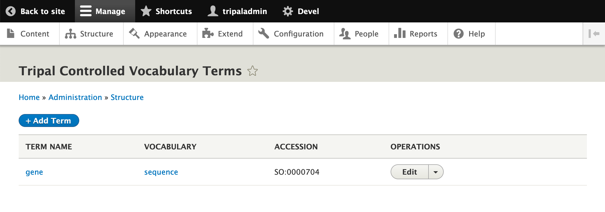
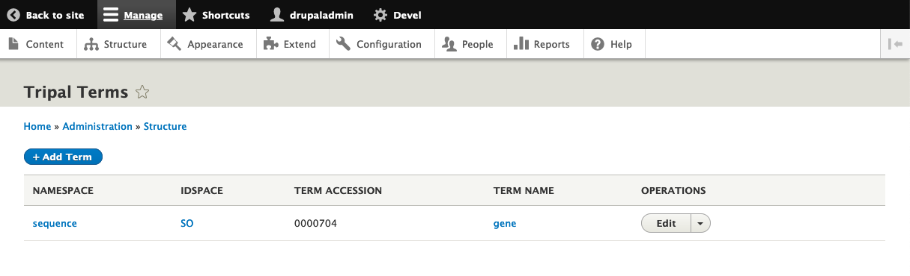

Controlled Vocabulary Terms Create/Load
=========================================

This lesson will teach you how to programmatically create new controlled vocabularies (CVs) and their terms (CVterms). It will also show you how to load both CVs and CVterms which already exist in your Tripal site.

.. warning::

  This lesson needs to be re-done once vocabulary integration is done. For now, all code samples have been removed as they no longer work.

.. note::

  You can try out this code anywhere in your Tripal extension module except in Twig templates. If you do not have a Tripal extension module, you can use the `Devel PHP <https://www.drupal.org/project/devel_php>`_ Drupal module on your **development Tripal site** and then execute the code at ``https://yourdrupalsite/devel/php``.

Controlled Vocabularies (CVs)
------------------------------

.. note::

  **Background:** :doc:`/dev_guide/cvterms`

  Questions:
    - How do I programmatically create a controlled vocabulary?
    - How do I load existing controlled vocabularies?
    - How do I access values once I have the vocabulary?

Create CV
^^^^^^^^^^

The following code demonstrates how to create a Tripal Controlled Vocabulary (CV) for the sequence ontology.

.. code:: php

  $details = [
    'idspace' => 'SO',
    'namespace' => 'sequence',
    'name' => 'The Sequence Ontology',
    'description' => 'The Sequence Ontology is a set of terms and relationships used to describe the features and attributes of biological sequence. SO includes different kinds of features which can be located on the sequence.'
  ];
  // Add in code sample of how to retrieve the above term.

This code sample simply describes the controlled vocabulary you would like to create as an associative array and then uses the ``tripal.tripalVocab.manager`` service to create it.

You can check that the CV saves properly by navigating to Home > Administration > Structure > Tripal Controlled Vocabularies (``admin/structure/tripal_vocab``) and ensuring your new CV is in the list of existing CVs.

This also automatically creates a Tripal IDSpace. A vocabulary can have multiple IDSpaces (e.g. EDAM has data, format, operations, etc.) but the method above will automatically create a single IDSpace associated with the vocabulary. You can check the IDSpace was created correctly by clicking on "View Tripal IDSpaces" at the top of the vocabulary listing and ensuring your new IDSpace is in the list of existing IDSpaces.

Load CV
^^^^^^^^^

Now that you have at least one CV, you can load an existing CV. This is demonstrated in the following code.

.. code:: php

  $details = [
    'name' => 'The Sequence Ontology',
    'namespace' => 'sequence',
  ];
  // code sample of how to load the above cv you just created.

The getVocabularies() method allows you to retrieve Tripal Vocabulary objects using their name and/or namespace.

Once you have a Tripal Vocabulary object, you can retrieve the value of various properties by using the following methods:

.. code:: php

  // code sample showing how to access the vocab id, name, description, etc.

Controlled Vocabulary Terms (CVterms)
---------------------------------------

.. note::

  **Background:** :doc:`/dev_guide/cvterms`

  Questions:
    - How do I programmatically add a term to an existing vocabulary.
    - How do I load an existing CVterm?
    - How do I access values once I have the term?

Create CVterm
^^^^^^^^^^^^^^^

The following code demonstrates how to create a Tripal Controlled Vocabulary Term (CVterm) in the "sequence ontology" controlled vocabulary (CV). Specifically, we are going to create a Tripal CVterm for the `gene <http://www.sequenceontology.org/miso/release_2.5/term/SO:0000704>`_ term from the sequence ontology.

.. code:: php

  $details = [
    'accession' => '0000704',
    'name' => 'gene',
    'vocabulary' => [
      'name' => 'sequence',
      'idspace' => 'SO',
    ],
    'definition' => 'A region (or regions) that includes all of the sequence elements necessary to encode a functional transcript. A gene may include regulatory regions, transcribed regions and/or other functional sequence regions.',
  ];
  // Code sample showing how to create the above term.

This follows the same format as for creating the sequence ontology CV. First we describe the term we want to create including the Tripal Vocabulary and then we use the ``tripal.tripalTerm.manager`` service to create it. This service will create the controlled vocabulary if it doesn't already exist!

To check if your CVterm was created properly you can look on the listing at Home > Administration > Structure > Tripal Vocabulary (``admin/structure/tripal_vocab``) then click on "View Tripal Terms" and ensure your new CVterm is in the list of existing CVterms.

Load CVterm
^^^^^^^^^^^^^

Now that you have at least one CVterm, you can load an existing CVterm. This is demonstrated in the following code.

.. code::

  $details = [
    'accession' => '0000704',
    'vocabulary' => [
      'namespace' => 'sequence',
      'idspace' => 'SO',
    ],
  ];
  // code sample showing how to retrieve the above term.

Once you have a TripalTerm object, you can retrieve the value of various properties by using the following methods:

.. code::

  // Code sample showing how to retrieve
  // the id space, accession, name, definition of a term.
