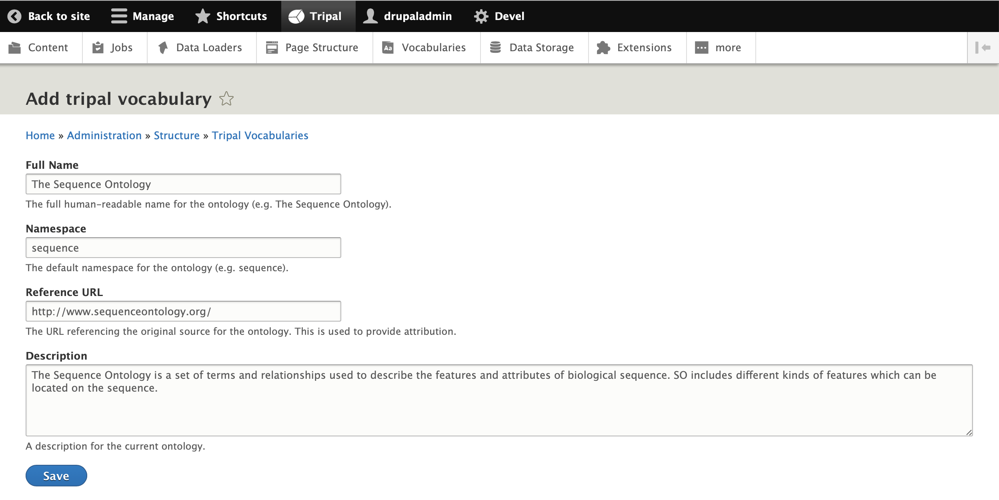
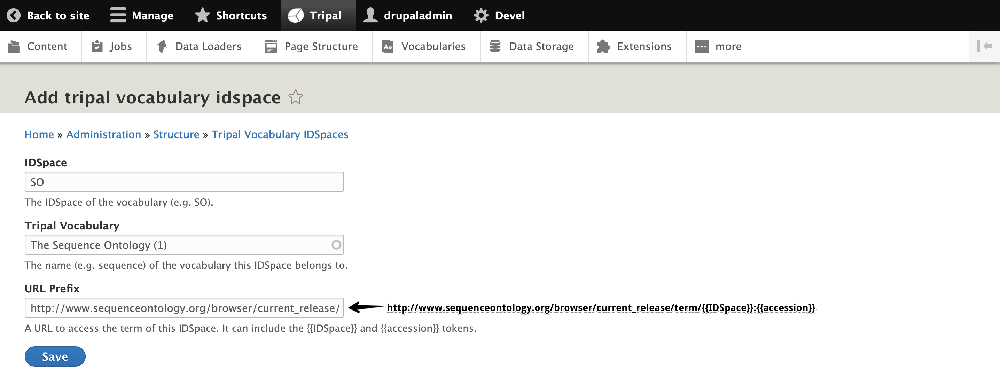
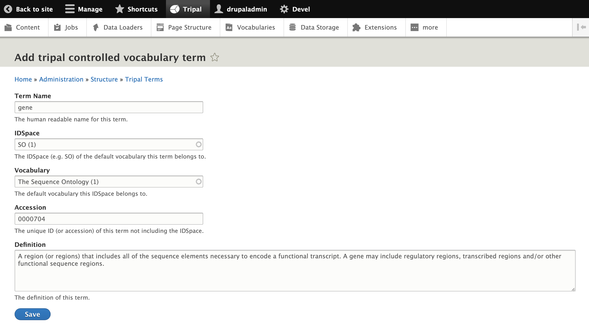

Setting up Tripal Vocabularies
==============================

Controlled vocabulary terms are used to define Tripal Content Types. As such, they are one of the first things you'll need to set up for your Tripal site. Here is where you'll find how to add a CV, IDSpace, and Term through the user interface.

.. note::
  Refer to this :doc:`/dev_guide/cvterms` page for information on:

    - Why CVs are important
    - What are IDSpaces and Terms
    - How to find the right CVs for use in your Tripal site

How to navigate to Tripal CVs
^^^^^^^^^^^^^^^^^^^^^^^^^^^^^
In the Administration toolbar, navigate to Tripal -> Vocabularies.

.. image:: TripalCV_setup.1.png

This will bring you to a listing of all Tripal vocabularies once they have been created.

How to add a Tripal Controlled Vocabulary
^^^^^^^^^^^^^^^^^^^^^^^^^^^^^^^^^^^^^^^^^
Use the blue button **Add Vocabulary** to add a new vocabulary. Here, we'll demonstrate adding The Sequence Ontology as a controlled vocabulary as seen in the screenshot below.

Once you click on **Save**, you'll be brought back to the Vocabularies listing where the CV you just created should now be listed.

How to add a Tripal IDSpace
^^^^^^^^^^^^^^^^^^^^^^^^^^^
On the **Tripal Vocabularies** page, select the tab labeled **IDSpaces**, then click on the blue **Add IDSpace** button.

Suppose we want to create an IDSpace for the CV we just created, The Sequence Ontology. In the screenshot below, we'll need to fill the IDSpace, select a Tripal Vocabulary (in this case, The Sequence Ontology), and fill in the URL Prefix.

The full URL Prefix has been added to the screenshot since it was cut off by the size of the textbox. Note the use of tokens: {{IDSpace}} for the IDSpace and {{accession}} for the term.

Click **Save** and you should see your new IDSpace listed on the page.

How to add a Term
^^^^^^^^^^^^^^^^^
Either from the **Tripal Vocabularies** or **Tripal Vocabulary IDSpaces** page, select the tab labeled **Terms**, then click on the blue **Add Term** button.

In the screenshot below, we are adding the term **gene** to our vocabulary (The Sequence Ontology) and IDSpace (SO).

Click **Save** and you should see your newly created term in the listing.
