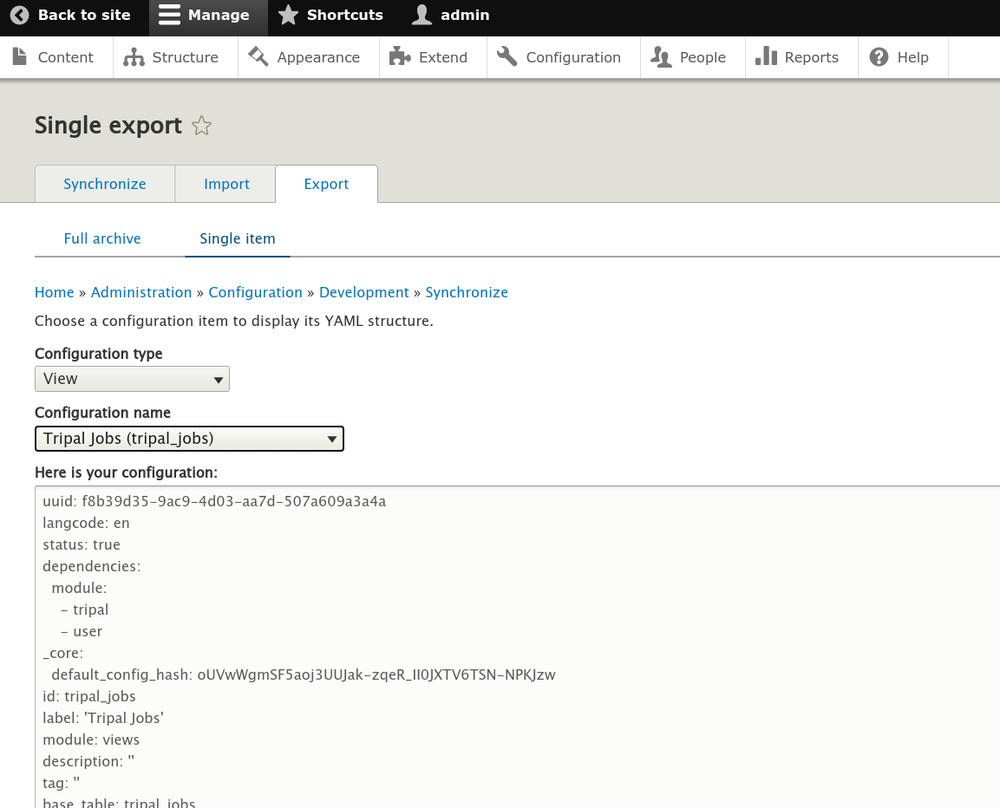

Upgrading an Extension Module
================================

This page provides useful short snippets of code to help module developers upgrade their Tripal v3 compatible modules to work with Drupal 8/9. This list is not comprehensive or complete, but is meant to be an aid.

tripal_set_message() and tripal_report_error()
---------------------------------------------------

These functions have been upgraded and thus can be used as is. However, the new way is use a logger service as shown below.

.. code-block:: php

  $logger = \Drupal::service('tripal.logger');
  $logger->notice('Hello world');
  $logger->info('Hello world');
  $logger->warning('Hello world');
  $logger->error('Hello world');
  $logger->debug('Hello world');

drupal_set_message()
----------------------

Changelog: https://www.drupal.org/node/2774931

.. code-block:: php

  use Drupal\Core\Messenger\MessengerInterface;
  // if not set by constructor...
  $this->messenger = \Drupal::messenger();

  // Add specific type of message within classes.
  $this->messenger->addMessage('Hello world', 'custom');
  $this->messenger->addError('Hello world');
  $this->messenger->addStatus('Hello world');
  $this->messenger->addWarning('Hello world');

  // In procedural code:
  $messenger = \Drupal::messenger();
  $messenger->addMessage('Hello world', 'custom');
  $messenger->addError('Hello world');
  $messenger->addStatus('Hello world');
  $messenger->addWarning('Hello world');

format_date()
-------------

.. code-block:: php

  \Drupal::service('date.formatter')->format($time);

Loading a User Object
---------------------
To load a user using a known user ID.

.. code-block:: php

   // Load a user with a known UID in the $uid variable.
   $user = \Drupal\user\Entity\User::load($uid);

To get the current user:

.. code-block:: php

   $current_user = \Drupal::currentUser();
   $user = \Drupal\user\Entity\User::load($current_user->id());


Creating Links
--------------
To create HTML links the Drupal 7 was was:

.. code-block:: php

  $link = l('Administration', '/admin')


The Drupal 9 approach is:

.. code-block:: php

   use Drupal\Core\Link;
   use Drupal\Core\Url;

   $link = Link::fromTextAndUrl('Administration', Url::fromUri('internal:/admin'))

Using Links in `drupal_set_message`:

.. code-block:: php

      $jobs_url = Link::fromTextAndUrl('jobs page',
        Url::fromUri('internal:/admin/tripal/tripal_jobs'))->toString();
      drupal_set_message(t("Check the @jobs_url for status.",
        ['@jobs_url' => $jobs_url]));


Database Queries
----------------

db_query
````````
The `db_query` function is deprecated in Drupal 9. To perform a database query you will need to rework any calls to the `db_query` function in the following way:

.. code-block:: php

    // Get the database object.
    $database = \Drupal::database();

    // Perform the query by passing the SQL statement and arguments.
    $query = $database->query($sql, $args);

    // Get the result(s).
    $job = $query->fetchObject();


drupal_write_record
```````````````````
The `drupal_write_record` was useful in Drupal 7 for directly working with tables that Drupal was aware of.  Here's the replacement:


.. code-block:: php

   $database = \Drupal::database();
   $num_updated = $database->update('tripal_jobs')
     ->fields([
       'status' => 'Cancelled',
       'progress' => 0,
     ])
     ->condition('job_id', $this->job->job_id)
     ->execute();

Views
-----

The hook_views_data() function
``````````````````````````````
The `hook_views_data` function is used to expose tables within Drupal to the Drupal Views.  The function returns an array that defines how tables can be handled by Views.  Fortunately, this is mostly backwards compatible and you can keep the function as is. However, you will need to make the following changes:

1. Where handlers are defined for the field, filter, sort, relationship, argument you must change the key `handler` to `id`.
2. Handler names are now just a single word. The following table provides some common name changes.

+--------------+-------------------------------+---------------------+
| Handler Type |D7 Handler Function            | D8/9 Handler ID     |
+==============+===============================+=====================+
| field        | views_handler_field           | standard (strings)  |
+              +-------------------------------+---------------------+
|              | views_handler_field_numeric   | numeric             |
+              +-------------------------------+---------------------+
|              | views_handler_field_date      | date                |
+--------------+-------------------------------+---------------------+
| filter       | views_handler_filter_numeric  | numeric             |
+              +-------------------------------+---------------------+
|              | views_handler_filter_string   | string              |
+              +-------------------------------+---------------------+
|              | views_handler_filter_date     | date                |
+--------------+-------------------------------+---------------------+
| sort         | views_handler_sort            | standard (strings)  |
+              +-------------------------------+---------------------+
|              | views_handler_sort_date       | date                |
+--------------+-------------------------------+---------------------+
| argument     | views_handler_argument_string | string              |
+              +-------------------------------+---------------------+
|              | views_handler_argument_date   | date                |
+--------------+-------------------------------+---------------------+
| relationship | views_handler_relationship    | standard            |
+--------------+-------------------------------+---------------------+

You can find additional handlers at these API pages:

- `Fields <https://api.drupal.org/api/drupal/core%21modules%21views%21src%21Plugin%21views%21field%21FieldPluginBase.php/group/views_field_handlers/9.0.x>`_
- `Filters <https://api.drupal.org/api/drupal/core%21modules%21views%21src%21Plugin%21views%21filter%21FilterPluginBase.php/group/views_filter_handlers/9.0.x>`_
- `Sort <https://api.drupal.org/api/drupal/core%21modules%21views%21src%21Plugin%21views%21sort%21SortPluginBase.php/group/views_sort_handlers/9.0.x>`_
- `Arguments <https://api.drupal.org/api/drupal/core%21modules%21views%21src%21Plugin%21views%21argument%21ArgumentPluginBase.php/group/views_argument_handlers/9.0.x>`_
- `Relationships <https://api.drupal.org/api/drupal/core%21modules%21views%21src%21Plugin%21views%21relationship%21RelationshipPluginBase.php/group/views_relationship_handlers/9.0.x>`_


The hook_views_default_views() function
```````````````````````````````````````
In Drupal v7 this function was used to provide the set of views that you would like the end-user to see automatically when the module is installed.  This function is no longer used neither is the `<modulename>.views_default.inc` file where this hook would be stored. Instead the default views are provided in YML format.

**Step 1: Create the View**: To recreate any views that your module provided in Drupal 7, you must recreate the View using the Views UI interface. No coding is required.

**Step 2: Export the View**: Once the view has been recreated, you can export the YML for the view by navigating to ``Admin`` >> ``Configuration`` >> ``Configuration Synchronization``.  Click the ``Export`` tab at the top, then click the ``single item`` link below the tab.  In the page that appears you should then select ``View`` from the ``Configuration type`` dropdown and then select the name of the view you want to export. The YML code for the selected view will appear in the textarea below. The screenshot below shows an example:



**Step 3: Create the View YML file**: Once you have the YML code for the view, you must create a new file named `views.view.<view_name>.yml` and place the code inside of it.   Where `<view_name>` is the machine name of the view.  You can safely remove the first `uuid` line. This file must be placed in the `config/install` directory of your module.

**Step 4:  Reinstall the Module**: In order for Drupal Views to see this new view you must reinstall the module.


Embed a View on a Page
``````````````````````
In Drupal v7 you could embed a view onto any page by using code similar to the following

.. code-block:: php

    $view = views_embed_view('tripal_admin_jobs', 'default');

In Drupal 8 use code similar to the following to embed a view on a page:

.. code-block:: php

    $view = \Drupal\views\Views::getView('tripal_jobs');
    $view->setDisplay('default');
    if ($view->access('default')) {
      return $view->render();
    }
    else {
      return [
        '#markup' => 'You do not have access to view this page.',
      ];
    }


Attaching CSS
-------------
In Drupal 8/9 CSS files are part of "libraries".  Libraries are groups of "assets" such as CSS, JS, or other resources needed for a particular set of pages that the module provides.  Libraries are defined in the `<module_name>.libraries.yml` file.  For information about preparing your CSS files with drupal see the page about `adding css and js files to a module <https://www.drupal.org/node/2274843>`_.  Once the CSS is setup correctly, you want to add "libraries" to pages that use them.  This is done by adding an '#attached' element to the render array returned by a page using the following form:

.. code-block:: php

   '#attached' => [
     'library' => ['<module_name>/<library_name>'],
   ]

Replace `<module_name>` and `<library_name>` with appropriate values.
