Bulk Loader
===========

.. note::

  Remember you must set the ``$DRUPAL_HOME`` environment variable if you want to cut-and-paste the commands below. See :doc:`./install_tripal/drupal_home`

The bulk loader is a tool that Tripal provides for loading of data contained in tab delimited files. Tripal supports loading of files in standard formats (e.g. ``FASTA``, ``GFF``, ``OBO``), but Chado can support a variety of different biological data types and there are often no community standard file formats for loading these data. For example, there is no file format for importing genotype and phenotype data. Those data can be stored in the feature, stock and natural diversity tables of Chado. The Bulk Loader was introduced in Tripal v1.1 and provides a web interface for building custom data loader. In short, the site developer creates the bulk loader "template". This template can then be used and re-used for any tab delimited file that follows the format described by the template. Additionally, bulk loading templates can be exported allowing Tripal sites to share loaders with one another.  

The following commands can be executed to install the Tripal Bulk Loader using Drush:

.. code-block:: bash

  cd /var/www/
  drush pm-enable tripal_bulk_loader
  

Plan How to Store Data
----------------------

To demonstrate use of the Bulk Loader, a brief example that imports a list of organisms and associates them with their NCBI taxonomy IDs will be performed. The input tab-delimited file will contains the list of all *Fragaria* (strawberry) species in NCBI at the time of the writing of this document.  Click the file link below and download it to ``/var/www/html/sites/default/files``.

* `Fragaria.txt <http://tripal.info/sites/default/files/book_pages/Fragaria_0.txt>`_

.. code-block:: bash

  cd $DRUPAL_HOME/sites/default/files
  wget http://tripal.info/sites/default/files/book_pages/Fragaria_0.txt

This file has three columns: NCBI taxonomy ID, genus and species:

.. csv-table:: Fragaria sample file

  3747    "Fragaria"        "x ananassa"
  57918   "Fragaria"        "vesca"
  60188   "Fragaria"        "nubicola"
  64939   "Fragaria"        "iinumae"
  64940   "Fragaria"        "moschata"
  64941   "Fragaria"        "nilgerrensis"
  64942   "Fragaria"        "viridis"

To use the bulk loader you must be familiar with the Chado database schema and have an idea for where data should be stored. It is best practice to consult the GMOD website or consult the Chado community (via the `gmod-schema mailing list <https://lists.sourceforge.net/lists/listinfo/gmod-schema>`_) when deciding how to store data. For this example, we want to add the species to Chado, and we want to associate the NCBI taxonomy ID with these organisms. The first step, therefore, is to decide where in Chado these data should go. In Chado, organisms are stored in the **organism** table. This table has the following fields:

`chado.organism Table Schema`

.. csv-table::
  :header: "Name",	"Type",	"Description"

  "organism_id",	"serial",	"PRIMARY KEY"
  "abbreviation",	"character varying(255)",
  "genus",	"character varying(255)",	"UNIQUE#1 NOT NULL"
  "species",	"character varying(255)",	"UNIQUE#1 NOT NULL  A type of organism is always uniquely identified by genus and species. When mapping from the NCBI taxonomy names.dmp file, this column must be used where it is present, as the common_name column is not always unique (e.g. environmental samples). If a particular strain or subspecies is to be represented, this is appended onto the species name. Follows standard NCBI taxonomy pattern."
 	"common_name",	"character varying(255)"
 	"comment",	"text"

We can therefore store the second and third columns of the tab-delimited input file in the **genus** and **species** columns of the organism table.

In order to store a database external reference (such as for the NCBI Taxonomy ID) we need to use the following tables: **db**, **dbxref**, and **organism_dbxref**. The **db** table will house the entry for the NCBI Taxonomy; the **dbxref** table will house the entry for the taxonomy ID; and the **organism_dbxref** table will link the taxonomy ID stored in the **dbxref** table with the organism housed in the **organism** table. For reference, the fields of these tables are as follows:

`chado.db Table Schema`

.. csv-table::
  :header: "Name",	"Type",	"Description"

 	"db_id",	"serial",	"PRIMARY KEY"
 	"name",	character varying(255),	"UNIQUE NOT NULL"
 	"description",	"character varying(255)", ""
 	"urlprefix",	"character varying(255)"
 	"url",	"character varying(255)"

`chado.dbxref Table Schema`

.. csv-table::
  :header: "Name",	"Type",	"Description"

 	"dbxref_id",	"serial",	"PRIMARY KEY"
  "db_id",	"integer",	"Foreign Key db.  UNIQUE#1 NOT NULL"
 	"accession",	"character varying(255)",	"UNIQUE#1 NOT NULL.  The local part of the identifier. Guaranteed by the db authority to be unique for that db."
 	"version",	"character varying(255)",	"UNIQUE#1 NOT NULL DEFAULT ''"
 	"description",	"text"

`chado.organism_dbxref Table Schema`

.. csv-table::
  :header: "Name",	"Type",	"Description"

  "organism_dbxref_id", "serial", "PRIMARY KEY"
  "organism_id",	"integer",	"Foreign key organism. UNIQUE#1 NOT NULL"
  "dbxref_id",	"integer",	"Foreign key dbxref.  UNIQUE#1 NOT NULL"

For our bulk loader template, we will therefore need to insert values into the **organism**, **db**, **dbxref** and **organism_dbxref** tables. In our input file we have the genus and species and taxonomy ID so we can import these with a bulk loader template. However, we do not have information that will go into the db table (e.g. "NCBI Taxonomy"). This is not a problem as the bulk loader can use existing data to help with import. We simply need to use the "NCBI Taxonomy" database that is currently in the Chado instance of Tripal v3.

Creating a New Bulk Loader Template
-----------------------------------

Now that we know where all of the data in the input file will go and we have the necessary dependencies in the database (i.e. the NCBI Taxonomy database), we can create a new bulk loader template. Navigate to ``Tripal → Data Loaders → Chado Bulk Loader``, click the **Templates** tab in the top right corner, and finally click the link **Add Template**. The following page appears:

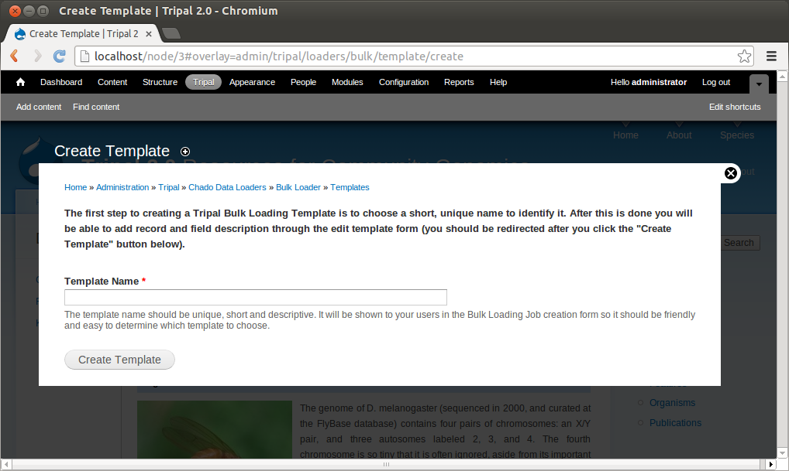

We need to first provide a name for our template. Try to name templates in a way that are meaningful for others. Currently only site administrators can load files using the bulk loader. But, future versions of Tripal will provide functionality to allow other privileged users the ability to use the bulk loader templates. Thus, it is important to name the templates so that others can easily identify the purpose of the template. For this example, enter the name **NCBI Taxonomy Importer (taxid, genus, species)**. The following page appears:

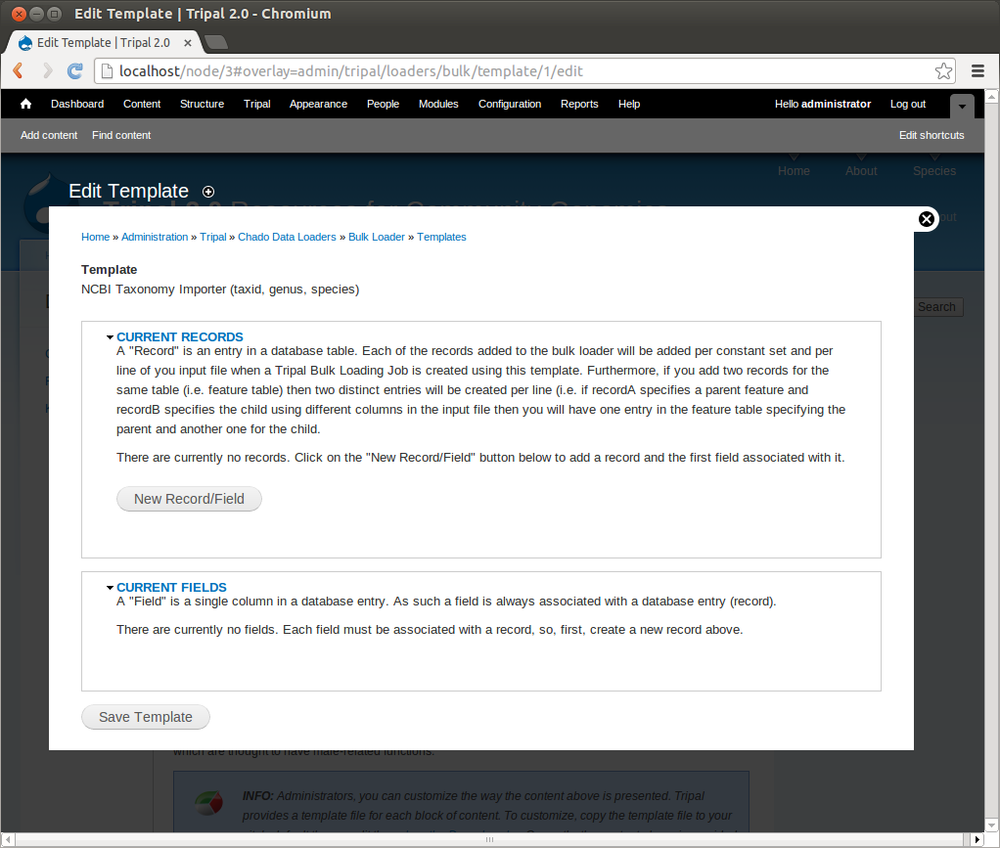

Notice that the page is divided into two sections: **Current Records** and **Current Fields**. Before we continue with the template we need a bit of explanation as to the terminology used by the bulk loader. A **record** refers to a Chado table and an action on that table. For example, to insert the data from the input file we will need to select the NCBI Taxonomy database from the **db** table and insert entries into the **dbxref**, **organism** and **dbxref_organism** tables. Therefore, we will have four records:

* An insert into the organism table
* A select from the db table (to get the database id (db_id) of the "NCBI Taxonomy" database needed for the insert into the dbxref table)
* An insert into the dbxref table
* An insert into the organism_dbxref table.

Each record contains a set of fields on which the action is performed. Thus, when we insert an entry into the organism table we will insert into two fields: **genus** and **species**.

To create the first record for inserting an organism, click the button **New Record/Field**. The following page appears:

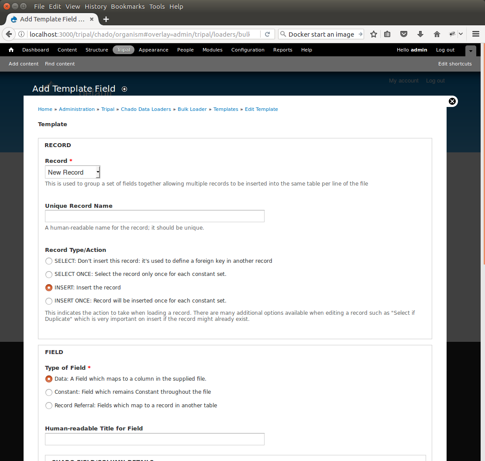

By default, when adding a new record, the bulk loader also provides the form elements for adding the first field of the record as well. We are adding a new record, so we can leave the **Record** drop-down as **New Record**. Next, give this record a unique record name. Because we are inserting into the organism table, enter the name **Organism** into the **Unique Record Name** box.

We also have the opportunity with this form to add our first field to the record.  Because we are adding the organism record we will first add the field for the **genus**. In the **Field** section we specify the source of the field. Because the genus value comes from the input file, select the first radio button titled **Data**. Next we need a human-readable name for the field. This field is the **genus** field so we will enter Genus into the **Human-readable Title for Field** box.  Next, we need to specify the **Chado table** for this record. In the Chado table drop down box, choose the **organism** table, and in the **Chado Field/Column** drop down box select **genus**.

In the next section, titled **Data File Column**, we need to indicate the column in the tab-delimited file where the genus is found. For the example file this is column 2 (columns are ordered beginning with number 1). Therefore, enter the number **2** in the **Column** box. There are additional options to expose the field to the user, but for now we can ignore those options. Click the **Save Changes** button at the bottom. We now see that the organism record and the first field have been added to our bulk loader template.

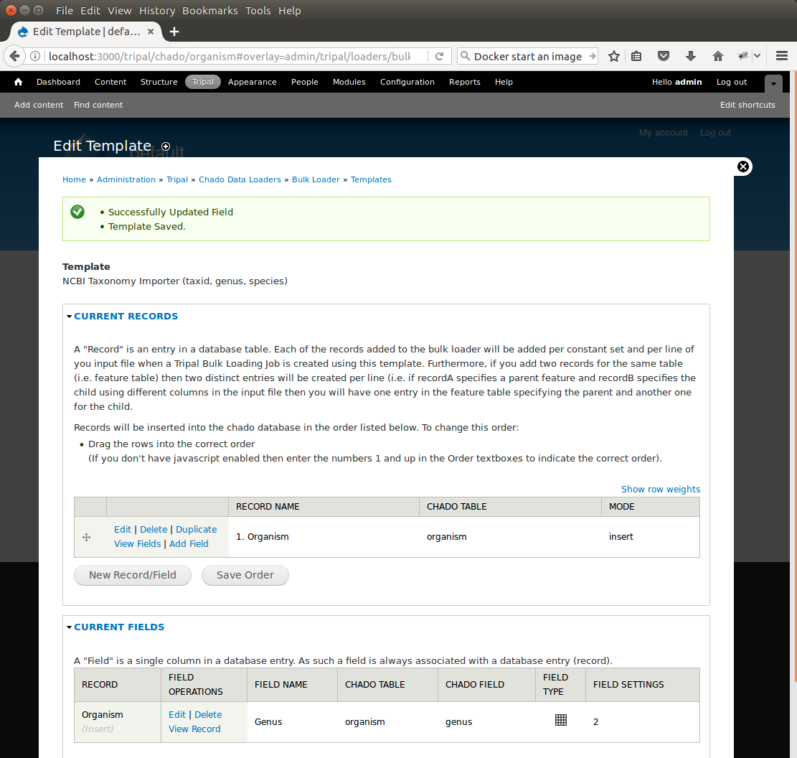

We also see that the **Mode** (or action) for this record has been set to insert by default. Before continuing we should edit the settings for the record so that it is more fault tolerant. Click the **Edit** link to the left of the new organism record. On the resulting page we see the record details we already provided, but now there is a section titled **Action to take when Loading Record**. By default, the **INSERT** option is selected. This is correct. We want to perform an insert. However, notice in the **Additional Insert Options** section, the **SELECT if duplicate (no insert).** Check this box. This is a good option to add because it prevents the bulk loader from failing if the record already exists in the table.

Click the **Save Record** button to save these settings. Now, you will see that the **Mode** is now set to insert or select if duplicate. Previously the **Mode** was just **insert**.

Next, we need to add the **species** field to the record. Click the **Add Field** link to the left of the organism record name. Here we are presented with the same form we used when first adding the organism record. However, this time, the **Record** section is collapsed.  If we open that section the drop down already has the **Organism** record as we are not creating a new record. To add the **Species** field, provide the following values and click the **Save Changes button**:

* Type of field: Data
* Human-readable Title for Field: Species
* Chado table: organism (should already be set)
* Chado Field/Column: species
* Column: 3

We now have two fields for our organism record:

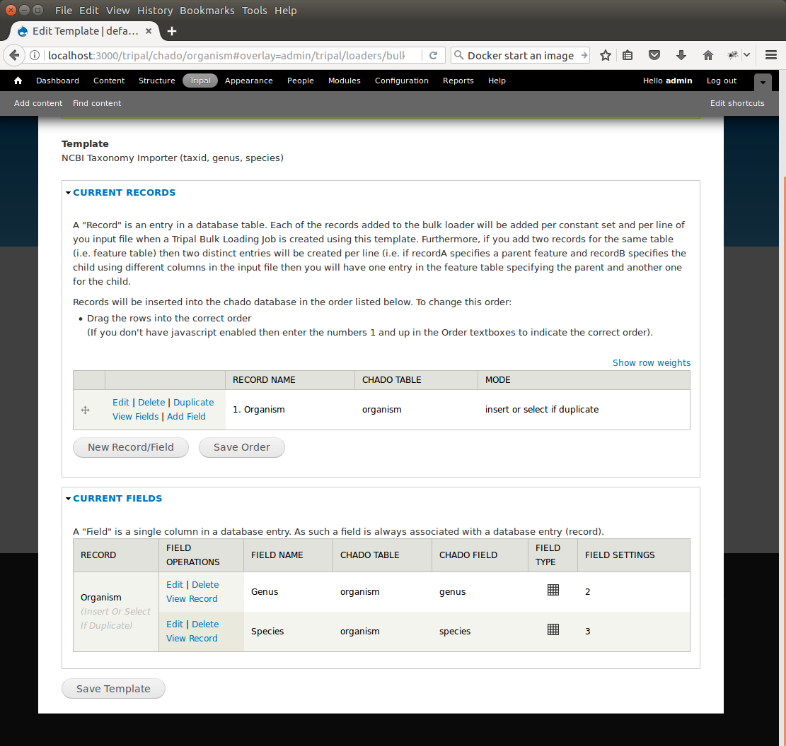

At this point our organism record is complete, however there are still a few fields in the organism table of Chado that are not present in our record. These include the **organism_id, abbreviation, common_name** and **comment** fields. We do not have values in our input file for any of these fields. Fortunately, the **organism_id** field is a primary key field and is auto generated when a record is submitted. We do not need to provide a value for that field. The other fields are not part of the unique constraint of the table. Therefore, those fields are optional and we do not need to specify them. Ideally, if we did have values for those non-required fields we would add them as well.

To this point, we have built the loader such that it can load two of the three columns in our input file. We have one remaining column: the NCBI taxonomy ID. In order to associate an organism with the taxonomy ID we must first insert the taxonomy ID into the **dbxref** table. Examining the dbxref table, we see that a **db_id** field is a required value in a foreign key relationship. We must first retrieve the **db_id** from the **db** table of Chado before we can add the entry to the **dbxref** table. Therefore, we will create a second record that will do just that. On the **Edit Template** page click the button **New Record/Field**. Here we see the same form we used for adding the first organism record. Provide the following values:

* For the record:
   * Record: New Record
   * Unique Record Name: NCBI Taxonomy DB
   * Record Type/Action: SELECT ONCE: Select the record only once for each constant set.
* For the field:
   * Type of field: Constant
   * Human-readable Title for Field: DB name
   * Chado table: db
   * Chado field/column: name
* Within the Constant section:
   * Constant Value:  NCBITaxon
   * Check "Ensure the value is in the table"

Here we use a field type of **Constant** rather than **Data**. This is because we are providing the value to be used in the record rather than using a value from the input file. The value we are providing is "NCBI Taxonomy" which is the name of the database we added previously. The goal is to match the name "NCBI Taxonomy" with an entry in the **db** table. Click the **Save Changes** button.

We now see a second record on the **Edit Template** page. However, the mode for this record is insert. We do not want to insert this value into the table, we want to select it because we need the corresponding **db_id** for the **dbxref** record. To change this, click the Edit link to the left of the **NCBI Taxonomy DB** record. Here we want to select only the option **SELECT ONCE**. We choose this option because the database entry that will be returned by the record will apply for the entire input file. Therefore, we only need to select it one time. Otherwise, the select statement would execute for each row in the input file causing excess queries. Finally, click **Save Record**. The **NCBI Taxonomy DB** record now has a mode of **select once**.  When we created the record, we selected the option to 'SELECT ONCE'.  This means that the bulk loader will perform the action one time for that record for the entire import process.  Because the field is a constant the bulk loader need not execute that record for every row it imports from our input file.  We simply need to select the record once and the record then becomes available for use through the entire import process.

Now that we have a record that selects the **db_id** we can now create the **dbxref** record. For the **dbxref** record there is a unique constraint that requires the **accession**, **db_id** and **version**. The version record has a default value so we only need to create two fields for this new record: the db_id and the accession. We will use the **db_id** from the **NCBI Taxonomy DB** record and the accession is the first column of the input file. First, we will add the **db_id** record. Click the **New Record/Field** button and set the following:

* For the record:
   * Record: New Record
   * Unique Record Name: Taxonomy ID
   * Record Type/Action:  INSERT: insert the record
* For the field:
   * Type of field: Record referral
   * Human-readable Title for Field: NCBI Taxonomy DB ID
   * Chado table: dbxref
   * Chado Field/Column: db_id
* In the Record Referral Section:
   * Record to refer to: NCBI Taxonomy DB
   * Field to refer to: db_id

Click the Save Changes button. The Edit Template page appears.

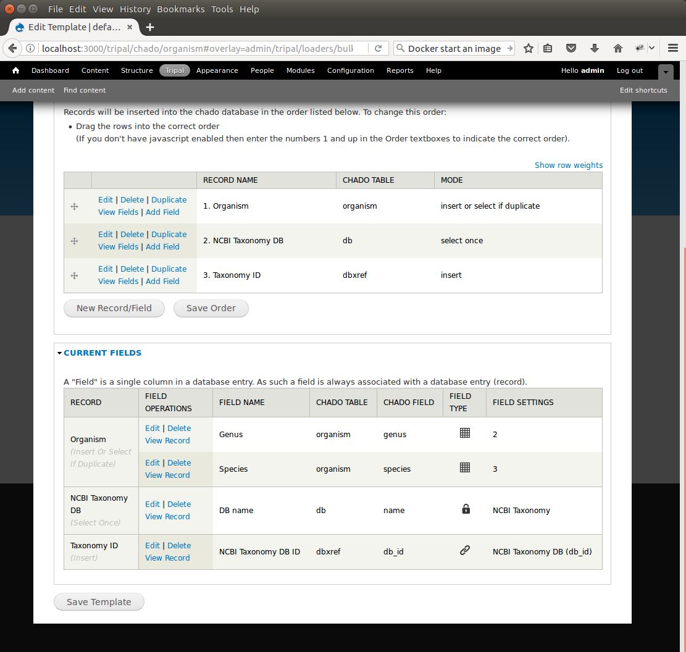

Again, we need to edit the record to make the loader more fault tolerant. Click the Edit link to the left of the Taxonomy ID record. Select the following:

* Insert
* Select if duplicate

To complete this record, we need to add the accession field. Click the Add field link to the left of the Taxonomy ID record name. Provide the following values:

* For the field:
   * Type of Field: Data
   * Human-readable Title for Field: Accession
   * Chado table: dbxref
   * Chado field/column: accession
* In the Data File Column section:
   * Column: 1

At this state, we should have three records: Organism, NCBI Taxonomy DB, and Taxonomy ID. We can now add the final record that will insert a record into the **organism_dbxref** table. Create this new record with the following details:

* For the record:
   * Record: New Record
   * Unique Record Name: Taxonomy/Organism Linker
   * Check: Insert: insert the record
* For the field:
   * Type of Field: Record Referral
   * Human-readable Title for Field: Accession Ref
   * Chado table: organism_dbxref
   * Chado field/column: dbxref_id
* In the Record Referral section:
   * Record to refer to: Taxonomy ID
   * Field to refer to: dbxref_id

Create the second field:

* For the field:
   * Type of Field: Record Referral
   * Human-readable Title for Field: Organism ID
   * Chado table: organism_dbxref
   * Chado field/column: organism_id
* In the Record Referral section:
   * Record to refer to: Organism
   * Field to refer to: organism_id

​After saving the field.  Edit the record and set the following:

* Change the record mode to: insert or select if duplicate

We are now done! We have created a bulk loader template that reads in a file with three columns containing an NCBI taxonomy ID, a genus and species. The loader places the genus and species in the **organism** table, adds the NCBI Taxonomy ID to the **dbxref** table,  links it to the NCBI Taxonomy entry in the db table, and then adds an entry to the **organism_dbxref** table that links the organism to the NCBI taxonomy Id. The following screen shots show how the template should appear:

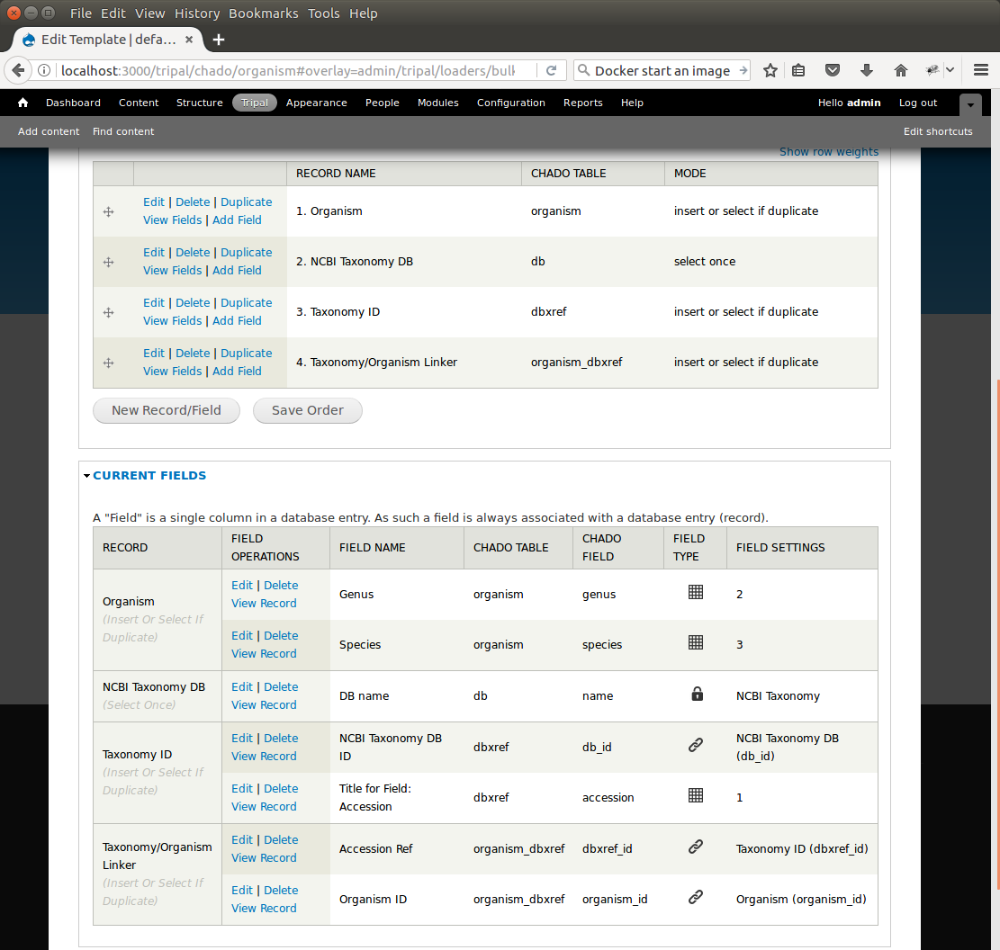

To save the template, click the **Save Template** link at the bottom of the page.

Creating a Bulk Loader Job (importing a file)
---------------------------------------------

Now that we have created a bulk loader template we can use it to import a file. We will import the **Fragaria**.txt file downloaded previously. To import a file using a bulk loader template, click the **Add Content** link in the administrative menu and click the **Bulk Loading Job**. A bulk loading job is required each time we want to load a file. Below is a screen shot of the page used for creating a bulk loading job.

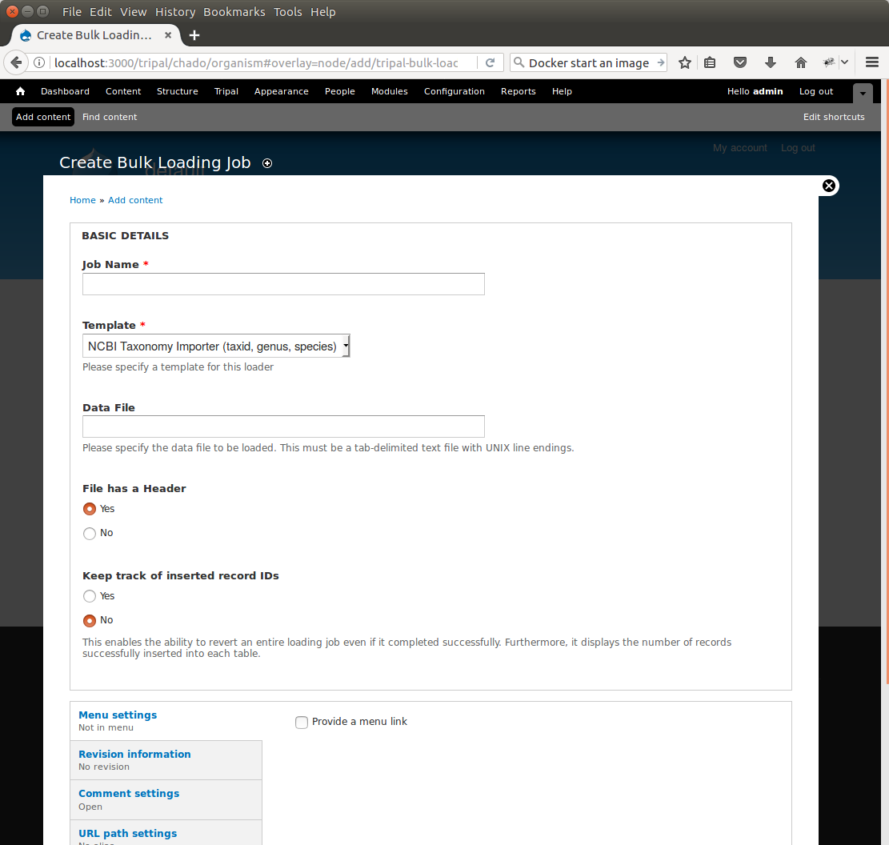

Provide the following values:

* Job Name: Import of Fragaria species
* Template: NCBI Taxonomy Importer (taxid, genus species).
* Data File: [DRUPAL_HOME]/sites/default/files/Fragaria_0.txt
* Keep track of inserted IDs: No
* File has a header: No

.. note::

  Be sure to change the [DRUPAL_HOME] token to where Drupal is installed.

Click **Save**. The page then appears as follows:

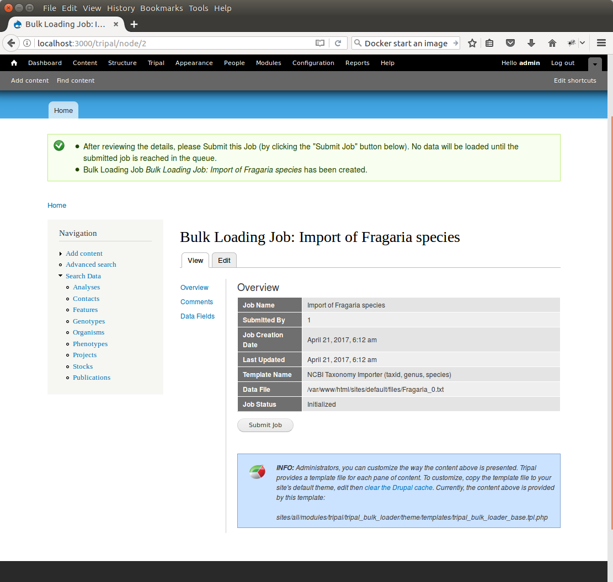

You can see details about constants that are used by the template and the where the fields from the input file will be stored by clicking the **Data Fields** tab in the table of contents on the left sidebar.

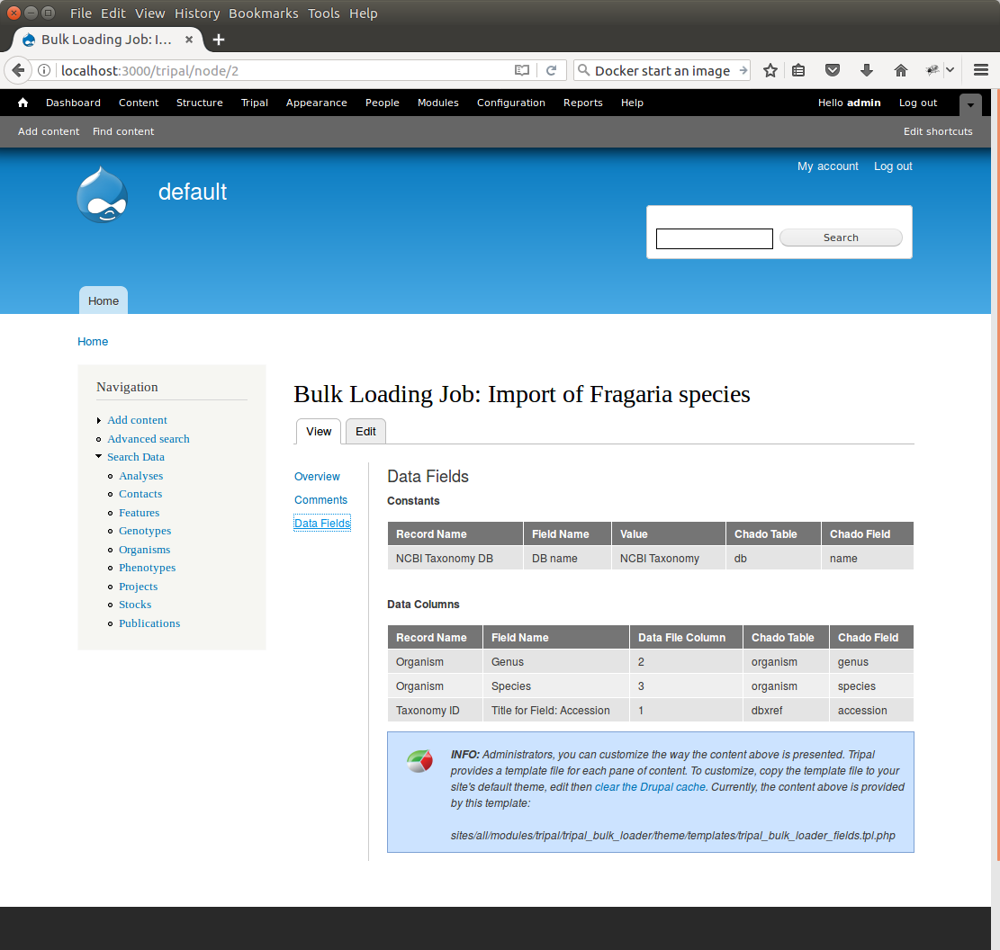

Now that we have created a job, we can submit it for execution by clicking the **Submit Job** button. This adds a job to the Tripal Jobs systems and we can launc the job as we have previously in this tutorial:

.. code-block:: shell

  cd /var/www
  drush trp-run-jobs --username=admin --root=$DRUPAL_HOME

After execution of the job you should see similar output to the terminal window:

.. code-block:: shell

  Tripal Job Launcher
  Running as user 'admin'
  -------------------
  There are 1 jobs queued.
  Calling: tripal_bulk_loader_load_data(2, 7)
  Template: NCBI Taxonomy Importer (taxid, genus, species) (1)
  File: /var/www/html/sites/default/files/Fragaria_0.txt (46 lines)

  Preparing to load...
  Loading...
      Preparing to load the current constant set...
          Open File...
          Start Transaction...
          Defer Constraints...
          Acquiring Table Locks...
              ROW EXCLUSIVE for organism
              ROW EXCLUSIVE for dbxref
              ROW EXCLUSIVE for organism_dbxref
      Loading the current constant set...
  Progress:
  [|||||||||||||||||||||||||||||||||||||||||||||||||||] 100.00%. (46 of 46) Memory: 33962080

Our *Fragaira* species should now be loaded, and we return to the Tripal site to see them. Click on the **Organisms** link in the **Search Data** menu.  In the search form that appears, type "Fragaria" in the **Genus** text box and click the **Filter** button. We should see the list of newly added *Fragaria* species.

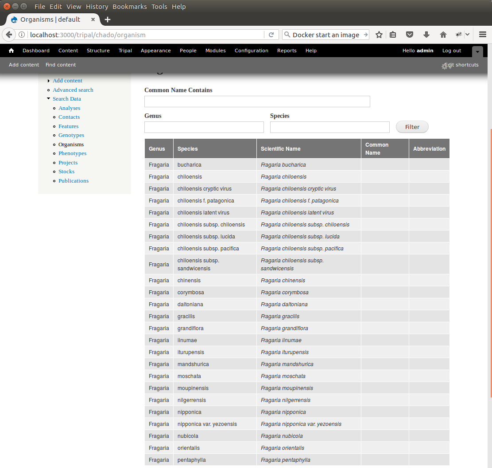

Before the organisms will have Tripal pages, the Chado records need to be **Published**.  You can publish them by navigating to **Tripal Content -> Publish Tripal Content**.  Select the **organism** table from the dropdown and run the job.

.. note::

	In Tripal 2, records were synced by naviating to **Tripal → Chado Modules → Organisms**.

Once complete, return to the search form, find a *Fragaria* species that has been published and view its page. You should see a Cross References link in the left table of contents. If you click that link you should see the NCBI Taxonomy ID with a link to the page:

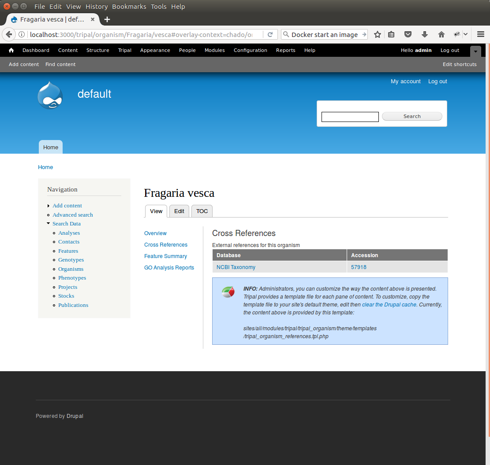

Sharing Your Templates with Others
----------------------------------

Now that our template for loading organisms with NCBI Taxonomy IDs is completed we can share our template loader with anyone else that has a Tripal-based site.  To do this we simply export the template in text format, place it in a text file or directly in an email and send to a collaborator for import into their site.  To do this, navigate to **Tripal → Chado Data Loaders → Buik Loader** and click the **Tempalate** tab at the top.  Here we find a table of all the templates we have created.  We should see our template named **NCBI Taxonomy Importer** (taxid, genus, species).  In the far right colum is a link to export that template.  Licking that link will redirect you to a page where the template is provided in a serialized PHP array.

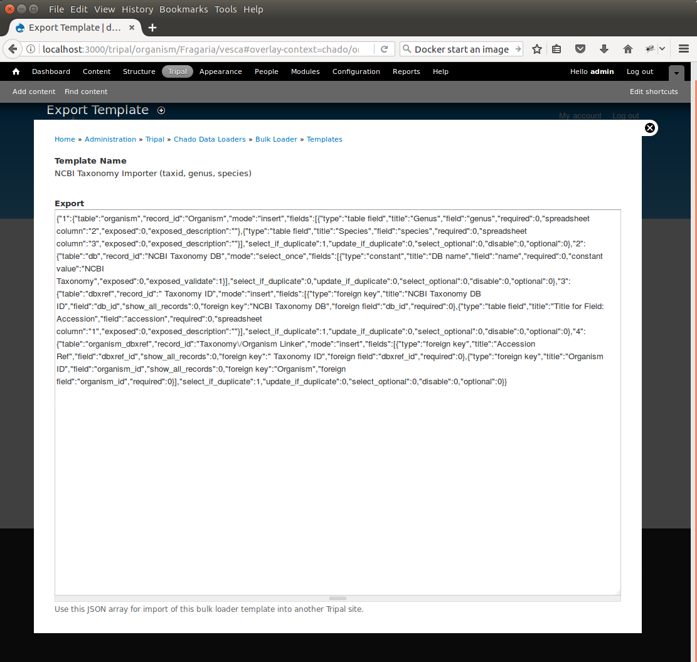

Cut-and-paste all of the text in the **Export** field and send it to a collaborator.

To import a template that may have been created by someone else, navigate to **Tripal → Chado Data Loaders → Buik Loader** and click the **Tempalate** tab. A link titled Import Template appears above the table of existing importers.  The page that appears when that link is clicked will allow you to import any template shared with you.
