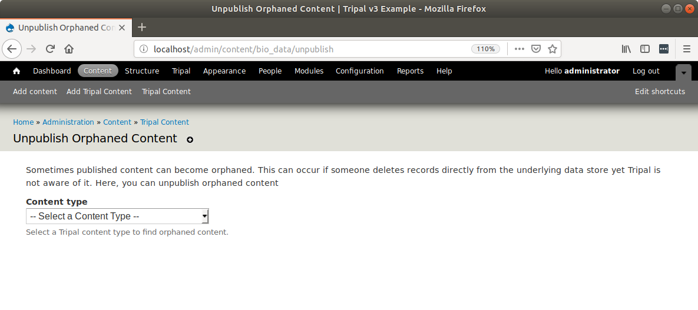
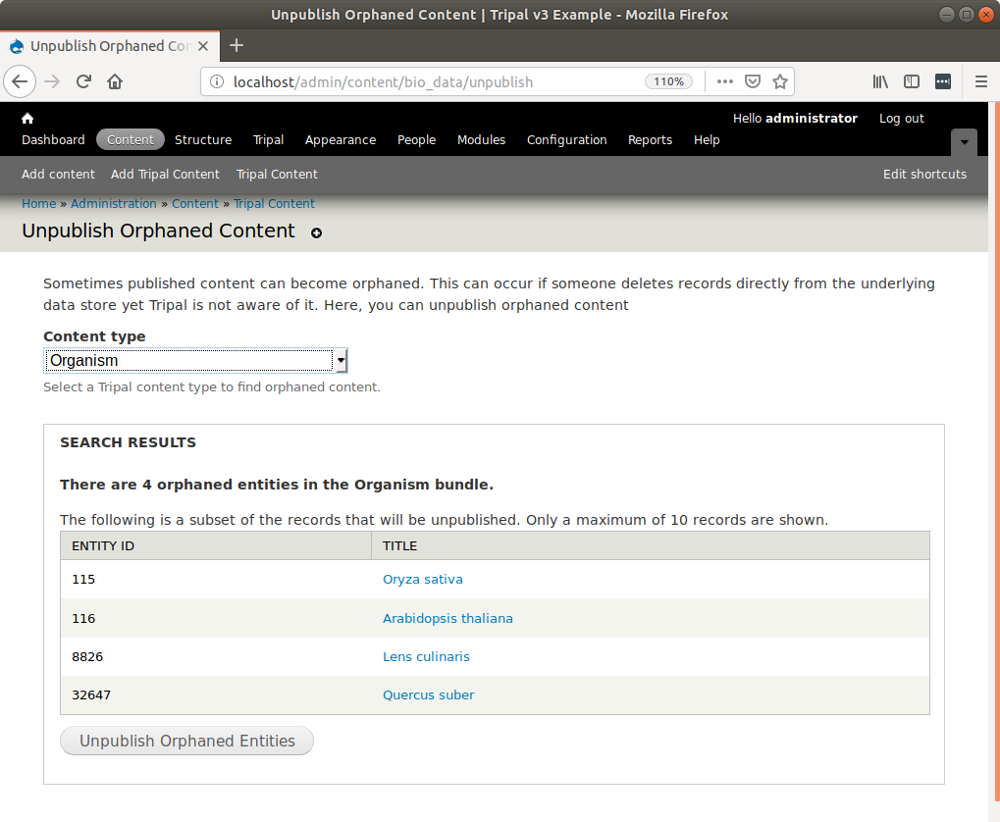
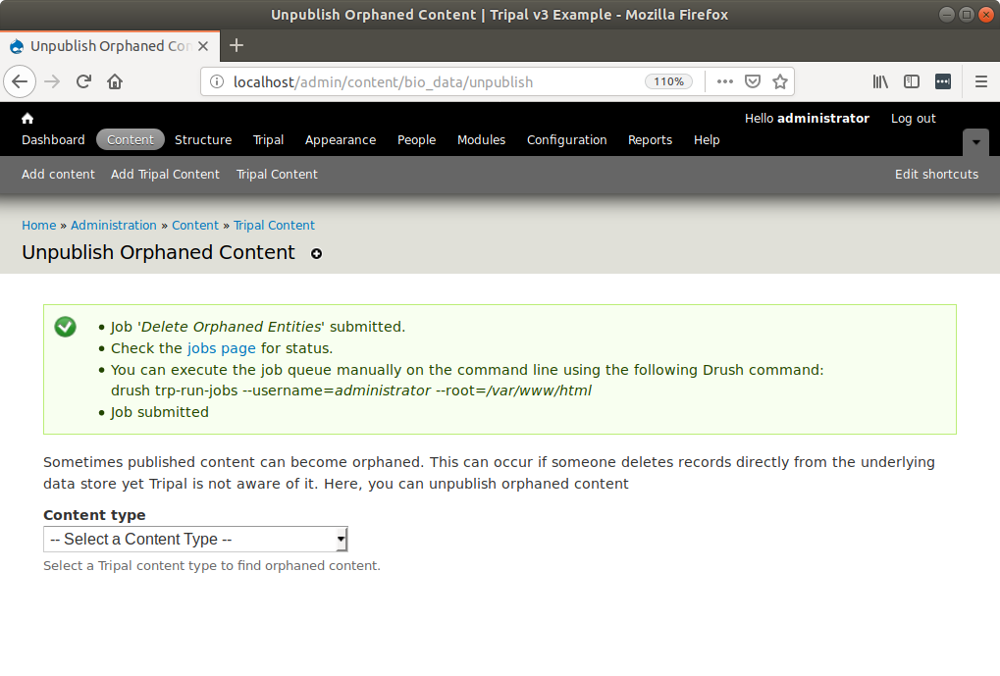

Handling Orphaned Entities
==========================
It is common for site developers to work directly with Chado, especially as they become more familiar with it. And sometimes, they may purposefully or accidentally remove data from Chado that is utilized by published Tripal entities. This results in an entity being "orphaned".  The entity will still have a page on the website but the data about that entity is no longer available.  If this occurs you can easily remove published entities that are "orphaned" by navigating to **Administer > Tripal Content Types** and clicking the **Unpublish Orphaned Content** link.  The following page appears.

Next, select the content type that has missing data in the **Content Type** select box.  For example, suppose an organism was removed:

A list of at most 10 entities that are orphaned are shown. This list is just for convenience and does not show all of the orphaned entities that will be removed. If the content type has no orphaned entities then nothing is shown.  You can submit a job to clean the orphaned entities by clicking the **Unpublish Orphaned Entities** button.  

If you have automatic job execution enabled then the cleanup will occur automatically. Otherwise you should manually execute the job on the command-line using Drush as instructed.
