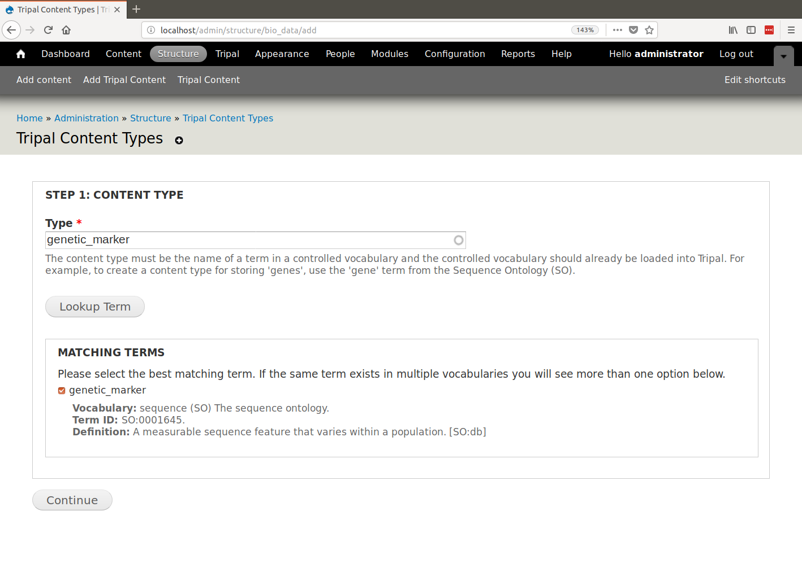
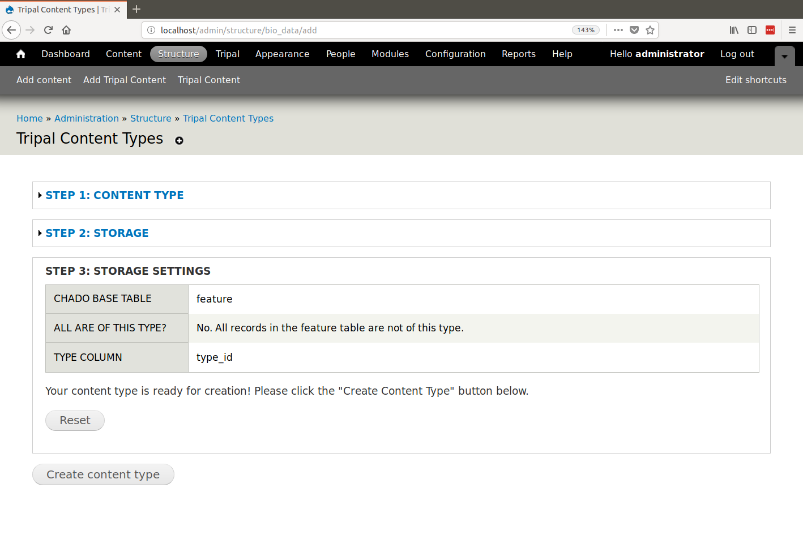
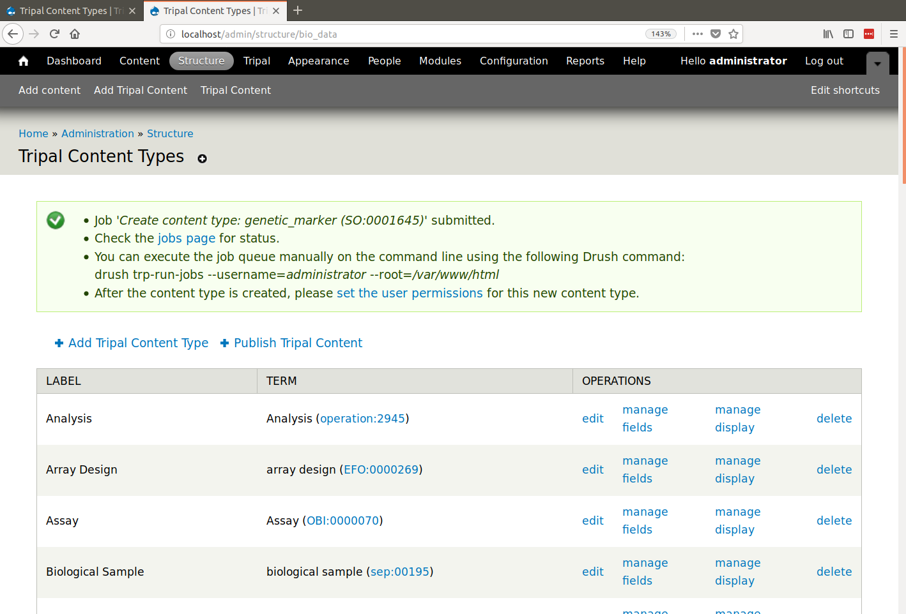

Creating Content Types
======================

.. note::

  Prior to creating a new content type you should understand the structure of Chado and how others use Chado to store similar types of data.

Tripal v3 comes with some pre-defined content types, however you have the ability to create new Content Types through the Administrative user interface! In Tripal v3, all content types are defined by `Controlled Vocabulary (CV) terms <https://en.wikipedia.org/wiki/Controlled_vocabulary>`_. This has a number of advantages:

1. Facilitates sharing between Tripal sites.
2. Provides a clear indication of what content is available on your site.
3. Makes content creation more intuitive from Tripal v2 (add a "Gene" rather then a "feature").
4. Allows complete customization of what data types your site provides.
5. Integrates tightly with web services allowing Tripal to adhere to RDF specifications.

Find a Controlled Vocabulary (CV) Term
---------------------------------------

Before creating a new content type for your site you must identify a CV term that best matches the content type you would like to create.  CVs are plentiful and at times selection of the correct term from the right vocabulary can be challenging. If there is any doubt about what term to use, then it is best practice to reach out to others to confirm your selection. The Tripal User community is a great place to do this by posting a description of your content type and your proposed term on the `Tripal Issue Queue <https://github.com/tripal/tripal/issues>`_.  Confirming your term with others will also encourage re-use across Tripal sites and improve data exchange capabilities.

The `EBI's Ontology Lookup Service <http://www.ebi.ac.uk/ols/index>`_ is a great place to locate terms from public vocabularies. At this site you can search for terms for your content type.  If you can not find an appropriate term in a public vocabulary or via discussion with others then you create a new **local** term within the **local** vocabulary that comes with Tripal.

.. warning::

  Creation of **local** terms is discouraged but sometimes necessary.  When creating local terms, be careful in your description.

How to Add a CV Term
--------------------
Loading From an OBO File
^^^^^^^^^^^^^^^^^^^^^^^^
Once you've chosen a term to describe your content type, you may need to add the term to Tripal if it is not already present.  Many CVs use the `OBO file format <https://owlcollab.github.io/oboformat/doc/GO.format.obo-1_4.html>`_ to define their terms. If the term belongs to a controlled vocabulary with a file in OBO format then you can load all the terms of the vocabulary using Tripal's OBO Loader at **Tripal → Data Loaders → Chado Vocabularies → Chado OBO Loader**.

.. _adding_a_cvterm:

Manually Adding a Term
^^^^^^^^^^^^^^^^^^^^^^
Alternatively, you can add terms one at a time. To add a single term either from an existing vocabulary or a new local term, navigate to **Tripal → Data Loaders → Chado Vocabularies → Manage Chado CVs** and search to see if the vocabulary already exists. If it does you do not need to add the vocabulary.  If it does not exist, click the **Add Vocabulary** link to add the vocabulary for your term. Then navigate to **Tripal → Data Loaders → Chado Vocabularies → Mange Chado CV Terms** then click the **Add Term link** to add the term.

Create a Tripal Content Type
----------------------------

Creation of a new content type requires familiarity with Chado.  This is because data records used by content types must be mapped to actual data and the data lives in Chado.  Tripal's interface for creating content types allows you to provide the CV term for the type and then indicate where in Chado the data is/will be stored.  Chado is a flexible relational database schema.  Thus, it is possible for different sites to store data in different ways.  It is best practice however to follow community standards when storing data.  Therefore, please review the online documentation for Chado. If you are unclear how data for your content type should be stored in Chado please consider emailing the `Chado mailing list <http://gmod.org/wiki/GMOD_Mailing_Lists>`_ or posting an issue on the `Chado GitHub issue queue <https://github.com/GMOD/Chado>`_ to ask for help or add a request for help on the Tripal issue queue.

To add a new content type, start by navigating to **Structure → Tripal Content Types** and  click on the **Add Tripal Content Type** link at the top. This will take you to a web form that leads you through the process of creating a custom Tripal Content Type.

Genetic Marker Example
^^^^^^^^^^^^^^^^^^^^^^
To demonstrate how to create a new content type we will use the example of a genetic marker. First, enter for the name of the term you would like to use to describe your content in the Content Type autocomplete textbox. Then, click **Lookup Term**. This should bring up a list of matching terms from which you can select the specific term you would like to use.  Sometimes the same term exists in multiple vocabularies and you can select the proper one.

During content type creation there is as a section to specify which Chado tables will store your data. Chado is typically structured with primary **base** tables (e.g. organism, feature, stock, project, etc) and a set of linker and property tables that contain ancillary data related to the base records.  Here you must first choose the base table where primary records for your data type are stored.  For our example, because genetic markers are sequence features, they are stored in the Chado **feature** table.

.. image:: creating_content.create2.png

Next, you will be asked if all of the records in the selected table are of the desired content type.  Usually the answer to this is "No", especially if the Chado table has a **type_id** column.  In our case. The **feature** table does have a **type_id** column so we must select "No".

.. image:: creating_content.create3.png

If all of the records in the selected table do not belong to the content type then the form knows enough about each Chado table to offer you appropriate options for how to store data for your content type.  The form knows that the **feature** table has a **type_id** column so it asks if we can differentiate records for our content type using the **type_id** field.  For our example genetic marker we can do so.

.. image:: creating_content.create4.png

Just prior to creating our content type we are provided a summary of our selection to review:

Finally, click the **Create Content Type** to create a custom genetic marker content type.  We are provided with a message indicating that a job has been added for creation of the content type.  Depending how large the Chado database is, creation of a contnet type may take awhile, hence we must run it as a job.

Once the content type is created, you can create pages for site visitors. This will be described later in this User's Guide. In short, you can manually create new records through brand new web forms that are created automatically for your content type, or you can use a data loader to import your data directly to Chado, then **Publish** those records through the Tripal interface.

.. note::

  Each time you create a new content type, you get several new things:

  - A new search tool will be created automatically for the content type.
  - A new set of permissions to help you control access is created.

SNP Example
^^^^^^^^^^^
Perhaps we want to be more specific with our genetic marker pages and create pages for each type of genetic marker (e.g. SNP, RFLP, etc. pages).  Suppose for this example that we continue to store genetic markes in the feature table and use the genetic_marker term in  **type_id** as in the previous example.  To differentiate between different markers, we store a record in the **featureprop** table where the **featureprop.type_id** indicates the that the property provides the marker type and the **featureprop.value** column houses the string for the marker type (e.g. "SNP").  Thus, any genetic marker that has a property with this type of featureprop should form part of our SNP content type.

To accomplish this we can walk through the content type creation form and set the following values:

.. csv-table::
  :header: Field, Value

  "Content Type", "SNP (SO:0000694)"
  "Storage Backend", "Chado"
  "Chado Table", "feature"
  "Are all records in the ``feature`` table of type 'genetic_marker'?", "No"
  "Type column", "--None--"
  "Do you want to use the ``featureprop`` table to distinguish between content types?", "Yes"
  "Base Type", "'genetic_marker' (SO:0001645)"
  "Property Type", "type (rdfs:type)"
  "Property Value", "SNP"

.. image:: creating_content.create7.png

After clicking the **Create content type** button a job will be submitted and we will have a new SNP content type whose data is saved to both the feature and featureprop tables.
