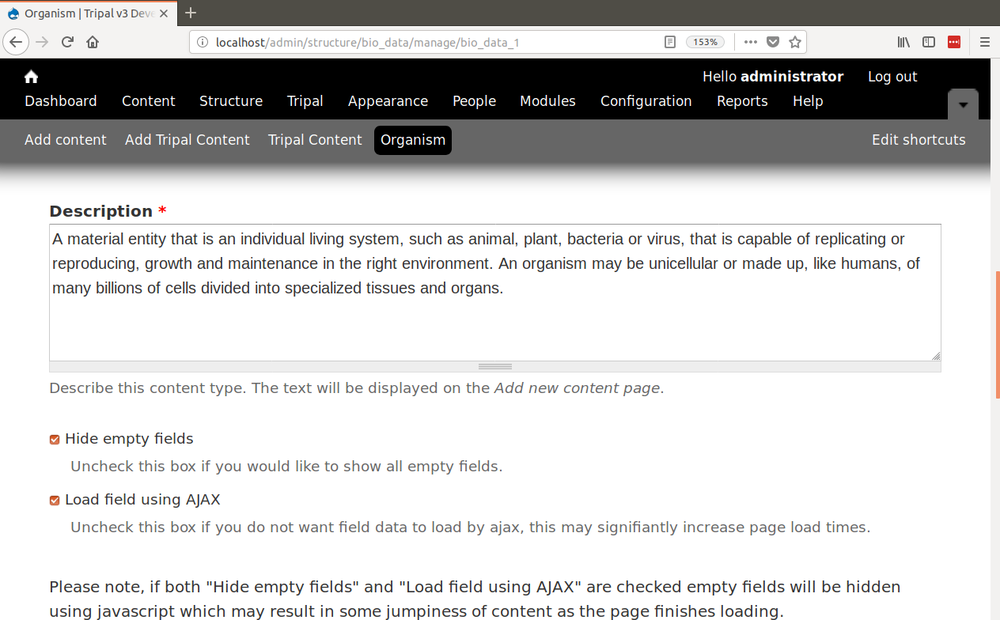

Hide Empty Fields and AJAX loading
==================================

Tripal provides two additional controls for display of fields on a page:

* Hiding fields with no data.
* Loading fields using AJAX.

You will find two check boxes when editing any content page that gives you these controls.  Navigate to ``Structure → Tripal Content Types`` and then click on any Tripal Content Type.  You will see options similar to the following:

Hiding Empty Fields
-------------------
The previous sections of this guide instructed how to rearrange fields on a page, hide their titles, and organize them into panes.  However, while there are many fields many of them may not have any data.  All of these fields are present because the data store (e.g. Chado) has the capacity to house the type of data the fields represent, but if you did not load data appropriate for those fields then they will have no data.  

By default Tripal v3 hides all empty fields from the user. However if you would prefer to show all fields to the user regardless of whether there is content for that particular page edit the content type and click the box labeled `Hide Empty Fields` and click the `Save` button at the bottom.  The next time anyone loads any page for the given content type all fields will be shown regardless if they have data.

Using AJAX to Load Fields
-------------------------
Depending on the number of fields for your content type and the amount of data that those fields contain you may notice that page loads can take a few seconds to load. AJAX is a method to help decrease load times by allowing the page to load quickly with minimal data and allowing fields with larger amounts of data to load after the initial page load.  Tripal has this setting enabled by default. but you can disable this feature.  Similar to the check box for hiding fields, there is a check box on the content type edit page labeled `Load field using AJAX`. Remove the check for box to disable all AJAX loading of fields and save the content type settings.

.. note::
 
  You can control AJAX loading and hiding of empty fields differently for each content type.
