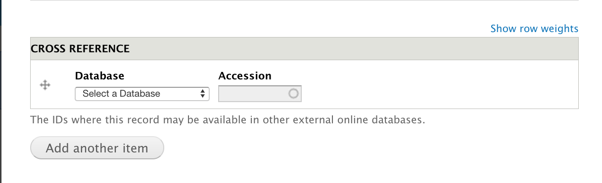
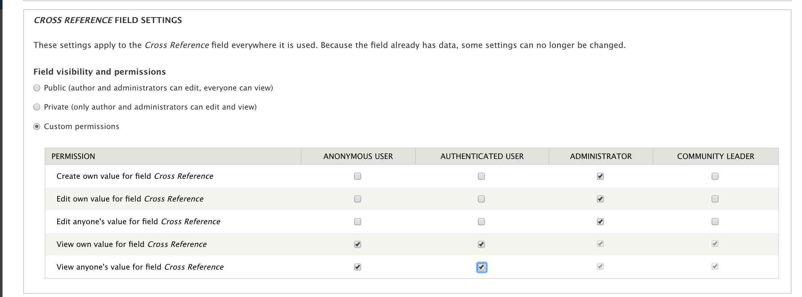

Field Specific Permissions
===========================

.. _why_field_permissions:

Why Field Permissions?
----------------------

Not all Tripal Fields are created equal.  You may have some fields that you don't want all users to be able to view, or even to be able to edit. This might be the case for a variety of reasons.  Some Chado base tables may have **type** fields that you don't utilize: for example, the contact table.  Some of your content types may be configured with a lot of property fields, with only a subset of them being relevant to an end user.  Some fields require prior insertion of data elsewhere: for example, the Cross-Reference field.  Perhaps you have some Chado property fields that are for internal use only.

.. note::

	If you're following this guide because you want users to submit data into Chado, consider using Tripal HeadQuarters (HQ).  Tripal HQ provides a user-contributed content control center and administrative toolbox for your Tripal site. This means that users are able to create whatever Chado content you’d like them, but withhold inserting it into the database until someone has approved it.  Find out more here: https://tripal-hq.readthedocs.io/en/latest/index.html
  

Simply disabling the display of the formatter won't prevent the widget from showing up on the submission page, and besides, you might want site admins to still have access to those fields!  Deleting the field will cause them to re-appear when you press the "Check for New Fields" button!  Field Permissions allows you to configure field-specific permissions so that users contributing content via Chado only see the fields they need to see.

.. warning::

	Because all Tripal Entities are the same base entity type (``TripalEntity``), configuring field permissions on one bundle will configure it for **all** bundles.  This means, for example, hiding a field on Organism will also hide it on Analysis.
   

Installing the Drupal Field Permissions module
-----------------------------------------------

The module can be enabled directly from Drush with the below command.

.. code-block:: bash

  drush pm-enable -y field_permissions

You can find the Field Permission module page here: https://www.drupal.org/project/field_permissions and a more in-depth user guide here: https://www.drupal.org/node/2802067

Setting Field-specific Permissions
--------------------------------------------

Let's assume I want to hide the Cross-Reference field from my users submitting Genome Assembly data, but still want it available for my administrators.

First, navigate to the content type field configuration page via **Admin --> Structure --> Tripal Content --> Genome Assembly**.  For each field we want to hide, we must configure the field instance settings individually.  Click **Edit** for the Cross Reference field, and scroll down to **CROSS REFERENCE FIELD SETTINGS**.
Select **Custom Permissions** and ensure that the user role you set up for submitters can view, but cannot edit, this field.

Once permissions are configured to your liking, click **Save Settings**.

.. warning::

  Some fields are **Required**.  Do not disable required fields that can't be null.  If you do, users won't be able to submit content!

Now, if you submit content as a user with that role, the field will not display on the widgets, but will still appear on normal content.
