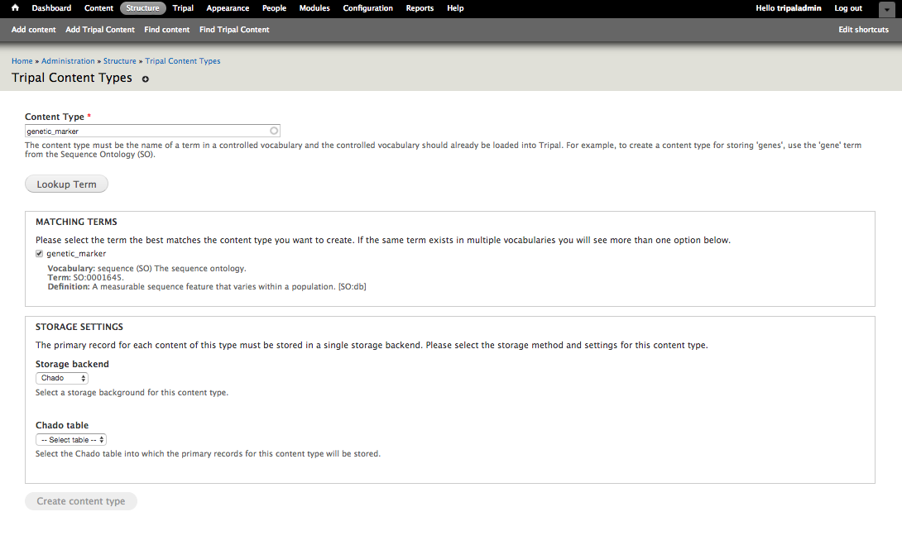
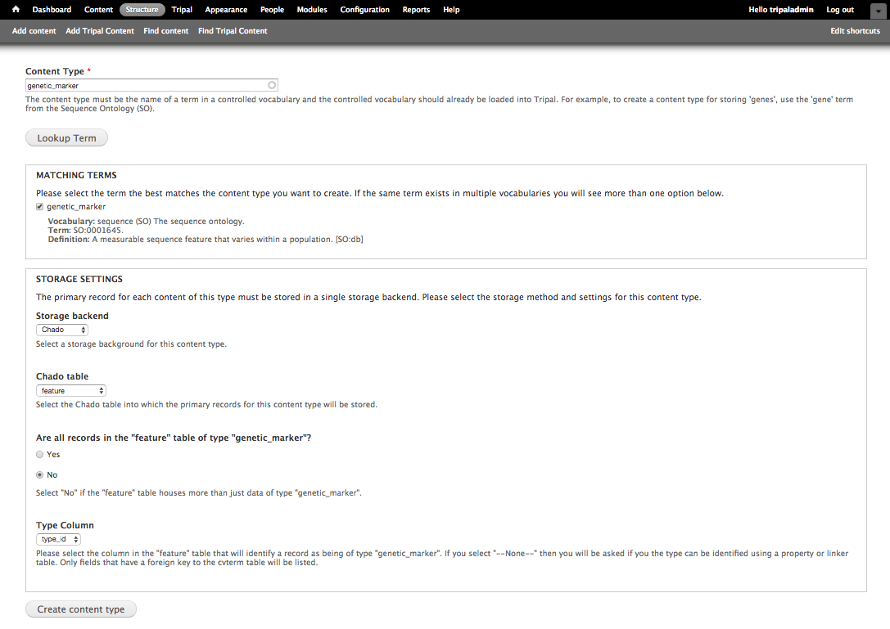

Creating Content Types
======================

Tripal v3 comes with some pre-defined content types, however you have the ability to create new Content Types through the Administrative user interface! In Tripal v3, all content types are defined by `Controlled Vocabulary (CV) terms <https://en.wikipedia.org/wiki/Controlled_vocabulary>`_. This has a number of advantages:

1. Facilitates sharing between Tripal sites.
2. Provides a clear indication of what content is available on your site.
3. Makes content creation more intuitive from Tripal v2 (add a "Gene" rather then a "feature").
4. Allows complete customization of what data types your site provides.
5. Integrates tightly with web services allowing Tripal to adhere to RDF specifications.

Find a Controlled Vocabulary (CV) Term
---------------------------------------

Before creating a new content type for your site you must identify a CV term that best matches the content type you would like to create.  CVs are plentiful and at times selection of the correct term from the right vocabulary can be challenging. If there is any doubt about what term to use, then it is best practice to reach out to others to confirm your selection. The Tripal User community is a great place to do this by posting a description of your content type and your proposed term on the `Tripal Issue Queue <https://github.com/tripal/tripal/issues>`_.  Confirming your term with others will also encourage re-use across Tripal sites and improve data exchagnge capabilities.

The `EBI's Ontology Lookup Service <http://www.ebi.ac.uk/ols/index>`_ is a great place to locate terms from public vocabularies. At this site you can search for terms for your content type.  If you can not find an appropriate term in a public vocabulary or via discussion with others then you create a new **local** term within the **local** vocabulary that comes with Tripal.

.. warning::

  Creation of **local** terms is discouraged but sometimes necessary.  When creating local terms, be careful in your description.

How to Add a CV Term
--------------------
Loading From an OBO File
^^^^^^^^^^^^^^^^^^^^^^^^
Once you've choosen a term to describe your content type, you may need to add the term to Tripal if it is not already present.  Many CVs use the `OBO file format <https://owlcollab.github.io/oboformat/doc/GO.format.obo-1_4.html>`_ to define their terms. If the term belongs to a controlled vocabulary with a file in OBO format then you can load all the terms of the vocabulary using Tripal's OBO Loader at **Tripal → Data Loaders → Chado Vocabularies → Chado OBO Loader**.

Manually Adding a Term
^^^^^^^^^^^^^^^^^^^^^^
Alternatively, you can add terms one at a time. To add a single term either from an existing vocabulary or a new local term, navigate to **Tripal → Data Loaders → Chado Vocabularies → Manage Chado CVs** and search to see if the vocabulary already exists. If it does you do not need to add the vocabulary.  If it does not exist, click the **Add Vocabulary** link to add the vocabulary for your term. Then navigate to **Tripal → Data Loaders → Chado Vocabularies → Mange Chado CV Terms** then click the **Add Term link** to add the term.

Create a Tripal Content Type
----------------------------

.. note::

  Prior to creating a new content type you should understand the structure of Chado and how others store similar types of data.

Creation of a new content type requires familiarity with Chado.  This is because data records used by content types must be mapped to actual data and the data lives in Chado.  Tripal's interface for creating content types allows you to provide the CV term for the type and then indicate where in Chado the data is/will be stored.  Chado is a flexible relational database schema.  Thus, it is possible for different sites to store data in different ways.  It is best practice however to follow community standards when storing data.  Therefore, please review the online documentation for Chado. If you are unclear how data for your content type should be stored in Chado please consider emailing the `Chado mailing list <http://gmod.org/wiki/GMOD_Mailing_Lists>`_ to ask for help or add a request for help on the Tripal issue queue.

To add a new content type, start by navigating to **Structure → Tripal Content Types** and  click on the **Add Tripal Content Type** link at the top. This will take you to a web form that leads you through the process of creating a custom Tripal Content Type. First, enter for the name of the term you would like to use to describe your content in the Content Type autocomplete textbox (e.g. genetic_marker). Then, click **Lookup Term**. This should bring up a list of matching terms from which you can select the specific term you would like to use.  Sometimes the same term exists in multiple vocabularies and you can select the proper one.

During content type creation there is as a section to specify which Chado tables will store your data. Chado is typically structured with primary **base** tables (e.g. organism, feature, stock, project, etc) and a set of linker and property tables that contain ancillary data related to the base records.  Here you must first choose the base table where primary records for your data type are stored.  For our example, because genetic markers are sequence features, they are stored in the Chado feature table. Once you select the Chado table, the form will ask additional questions to determine exactly how records of the content type can be found. Specifically, the following options are supported if the appropriate fields/tables are available:

1. All records in the **base** table belong to the content type (e.g. tables: organism, analysis, etc.)
2. The **base** table has a **type_id** that stores the CV term and this differentiates the records. (e.g. tables: feature, stock, library, etc.).
3. The records can be differentiated by way of a property table which contains a **type_id** column for the CV term. (e.g. tables: featureprop, stockprop, libraryprop, etc.)
4. The records can be differentiated by way of a linking table that associates records in the **base** table with the CV term (e.g. tables: feature_cvterm, stock_cvterm, etc.)

For our genetic marker example, we can use the Chado **feature** table and **type_id** column to differentiate which records in the feature table are genetic markers. Thus we

- Select "No" not all records in the feature table are genetic markers
- Type Column: type_id

Then click Create Content Type to create a custom genetic marker content type.

Once the content type is created, you can create pages for site visitors. This will be described later in this User's Guide. In short, you can manually create new records through brand new web forms that are created automatically for your content type, or you can use a data loader to import your data directly to Chado, then **Publish** those records through the Tripal interface.
