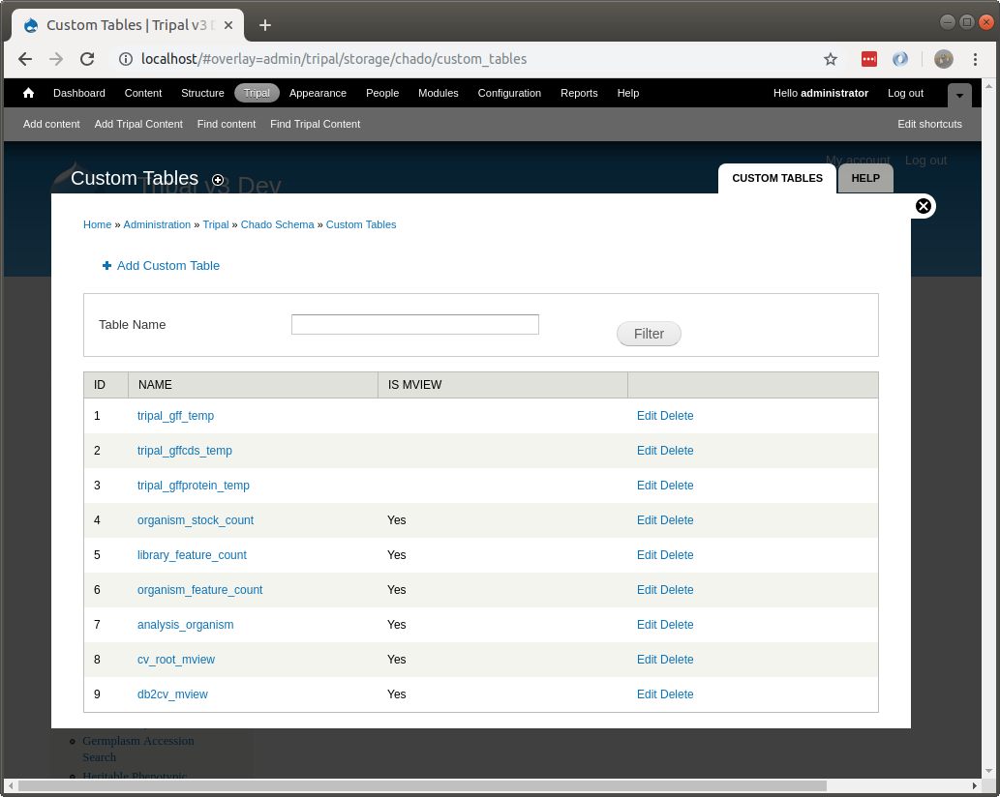
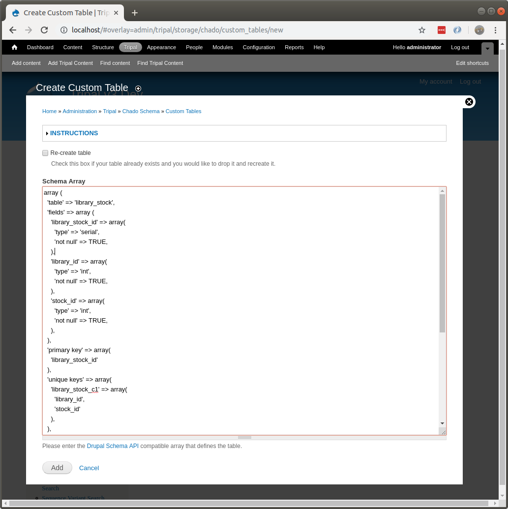

Custom Tables
=============

Chado has a large number of tables that can be used for storing a variety of biological and ancillary data.  All effort should be made to use the existing tables for storing data. However, there are times when the current set of tables is not adequate for storing some data. Tripal allows you to create custom tables in Chado using the Tripal web interface.  The interface for managing custom tables can be found on the **Tripal → Data Storage → Chado -> Custom Tables** page.

This page contains a link to add a new custom table (at the top), a search interface to find tables by name, and a listing of existing tables.  You can use this interface to add, edit and remove custom tables.  By default, several custom tables have been created automatically by Tripal modules.  These tables hold data managed by the modules.  Also, tables used as materialized views appear in this list as well. They are identified with the `Is Mview` column.

.. warning::

  You should not remove or edit custom tables that were created programmatically by tripal modules as it may cause problems with the proper function of the modules that created them.

If you need to create a new table you should follow the following procedure.

1.  Plan and design your table. It is best if you follow Chado design style so that your table would easily fit into Chado.
2.  Reach out to the Chado community on the `Chado mailing list <https://sourceforge.net/projects/gmod/lists/gmod-schema>`_ and ask for advice on your design.
3.  If you think your new table would benefit others, consider requesting it be added to a future version of Chado by adding an issue in the `Chado GitHub issue queue <https://github.com/gmod/chado/issues>`_.
4.  Write your table in the `Drupal Schema API <https://www.drupal.org/docs/7/api/schema-api/introduction-to-schema-api>`_ array format.
5.  Navigate to the  **Tripal → Data Storage → Chado -> Custom Tables** page on your site. Click the `Add Custom Table` link at the top and cut-and-paste the schema array and click the `Add` button.

One your table is created, you will want to add data to it.  You can do so without any programming by using the :doc:`./bulk_loader`.  The bulk loader expects that your data is housed in a tab-delimited text file and allows you to map columns from your file to columns in your new custom table. Each row of your file becomes a new record in your table.  

Alternatively, if you can write custom loaders using the Tripal API as described in the 
:doc:`../dev_guide`
