Brief Drupal Overview
=====================

.. note::

  Some of the images used on this page refer to Tripal v2.  However, this Drupal overview applies equally well to both versions.

User Account Page
-----------------

All users have an account page. When you first install Drupal, you are logged in as the administrator. The account page is simple for now. Click the **My account** link on the left sidebar. You'll see a brief history for the user and an **Edit** tab. Users can edit their own information using the edit interface:

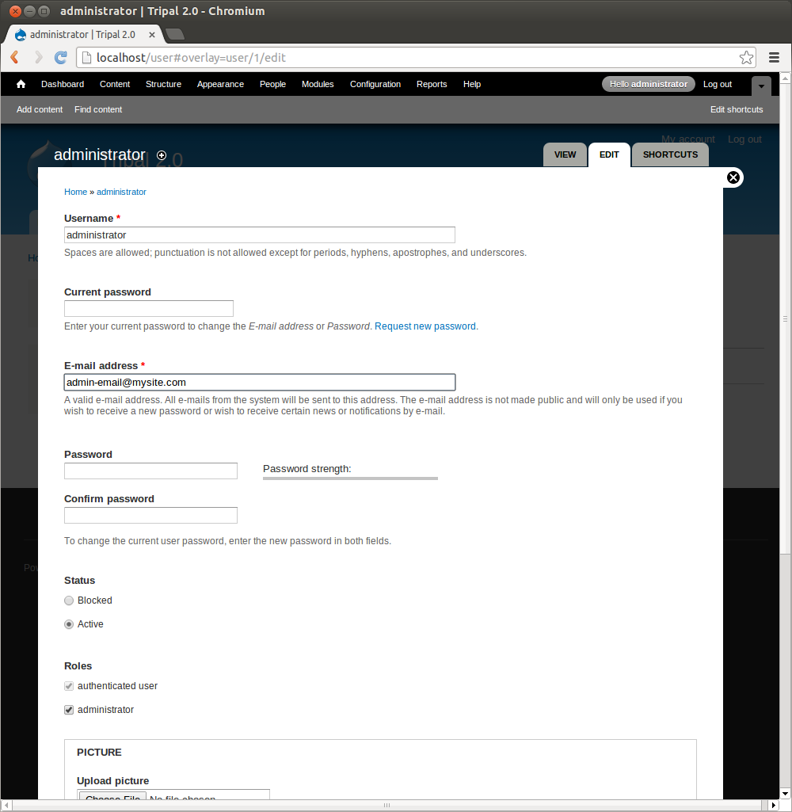

Creating Content
----------------

Creation of content in Drupal is very easy. Click the **Add content** link on the top administrative menu.

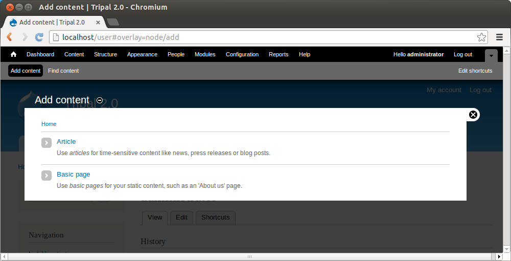

You'll see two content types that come default with Drupal: Article and Basic Page. Here is where a user can add simple new pages to the website without knowledge of HTML or CSS. Click the **Basic Page** content type to see the interface for creating a new page:

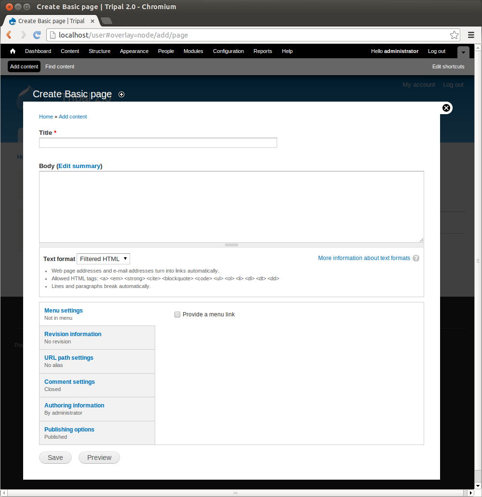

You'll notice at the top a **Title** field and a **Body** text box. All pages require a title and typically have some sort of content entered in the body. Additionally, there are other options that allow someone to enter HTML if they would like, save revisions of a page to preserve a history and to set authoring and publishing information.

For practice, try to create two new pages. A **Home** page and an **About** page for our site. First, create the home page and second create the about page. Add whatever text you like for the body.

In the screenshots above, you may have noticed the link **Add Tripal Content**.  Tripal content is different from the typical Drupal content types: **Basic Page** or **Article**.  Instead the content that Tripal provides is the biological and ancillary data that your site will provide to users.  Later this tutorial will describe how to add new biological data.

Finding Content
---------------

To find any content that has been created on the site, click the **Find Content** link on the administrative menu at the top. The page shows all content available on the site. You will see the **About** and **Home** pages you created previously:

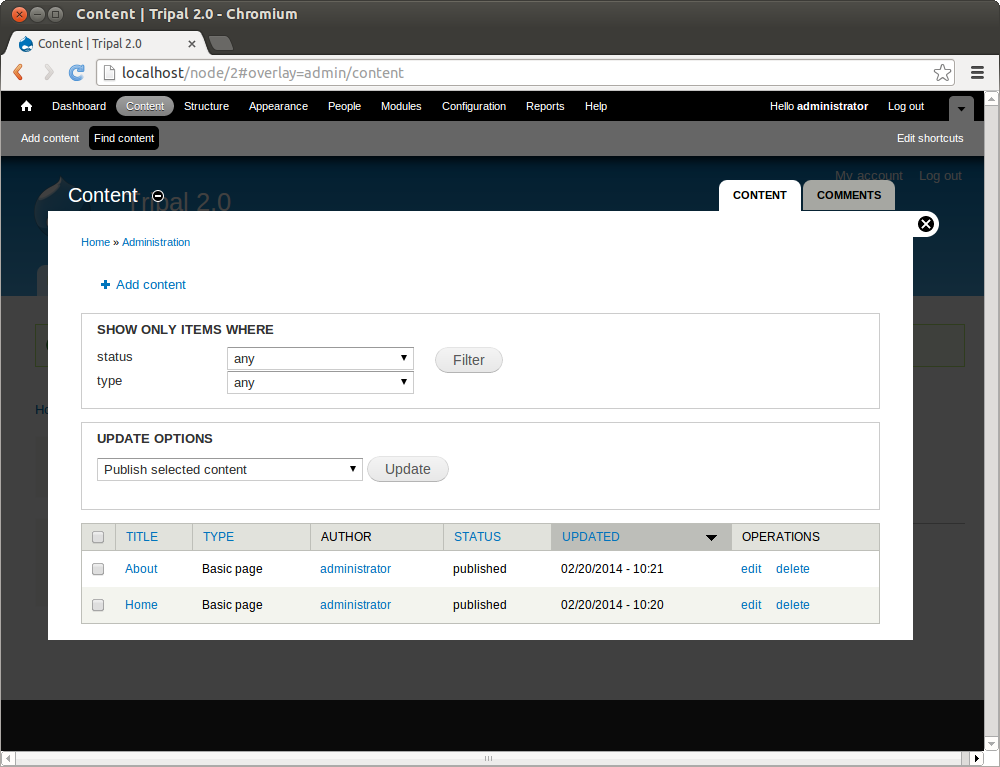

You'll also notice a set of drop down boxes for filtering the content. For sites with many different content types and pages this helps to find content. You can use this list to click to view each page or to edit.

Later in this guide, instructions will be provided for finding Tripal Content. Tripal content is different from the typical Drupal content types: **Basic Page** or **Article**.  Instead the content that Tripal provides is the biological and ancillary data that your site will provide to users.  It is also accessible via a link named **Find Tripal Content** found on the same menu bar as **Find Content**

Site Administration
-------------------

Modules
^^^^^^^
Click the **Modules** link on administrative menu at the top of the page:

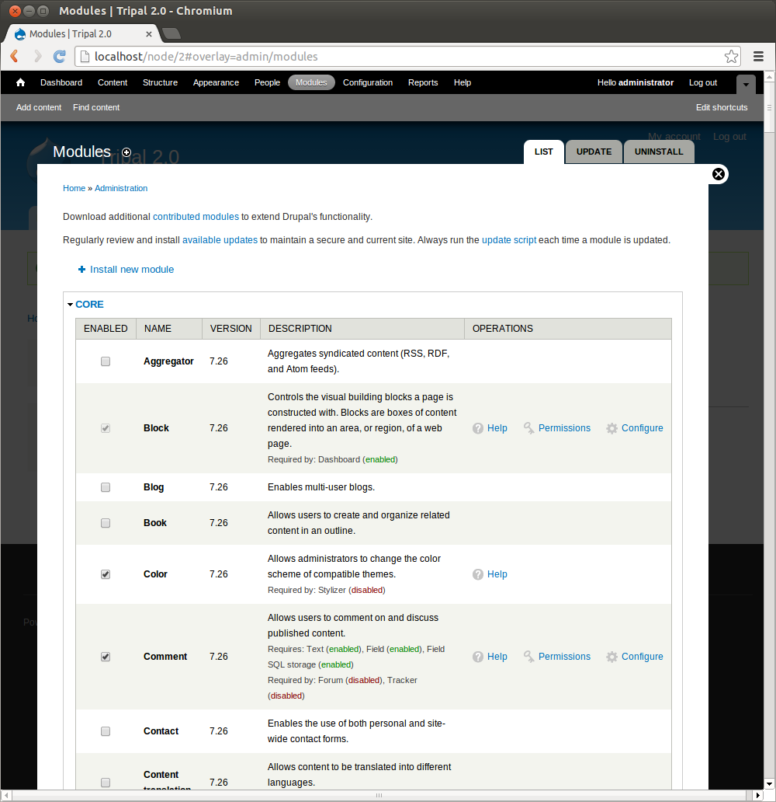

Here is where you see the various modules that make up Drupal. Take a minute to scroll through the list and read some of the descriptions. The modules you see here are core modules that come with Drupal. Those that are checked come pre-enabled. Those that are not checked we will need to install them if we want to use them. To enable or "turn on" a module, check the box next to the desired module, then scroll to the bottom and click 'Save configuration'. Your site will now have the functionality provided by that module. Alternatively, you can search for modules that may be useful to your intended site design at the Drupal module repository, https://drupal.org/project/project_module, and install them by clicking the **Install New Module** link. Finally, a 3rd method to install modules is by use of the drush tool. We will use drush for this tutorial.

Themes
^^^^^^
Next, click the **Appearance** link on the administrative menu at the top of the page:

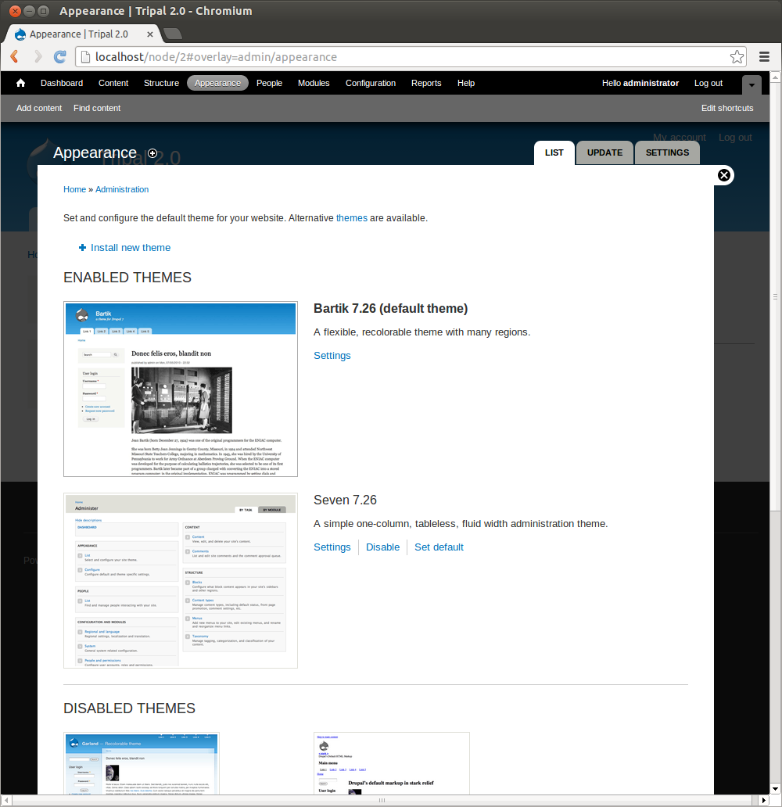

Here, you'll see a list of themes that come with Drupal by default. Here you will see the **default theme** is called **Bartik**. This theme controls the appearance of all content on the site. You can easily change the way the site looks by changing the default theme to another theme. For this tutorial, we would like to use the **Garland** theme. If you scroll down you'll see that one theme named Garland. click the link in the Garland theme section titled **Enable and set default**. The current look of the site is using the Garland theme.

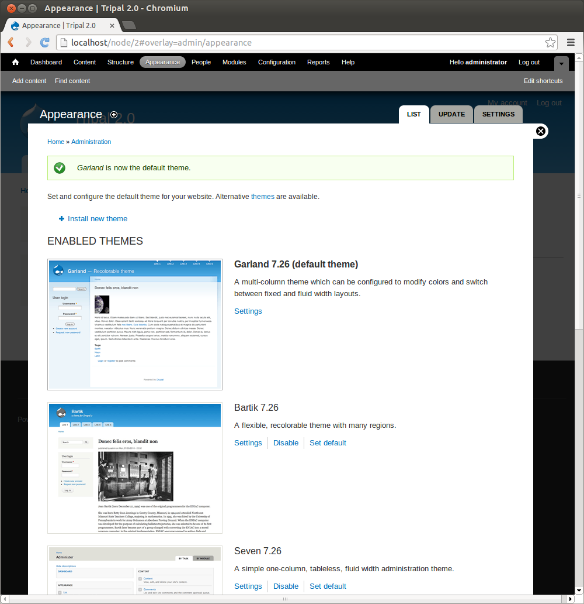

Now, click the house icon in the top left. Our home page now uses the Garland theme:

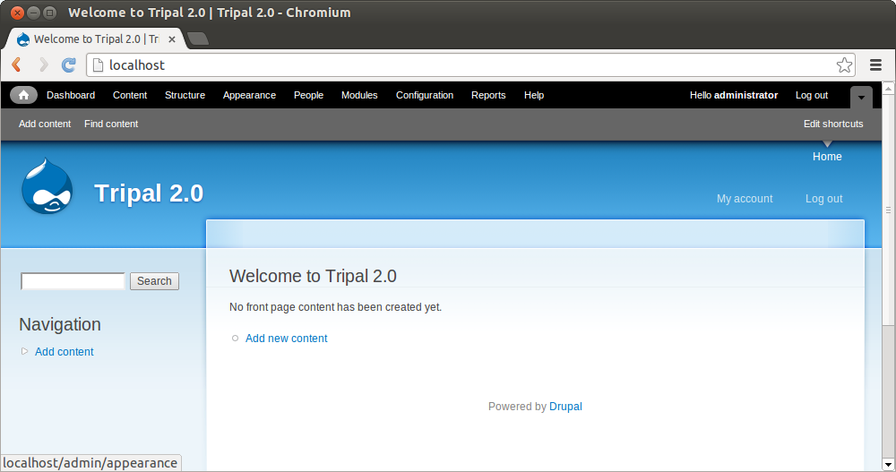

Blocks
^^^^^^
Blocks in Drupal are used to provide additional content to any page that already exists. Examples of blocks might be a short overview of recent news items, Twitter feeds, links, recently added content, etc. The blocks interface can be found by navigating to **Structure → Blocks** using the top administrative menu.

On this page you'll see a list of available blocks and where they are located within the site.

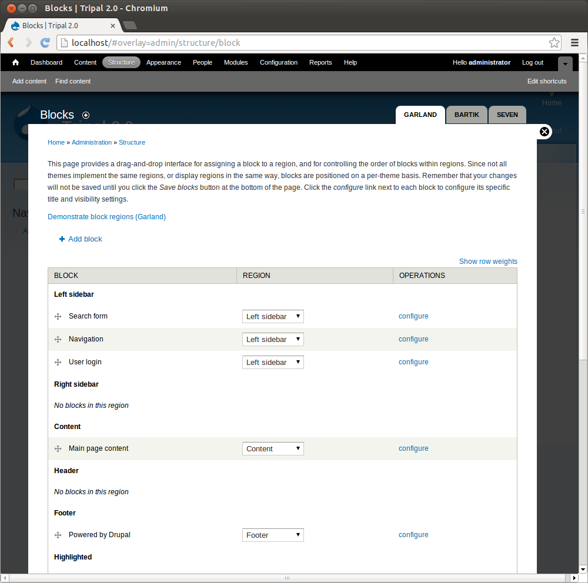

Here you can see that the **Search form**, **Navigation**, and **User Login** blocks are all on the left sidebar of Garland theme. There are also a list of other regions available that do not have any blocks and there are many blocks which are Disabled but could be added to a region on the page. For this tutorial, we would like for blocks to appear on the right sidebar rather than the left sidebar. Therefore, change the **Search form**, **Navigation**, and **User Login** to all use the right sidebar by changing the drop down box next to each one. When done, click the **Save Blocks** button at the bottom. Now when we view our home page the navigation links, search form and user login box (not shown while logged in) all appear on the right side:

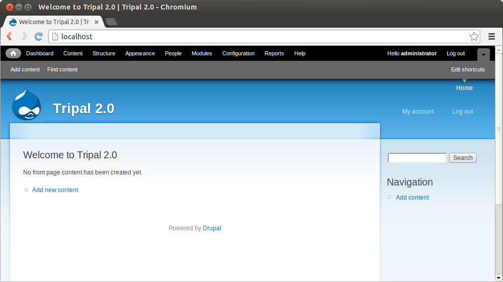

Menus
^^^^^
For this tutorial, we want to add new links in the **Main Menu** to our new Home and About pages we created earlier. In the Garland theme, the main menu appears in the top right corner and currently only has the link 'Home'. We want to change this link to direct to our new home page. But first, we need to find the path for our home page. The path for a page can be found in the address bar for the page. In Drupal pages of content are generally referred to as **nodes**. We can find the new home and about pages using the **Find content** link in the top administrative menu. If we click the link for our home page you'll see the address is http://localhost/node/1. Our about page is http://localhost/node/2 (i.e the first and second pages we created).

Drupal provides an interface for working with menus, including adding new menu items to an existing menu or for creating new menus. You can find the interface for working with menus by navigating to **Structure → Menus** via the administrative top menu:

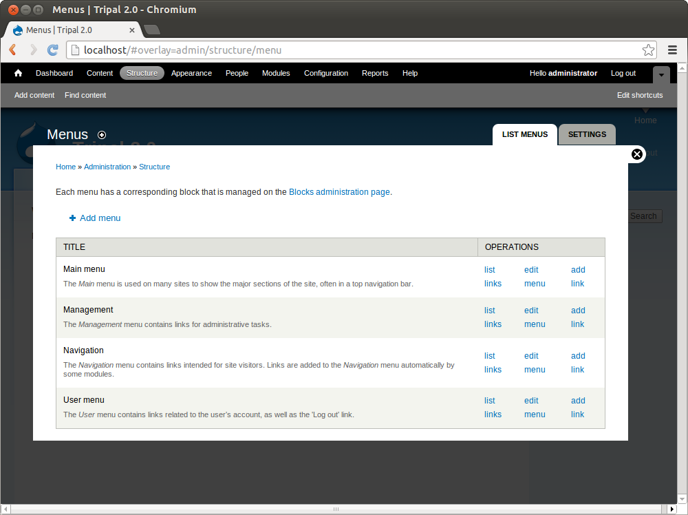

Click the link list links in the operations section for the **Main Menu**. Here we see that the **Home** link already exists:

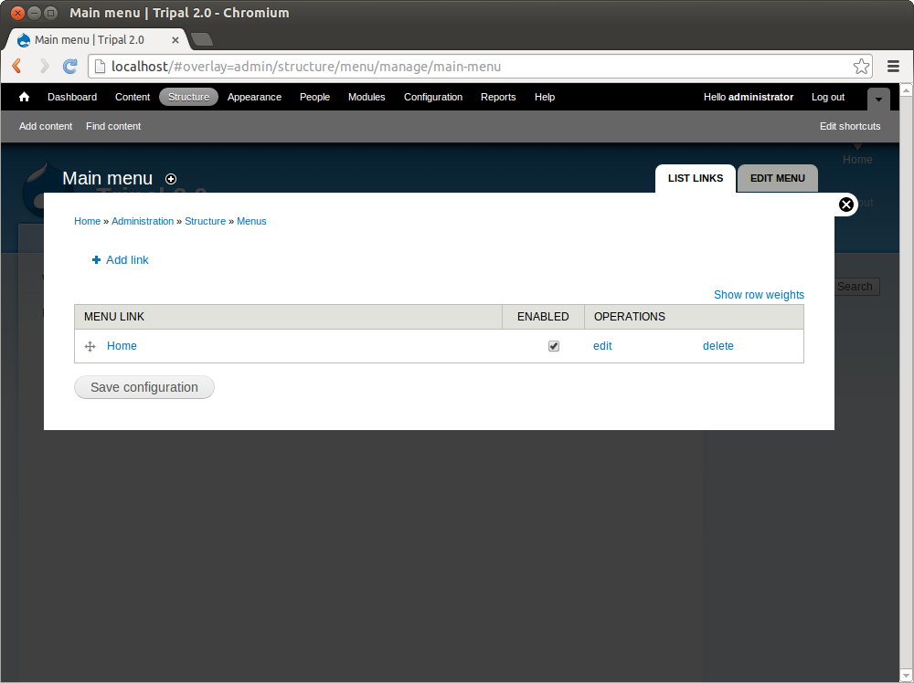

Click edit to change the location of the Home menu item. In the form that appears, we need to set the path for our new home page. The path for each of these nodes is **node/1** and **node/2**. Fill out the form fields with these values

.. csv-table::
  :header: "Form element", "Value"

  "Menu Link Title", "Home"
  "Path", "node/1"
  "Description", "Tripal 2.0 Demo Home Page"
  "Enabled", "checked"
  "Show as Expanded", "no check"
  "Parent item", "<Main menu>"
  "Weight", "0"

The resulting page appears as follows:

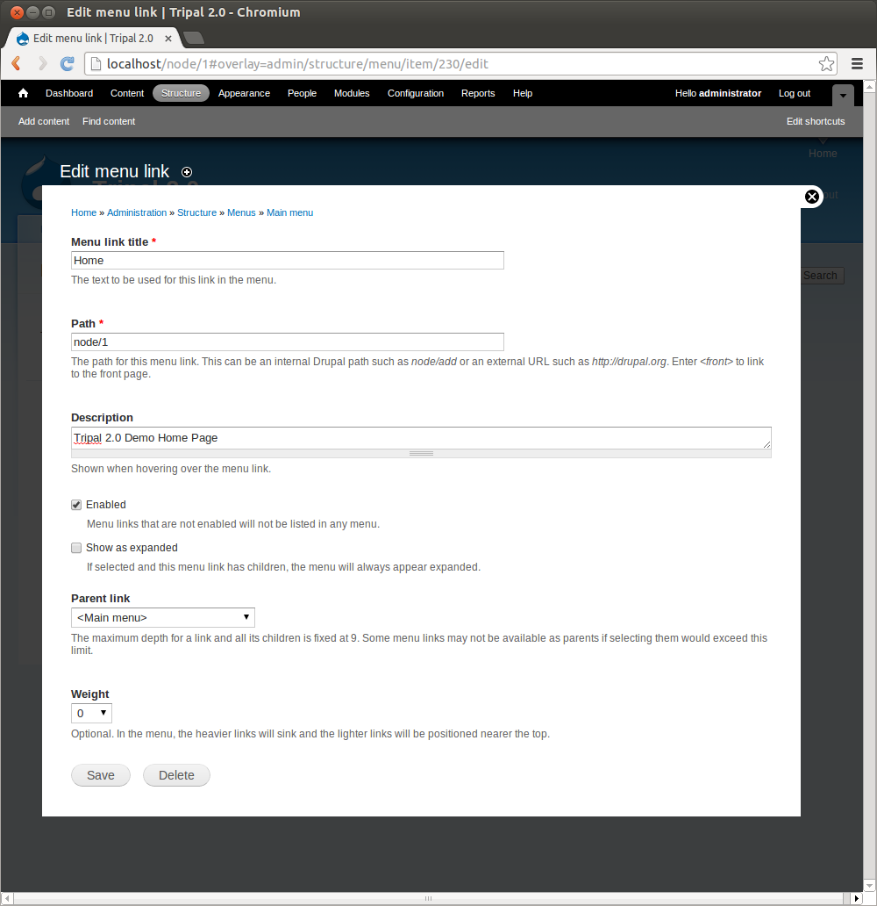

The settings above will give the menu link a title of **Home** and put it on the Main menu menu. If we then click the **Save** button at the bottom our **Home** menu item now redirects us to our new home page. Now, we also want to add a new menu item for the **About** page. Return to the **Main menu** configuration page and add a new link with the following values:

.. csv-table::
  :header: "Form element", "Value"

  "Menu Link Title", "About"
  "Path", "node/2"
  "Description", "About this site"
  "Enabled", "checked"
  "Show as Expanded", "no check"
  "Parent item", "<Main menu>"
  "Weight", "0"

Click **Save** and a new menu item should appear. You can then change the order of the menu items by dragging and dropping the link using the cross-hairs next to each menu item.

URL Path
^^^^^^^^
As mentioned previously, the URL paths for our pages have node/1 and node/2 in the address. This is not very intuitive for site visitors.

To set a path, click on our new **About** page in the new menu link at the top and click the **Edit** tab (you may have to close the overlay to see the menu item). Scroll to the bottom of the edit page and you'll see a section titled **URL path setting**. click to open this section. Since this is our about page, we simply want the URL to be http://localhost/about. To do this, just add the word "about" in the text box and click the **Save** button. You will now notice that the URL for this page is no longer http://localhost/node/2 but now http://localhost/about. Although, both links will still get you to our About page.

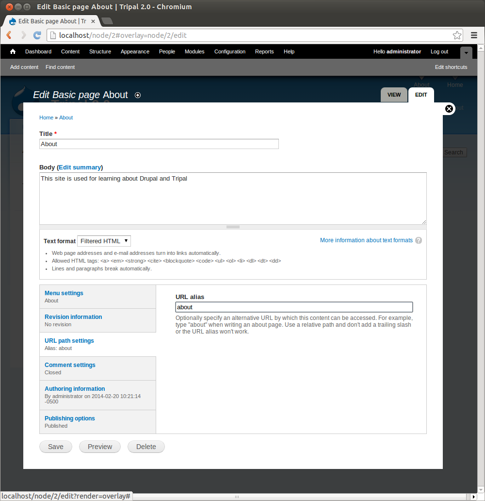

Now, use the instructions described above to set a path of 'home' for our home page.

Site Configuration
^^^^^^^^^^^^^^^^^^
There are many options under the **Configuration** link of the administrative menu at the top. Here we will only look at one of these at the moment--the **Site Information** page. Here you will find the settings we made when installing the site. You can change the site name, add a slogan, mission and footer text to the. The section titled **Front Page** is where we can tell Drupal to use our new **Home** page we created as the first page visitors see when they view the site. We want this to be the same as the home page we created and added a link for in the **Main menu**. In this text box enter the text **node/1**. Notice there is no preceding forward slash. Alternatively we could have used the URL path we added in the previous step. Let's add a slogan: **Resources for Community Genomics**.

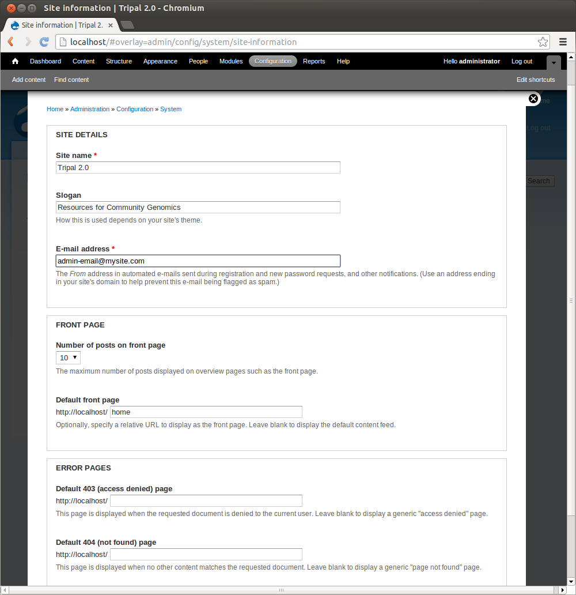

Now, click the **Save configuration** button at the bottom. You'll now see the slogan now at the top of the page. Also, if you click the site name or the home icon at the top left we are now redirected to the new home page.

User Accounts
-------------
For this tutorial, we will not discuss in depth the user management infrastructure except to point out:

- User accounts can be created
- Users are assigned to various roles
- Permissions for those roles can be set to allow groups of users certain administrative rights or access to specific data.

Explore the Drupal **User Management** menu to see how users can be created, added to roles with specific permissions.
