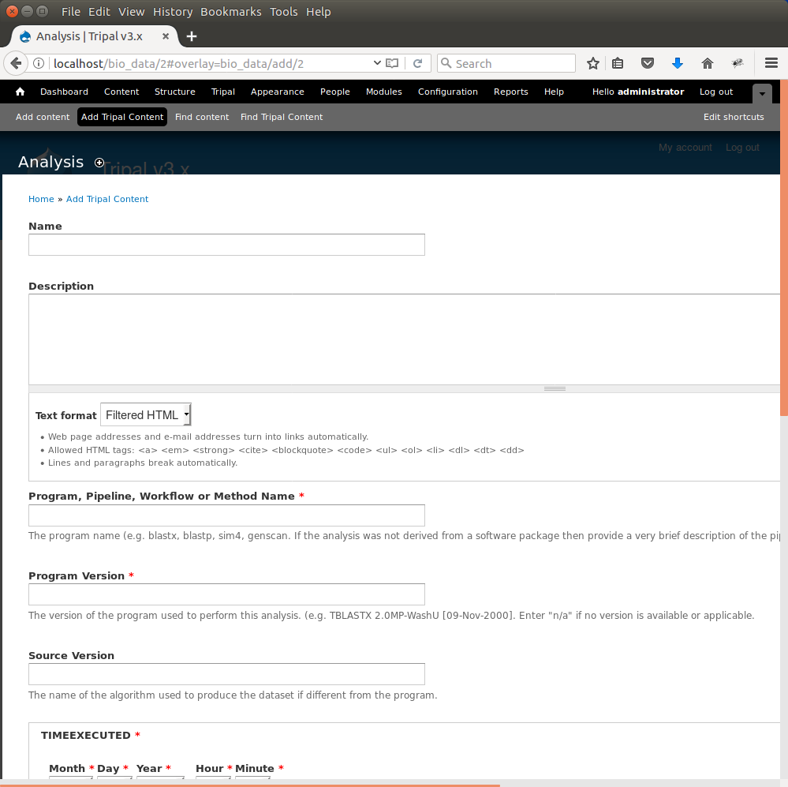
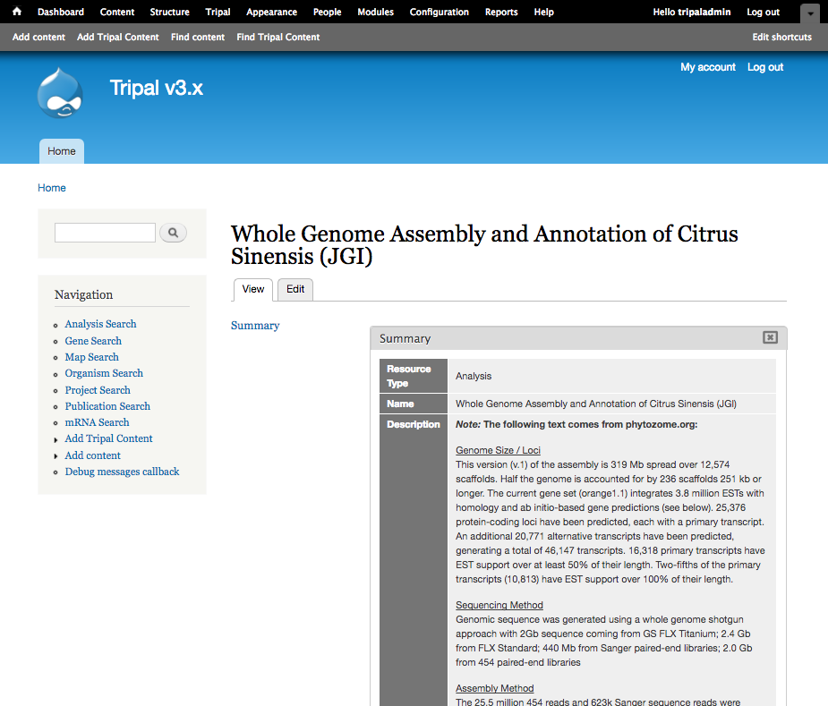

Analyses
========

For this tutorial we will later import a set of genes, and their associated mRNA, CDS, UTRs, etc. Tripal's Chado loader for importing genomic data requires that an analysis be associated with all imported features. This has several advantages, including:

- The source of features (sequences) can be traced. Even for features simply downloaded from a database, someone else can see where the features came from.
- Provenance describing how the features were created can be provided (e.g. whole genome structural and functional annotation description).
- The analysis associates all of the features together.

To create an analysis for loading our genomic data, navigate to the Add Tripal Content and click on the link: **Analysis**

The analysis creation page will appear:

Here you can provide the necessary details to help others understand the source of your data. For this tutorial, enter the following:

.. csv-table::
  :header: "Form Element",	"Value"

  "Name", "Whole Genome Assembly and Annotation of Citrus Sinensis (JGI)"
  "Program, Pipeline Name or Method Name", "Assembly and Annotation Performed by JGI"
  "Program Version", "Phytozome v9"
  "Time Executed", "For this tutorial just select any date."
  "Data Source Name", "JGI Citrus sinensis assembly/annotation v1.0 (154)"
  "Data Source URI", "http://www.phytozome.net/citrus.php"
  "Description (Set to Full HTML):", "
 <strong><em>Note: </em>The following text comes from phytozome.org:</strong>
 
 <u>Genome Size / Loci</u>  This version (v.1) of the assembly is 319 Mb spread over 12,574 scaffolds. Half the genome is accounted for by 236 scaffolds 251 kb or longer. The current gene set (orange1.1) integrates 3.8 million ESTs with homology and ab initio-based gene predictions (see below). 25,376 protein-coding loci have been predicted, each with a primary transcript. An additional 20,771 alternative transcripts have been predicted, generating a total of 46,147 transcripts. 16,318 primary transcripts have EST support over at least 50% of their length. Two-fifths of the primary transcripts (10,813) have EST support over 100% of their length.
 
 <u>Sequencing Method</u>  Genomic sequence was generated using a whole genome shotgun approach with 2Gb sequence coming from GS FLX Titanium; 2.4 Gb from FLX Standard; 440 Mb from Sanger paired-end libraries; 2.0 Gb from 454 paired-end libraries
 
 <u>Assembly Method</u>  The 25.5 million 454 reads and 623k Sanger sequence reads were generated by a collaborative effort by 454 Life Sciences, University of Florida and JGI. The assembly was generated by Brian Desany at 454 Life Sciences using the Newbler assembler.
 
 <u>Identification of Repeats</u>  A de novo repeat library was made by running RepeatModeler (Arian Smit, Robert Hubley) on the genome to produce a library of repeat sequences. Sequences with Pfam domains associated with non-TE functions were removed from the library of repeat sequences and the library was then used to mask 31% of the genome with RepeatMasker.
 
 <u>EST Alignments</u>  We aligned the sweet orange EST sequences using Brian Haas's PASA pipeline which aligns ESTs to the best place in the genome via gmap, then filters hits to ensure proper splice boundaries.
"

.. note::
  Above, the description is provided as HTML code.  However if you enabled the **ckeditor** module (as instructed in the Tripal Prerequisites section), you should click the link **Switch to plain-text editor** found below the Description field before cut-and-pasting the code above.  Normally, you would enter the text free-hand but for this tutorial it is fastest to cut-and-paste the HTML.

After saving, you should have the following analysis page:

