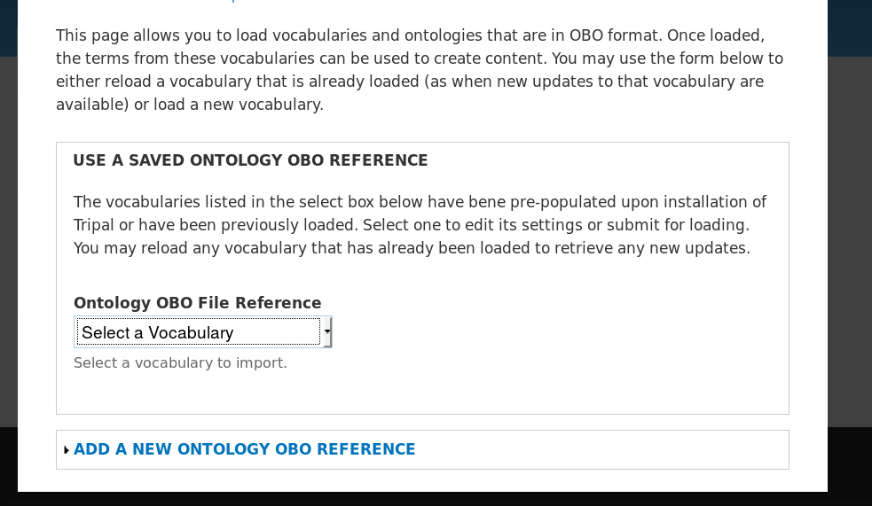

Controlled Vocabularies
=======================

Before we proceed with setup of our example genomics site we will want to load the Gene Ontology.  This is because we will be loading a whole genome, genes and transcripts with annotations.  These annotations include Gene Ontology terms.  To load the Gene Ontolgoy, navigate to **Tripal → Data Loaders → Chado Vocabularies → OBO Vocabulary Loader**. You will see the following page:

The Ontology loader allows you to select a pre-defined vocabulary for loading or allow you to provide your own. If you provide your own, you give the remote URL of the OBO file or provide the full path on the local web server where the OBO file is located. In the case of a remote URL, Tripal first downloads and then parses the OBO file for loading. If you do provide your own OBO file it will appear in the saved drop down list for loading of future updates to the ontology.

During the Tripal installation portion of this tutorial, several vocabularies were pre-installed for you. The Gene Ontology, however, was not. To import the Gene Ontology, select it from the drop-down and click the Import Vocabulary button. You will notice a job is added to the jobs system. Now manually launch the jobs

::

  drush trp-run-jobs --username=administrator --root=/var/www/html

.. note::

  Loading the Gene Ontology will take several hours.
