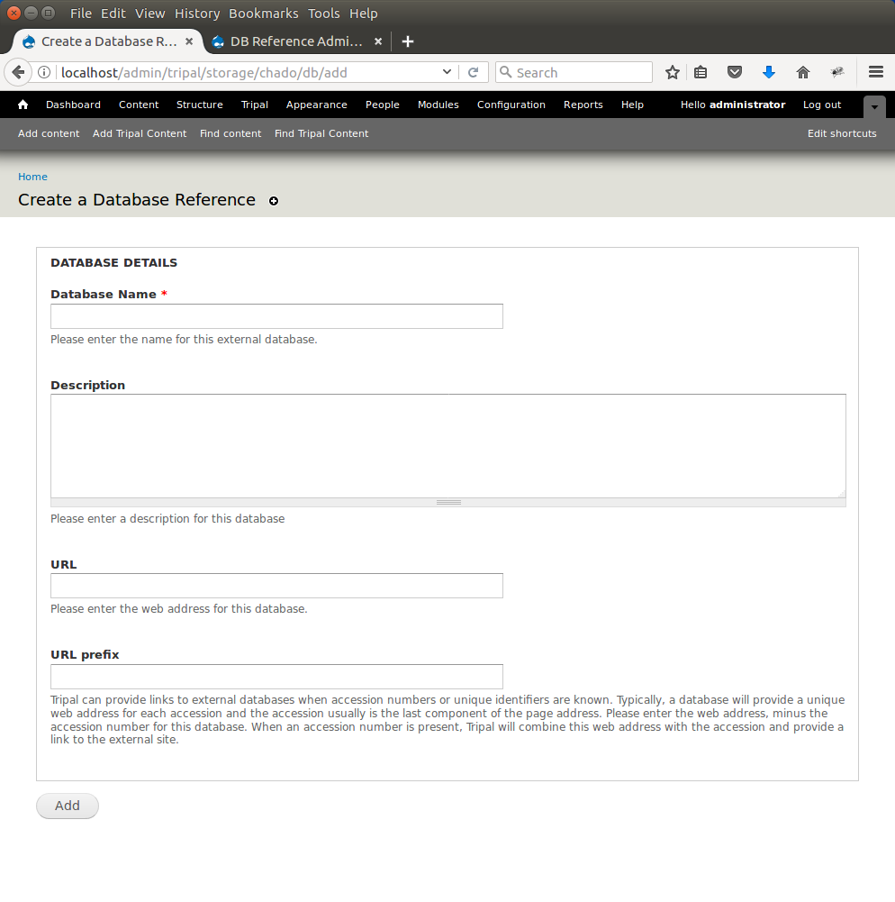

Cross References
================

For our gene pages and mRNA pages we want to link back to JGI where we obtained the genes. Therefore, we want to add a database reference for JGI. To add a new external databases, navigate to **Tripal → Data Loaders →  Chado Databases** and click the link titled **Add a Database**. The resulting page provides fields for adding a new database:

Enter the following values for the fields:

.. csv-table::
  :header: "Field Name", "Value"

  "Database Name", "Phytozome"
  "Description", "Phytozome is a joint project of the Department of Energy's Joint Genome Institute and the Center for Integrative Genomics to facilitate comparative genomic studies amongst green plants"
  "URL", "http://www.phytozome.net/"
  "URL prefix", "https://phytozome.jgi.doe.gov/phytomine/portal.do?externalid=PAC:{accession}"

The URL prefix is important as it will be used to create the links on our gene pages. When an object (e.g. gene) is present in another database, typically those database have a unique identifier (or accession) for the resource.  If we want to link records in our database to records in the remote database we need to provide a URL prefix that Tripal will use to create the URL.   Typically a remote database has a standard URL schema by which someone can specify a unique resource.  Often the resource accession is the last word in the URL to allow others to easily build the URL for any resource.  Tripal can take advantage of these type URL schemas via the URL Prefix field.

The URL prefix should be the URL used to identify a resource.  Two tokens, {db} and {accession}, can be used in place of where the database name and accession might be needed to create the URL. If no {db} or {accession} are provided in the URL prefix then Tripal will append the database name and the accession to the URL prefix to form the final URL.  In this example, the Phytozome URL only requires the accession. The position where that accession will be placed is indicated with the {accession} token.  The {db} token is not needed.

Click **Add**.

We now have added a new database!
