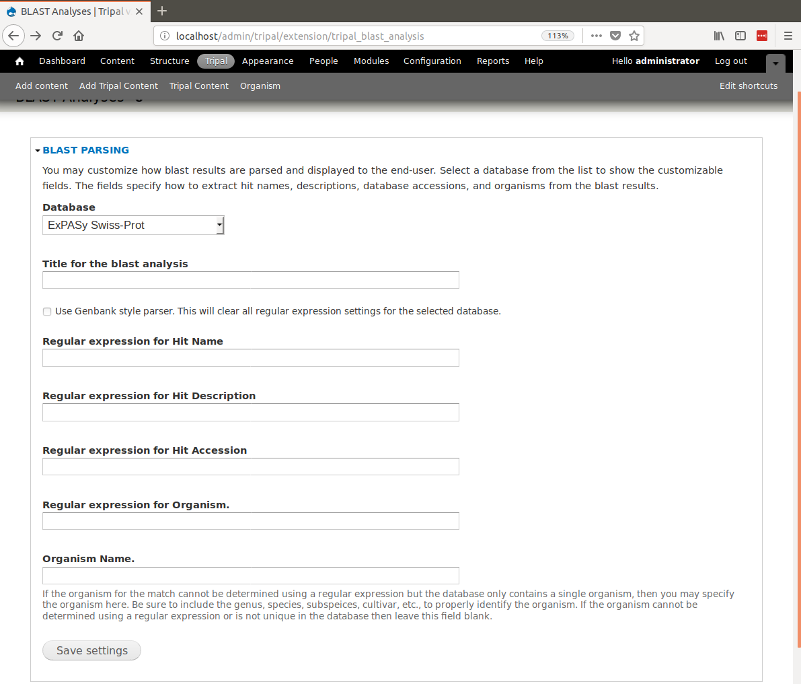
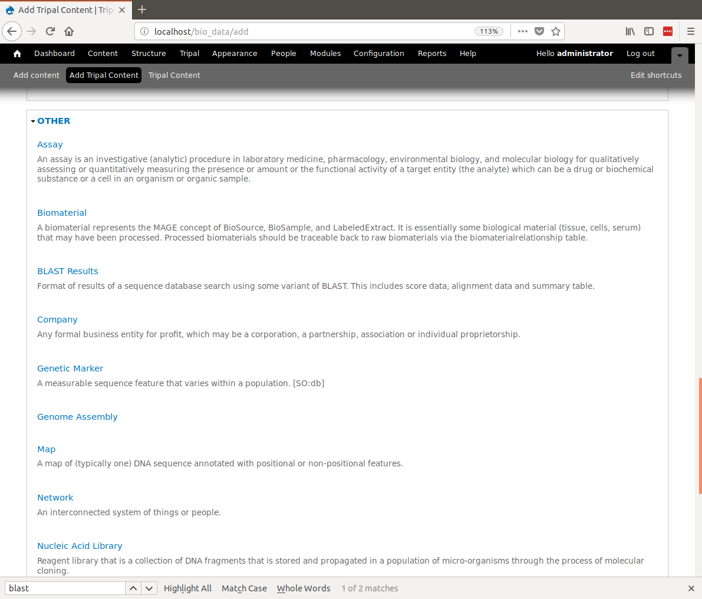
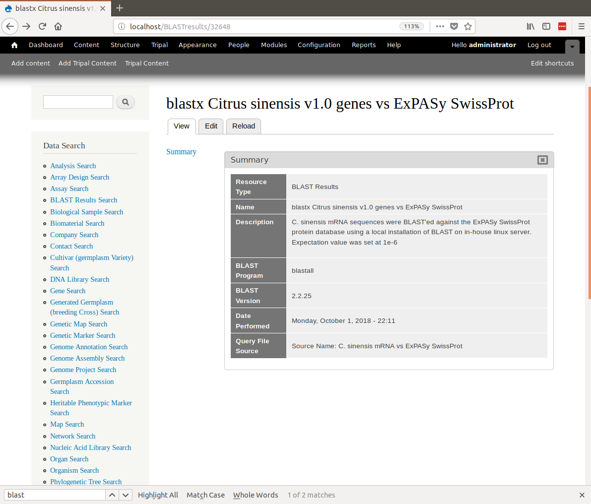
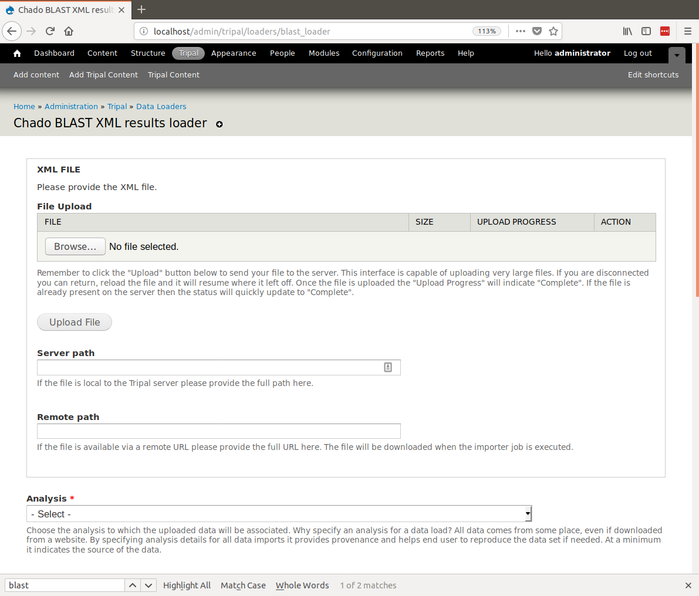
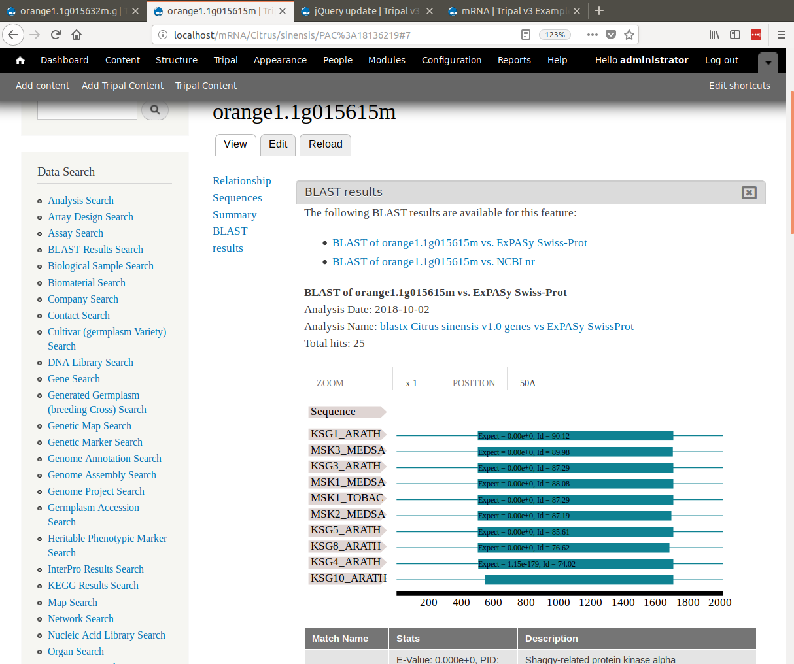
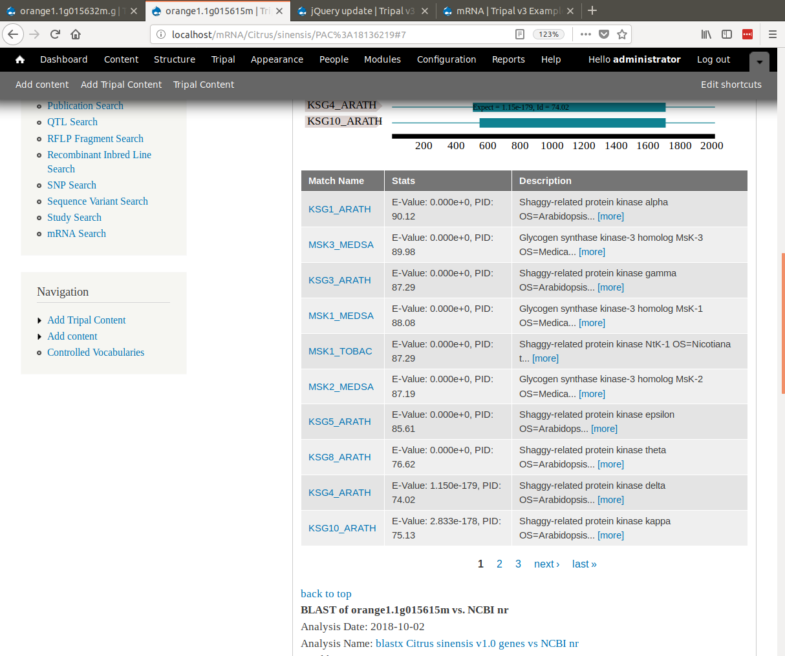

Adding BLAST Results
====================
.. note::

  Remember you must set the ``$DRUPAL_HOME`` environment variable if you want to cut-and-paste the commands below. See :doc:`../../install_tripal/drupal_home`

Adding BLAST Databases
----------------------

Before we load our BLAST results we want to add some external databases.  For this tutorial we have protein BLAST results against NCBI nr and ExPASy SwissProt.  We would like the BLAST hits to be clickable such that they link back to their respective databases. To do this, we must add some additional databases.  Navigate to **Tripal → Data Loaders → Chado Databases** and click the link titled **Add a Database**. The resulting page provides fields for adding a new database.  Add two new databases, one for NCBI nr and the other for ExPASy SwissProt.

Use these values for adding the NCBI nr database:

.. csv-table::
  :header: "Field Name", "Value"

  "Name", "NCBI nr"
  "Description", "NCBI's non-redundant protein database"
  "URL", "http://www.ncbi.nlm.nih.gov/"
  "URL Prefix", "http://www.ncbi.nlm.nih.gov/protein/"

Use these values for adding the SwssProt database:

.. csv-table::
  :header: "Field Name", "Value"

  "Name", "ExPASy Swiss-Prot"
  "Description", "A curated protein sequence database which strives to provide a high level of annotation, a minimal level of redundancy and high level of integration with other databases"
  "URL", "http://expasy.org/sprot/"
  "URL prefix", "http://www.uniprot.org/uniprot/"

Configure Parsing of BLAST Results
----------------------------------
First, we need to ensure that the BLAST module can properly parse the BLAST hits. To do this, navigate to **Tripal → Extensions → Tripal Blast Analyses**. On this page are configuration settings for the Tripal BLAST Analysis extension module.

Within the section titled BLAST Parsing, you can specify a different, more meaningful name for the sequence library file (a.k.a. database) used for BLASTing. This name will be displayed with BLAST results. You can also provide regular expressions for parsing BLAST hits. For example, the following is a line for a match from SwissProt:

  ::

    sp|P43288|KSG1_ARATH Shaggy-related protein kinase alpha OS=Arabidopsis thaliana GN=ASK1 PE=2 SV=3

Here the hit name is ``KSG1_ARATH``, the accession is ``P43288``, the hit description is ``Shaggy-related protein kinase alpha OS=Arabidopsis thaliana`` and the organism is ``Arabidopsis thaliana``. We need regular expressions to tell Tripal how to extract these unique parts from the match text. Because Tripal is a PHP application, the syntax for regular expressions follows the PHP method. Documentation for regular expressions used in PHP can be found here. The following regular expressions can be used to extract the hit name, the accession, hit description and organism for the example SwissProt line above:

.. csv-table::
  :header: "Element", "Regular Expression"

  "Hit Name", ``^sp\|.*?\|(.*?)\s.*?$``
  "Hit Description", ``^sp\|.*?\|.*?\s(.*)$``
  "Hit Accession", ``^sp\|(.*?)\|.*?\s.*?$``
  "Hit Organism", ``^.*?OS=(.*?)\s\w\w=.*$``

In this tutorial, we will be adding BLAST results for the two databases we just created: ExPASy SwissProt and NCBI nr. First, select ExPASy SwissProt from the drop-down menu. A form will appear:

In the form fields, add the following values:

.. csv-table::
  :header: "Field", "Value"

  "Title for the BLAST analysis", "(leave blank)"
  "Regular expression for Hit Name", ``^sp\|.*?\|(.*?)\s.*?$``
  "Regular expression for Hit Description", ``^sp\|.*?\|.*?\s(.*)$``
  "Regular expression for Hit Accession:", ``^sp\|(.*?)\|.*?\s.*?$``
  "Regular expression for Organism", ``^.*?OS=(.*?)\s\w\w=.*$``
  "Organism Name", "(leave blank)"

Click **Save Settings**.

The match accession will be used for building web links to the external database. The accession will be appended to the URL Prefix set earlier when the database record was first created.

Now select the **NCBI nr** database from the drop-down. NCBI databases use a format that is compatible with BLAST. Therefore, the hit name, accession and description are handled differently in the BLAST XML results. To correctly parse results from an NCBI database click the **Use Genbank style parser** checkbox. This should disable all other fields and is all we need for this database.  Clikc the Save Settings button.

Create the Analysis Page
------------------------

.. note::

  It is always recommended to create an analysis page anytime you import data. The purpose of the analysis page is to describe how the data being added was derived or collected.

Now we can create our analysis page. Navigate to **Content → Tripal Content** and click the **Add Tripal Content** link. This page contains a variety of content types that the site supports.  Scroll to the **Other** section and find the content type named **Blast Results**:

Here we can save details about the analysis used to create the BLAST results.  Enter the following in the fields that appear on the page:

.. csv-table::
  :header: "Field", "Value"

    "Name", "blastx Citrus sinensis v1.0 genes vs ExPASy SwissProt"
    "Description", "Citrus sinensis mRNA sequences were BLAST'ed against the ExPASy SwissProt protein database using a local installation of BLAST on in-house linux server. Expectation value was set at 1e-6"
    "BLAST Program", "blastx"
    "BLAST Version", "2.2.25"
    "Data Source Name ", "Citrus sinensis mRNA vs ExPASy SwissProt"
    "Date Performed", "(today's date)"

Click the **Save** button. You can now see our new BLAST analysis page.

Create a second Analysis page for the results of the NCBI nr BLAST analysis. Use the following values:

.. csv-table::
  :header: "Field", "Value"

    "Name", "blastx Citrus sinensis v1.0 genes vs NCBI nr"
    "Description", "Citrus sinensis mRNA sequences were BLAST'ed against the NCBI non-redundant protein database using a local installation of BLAST on in-house linux server. Expectation value was set at 1e-6"
    "BLAST Program", "blastx"
    "BLAST Version", "2.2.25"
    "Data Source Name ", "Citrus sinensis mRNA vs NCBI nr"
    "Date Performed", "(today's date)"

Import the BLAST XML results
----------------------------
First, we will load BLAST results for our citrus gene vs ExPASy SwissProt.  Now that we have our database records setup and configured and we have our analysis record created, we are ready to import the blast results.  To do this, navigate to **Tripal > Data Loaders > Chado BLAST XML results loader**.  The following page will be presented:

The top section of this page provides multiple methods for providing results file: via an upload interface, specifying a remote URL or a file path that is local to the server.  Most likely, you will always upload or provide a remote URL.  However, we download the file earlier, and stored them here: ``$DRUPAL_HOME/sites/default/files``.  So, in this case we can use the path on the local server.  Provide the following value for this form:

.. csv-table::
  :header: "Field", "Value"

  "Server path", "sites/default/files/Blastx_citrus_sinensis-orange1.1g015632m.g.fasta.0_vs_uniprot_sprot.fasta.out"
  "Analysis", "blastx Citrus sinensis v1.0 genes vs ExPASy SwissProt (blastall 2.2.25, Citrus sinensis mRNA vs ExPASy SwissProt)"
  "Database", "ExPASy SwissProt"
  "BLAST XML File Extension", "out"
  "Query Type", "mRNA"

.. note::

  For the **Server path** we need not give the full path.  Because we downloaded the files into the Drupal directory we can leave off any preceding path and Tripal will resolve the path.  Otherwise we could provide the full path.

.. note::

  Specifying **ExPASy SwissProt** as the database will allow the importer to use the database configuration settings we entered earlier.

Clicking the **Import BLAST file** will add a job which we can manually execute with the following command:

::

  drush trp-run-jobs --username=administrator --root=$DRUPAL_HOME

The results should now be loaded. Now we want to add the results for NCBI nr. Repeat the steps above to add a new analysis with the following details:

.. csv-table::
  :header: "Field", "Value"

  "Server path", "sites/default/files/Blastx_citrus_sinensis-orange1.1g015632m.g.fasta.0_vs_nr.out"
  "Analysis", "blastx Citrus sinensis v1.0 genes vs ExPASy SwissProt (blastall 2.2.25, Citrus sinensis mRNA vs NCBI nr)"
  "Database", "ExPASy SwissProt"
  "BLAST XML File Extension", "out"
  "Query Type", "mRNA"

Click the Save button and manually run the job:

::

  drush trp-run-jobs --username=administrator --root=$DRUPAL_HOME

To view results we must find the mRNA that has BLAST hits.  For this example, click on the **mRNA Search** link in the **Data Search** block.  Search for the mRNA named `orange1.1g015615m`.  Viewing the page, we should now see BLAST results by clicking the 'BLAST results' link in the left table of contents.

Notice, that when viewing the results, the SwissProt matches are links.  When clicked they redirect the user to the SwissProt website where users can find more information about that protein.

.. note::

  The match links are able to link out to SwissProt and NCBI because of the initial setup where we added the database settings and we set regular expressions for parsing the match accessions.
