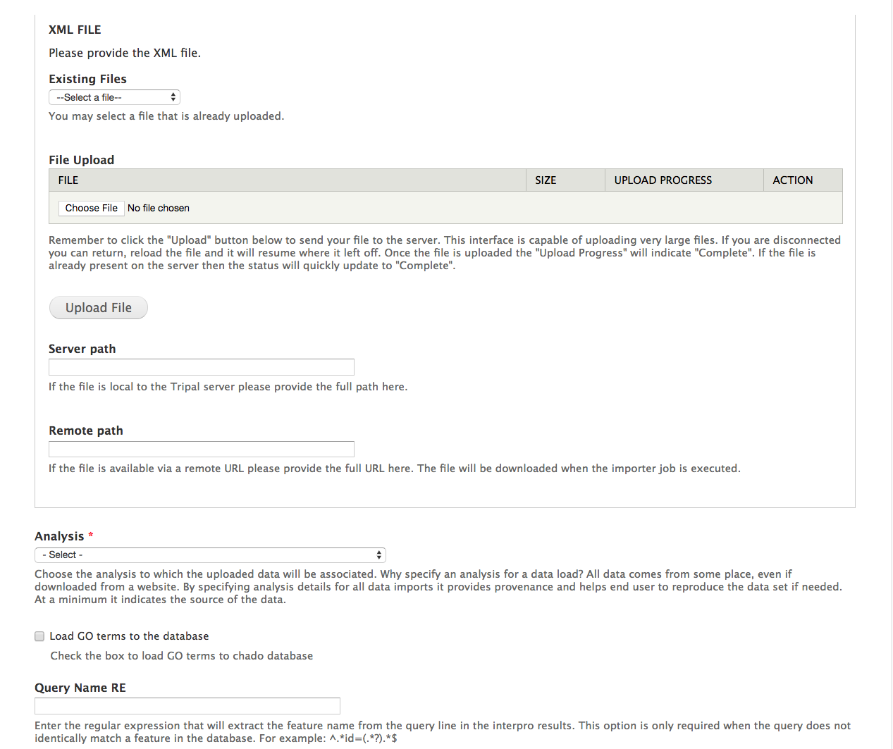
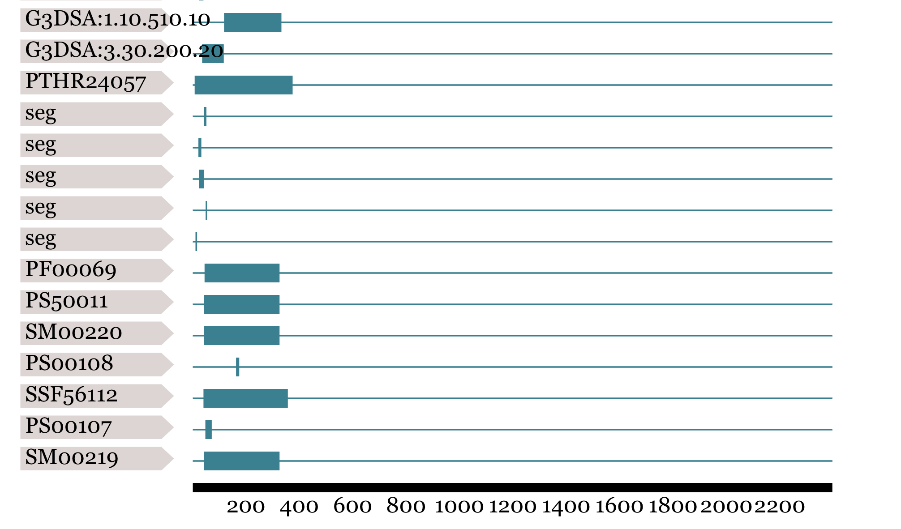

Adding InterProScan Results
===========================

.. note::

  Remember you must set the ``$DRUPAL_HOME`` environment variable if you want to cut-and-paste the commands below. See :doc:`../../install_tripal/drupal_home`

For this tutorial, these results were obtained by using a local installation of InterProScan installed on a computational cluster. However, you may choose to use Blast2GO or the online InterProScan utility. Results should be saved in ``XML`` format.

What is InterProScan?
---------------------
To learn more about InterProScan, please visit https://www.ebi.ac.uk/interpro/

Create the Analysis Page
-------------------------

  .. note::

    It is always recommended to create an analysis page anytime you import data. The purpose of the analysis page is to describe how the data being added was derived or collected.

Tripal defines the **InterPro Results** Bundle, which is a specific type of Chado analysis.  Create a new record by going to ``Content -> Tripal Content -> Add Tripal Content --> InterPro Results``.

Fill out the fields as described in the table below.

.. csv-table::
  :header: "Field", "Value"

  "Name", "InterPro Annotations of C. sinensis v1.0"
  "InterPro Program", "InterProScan"
  "InterPro Version", "4.8"
  "Date Performed", "Current Date"
  "Data Source Name", "C. sinensis v1.0 mRNA"
  "Data Source Version", "v1.0"
  "Data Source URI", "n/a"
  "Description", "Materials & Methods: C. sinensis mRNA sequences were mapped to IPR domains and GO terms using a local installation of InterProScan executed on a computational cluster. InterProScan date files used were MATCH_DATA_v32, DATA_v32.0 and PTHR_DATA v31.0."

Press the **Save** button.

Import the InterProScan XML results
------------------------------------

Next, we will load InterProScan results for our citrus gene.  To do this, navigate to **Tripal > Data Loaders > Chado InterProScan XML results loader**.  The following page will be presented:

The top section of this page provides multiple methods for providing results file: via an upload interface, specifying a remote URL or a file path that is local to the server.  Most likely, you will always upload or provide a remote URL.  However, we downloaded the files earlier, and stored them here: ``$DRUPAL_HOME/sites/default/files``.  So, in this case we can use the path on the local server.  Provide the following value for this form:

.. csv-table::
  :header: "Field", "Value"

  "Server path", "sites/default/files/Citrus_sinensis-orange1.1g015632m.g.iprscan.xml"
  "Analysis", "InterPro Annotations of C. sinensis v1.0"
  'Load GO terms to the database', 'unchecked'
  "Query Name RE", ""
  "Use Unique Name", "unchecked"
  "Query Type", "mRNA"

In order for GO terms to be imported, the Gene Ontology must be loaded on your site: for this tutorial, we leave the box unchecked.

.. note::

  For the **Server path** we need not give the full path.  Because we downloaded the files into the Drupal directory we can leave off any preceding path and Tripal will resolve the path.  Otherwise we could provide the full path.

Clicking the **Import InterProScan file** will add a job which we can manually execute with the following command:

::

    drush trp-run-jobs --username=administrator --root=$DRUPAL_HOME

After the job is run, our InterPro field will be populated on the mRNA page with an annotation diagram:

