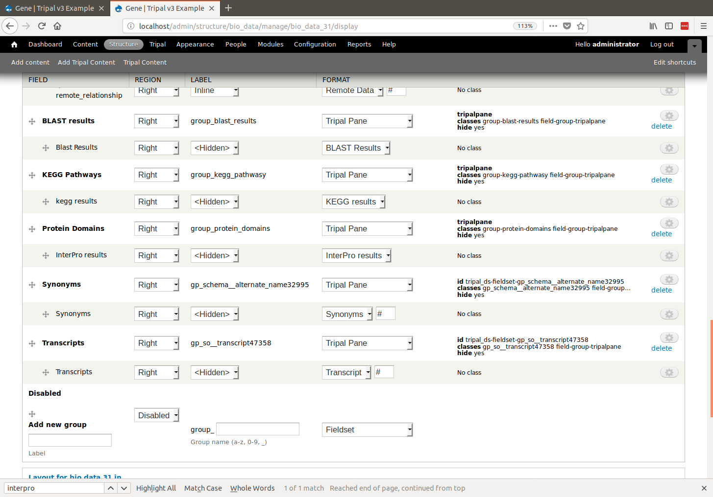

Module Setup
============
.. note::

  Remember you must set the ``$DRUPAL_HOME`` environment variable if you want to cut-and-paste the commands below. See :doc:`../../install_tripal/drupal_home`
  
  
For this example we will be load functional data for our gene. To do this we will use the Blast, KEGG, and InterPro extension modules. However, these extension modules are not part of the "core" Tripal package but are available as separate extensions.  Anyone may create extensions for Tripal.  These extensions are useful for genomic data and therefore are included in this tutorial. 

To download these modules:

  ::
  
    cd $DRUPAL_HOME    
    drush pm-download tripal_analysis_blast
    drush pm-download tripal_analysis_kegg
    drush pm-download tripal_analysis_interpro

Now, enable these extension modules:

  ::
  
    drush pm-enable tripal_analysis_blast
    drush pm-enable tripal_analysis_interpro
    drush pm-enable tripal_analysis_kegg

For this example, we will use the following files which are available for downloading:

- `Citrus_sinensis-orange1.1g015632m.g.iprscan.xml <http://www.gmod.org/mediawiki/images/0/0c/Citrus_sinensis-orange1.1g015632m.g.iprscan.xml>`_
- `Citrus_sinensis-orange1.1g015632m.g.KEGG.heir.tar.gz <http://www.gmod.org/mediawiki/images/1/13/Citrus_sinensis-orange1.1g015632m.g.KEGG.heir.tar.gz>`_
- `Blastx_citrus_sinensis-orange1.1g015632m.g.fasta.0_vs_uniprot_sprot.fasta.out <http://www.gmod.org/mediawiki/images/e/e8/Blastx_citrus_sinensis-orange1.1g015632m.g.fasta.0_vs_uniprot_sprot.fasta.out>`_
- `Blastx_citrus_sinensis-orange1.1g015632m.g.fasta.0_vs_nr.out <http://www.gmod.org/mediawiki/images/2/24/Blastx_citrus_sinensis-orange1.1g015632m.g.fasta.0_vs_nr.out>`_

Download these files to the ```$DRUPAL_HOME/sites/default/files``` directory. To do so quickly run these commands:

  ::
  
    cd $DRUPAL_HOME/sites/default/files
    wget http://www.gmod.org/mediawiki/images/0/0c/Citrus_sinensis-orange1.1g015632m.g.iprscan.xml
    wget http://www.gmod.org/mediawiki/images/1/13/Citrus_sinensis-orange1.1g015632m.g.KEGG.heir.tar.gz
    wget http://www.gmod.org/mediawiki/images/e/e8/Blastx_citrus_sinensis-orange1.1g015632m.g.fasta.0_vs_uniprot_sprot.fasta.out
    wget http://www.gmod.org/mediawiki/images/2/24/Blastx_citrus_sinensis-orange1.1g015632m.g.fasta.0_vs_nr.out

Each of these modules provides new fields for both the **gene** and **mRNA** content types.  To add these new field to those content types, navigate to **Structure > Tripal Content Types** and click the **manage fields** link in the row for the **mRNA** content type.  Click the link titled **Check for new fields**.  After a few moments the page will refresh and you will be notified that new fields have been added.

.. image:: setup1.png

Next, we need to position the new field. Using the skills you learned in the :doc:`../../content_types/configuring_page_display` Create three new **Tripal Panes** named:

- Blast Results
- Protein Domains
- KEGG Pathways

Be sure to:

- Place the three new fields into each pane respectively 
- Move the Panes out of the **disabled** section. 
- Set the label for each field to **Hidden**.

The following shows an example of this layout:



The fields are now ready for display once data is added!  

.. note::

   If you want both the **Gene** and **mRNA** content type to have BLAST, InterPro and KEGG result fields you must repeat the steps above for both.

.. note::

  Anytime you install a Tripal v3 extension module you should check for new fields, and then place those fields in the layout.  Extension modules often will not do this for you because they do not assume you want these new fields.
  
