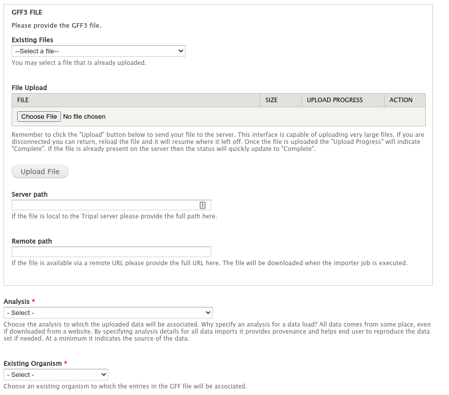
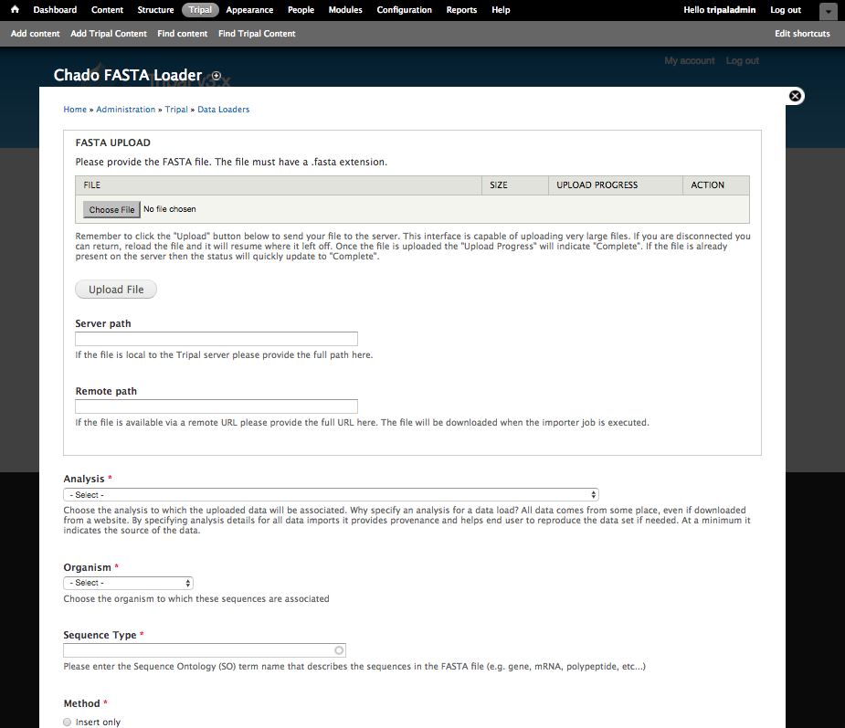
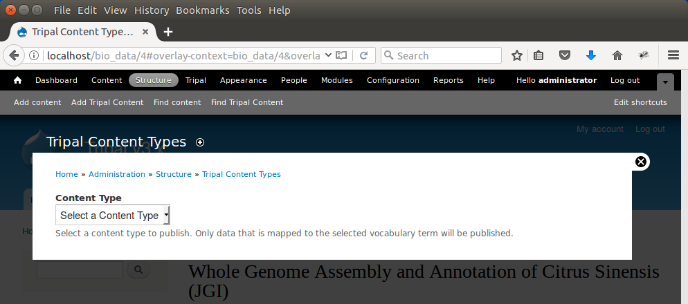
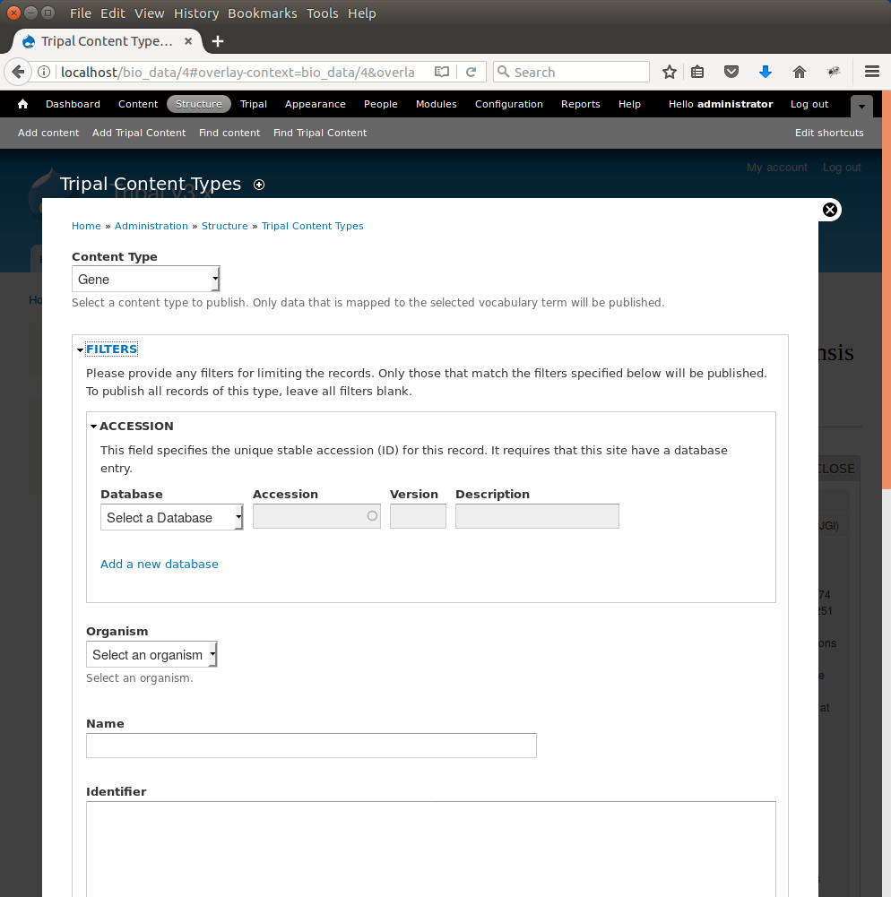
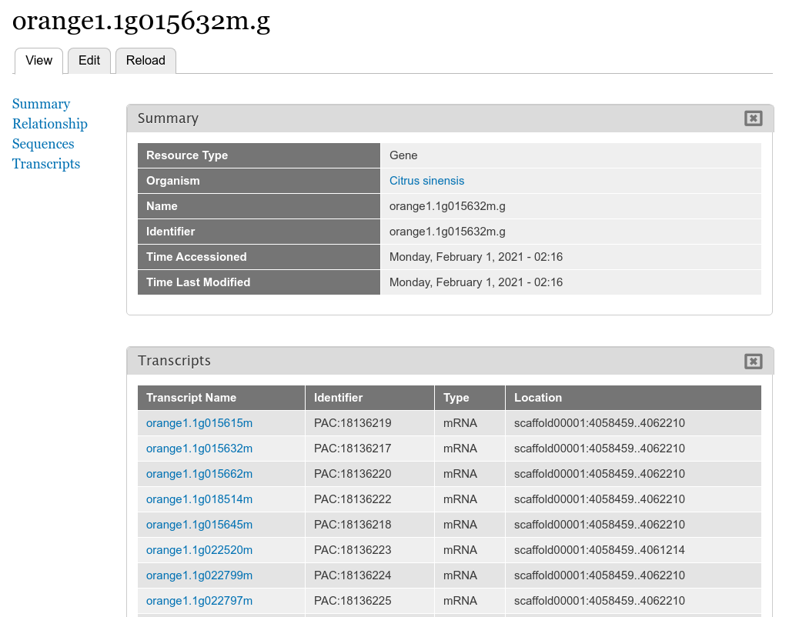

Genomes and Genes
=================

Loading Feature Data
--------------------
Now that we have our organism and whole genome analysis ready, we can begin loading genomic data. For this tutorial only a single gene from sweet orange will be loaded into the databsae. This is to ensure we can move through the tutorial rather quickly. The following datasets will be used for this tutorial:

- `Citrus sinensis-orange1.1g015632m.g.gff3 <http://tripal.info/sites/default/files/Citrus_sinensis-orange1.1g015632m.g.gff3>`_
- `Citrus sinensis-scaffold00001.fasta <http://tripal.info/sites/default/files/Citrus_sinensis-scaffold00001.fasta>`_
- `Citrus sinensis-orange1.1g015632m.g.fasta <http://tripal.info/sites/default/files/Citrus_sinensis-orange1.1g015632m.g.fasta>`_

One of the new features available in many of the Tripal v3 data loaders is an HTML5 file upload element which allows administrators and users to upload large files reliably. This removes the requirement in previous versions of this tutorial to download these files directly on the server and provide a path to the file. Instead, if you have the file on your current local machine you can now simply upload it for loading.

Another new option in Tripal v3 Data Loaders is the ability to provide a remote path of a file to be loaded. This completely alleviates the need to transfer large files multiple times and eases the loading process.

Loading a GFF3 File
-------------------
The gene features (e.g. gene, mRNA, 5_prime_UTRs, CDS 3_prime_UTRS) are stored in the GFF3 file downloaded in the previous step. We will load this GFF3 file and consequently load our gene features into the database. Navigate to **Tripal → Data Loaders → Chado GFF3 Loader**.

Enter the following:

.. csv-table::
  :header: "Field Name", "Value"

  "File", "Upload the file name Citrus_sinensis-orange1.1g015632m.g.gff3"
  "Analysis", "Whole Genome Assembly and Annotation of Citrus sinensis"
  "Existing Organism", "Citrus sinensis"
  "Landmark Type", "supercontig"
  "All other options", "leave as default"

.. note::
    The Landmark Type is provided for this demo GFF3 file because the chromosome is not defined in the file, only the genomic features on the chromosomes.  The landmark type is not needed if the GFF3 file has the chromosomes (scaffolds or contigs) defined in the GFF3 file.

Finally, click the Import GFF3 file button. You'll notice a job was submitted to the jobs subsystem. Now, to complete the process we need the job to run. We'll do this manually:

::

  drush trp-run-jobs --username=administrator --root=/var/www/html

You should see output similar to the following:

::

    2020-10-02 21:53:18
    Tripal Job Launcher
    Running as user 'admin'
    -------------------
    2020-10-02 21:53:18: There are 1 jobs queued.
    2020-10-02 21:53:18: Job ID 1310.
    2020-10-02 21:53:18: Calling: tripal_run_importer(123)

    Running 'Chado GFF3 File Loader' importer
    NOTE: Loading of file is performed using a database transaction.
    If it fails or is terminated prematurely then all insertions and
    updates are rolled back and will not be found in the database

    Opening /var/www/html/sites/default/files/tripal/users/1/Citrus_sinensis-orange1.1g015632m.g.gff3
    Opening temporary cache file: /tmp/TripalGFF3Import_aUgoru
    Step  1 of 26: Caching GFF3 file...
    Step  2 of 26: Find existing landmarks...
    Step  3 of 26: Insert new landmarks (if needed)...
    Step  4 of 26: Find missing proteins...
    Step  5 of 26: Add missing proteins to list of features...
    Step  6 of 26: Find existing features...
    Step  7 of 26: Clear attributes of existing features...
    Step  8 of 26: Processing 135 features...
    Step  9 of 26: Get new feature IDs...
    Step 10 of 26: Insert locations...
    Step 11 of 26: Associate parents and children...
    Step 12 of 26: Calculate child ranks...
    Step 13 of 26: Add child-parent relationships...
    Step 14 of 26: Insert properties...
    Step 15 of 26: Find synonyms (aliases)...
    Step 16 of 26: Insert new synonyms (aliases)...
    Step 17 of 26: Insert feature synonyms (aliases)...
    Step 18 of 26: Find cross references...
    Step 19 of 26: Insert new cross references...
    Step 20 of 26: Get new cross references IDs...
    Step 21 of 26: Insert feature cross references...
    Step 22 of 26: Insert feature ontology terms...
    Step 23 of 26: Insert 'derives_from' relationships...
    Step 24 of 26: Insert Targets...
    Step 25 of 26: Associate features with analysis....
    Step 26 of 26: Adding sequences data (Skipped: none available)...

    Done.
    Committing Transaction...

    Remapping Chado Controlled vocabularies to Tripal Terms...
    Done.

.. note::

  For very large GFF3 files the loader can take quite a while to complete.

Loading FASTA files
-------------------
Using the Tripal GFF3 loader we were able to populate the database with the genomic features for our organism. However, those features now need nucleotide sequence data. To do this, we will load the nucleotide sequences for the mRNA features and the scaffold sequence. Navigate to the **Tripal → Data Loaders → Chado FASTA Loader**.

Before loading the FASTA file we must first know the Sequence Ontology (SO) term that describes the sequences we are about to upload. We can find the appropriate SO terms from our GFF file. In the GFF file we see the SO terms that correspond to our FASTA files are 'scaffold' and 'mRNA'.

.. note::

  It is important to ensure prior to importing, that the FASTA loader will be able to appropriately match the sequence in the FASTA file with existing sequences in the database. Before loading FASTA files, take special care to ensure the definition line of your FASTA file can uniquely identify the feature for the specific organism and sequence type.

For example, in our GFF file an mRNA feature appears as follows:

::

  scaffold00001   phytozome6      mRNA    4058460 4062210 .       +       .       ID=PAC:18136217;Name=orange1.1g015632m;PACid=18136217;Parent=orange1.1g015632m.g

Note that for this mRNA feature the ID is **PAC:18136217** and the name is **orange1.1g015632m**. In Chado, features always have a human readable name which does not need to be unique, and also a unique name which must be unique for the organism and SO type. In the GFF file, the ID becomes the unique name and the Name becomes the human readable name.

In our FASTA file the definition line for this mRNA is:

::

  >orange1.1g015632m PAC:18136217 (mRNA) Citrus sinensis

By default Tripal will match the sequence in a FASTA file with the feature that matches the first word in the definition line. In this case the first word is **orange1.1g015632m**. As defined in the GFF file, the name and unique name are different for this mRNA. However, we can see that the first word in the definition line of the FASTA file is the name and the second is the unique name. Therefore, when we load the FASTA file we should specify that we are matching by the name because it appears first in the definition line.

If however, we cannot guarantee the that feature name is unique then we can use a regular expressions in the **Advanced Options** to tell Tripal where to find the name or unique name in the definition line of your FASTA file.

.. note::

  When loading FASTA files for features that have already been loaded via a GFF file, always choose "Update only" as the import method. Otherwise, Tripal may add the features in the FASTA file as new features if it cannot properly match them to existing features.

Now, enter the following values in the fields on the web form:

.. csv-table::
  :header: "Field Name", "Value"

  "FASTA file", "Upload the file named Citrus_sinensis-scaffold00001.fasta"
  "Analysis", "Whole Genome Assembly and Annotation of Citrus sinensis"
  "Organism", "Citrus sinensis (Sweet orange)"
  "Sequence type", "supercontig (scaffold is an alias for supercontig in the sequence ontology)"
  "Method", "Update only (we do not want to insert these are they should already be there)"
  "Name Match Type", "Name"

Click the Import Fasta File, and a job will be added to the jobs system. Run the job:

::

  drush trp-run-jobs --username=administrator --root=/var/www/html

Notice that the loader reports the it "Found 1 sequences(s).". Next fill out the same form for the mRNA (transcripts) FASTA file:

.. csv-table::
  :header: "Field Name", "Value"

  "FASTA file", "Upload the file named Citrus_sinensis-orange1.1g015632m.g.fasta"
  "Analysis", "Whole Genome Assembly and Annotation of Citrus sinensis"
  "Organism", "Citrus sinensis (Sweet orange)"
  "Sequence type", "mRNA"
  "Method", "Update only"
  "Name Match", "Name"

The FASTA loader has some advanced options. The advanced options allow you to create relationships between features and associate them with external databases. For example, the definition line for the mRNA in our FASTA file is:

::

  >orange1.1g015632m PAC:18136217 (mRNA) Citrus sinensis

Here we have more information than just the feature name. We have a unique Phytozome accession number (e.g. PAC:18136217) for the mRNA. Using the **External Database Reference** section under **Additional Options** we can import this information to associate the Phytozome accession with the features.  A regular expression is required to uniquely capture that ID.  In the example above the unique accession is 18136217.  Because Tripal is a PHP application, the syntax for regular expressions follows the PHP method. Documentation for regular expressions used in PHP can be found `here <http://php.net/manual/en/reference.pcre.pattern.syntax.php>`_.  Enter the following value to make the associate between the mRNA and it's corresponding accession at Phytozome:

.. csv-table::
  :header: "Field Name", "Value"

  "External Database", "Phytozome"
  "Regular expression for the accession", "^.*PAC:(\d+).*$"

Remember, we have the name **Phytozome** in our **External Database** drop down because we manually added it as a database cross reference earlier in the turorial.  After adding the values above, click the **Import FASTA file** button, and manually run the submitted job:

::

  drush trp-run-jobs --username=administrator --root=/var/www/html

Now the scaffold sequence and mRNA sequences are loaded!

.. note:

  If the name of the gene to which this mRNA belonged was also on the definition line, we could use the **Relationships** section in the **Advanced Options** to link this mRNA with it's gene parent. Fortunately, this information is also in our GFF file and these relationships have already been made.

.. note::

  It is not required to load the mRNA sequences as those can be derived from their alignments with the scaffold sequence. However, in Chado the **feature** table has a **residues** column. Therefore, it is best practice to load the sequence when possible.

Creating Gene Pages
----------------------
Now that we've loaded our feature data, we must publish them. This is different than when we manually created our Organism and Analysis pages.  Using the GFF and FASTA loaders we imported our data into Chado, but currently there are no published pages for this data that we loaded.  To publish these genomic features, navigating to Structure → Tripal Content Types and click the link titled Publish Chado Content.  The following page appears:

Here we can specify the types of content to publish. For our site we want to offer both gene and mRNA pages (these types were present in our GFF file). First, to create pages for genes select 'Gene' from the dropdown.  A new Filter section is present and when opened appears as follows.

The **Filters** section allows you to provide filters to limit what you want to publish.  For example, if you only want to publish genes for a single organism you can select that organism in the Organism drop down list.  We only have one organism in our site, but for the sake of experience, add a filter to publish only genes for Citrus sinesis by selecting it from the Organism drop down.  Scroll to the bottom a click the Publish button.  A new job is added to the job queue.  Manually run the job:

::

  drush trp-run-jobs --username=administrator --root=/var/www/html

You should see output similar to the following:

::

  Tripal Job Launcher
  Running as user 'administrator'
  -------------------
  Calling: tripal_chado_publish_records(Array, 12)

  NOTE: publishing records is performed using a database transaction.
  If the load fails or is terminated prematurely then the entire set of
  is rolled back with no changes to the database

  Succesfully published 1 Gene record(s).

Here we see that 1 gene was successfully published. This is because the GFF file we used previously to import the genes only had one gene present.

Now, repeat the steps above to publish the mRNA content type.  You should see that 9 mRNA records were published:

::

  Tripal Job Launcher
  Running as user 'administrator'
  -------------------
  Calling: tripal_chado_publish_records(Array, 13)

  NOTE: publishing records is performed using a database transaction.
  If the load fails or is terminated prematurely then the entire set of
  is rolled back with no changes to the database

  Succesfully published 9 mRNA record(s).

.. note::

  It is not necessary to publish all types of features in the GFF file. For example, we do not want to publish features of type **scaffold**. The feature is large and would have many relationships to other features, as well as a very long nucleotide sequence.  These can greatly slow down page loading, and in general would be overwhelming to the user to view on one page. As another example, each **mRNA** is composed of several **CDS** features. These **CDS** features do not need their own page and therefore do not need to be published.

Now, we can view our gene and mRNA pages. Click the Find Tripal Content link. Find and click the new page titled **orange1.1g015632m.g**. Here we can see the gene feature we added and its corresponding mRNA's.

Next find an mRNA page to view.  Remember when we loaded our FASTA file for mRNA that we associated the record with Phytozome.  On these mRNA pages you will see a link in the left side bar titled **Database Cross Reference**.  Clicking that will open a panel with a link to Phytozome.  This link appears because:

- We added a Database Cross Reference for Phytozome in a previous step
- We associated the Phytozome accession with the features using a regular expression when importing the FASTA file.

All data that appears on the page is derived from the GFF file and the FASTA  files we loaded.
