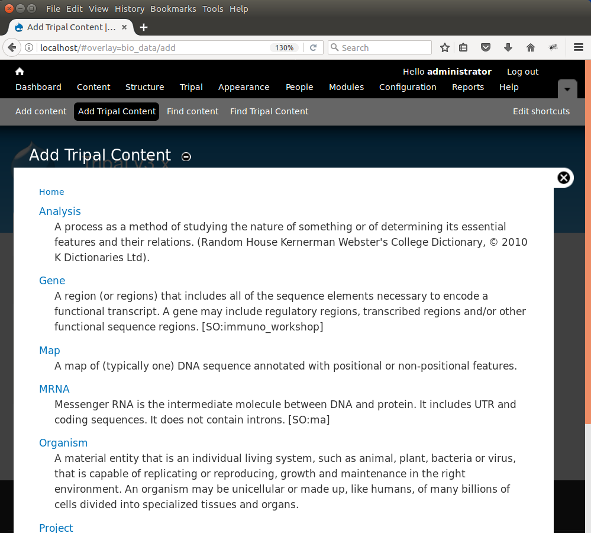
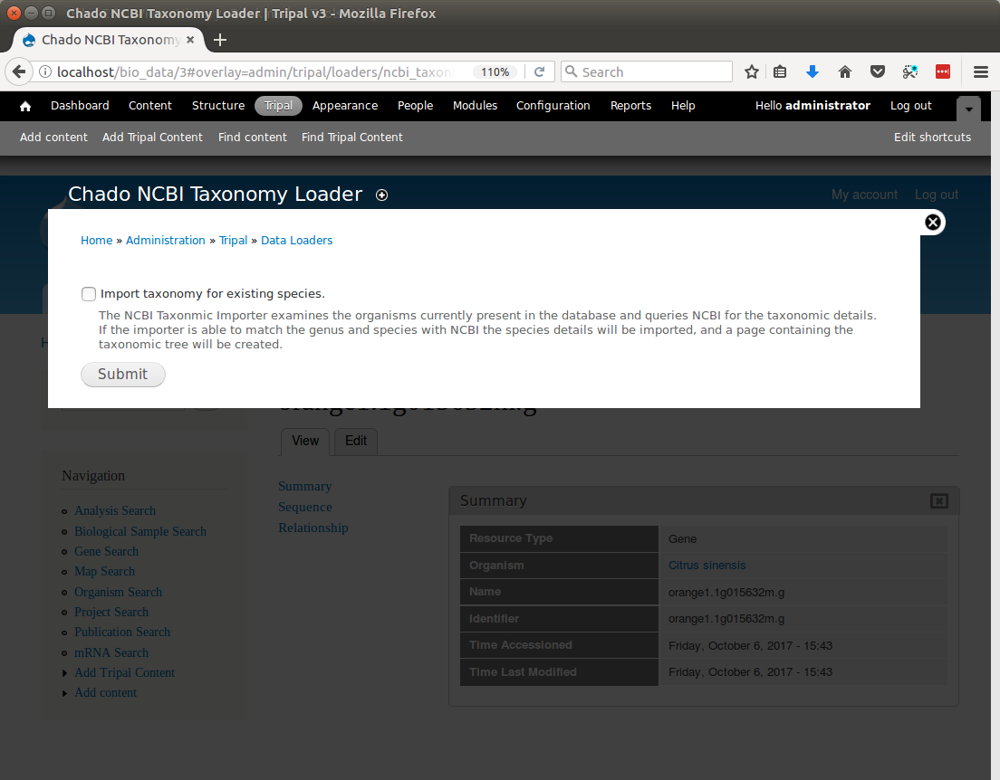
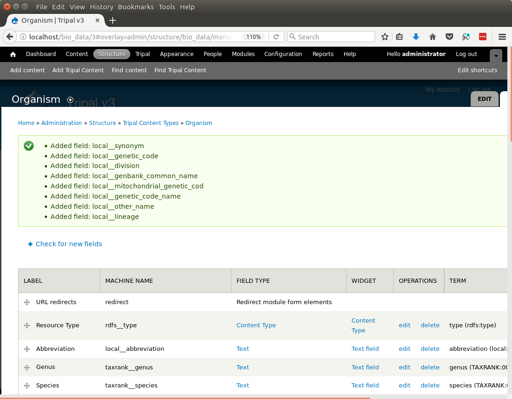
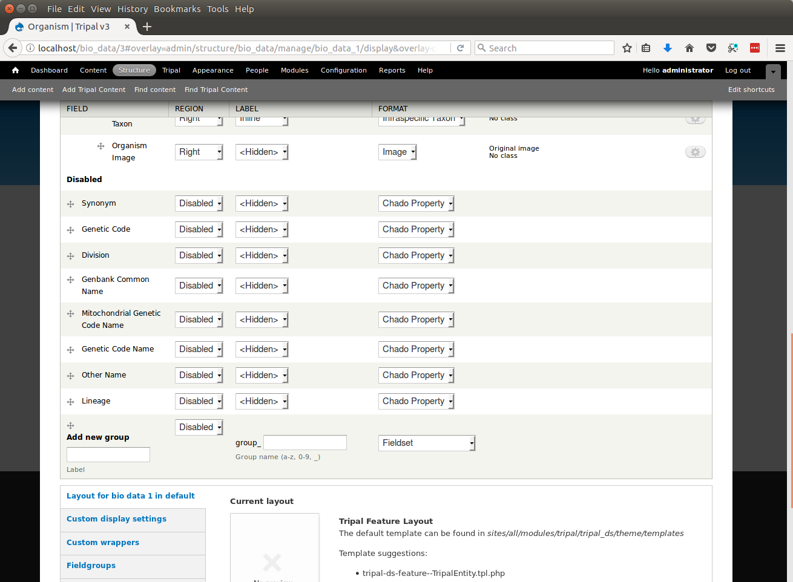
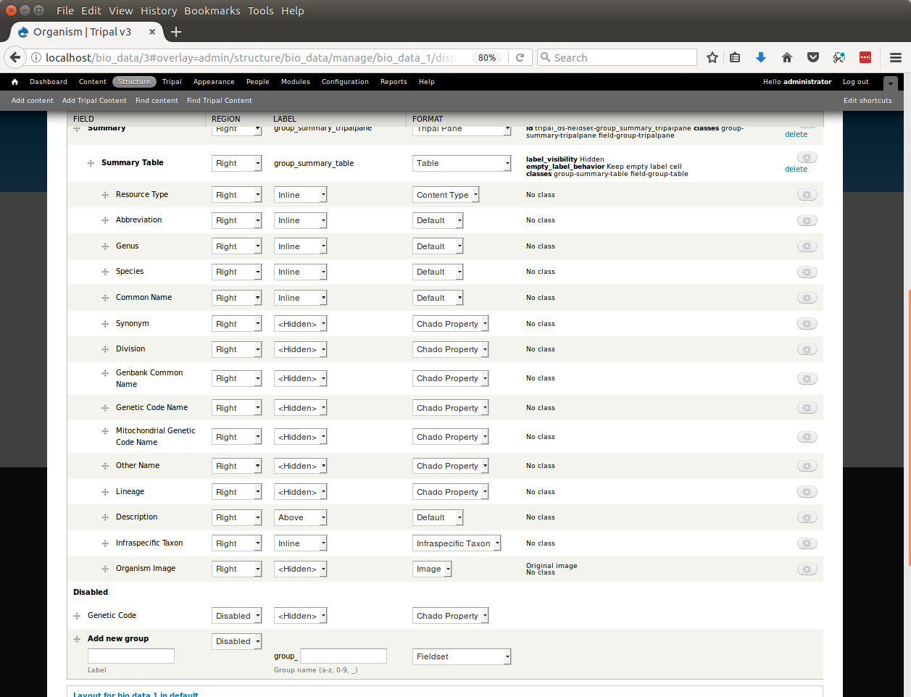
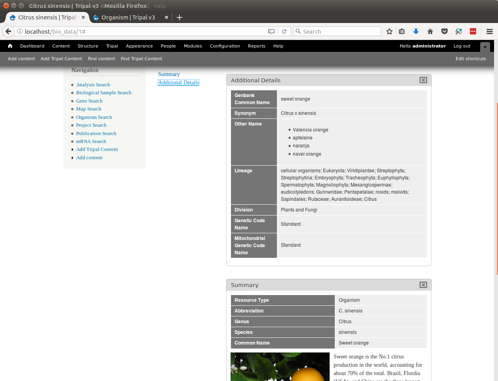

Organisms
=========
Before we can load our data we must first have an organism to which the data will be associated.  Chado v1.3 does not come preloaded with any organisms (although previous version of Chado do).  For this tutorial we will import genomic data for Citrus sinesis (sweet orange), so we must first create the organism.

Creating an Organism Page
-------------------------
We can  add the organism using the **Add Tripal Content** link in the top administrative menu. The **Add Tripal Content** page has several content types already available, including the **Organism** content type.

.. note::

  Drupal provides it's own content types such as **Article** and **Basic Page**.  These content types are referred to as **nodes** in Drupal speak. You can add these content types via the **Add Content** page. Tripal v3 derived content types are separated from these Drupal content types.

To add a new organism  click the **Organism** link and a form will appear with multiple fields. Fill in the fields with these values:

.. csv-table::
  :header: "Field Name", "Value"

  "Abbreviation", "C. sinensis"
  "Genus", "Citrus"
  "Species", "sinensis"
  "Common name", "Sweet orange"
  "Description",	"Sweet orange is the No.1 citrus production in the world, accounting for about 70% of the total. Brazil, Flordia (USA), and China are the three largest sweet orange producers. Sweet orange fruits have very tight peel and are classified into the hard-to-peel group. They are often used for juice processing, rather than fresh consumption. Valencia, Navel, Blood, Acidless, and other subtypes are bud mutants of common sweet orange varieties. Sweet orange is considered as an introgression of a natural hybrid of mandarin and pummelo; some estimates shows more mandarin genomic background than pummelo. The genome size is estimated at 380Mb across 9 haploid chromosomes."
  "Image", .. image:: organisms.citrus_sinensis.jpg

Leave all remaining fields empty and save the page.  You should now have an organism page that appears as follows:

.. image:: organisms.2.png

.. note::

  The layout of the organism page is provided by the **tripal_ds** module that was enabled during Tripal installation.  If you decided not to enable that module then your page will look quite different.

This page has three primary sections.  A left sidebar that contains a search box and a **block** titled **Navigation**.  To the right of the sidebar is the content section.  Here the content is divided into two columns.  In the first column is a table of contents listing the "Table of Contents" of the page.  Currently this list simply contains the **Summary**. The second column contains all of the content about the organism.  Clicking the links in the table of contents causes each section to slide to the top of the page for viewing while all other content slides downward.  Users need not scroll the entire page to see all content.  The close link (X) at the top right of each section allows the user to remove sections they may not want to see and which clutter their view.

There is more information about an organism that does not appear on this page.   By default, Tripal will not show fields that have no data.  However, if you prefer, you can change this behavior by configuring the content type to not hide empty fields.  You can find this option by navigating to **Structure > Tripal Content Types**, and click on the **edit** link for the content type. You will find the option to toggle this behavior there.

If you do not like this layout you can change it!  One of the benefits for using Drupal is the ability to customize the entire look and feel of your site.  Tripal v3 along with Drupal allow you to reorganize this (and any) page however you like.  This default layout is provided by the **tripal_ds** module to help simplify the process of laying out a page.  If you decided not to enable the **tripal_ds** module then your page will require manual layout. Later in this tutorial instructions to reorganize and re-theme the Tripal content pages are provided.  No programming is required to do this.

Load data from NCBI Taxonomy
----------------------------
Tripal makes it easy to import additional information about any organisms within a Tripal site from the `NCBI Taxonomy database <https://www.ncbi.nlm.nih.gov/taxonomy>`_.  The importer will only import data for species that you currently have in the Tripal database.  The taxonomic names must match those in the NCBI Taxonomy database.  Currently, we only have a single organism (Citrus sinensis) and we will import additional properties for this organism from NCBI but we can return later to import data for new organisms we may add later.  To import additional organism details, navigate to **Tripal → Data Loaders → Chado NCBI Taxonomy Loader**.  The following page appears:

Click the checbox beside the 'Import taxonomy for existing species' and click Submit.  Now run the submitted job:

::

  drush trp-run-jobs --username=administrator --root=$DRUPAL_HOME

You will see the following output:

::

  Tripal Job Launcher (in parallel)
  Running as user 'administrator'
  -------------------
  2017-10-06 15:45:47: There are 1 jobs queued.
  2017-10-06 15:45:47: Calling: tripal_chado_ncbi_taxonomy_import()

  NOTE: Importing of NCBI taxonomy data is performed using a database transaction.
  If the load fails or is terminated prematurely then the entire set of
  insertions/updates is rolled back and will not be found in the database

  2711    Citrus sinensis

Adding New Fields
-----------------

We have now imported many new properties about the Citrus sinensis organism from NCBI Taxonomy.  However, these properties won't show up on the page automatically.  We need to tell Drupal that our organism pages now have new property fields for display.   To do this, navigate to **Structure → Tripal Content Types** and in the row for the Organism content type, click the link titled managed fields.   Here we see a list the fields that associated with an Organism content type.  Click the link at the top of the page **Check for new fields**.  You will see that several new fields have been added.

Drupal now knows about these new fields!  But if we were to look at the Citrus sinensis page we would see that the new properties do not appear.  Despite that Drupal knows about the fields it has disabled their display.  To enable display of these fields click the **Manage Display** tab at the top right of the page.  Here all of the fields are organized into the structure that they will be displayed on the page.   Later in this tutorial a more formal description is provided about how you use this interface to change the way the page appears.  For now, we simply need to get the new fields to be shown.    Scroll to the bottom of the page and the new fields can be seen in the **Disabled** section.

We can move these new fields out of the Disabled section by clicking on the cross-hair icons to the left of the name and dragging the field into a section above.   Drag these fields into the **Summary** section underneath the **Summary Table**.  Notice in the screenshot below that the fields that were once in the **Disabled** section are now in the **Summary Table** section.  Click the **Save** button at the bottom to make all changes final.

Now, if we return to the organism page we will see these new properties were added to the page inside of the Summary Table.

.. image:: organisms.updated_page1.png

Further Customizations
----------------------

You may not like this arrangement of fields.  You may prefer to place these extra fields inside of a new **pane** rather than inside of the **Summary pane**.  Perhaps a pane named Additional Details.  You can rearrange the order of these fields and create new panes, as desired by following the more details instructions on the `Configure Page Display page <../configuring_page_display>`_ of this tutorial.  For example, the following shows these fields organized into a new pane named **Additional Details** which is separate from the **Summary** Pane.  Note the table of contents sidebar now lists the **Summary** and **Additional Details** links.  When clicked, the pane selected by the user migrates to the top of the page

