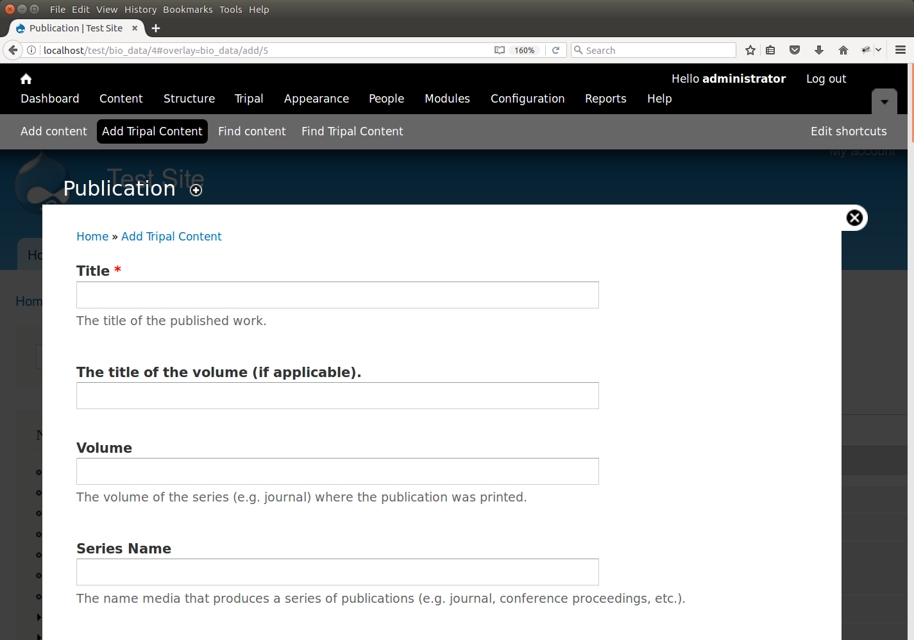
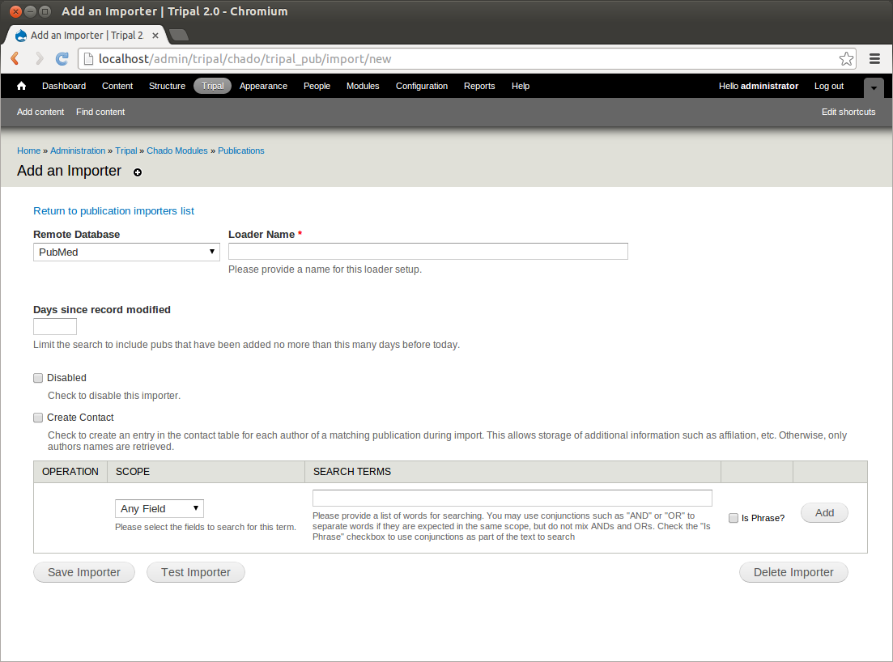
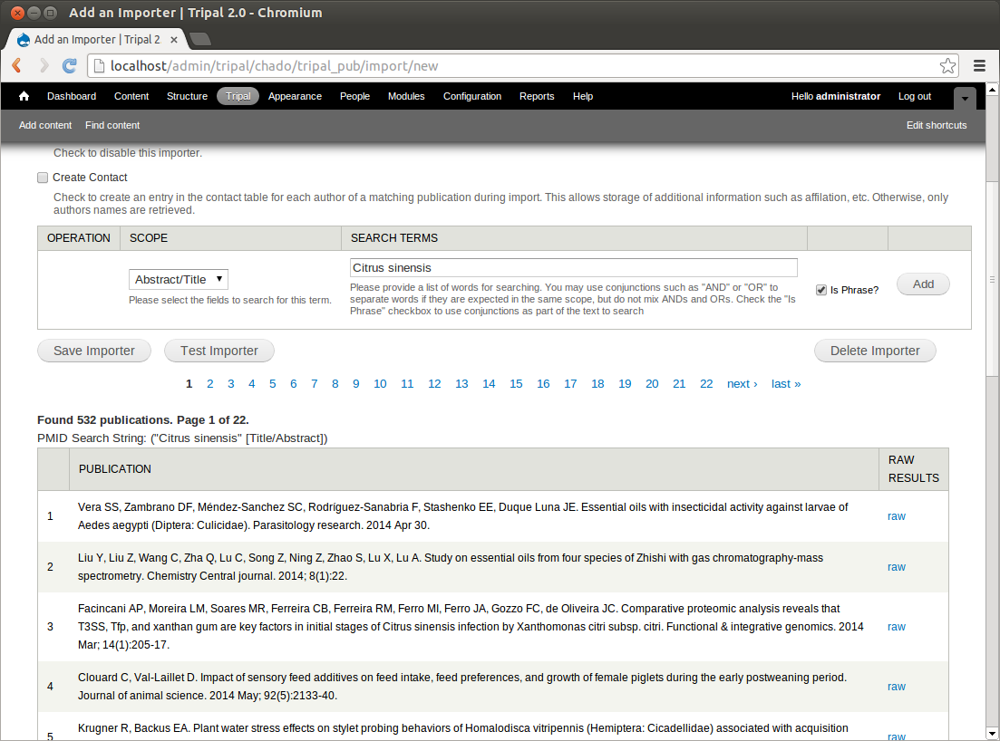
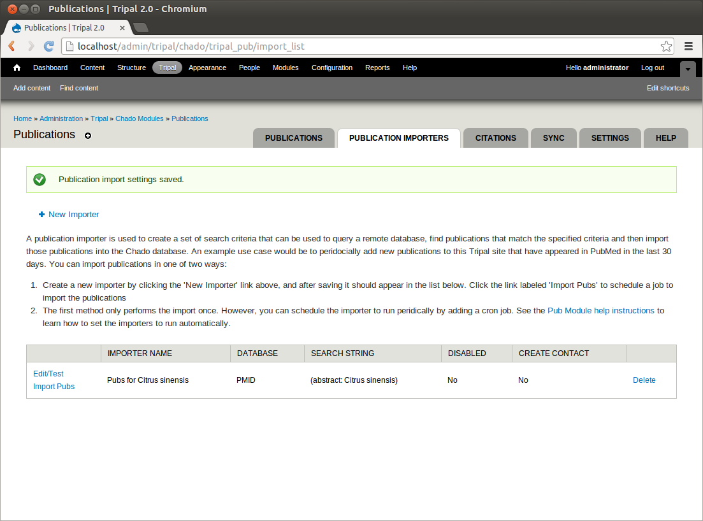
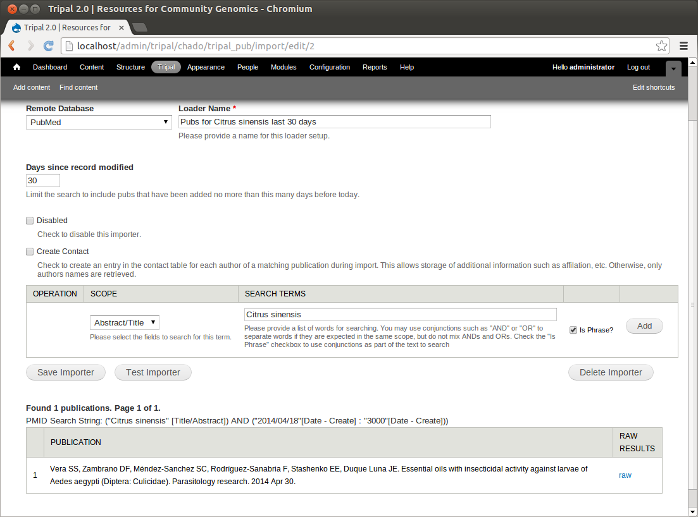

Importing Publications
======================
.. note::

  Remember you must set the ``$DRUPAL_HOME`` environment variable if you want to cut-and-paste the commands below. See :doc:`../install_tripal/drupal_home`
  
Tripal provides an interface for automatically and manually adding publications.

Manually Adding a Publication
-----------------------------
First, we will manually add a publication. Click the Add Tripal Content link in the administrative menu and then Publication.

We will add information about the Tripal publication. Enter the following values:

.. csv-table::
  :header: "Field Name", "Value"

  "Title", "Tripal v3: an ontology-based toolkit for construction of FAIR biological community databases."
  "Volume", "baz077"
  "Series Name", "Database"
  "Publication Year", "2019"
  "Unique Local Identifier", "Tripal v3: an ontology-based toolkit for construction of FAIR biological community databases."
  "Publication Type", "Journal"
  "Cross Reference", "Database: PMID"
  "Accession", "31328773"
  "Publication Date", "2019 Jul 22"
  "Citation", "Spoor S, Cheng CH, Sanderson LA, Condon B, Almsaeed A, Chen M, Bretaudeau A, Rasche H, Jung S, Main D, Bett K, Staton M, Wegrzyn JL, Feltus FA, Ficklin SP. Tripal v3: an ontology-based toolkit for construction of FAIR biological community databases.  Database. July 2019, 2019: baz077"
  "Authors", "Spoor S, Cheng CH, Sanderson LA, Condon B, Almsaeed A, Chen M, Bretaudeau A, Rasche H, Jung S, Main D, Bett K, Staton M, Wegrzyn JL, Feltus FA, Ficklin SP"
  "Abstract", "Community biological databases provide an important online resource for both public and private data, analysis tools and community engagement. These sites house genomic, transcriptomic, genetic, breeding and ancillary data for specific species, families or clades. Due to the complexity and increasing quantities of these data, construction of online resources is increasingly difficult especially with limited funding and access to technical expertise. Furthermore, online repositories are expected to promote FAIR data principles (findable, accessible, interoperable and reusable) that presents additional challenges. The open-source Tripal database toolkit seeks to mitigate these challenges by creating both the software and an interactive community of developers for construction of online community databases. Additionally, through coordinated, distributed co-development, Tripal sites encourage community-wide sustainability. Here, we report the release of Tripal version 3 that improves data accessibility and data sharing through systematic use of controlled vocabularies (CVs). Tripal uses the community-developed Chado database as a default data store, but now provides tools to support other data stores, while ensuring that CVs remain the central organizational structure for the data. A new site developer can use Tripal to develop a basic site with little to no programming, with the ability to integrate other data types using extension modules and the Tripal application programming interface. A thorough online User’s Guide and Developer’s Handbook are available at http://tripal.info, providing download, installation and step-by-step setup instructions."

To complete the page click the **Save** button at the bottom

Import of Publications
----------------------

Tripal supports importing of publications from remote databases such as NCBI PubMed.

Creation of an importer is an administrative function. A publication importer is created by the site administrator and consists of a set of search criteria for finding multiple publications at one time. When the importer is run, it will query the remote database, retrieve the publications that match the criteria and add them to the database. Because we loaded genomic data for Citrus sinensis we will create an importer that will find all publications related to this species.

First, navigate to **Tripal → Data Loaders → Chado Bulk Publication Importers** and click the link New Importer. You will see the following page:

Enter the following values in the fields:

.. csv-table::
  :header: "Field Name", "Value"

  "Remote Database", "PubMed"
  "Loader Name", "Pubs for Citrus sinensis"
  "Criteria #1", "
  - Scope: Abstract/Title
  - Search Terms: Citrus sinensis
  - is Phrase?: checked"

Now, click the 'Test Importer' button. This will connect to PubMed and search for all publications that match our provided criteria.  it may take a few minutes to complete. On the date this portion of the tutorial was written, over 800 publications were found:

Now, save this importer. You should see that we have one importer in the list:

We can use this importer to load all  publications related to Citrus sinensis from PubMed into our database (how to load these will be shown later). However, what if new publications are added? We would like this importer to be run monthly so that we can automatically add new publications as they become available. But we do not need to try to reload these 760 every time the loader runs each month. We will create a new importer that only finds publications within the last 30 days. To do this, click the link New Importer. Now, add the following criteria:

.. csv-table::
  :header: "Field Name", "Value"

  "Remote Database", "PubMed"
  "Loader Name", "Pubs for Citrus sinensis last 30 days"
  "Days since record modified", "30"
  "Criteria #1", "
  - Scope: Abstract/Title
  - Search Terms: Citrus sinensis
  - is Phrase?: checked"

Now, when we test the importer we find only 1 publications that has been added (created) to PubMed in the last 30 days:

Save this importer.

Next, there are two ways to import these publications. The first it to manually import them. There is a Drush command that is used for importing publications. Return to the terminal and run the following command:

::

  cd $DRUPAL_HOME
  drush trp-import-pubs --username=administrator

You should see output to the terminal that begins like this:

::

  NOTE: Loading of publications is performed using a database transaction.
  If the load fails or is terminated prematurely then the entire set of
  insertions/updates is rolled back and will not be found in the database

  Importing: Pubs for Citrus sinensis

The importer will import 100 publications at a time and pause between each set of 100 as it requests more.

Some things to know about the publication importer:

1. The importer keeps track of publications from the remote database using the publication accession (e.g. PubMed ID).
2. If a publication with an accession (e.g. PubMed ID) already exists in the local database, the record will be updated.
3. If a publication in the local database matches by title, journal and year with one that is to be imported, then the record will be updated. Y
4. Run the newly created Tripal Job to finish:

  ::

    cd $DRUPAL_HOME
    drush trp-run-jobs --user=administrator

The second way to import publications is to add an entry to the UNIX cron. We did this previously for the Tripal Jobs management system when we first installed Tripal. We will add another entry for importing publications. But first, now that we have imported all of the relevant pubs, we need to return to the importers list at **Tripal → Data Loaders → Chado Publication Importers** and disable the first importer we created. We do not want to run that importer again, as we've already imported all historical publications on record at PubMed. Click the edit button next to the importer named Pubs for Citrus sinensis, click the disable checkbox and then save the template. The template should now be disabled.

Now we have the importer titled **Pubs for Citrus sinensis last 30 days** enabled. This is the importer we want to run on a monthly basis. The cron entry will do this for us. On the terminal open the crontab with the following command:

::

  sudo crontab -e

Now add the following line to the bottom of the crontab:

::

  30 8 1,15 * *  su - www-data -c '/usr/local/drush/drush -r [DRUPAL_HOME] -l http://[site url] trp-import-pubs --report=[your email] > /dev/null'

Where

- [site url] is the full URL of your site
- [your email] is the email address of the user that should receive an email containing a list of publications that were imported. You can separate multiple email addresses with a comma.
- [DRUPAL_HOME] is the directory where Drupal is installed

The cron entry above will launch the importer at 8:30am on the first and fifteenth days of the month. We will run this importer twice a month in the event it fails to run (e.g. server is down) at least one time during the month.

Import from the USDA National Agricultural Library
--------------------------------------------------
The instructions for the Tripal publication importer described previously use the the NCBI PubMed database. However, you can also import publications from the USDA National Agriculture Library (AGRICOLA). However, to use this repository a few software dependences are required.  These include:

- The `YAZ library <https://www.indexdata.com/resources/software/yaz/>`_
- `PHP support for YAZ <https://www.php.net/manual/en/book.yaz.php>`_  

The following instructions are to install the necessary dependencies on an Ubuntu 18.04 LTS.   

First install yaz, the yaz development library and the php development library:

.. code-block:: bash
 
  sudo apt-get install yaz libyaz5-dev php-dev

Next update the PECL tool and install the PHP yaz library:

.. code-block:: bash
  
  sudo pecl channel-update pecl.php.net
  sudo pecl install yaz
  
Next, edit the `php.ini` files.  On Ubuntu 18.04 there are two PHP files:

- `/etc/php/7.2/cli/php.ini`
- `/etc/php/7.2/apache2/php.ini`

Add the following line to each file:

::

  extension=yaz.so

Finally, restart the web server so that it picks up the changes to the `php.ini` file.

.. code-block:: bash
  
  sudo service apache2 restart

You can now import publications from Agricola using the same interface as with PubMed.

