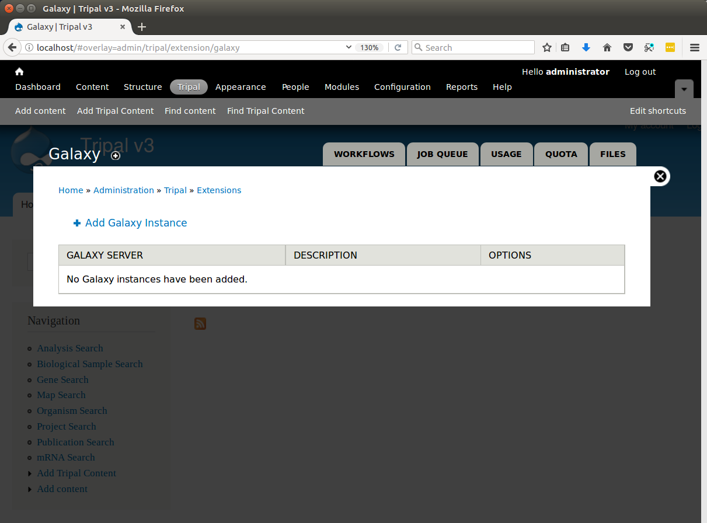
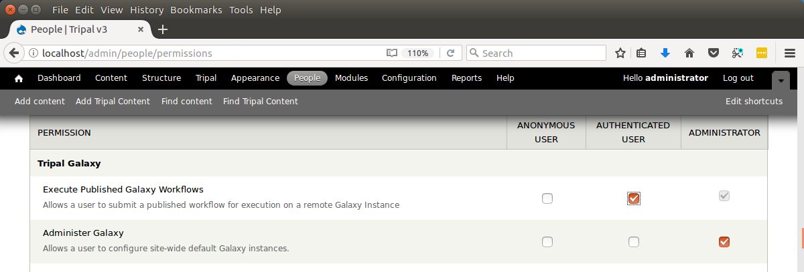

Install Tripal Galaxy
=================================

Installation
~~~~~~~~~~~~~

The Tripal Galaxy module is available as a full Drupal module.  Therefore, it can be installed following the typical Drupal module installation either via the GUI or via Drush.  However it requires a few dependencies:

* curl
* php-curl
* blend4php

Follow the typical method for installation of tools for your operating system to install curl and php-curl.  For example, on Ubuntu sytems you can install both curl and php-curl with the following command:

.. code-block:: bash

  sudo apt-get install php-curl

Additionally, this module requires the presence of the `blend4php library <https://github.com/galaxyproject/blend4php>`_.  The blend4php library was developed as part of the Tripal Gateway Project as stand-alone PHP bindings to the Galaxy RESTful API.  It allows any PHP-based web application to communicate with a remote Galaxy instance.  To install blend4php, navigate to the sites/all/libraries directory of your Drupal installation and issue the following command:

.. code-block:: bash

  git clone https://github.com/galaxyproject/blend4php.git

That's it!  The library is now available for Drupal to find.  Now, we can install the Tripal Galaxy module.  We'll do so here using a Drush command:

.. code-block:: bash

  drush pm-enable tripal_galaxy

You will be asked if you would like to download and then enable the module.  Now that the Tripal Galaxy module is installed, navigate to the ``Administration > Tripal > Extensions > Galaxy`` page via the administrative menu.  At this location is the administrative interface for interacting with remote Galaxy servers.  Near the top of the page are several tabs including **Workflows, Job Queue, Usage, Quotas** and **Files**.

Set Permissions
~~~~~~~~~~~~~~~~

Now that the Tripal Galaxy module is installed, we must set permissions so that users can add submit workflows and administrators can manage the workflows.  To set permissions, navigate to **People** page and click the **Permissions** tab in the top right.  Search through the list of permissions until you find the section titled **Tripal Galaxy**.  In this section you will find two types of permssions, one for providing access to execute published workflows and one for administering the Galaxy module.  By default Drupal provides three types of roles:  Anonymous, Authenticated and Administrator users.  The screen shot below shows these permissions for these three roles:

.. warning::

  If your site is not new you may have additional roles.  As a rule you should **never** give the anonymous user either permission.  Anonymous users should **never** be allowed to execute workflows. Set permissions as appropriate for your site's configuration.  Here we allow authenticated users the ability to execute workflows.
