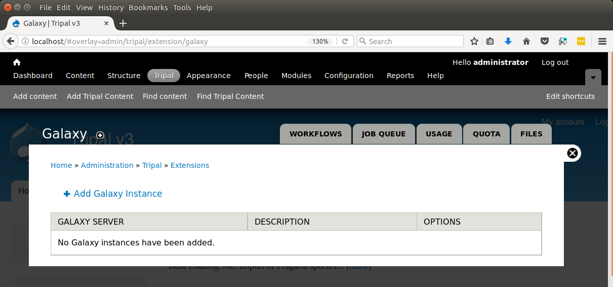
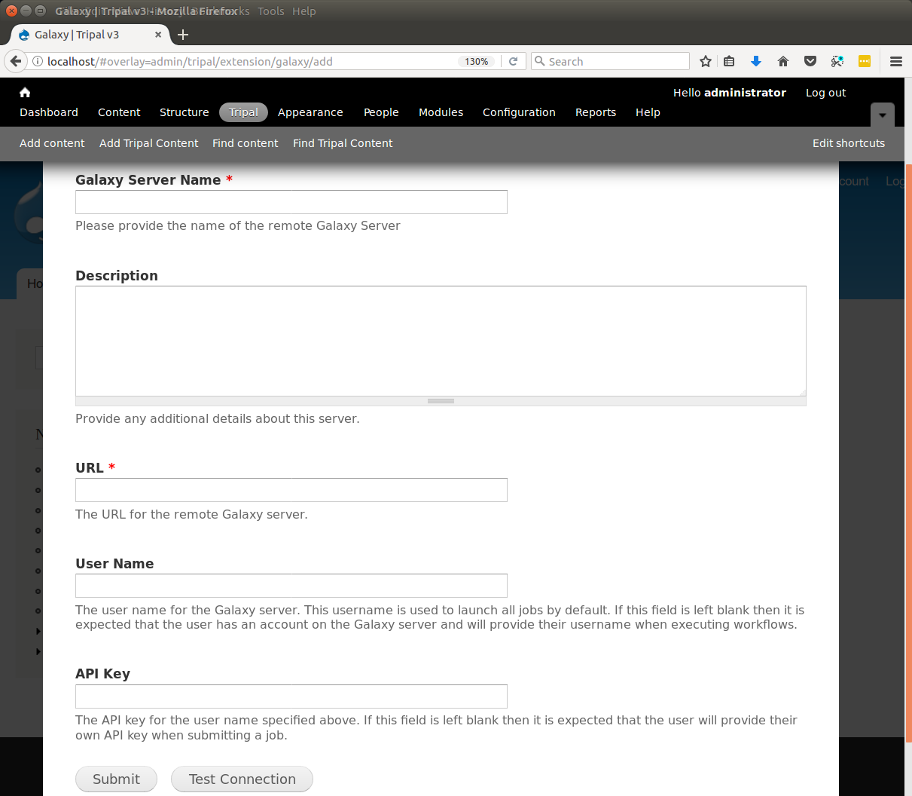
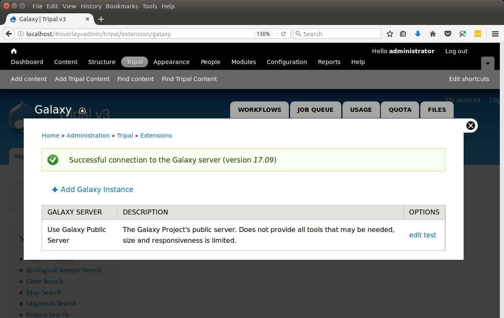

Adding a Remote Galaxy Server
===============================

Before any workflows can be run, at least one remote Galaxy server must be integrated with Tripal.  This can be done on the Tripal Galaxy administrative page.  This page is available by navigating to  **Administration > Tripal > Extensions > Galaxy**. The following page is presented:

We can add a new remote Galaxy server by clicking the Add Galaxy Instance link.  The following page appears:

Here we provide the details for the remote Galaxy instance.  This can be a Galaxy instance that was setup and created specifically and dedicated for your site to use, a shared Galaxy instance setup at your institution or one of several `public Galaxy instances <https://galaxyproject.org/public-galaxy-servers/>`_.  For this tutorial we will use the Galaxy Project's `"Use Galaxy" <https://usegalaxy.org/>`_ public instance.  The following values are therefore provided to the fields:

.. csv-table:: Example Galaxy Field Values
  :header: "Field Name",  "Value"

  "Galaxy Server Name", "Use Galaxy Public Server"
  "Description", "The Galaxy Project's public server.  Does not provide all tools that may be needed, size and responsiveness is limited."
  "URL", "https://usegalaxy.org/"
  "User Name", "*[The name of a user account on the Galaxy server]*"
  "API Key", "*[The API Key of the user]*"

The fields described above provide everything needed to connect to a remote Galaxy instance. These incluede the URL, user name of a user on the remote Galaxy server and the API Key for that user.  The **Galaxy Server Name** field and **Description** field are meant for you and the site's user's to know where computation is happening and the Description field is for the site admin.

The user name provided will the account under which all Galaxy workflows will be executed, but the Tripal Galaxy module will ensure that each workflow submission runs independent of all others within this user account.  It is recommended to create a **service** account on the remote Galaxy instance that is independent of a real person.  This service account can be specific for your website only.  Every user on Galaxy has the ability to create an API Key. It is via this key that Galaxy will allow remote connections from a client application like Tripal.  To retrieve the API key for your service account user, log on to the remote Galaxy instance and navigate to **User > Preferences > Manage API Key**.  By default, user's do not have an API key.  You can generate a key by clicking the link to generate a new key.  Once the key is generated you must cut-and-paste the key into the **API Key** field of the Tripal Galaxy Instance setup form (shown above).  Click the **Submit** button when done.

Now we can see that we have a Galaxy server available:

Clicking the test link beside the server details will check to ensure that we have entered all information correctly and we can successfully connect to the remote Galaxy server. We see in the screenshot above that the test was successful and that the Galaxy server version is currently 17.09.
