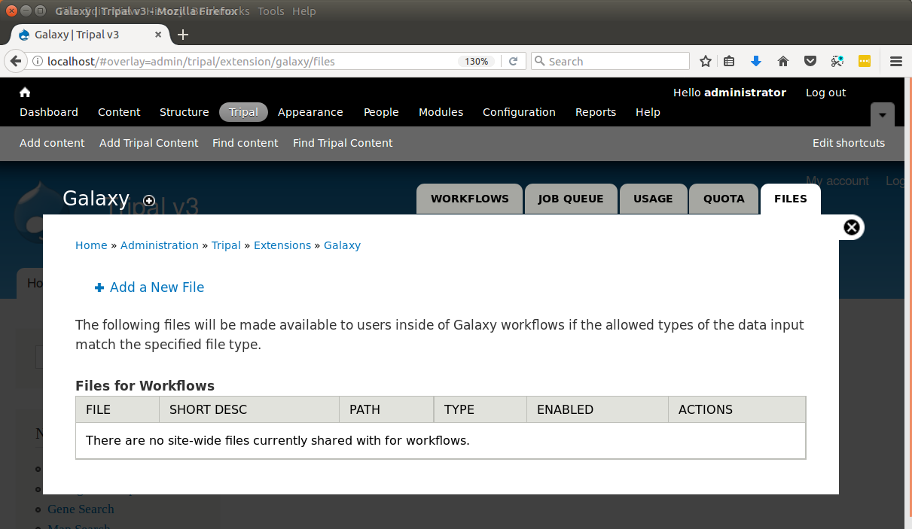
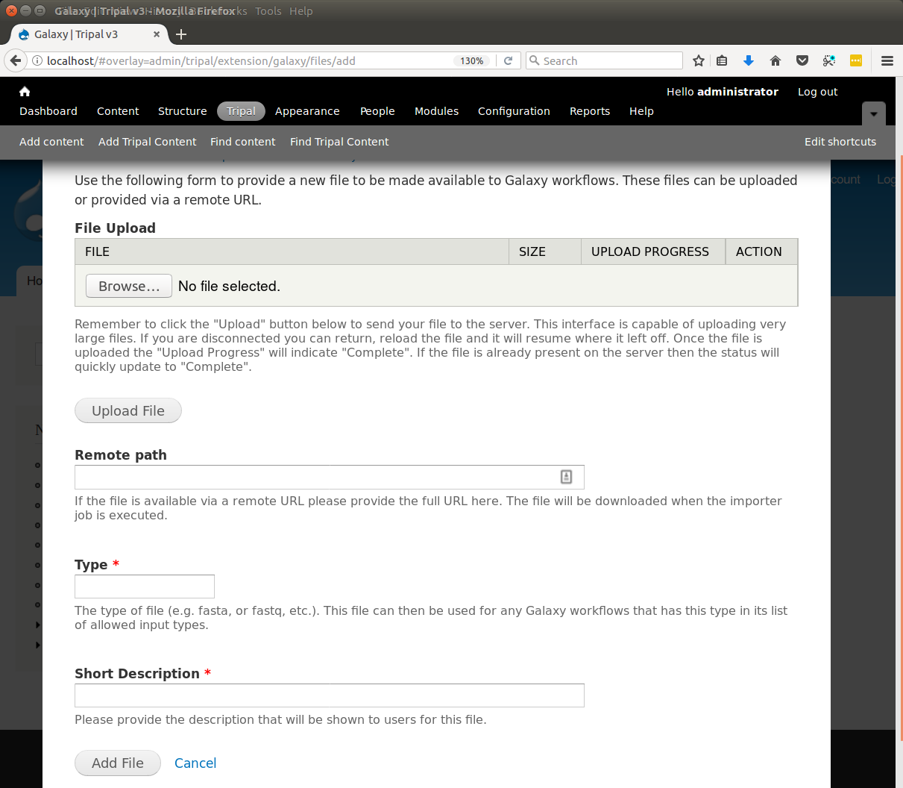
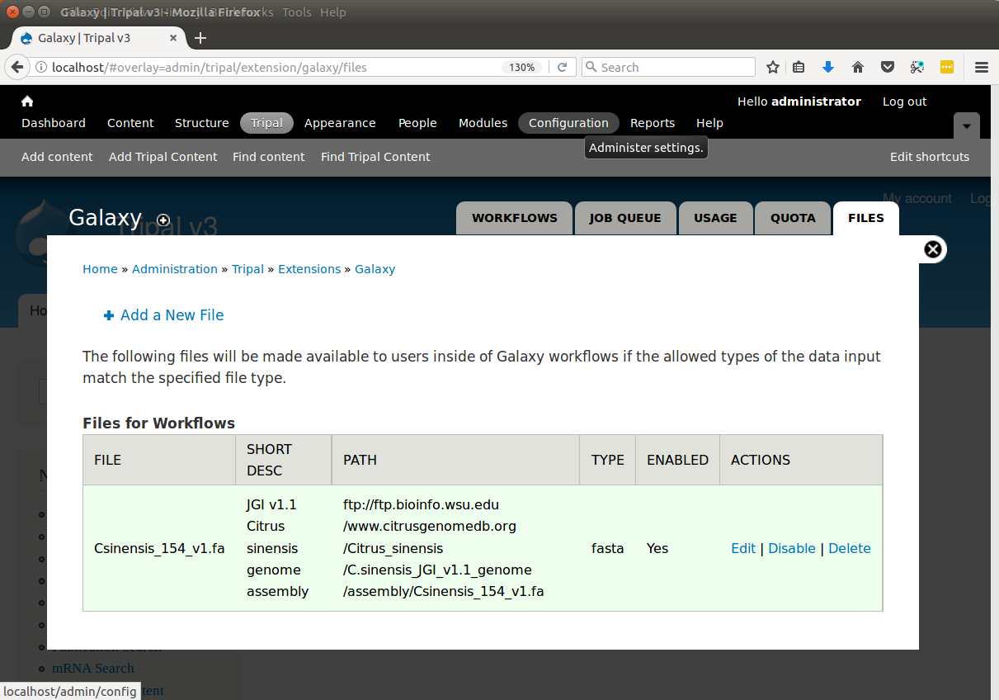

Site-wide Files
========================

The Galaxy workflows allow users to provide their own files, use Tripal data collections (i.e. data baskets) that they have saved or to use site-wide files that are provied by the site administrators.  These files can be used as input to the workflows provided to the user.  As an administrator, you can provide site-wide files for anyone to use in a Galaxy workflow by navigating to the Galaxy administrative page and clicking the **Files** tab near the top.   The following page appears:

Initially, there are no site-wide files available.  You can add a file (such as a whole genome assembly FASTA file) for use in workflows by clicking the **Add a New File** link. The following page appears.

Here you have two options for providing a file.  Either upload the file using the File Upload form or add the URL to the file if it is available from a remote source.  Typically files from remote sources are available with an HTTP URL or FTP URL.   For example, if your site provides whole genome data and the FASTA file for the genome assembly is available for retrieval from an FTP site, you should enter the full FTP URL for the file into the **Remote Path** field.  Next, you must provide the type of file.  Examples of file types include ``fasta``, ``fastq``, ``CSV``, etc.  You must provide a file type because Galaxy workflows sometimes require specific file types as input.  If an input requires a FASTA file then it expects a fasta file be provided.  Sometimes remote files do not have an appropriate extension to properly determine the file type. Therefore, you must indicate the file type.  Finally, the site's users should understand what the file is.  Enter a very brief description of the file to help users recognize what it contains.  When completed, click the Add File button.

In keeping with the example provided earlier in this User's Guide for Setup of an Example Genomics Site, the following screen shot shows a site-wide file for the JGI Citrus sinensis v1.1 assembly FASTA file that has been added.  Any workflow that expects a FASTA file as input will now be able to use this file in a workflow:

If you no longer need a specific file available for users you can either disable the file by clicking the **Disable** link in the Actions column, or you can delete the file by clicking the **Delete** link. Disabling the file will allow the file to remain as a site-wide file but exclude it from appearing for use in future workflow submissions.
