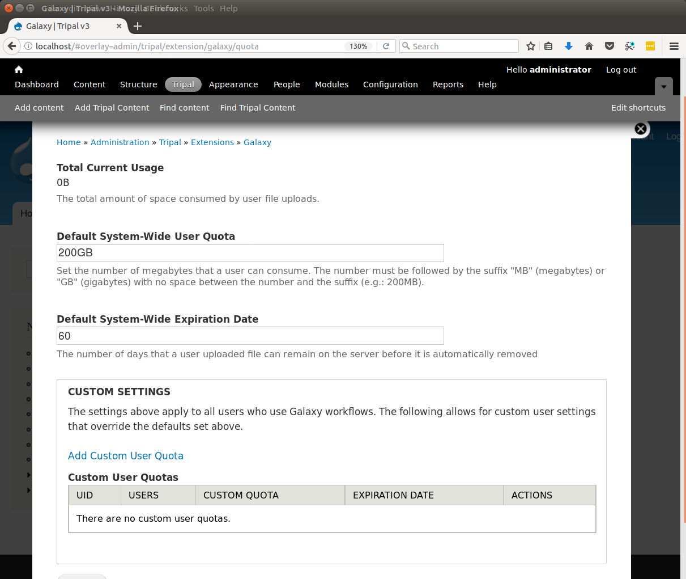

User Quotas
========================

One of the most important settings to configure is the quota system. This can be found on the **Quota** tab of the Galaxy Adminstrative page.  Typically, next-gen workflows require multiple large files.  Users will be able to select data available from this site for their workflows but they can also upload their own data.  To ensure that user's do not exceed the limits of the server a quota system is available.  Click the **Quota** tab to reveal the following page:

First, the total amount of space consumed by files uploaded for use in Galaxy workflows is shown at the top of the page.  Initially this will indicate 0 B (for zero bytes) as users upload files this statistic will change.  You may return to this page in the future to check how much space is currently used by user uploads. Here you can also specify the default system-wide quota that all users receive.  By default this is set to 64 Megabytes and a days to expiration of 60 days.  Once a file has existed on the site for 60 days the file is marked for deletion and will be removed when the Drupal cron is executed.  The default of 64MB per user is most likely too small for your site.  Adjust this setting and the days to expire as appropriate for your site's expected number of users and storage limitations and click the Save button to preserve any changes you have made.

In addition to the default settings for all users, you may want to allow specific users to have a larger (or perhaps smaller) quota.  You can set user-specific quotas by clicking the **Add Custom User Quota** link near the bottom of the page.   The following page appears:

.. image:: ./user_quotas.2.png

Here you must specify the Drupal user name of the user who should be granted a custom quota.  This field will auto populate suggestions as you type to help you find the correct username.  Enter the desired quota size and expiration days and click the **Submit** button. you will then see the user-specific quota listed in the table at the bottom of the page:

.. image:: ./user_quotas.3.png
