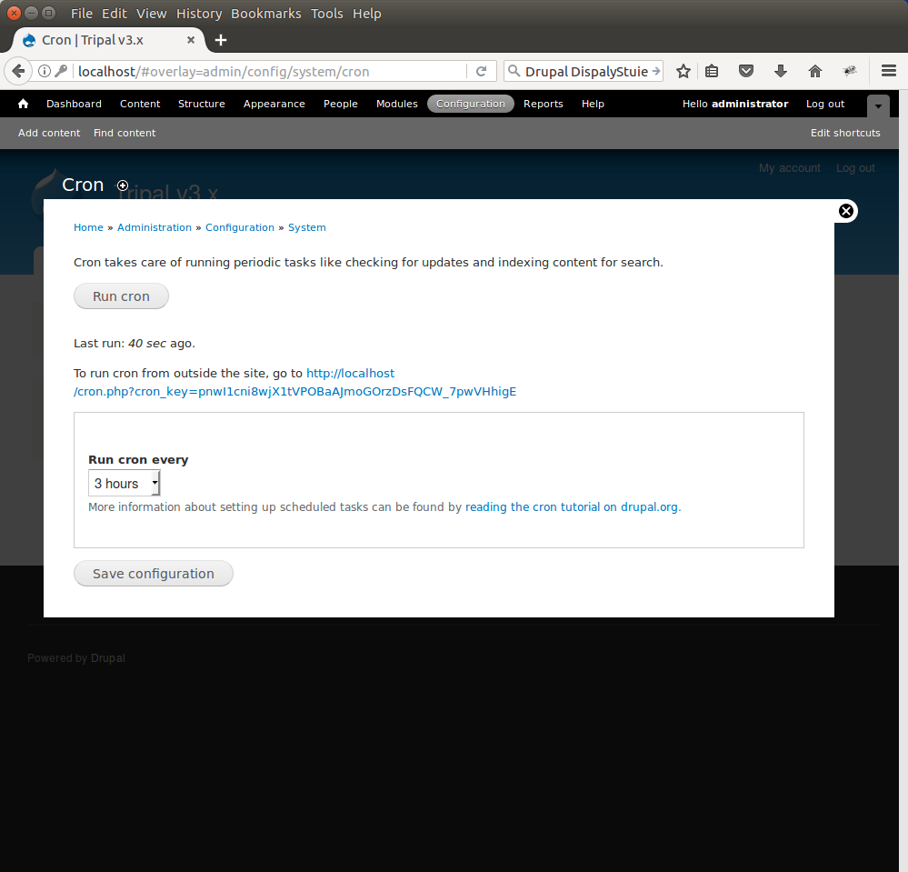

Automating Job Execution
========================================

.. note::

  Remember you must set the ``$DRUPAL_HOME`` environment variable if you want to cut-and-paste the commands below. See :doc:`./drupal_home`

The Drupal cron is used to automatically execute necessary Drupal housekeeping tasks on a regular interval.  You should *always* setup the Drupal cron to ensure your site checks for updates and security issues.  To do this, we want to integrate Drupal cron with the UNIX cron facility.  The UNIX cron will automatically execute commands on set regular intervals.  First, we must get the appropriate URL for the cron by navigating to **Configuration → Cron**. On this page you will see a link that we will use for cron:

.. warning::

  Be sure to edit the settings on the page and set the drop down value titled Run Cron Every to Never and save the configuration.   If we do not set this to Never then Drupal will run cron when user's visit the site and that may cause slowness.

Also, on that page is the URL for cron. In this example the URL is http://localhost/cron.php?cron_key=pnwI1cni8wjX1tVPOBaAJmoGOrzDsFQCW_7pw.

To add an entry to the UNIX cron we must use the crontab tool:

.. code-block:: bash

  sudo crontab -e

Add this line to the crontab:

.. code-block:: bash

  0,30 * * * * /usr/bin/wget -O - -q http://localhost/cron.php?cron_key=pnwI1cni8wjX1tVPOBaAJmoGOrzDsFQCW_7pwVHhigE

Now save the changes. We have now added a UNIX cron job that will occur every 30 minutes that will execute the cron.php script and cause Drupal to perform housekeeping tasks.

Automating Tripal Tasks
-----------------------
Many of the tasks that Tripal needs to perform can take some time to run.  Examples include loading of ontologies, publishing content, and importing data.  It is not practical for these tasks to run within the web browser. Therefore, Tripal provides a jobs management system.  When long-running tasks need execution a job is submitted and it waits in a queue until it is executed. There are several methods that can be used to help ensure jobs can be executed in a timely manner.

Option #1: Manual Execution of Jobs
^^^^^^^^^^^^^^^^^^^^^^^^^^^^^^^^^^^

Any job that is added to the Job's system can be run manually on the command line using a Drush command.  Throughout this tutorial instructions are provided to execute jobs manually.  Jobs in the queue can be executed using a Drush command similar to the following:

.. code-block:: bash

  drush trp-run-jobs --username=administrator --root=$DRUPAL_HOME

Remember to change the username from **administrator** to the name of the administrator on your site.

Option #2: Additional Cron Entry
^^^^^^^^^^^^^^^^^^^^^^^^^^^^^^^^

If you do not want to manually run every job that is added to Tripal's job system you can automate execution of the job by using the same cron system that Drupal uses for housekeeping steps. To do so, use the crontab Command to add a new line to the bottom of the cron setup:

.. code-block:: bash

  udo crontab -e

Add this line to the crontab:

.. code-block:: bash

  0,5,10,15,20,25,30,35,40,45,50,55 * * * * drush trp-run-jobs --username=administrator --root=$DRUPAL_HOME

Here, job execution will occur every 5 minutes.

Option #3:  Tripal Daemon Setup
^^^^^^^^^^^^^^^^^^^^^^^^^^^^^^^

Tripal version 3 has incorporated the Tripal Daemon module.  This module was previously an extension but is now part of the Tripal package.  The Tripal Daemon module will allow jobs to execute immediately upon submission, rather than waiting on the time set in the cron setup of option #2.  This can be especially useful when end-users submit jobs such as with the Tripal Blast UI module.   To enable the Tripal Daemon module use the following Drush command within your Drupal installation directory:

.. code-block:: bash

  drush pm-enable tripal_daemon

Further documentation for setup of the Tripal Daemon will appear here in the future.  For now, please see the :doc:`Job Management  </user_guide/job_management>` page for usage instructions.
