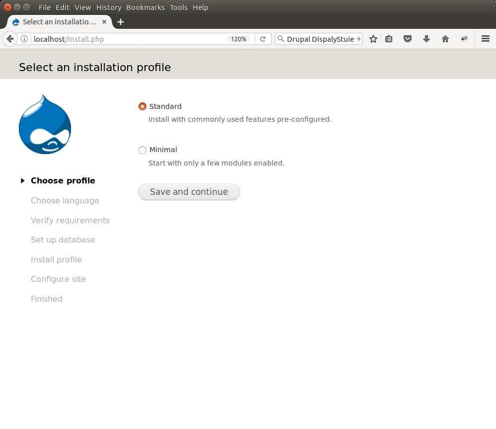
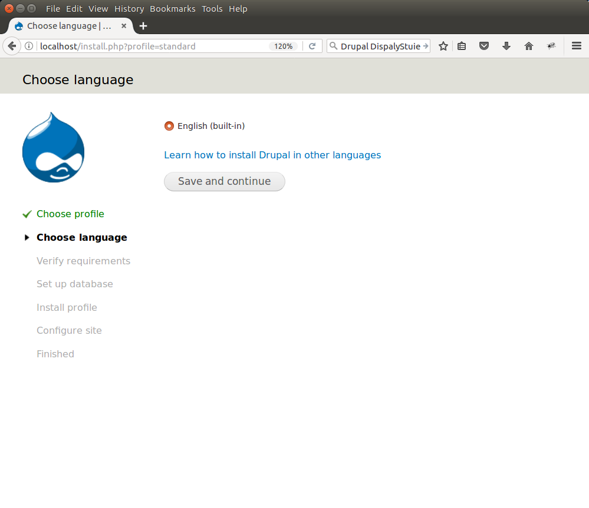
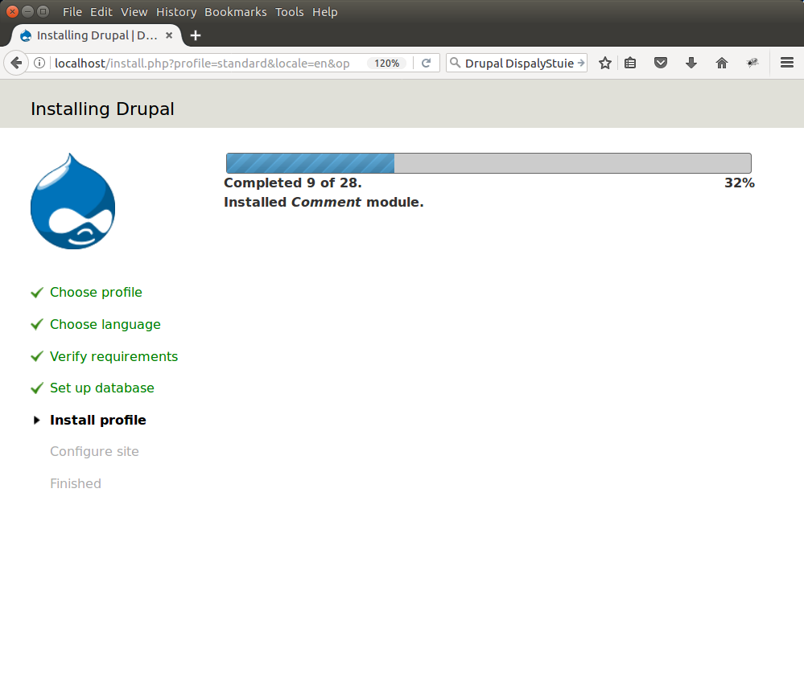
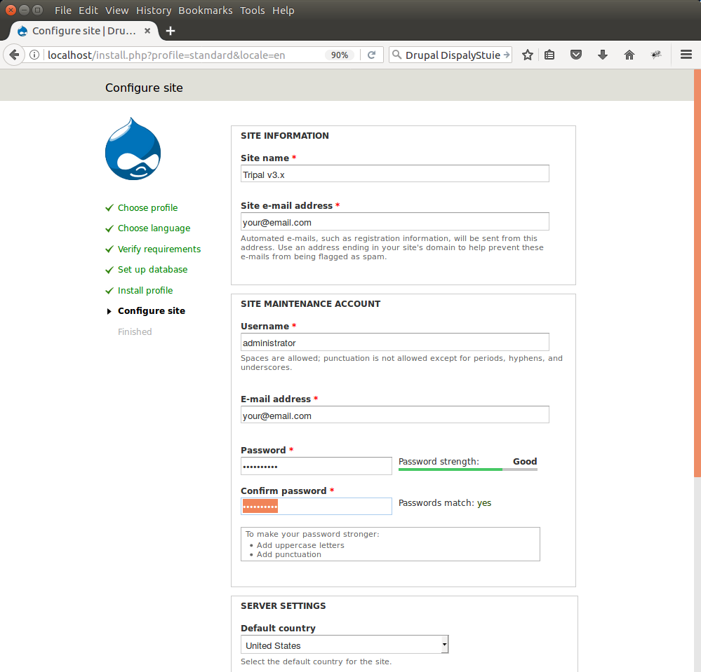
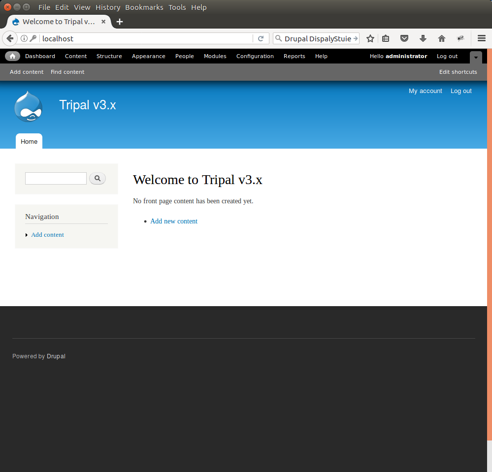

Drupal Installation
===================

Database Setup
--------------

Drupal can use a MySQL or PostgreSQL database but Chado prefers PostgreSQL so that is what we will use for both Drupal and Chado. We need to create the Drupal database. The following command can be used to create a new database user and database.

First, become the 'postgres' user:

.. code-block:: bash

  sudo su - postgres

Next, create the new 'drupal' user account. This account will not be a "superuser' nor allowed to create new roles, but should be allowed to create a database.

.. code-block:: bash

  createuser -P drupal

When requested, enter an appropriate password. Finally, create the new database:

.. code-block:: bash

  createdb drupal -O drupal

We no longer need to be the postgres user so exit

.. code-block:: bash

  exit

Software Installation
---------------------

.. note::

  Remember you must set the ``$DRUPAL_HOME`` environment variable if you want to cut-and-paste the commands below. See :doc:`../drupal_home`

Before we can install Drupal we must ensure that that we are allowed to add files into the root directory.  Select a user account that will be the owner of all web files and change the owner of the ``$DRUPAL_HOME`` directory to that user:

.. code-block:: bash

  sudo chown -R [user] $DRUPAL_HOME

Substitute [user] for the name of the user that will own the web files.

.. note::

  The apache web server runs as the user 'www-data'.  For security reasons you should chose a user other than 'www-data' to be the owner of the Drupal root directory.

Tripal 3.x requires version 7.x of Drupal. Drupal can be freely downloaded from the http://www.drupal.org website. At the writing of this Tutorial the most recent version of Drupal 7 is version 7.69. The software can be downloaded manually from the Drupal website through a web browser or we can use the ``wget`` command to retrieve it:

.. code-block:: bash

  cd $DRUPAL_HOME
  wget http://ftp.drupal.org/files/projects/drupal-7.69.tar.gz

Next, we want to install Drupal. We will use the tar command to uncompress the software:

.. code-block:: bash

  tar -zxvf drupal-7.69.tar.gz

Notice that we now have a drupal-7.69 directory with all of the Drupal files. We want the Drupal files to be in our document root, not in a 'drupal-7.69' subdirectory. So, we'll move the contents of the directory up one level:

.. code-block:: bash

  mv drupal-7.69/* ./
  mv drupal-7.69/.htaccess ./

If an index.html file is present (as is the case with Ubuntu installations) you can move it out of the way so that it does not interfere with Drupal by executing the following:

.. code-block:: bash

  mv index.html index.html.orig

.. note::

  It is extremely important the the hidden file ``.htaccess`` is also moved (note the second ``mv`` command above. Check to make sure this file is there:

  .. code-block:: bash

    ls -l .htaccess

Configuration File
------------------

Next, we need to tell Drupal how to connect to our database. To do this we have to setup a configuration file. Drupal comes with an example configuration file which we can borrow.

First navigate to the location where the configuration file should go:

.. code-block:: bash

  cd $DRUPAL_HOME/sites/default/

Next, copy the example configuration that already exists in the directory to be our actual configuration file by renaming it to ``settings.php``.

.. code-block:: bash

  cp default.settings.php settings.php

Now, we need to edit the configuration file to tell Drupal how to connect to our database server. To do this we'll use an easy to use text editor **gedit**.

.. code-block:: bash

  gedit settings.php

Find the following line

.. code-block:: php

  $databases = array();

and then insert the following array just after the above line:

.. code-block:: php

  $databases['default']['default'] = array(
    'driver' => 'pgsql',
    'database' => 'drupal',
    'username' => 'drupal',
    'password' => '********',
    'host' => 'localhost',
    'prefix' => '',
  );

Replace the text '********' with your database password for the user 'drupal' created previously.  Save the configuration file and close the editor.

Files Directory Creation
--------------------------

Finally, we need to create the directory where Drupal will have write-access to add files.  By default, Drupal expects to have write permission in the ``$DRUPAL_HOME/sites/default/files`` directory.  Therefore, we will set group ownership of the directory to the group used by the Apache web server.  This will be the user that Drupal uses to write files.

.. code-block:: bash

  mkdir -p $DRUPAL_HOME/sites/default/files
  sudo chgrp [group] $DRUPAL_HOME/sites/default/files
  sudo chmod g+rw $DRUPAL_HOME/sites/default/files

Substitute [group] for the name of the web server's group.  In Ubuntu this is www-data in CentOS this is apache. The above commands creates the directory, sets the group ownership for group, and gives read/write permissions to the group on the directory.

Web-based Steps
---------------

Navigate to the installation page of our new web site http://localhost/install.php

Ensure that Standard is selected and click **Save and Continue**. You will next be asked to select the language you want to use. Choose **English**:

Next, you will see a progress bar as Drupal is installed.

Once it completes, a configuration page with some final settings will be visible.

Here you will provide details appropriate for your site, including your site name and administrative password.  If you are experimenting with Tripal the following values can be used:

- Site Information
  - Site Name: Tripal 3.x
  - Site email: Your email address
- Site Maintenance Account
  - Username: administrator (all lower-case)
  - Email: Your email address
  - Password: ********
- Server Settings
  - Default country: (wherever the site is located)
  - Default time zone: (your time zone)
- Update Notifications (both boxes checked)

Now, click the **Save and Continue** button. You will see a message about unable to send an email. This is safe to ignore for the tutorial, but for a production site you will need that your server can send emails to a service provider. Now, your site is enabled. Click the link Your new site:

