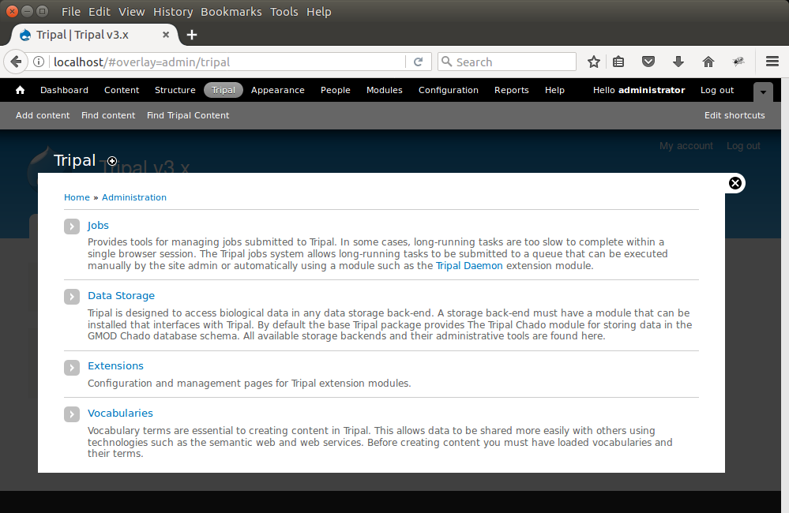
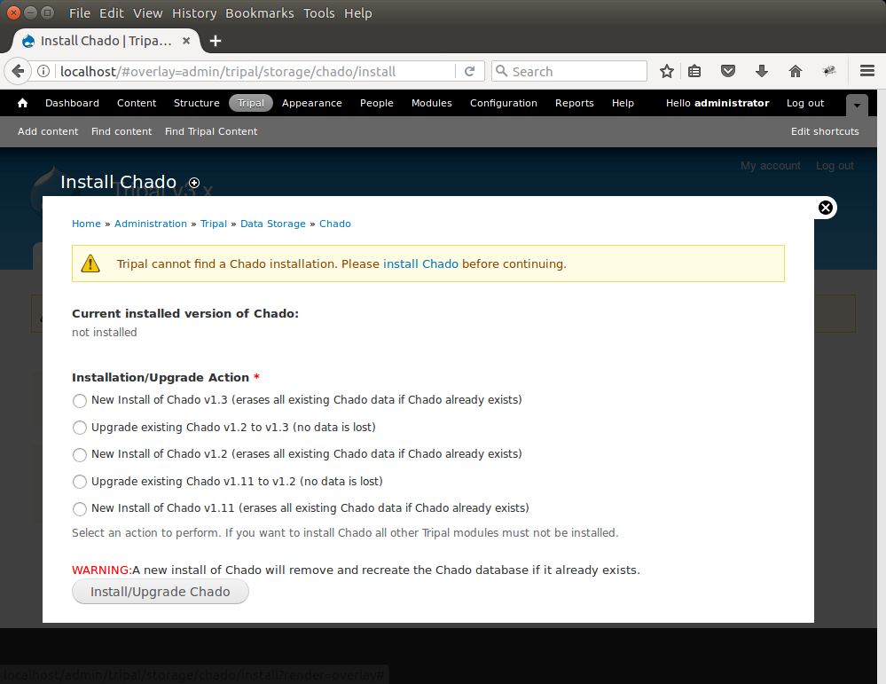
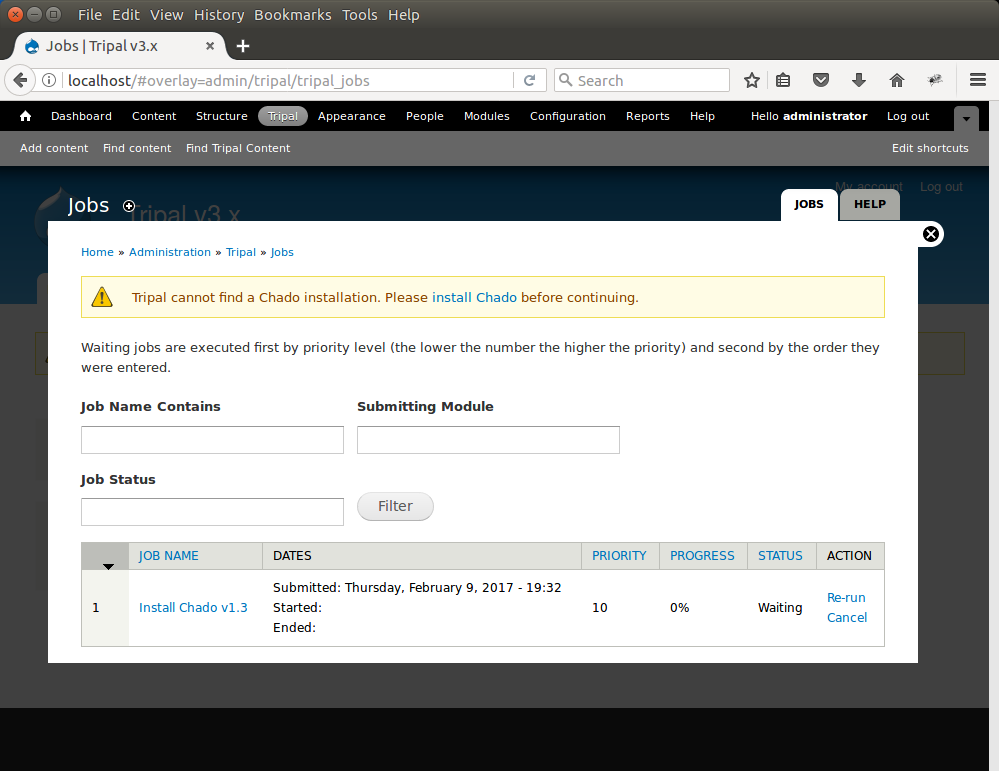
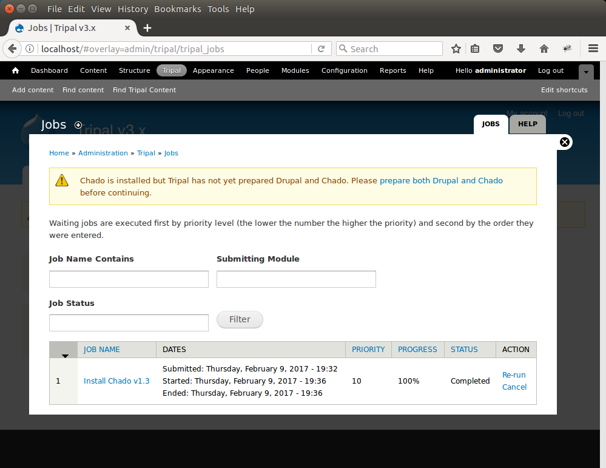
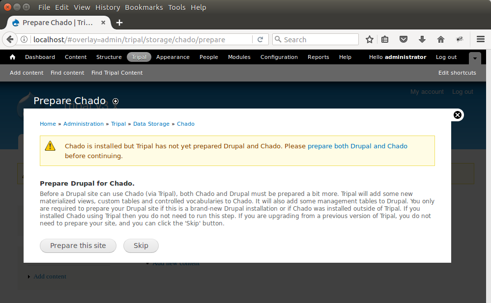
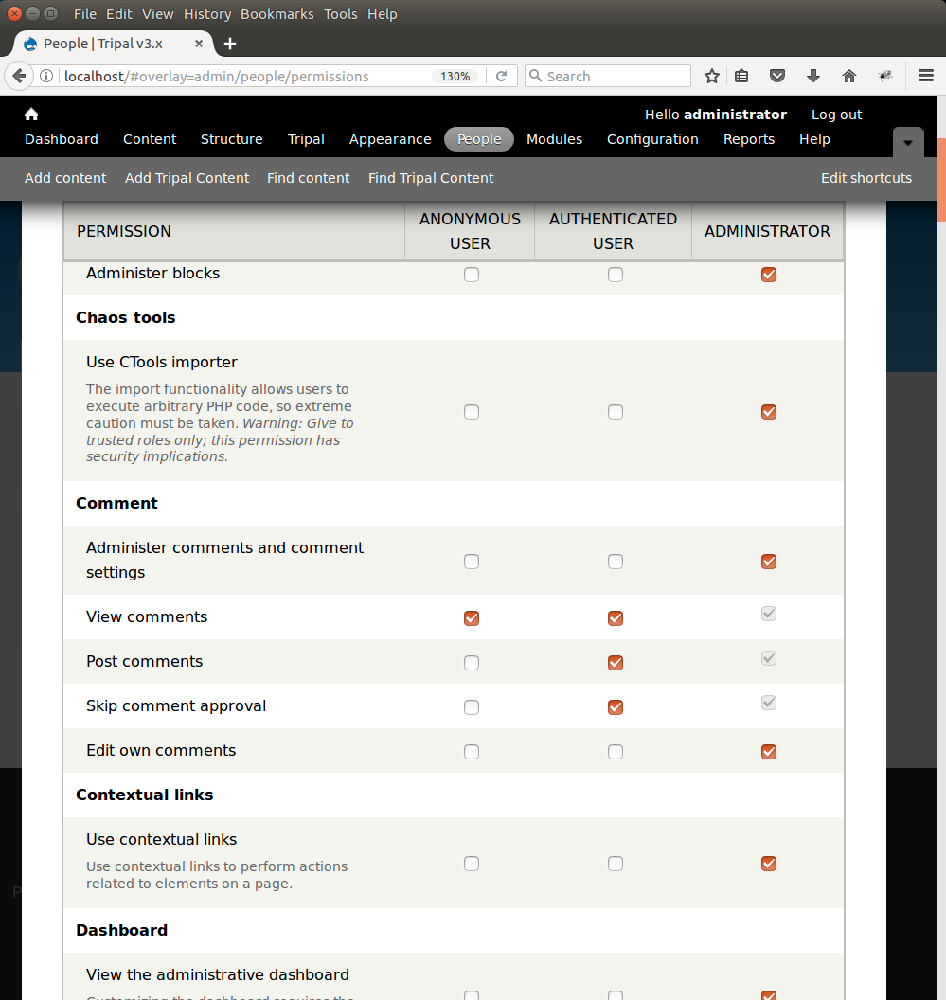
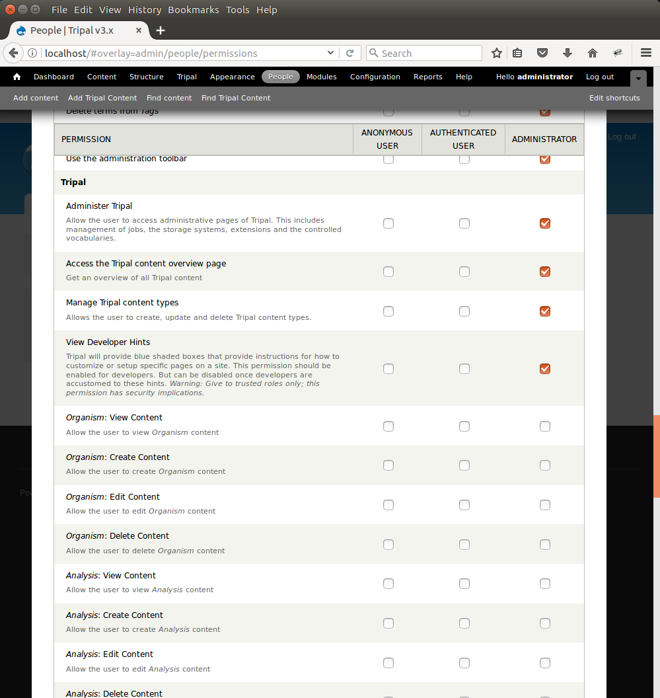

Tripal Installation
===================

.. note::

  Remember you must set the ``$DRUPAL_HOME`` environment variable if you want to cut-and-paste the commands below. See :doc:`../drupal_home`

Before installation of Tripal, you must first have a working Drupal installation.  Please see the previous section of this tutorial for step-by-step examples for server setup and Drupal installation instructions.  After installation of Tripal, you may install any Tripal extension modules you may want.

Download Tripal
---------------

The easiest way to download Tripal is to use the Drush command-line interface for Drupal.  If you do not have Drush please see the Drush installation section of this tutorial.  To download using drush follow these steps:

- Chage directories to your Drupal installation
- Execute the following drush command

  .. code-block:: bash

    drush pm-download tripal

Alternatively, you can download Tripal using the Drupal web interface as per the instructions provided on the `Installing modules <https://www.drupal.org/documentation/install/modules-themes/modules-7>`_ documentation at Drupal.org.  The Tripal project page at Drupal.org can be found here:  https://www.drupal.org/project/tripal.

Apply Patches
-------------

A bug exists in Drupal related to the bytea data type in PostgreSQL. At the writing of this document, a fix is not yet incorporated into Drupal, but a patch has been provided. Execute the following commands to patch Drupal:

.. code-block:: bash

  cd $DRUPAL_HOME
  wget --no-check-certificate https://drupal.org/files/drupal.pgsql-bytea.27.patch
  patch -p1 < drupal.pgsql-bytea.27.patch

There is also a bug in the Drupal Views 3.0 code that prevents Tripal's administrative and search data views from functioning. The patch is provided within the tripal_views module. To apply the patch execute the following:

.. code-block:: bash

  cd $DRUPAL_HOME/sites/all/modules/views
  patch -p1 < ../tripal/tripal_chado_views/views-sql-compliant-three-tier-naming-1971160-30.patch

Install Tripal
--------------

The process for enabling the Tripal modules is the same as for the **ctools** and **views** modules that were enabled previously. To install the Tripal package, enter the following command:

.. code-block:: bash

  drush pm-enable tripal

Tripal v3 is designed to be data store agnostic, therefore any data store with a compatible module can be used.  By default, Tripal supports Chado and a Tripal Chado module is provided.  Perform the same steps as before to enable the Tripal Chado module:

.. code-block:: bash

  drush pm-enable tripal_chado

There are two more important Tripal modules:  **tripal_ds** and **tripal_ws**. These modules provide default layouts  for content (tripal_ds) and RESTful web services (tripal_ws).  Neither of these modules are required, however without the default layouts content pages will be less attractive without manual organization.  With web services you can share the content of your site that will allow remote software developers to access data programmatically.  The Tripal Web Services module also will allow integration of data from other Tripal sites with this site.  To enable both default layouts and web services use the following command:

.. code-block:: bash

  drush pm-enable tripal_ds tripal_ws

Returning to the website, a new **Tripal** menu item appears at the top in the Administrative menu. Clicking the **Tripal** menu item reveals the Tripal administrative menu which contains four sections:  Jobs, Data Storage, Extensions and Vocabularies.  Each section will be described later in this guide.

Because we have the Tripal Chado module enabled we will find a link to manage the Chado setup under the **Tripal → Data Storage** section.  Notice the warning message indicating the Chado installation cannot be found.  This is because the Chado schema has not yet been installed.  The Chado schema is not automatically installed into the relational database (i.e. PostgreSQL).  This is because Chado can be installed separately outside of Tripal and therefore Tripal does not try to overwrite it if it already exists.  It is left to the site developer to consciously install Chado.  To install Chado, navigate to **Tripal → Data Storage → Chado → Install Chado**.  For this User's Guide it is assumed that Chado is not installed.  Select the option to install Chado v1.3 and click the button Install/Upgrade Chado.

After the button is clicked a message will appear stating "Job 'Install Chado v1.3' submitted.". Click the jobs page link to see the job that was submitted:

The job is waiting in the queue until the Tripal jobs system wakes and tries to run the job. The jobs management subsystem allows modules to submit long-running jobs, on behalf of site administrators or site visitors. Often, long running jobs can time out on the web server and fail to complete. The jobs system runs separately in the background. In the example above we now see a job for installing Chado. The job view page provides details such as the name of the job, dates that the job was submitted and job status.

Jobs in the queue can be executed using drush to manually launch the job:

.. code-block:: bash

  drush trp-run-jobs --username=administrator --root=$DRUPAL_HOME

As the installation of Chado proceeds, we should see output on the terminal console indicating the progress of the installation.  You should see output similar to the following:

::

  Tripal Job Launcher
  Running as user 'administrator'
  -------------------
  2018-06-29 16:28:38: There are 1 jobs queued.
  2018-06-29 16:28:38: Job ID 1.
  2018-06-29 16:28:38: Calling: tripal_chado_install_chado(Install Chado v1.3)
  Creating 'chado' schema
  Loading sites/all/modules/tripal/tripal_chado/chado_schema/default_schema-1.3.sql...
  Install of Chado v1.3 (Step 1 of 2) Successful!
  Loading sites/all/modules/tripal/tripal_chado/chado_schema/initialize-1.3.sql...
  Install of Chado v1.3 (Step 2 of 2) Successful.
  Installation Complete

We now see that the job has completed when refreshing the jobs management page:

Prepare Chado and Drupal
------------------------

To complete the installation of Chado we must prepare it for use with Tripal.  Notice in the screen shot above the message indicates that "Chado is installed by Tripal has not yet prepared Drupal and Chado....".  We must prepare Chado and Drupal before continuing.  To do this, click the link titled **prepare both Drupal and Chado**.  The following page appears:

To prepare the site click the button Prepare this site.   A new job is added to the jobs queue.  Jobs in the queue can be executed using drush to manually launch the job:

.. code-block:: bash

  drush trp-run-jobs --username=administrator --root=$DRUPAL_HOME

.. note::

  Preparing Chado may take several minutes to complete.   This is because the Sequence Ontology is automatically downloaded and installed into Chado as well as a few other vocabularies.

Set Permissions
---------------

Because we are logged on to the site as the administrator user we are able to see all content. However, Drupal provides user management and permissions tools that allows the site admin to set which types of users can view the content on the site. By default there are three types of users anonymous,  authenticated and the administrator. For this tutorial we want to set permissions so that anonymous visitors to the site can see the genomics content. To do this, navigate to **People → Permissions**. Here you will see permissions for all types of content.

Preparing Chado and Drupal in a previous step resulted in the automatic creation of some commonly used content types such as Organism, Analysis, Gene, mRNA, Map, Publication, and others.   You can control who can view, create, edit and delete these types of content  types, as well as set some administrative permissions if needed. On the Permission page, scroll down to the Tripal section.  Here you will see permissions that you can set per type of user:

Review these permissions and set them according to how you want content to be managed.  Typically, the administrator user receives all permissions, and anonymous and authenticated users receive 'View' permissions for all content types.  If you desire to create other types of users, Drupal allows you to do this by creating new types of roles.  For example, if you know that some users will be responsible for curating content, then you may add a curator role by clicking the **Roles** link in the top right corner of this permissions page.  After the new role is created you can return to the permission page to set the permissions accordingly.
