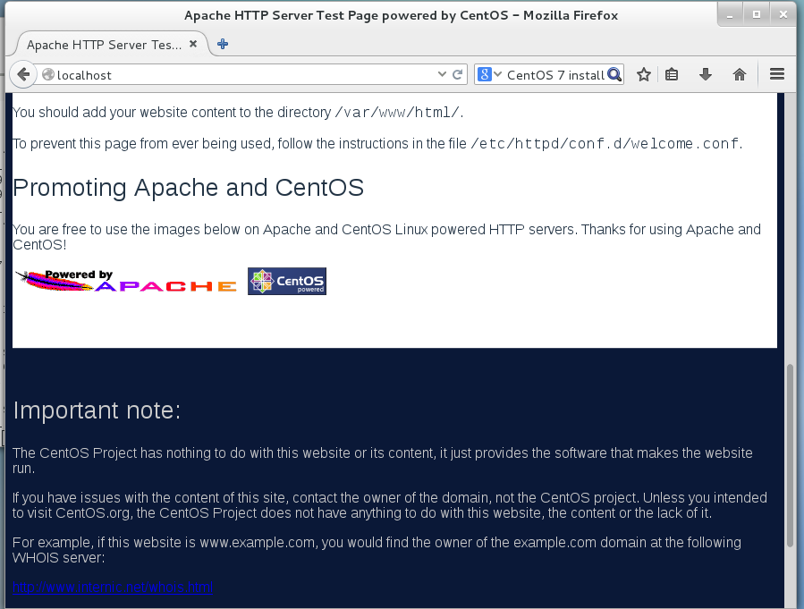
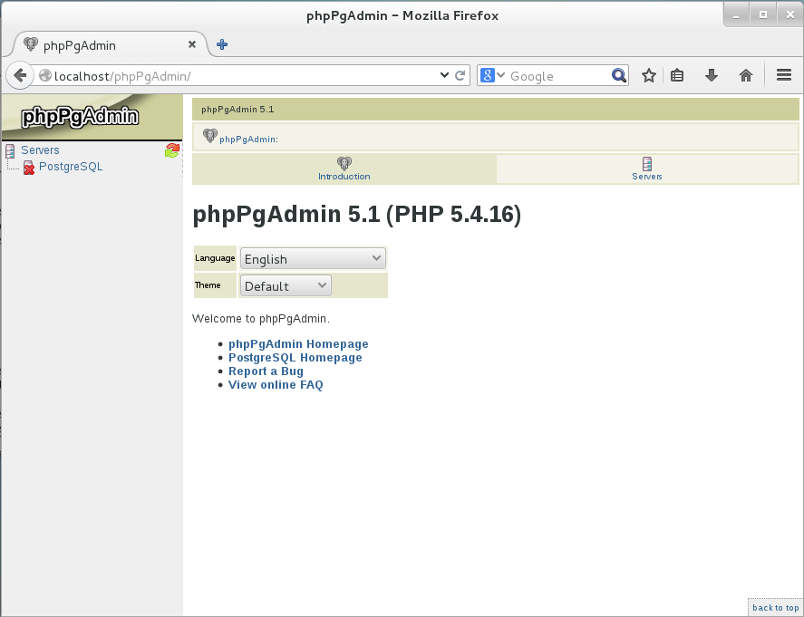

Server Setup (CentOS 7)
=======================

.. note::

  Tripal can be installed on multiple UNIX/Linux based systems. These instructions are for just CentOS 7.  However, this guide provides
  instructions for a several systems. Please choose the one that best suits your needs.  If you install on a different platform please consider sharing your notes and experience to add to this guide!

The following sections provide step-by-step instructions for installation of Tripal on a CentOS 7 server.  They provide details for setup of the server, including installation of the Apache web server and the PostgreSQL database server; installation of Drupal; installation of Drush, the command-line interface for Drupal; prerequisites for Tripal; and installation of Tripal within Drupal.

CentOS 7 Installation
---------------------

Please follow the online instructions for download and installation of CentOS 7.   The CentOS installation must have the following:

- A user account with administrative access (i.e. sudo privilege).
- A graphical desktop.
- An installed web browser.
- The "Development Tools" should be installed.  To install the development tools issue this command:

  .. code-block:: bash

    sudo yum groupinstall "Development Tools"

- A graphical text editor such as 'gedit'.  To Install gedit issue this command:

  .. code-block:: bash

    sudo yum install gedit

- The 'wget' utilty for retrieving files from remote web services.  To install wget issue this command:

  .. code-block:: bash

    sudo yum install wget

The tutorial below will provide the necessary steps to install the server components needed.   If you are using this tutorial to test Tripal you can use a virtual machine such as the `Oracle VirtualBox <https://www.virtualbox.org/>`_ or `VMWare <http://www.vmware.com/>`_.  The virtual machine allows you to install Ubuntu as a "guest" operating system within your existing "host" operating system (e.g. Windows).

Apache Installation
-------------------

Apache is the web server software.  CentOS simplifies the installation of Apache using the 'yum' utility.  To do so, simply issue the following command:

.. code-block:: bash

  sudo yum install httpd

Then start the web server

.. code-block:: bash

  sudo systemctl start httpd.service

Execute the following to ensure that the Apache server is started automatically if the server reboots:

.. code-block:: bash

  sudo systemctl enable httpd.service

Apache should now be installed. On the server, navigate to your new website using this address: http://localhost/. You should see the following page:

Next we need to edit the web site configuration file.  The configuration file specific for the default website is found here: /etc/httpd/conf/httpd.conf. Drupal needs permission to override some default restrictions set by the Apache web server, but it only needs to do so in the directory where it will be installed.  By default in CentOS 7, the web document root is the /var/www/html directory.  This is where all web files will be placed.  Therefore, we need to adjust the default settings for that directory for Drupal.  To do so, edit this file using the 'gedit' graphical text editor (should be previously installed). Because this file is owned by the 'root' user, we must use the 'sudo' command to run 'gedit' with administrative privileges:

.. code-block:: bash

  sudo gedit /etc/httpd/conf/httpd.conf

Find the Directory stanza for the /var/www/html directory and edit it so that it looks like the following:

.. code-block:: bash

  <Directory /var/www/html>
      Options Indexes FollowSymLinks MultiViews
      AllowOverride All
      Order allow,deny
      allow from all
  </Directory>

Now restart your Apache again.

.. code-block:: bash

  sudo systemctl restart httpd.service

Setup PHP
---------

Drupal uses PHP.   In CentOS there are two different instances of PHP that will be installed: a version for apache and another for use on the command-line. To install PHP we can use 'yum' utility:

.. code-block:: bash

  yum install php

Next, we need a few additional extension modules for PHP that support connection to a PostgreSQL database server, the GD graphics library and a few others:

.. code-block:: bash

  sudo yum install php-gd php-pgsql php-mbstring php-xml

PHP is now installed.  Before  continuing we must make a few changes to the PHP configuration file.  PHP will limit the amount of memory that a script can consume.  By default this limit is too low the Apache configuration of PHP.  For Tripal we need that limit to be higher.  To change it, edit the /etc/php.ini configuration file:

.. code-block:: bash

  sudo gedit /etc/php.ini

Within that file, find the setting titled,  memory_limit, and change it to something larger than 128M.  For this tutorial we will set the limit to be 2048M, but be sure not to exceed physical memory of your machine:

.. code-block:: php

  memory_limit = 2048M

Now, restart the webserver so that it picks up the new changes to the PHP settings.

.. code-block:: bash

  sudo systemctl restart httpd.service

PostgreSQL Server
-----------------

PostgreSQL is the database software that will be used to house both the Drupal and Tripal databases.  PostgreSQL can be installed on CentOS 7 simply by issuing the following command.

.. code-block:: bash

  sudo yum install postgresql-server

Next, initialize the PostgreSQL database:

.. code-block:: bash

  sudo postgresql-setup initdb

PostgreSQL database server is now installed and setup with default options.  However, it currently does not allow connections.  We want to allow at least connections from the local machine.  To do this, edit the /var/lib/pgsql/data/pg_hba.conf file:

.. code-block:: bash

  sudo gedit /var/lib/pgsql/data/pg_hba.conf

And set the following to allow connections from the localhost:

.. code-block:: bash

  # IPv4 local connections:
  host    all             all             127.0.0.1/32            md5
  # IPv6 local connections:
  host    all             all             ::1/128                 md5

Be sure that any previous "host" lines are commented out by adding a '#' symbol in front.  Next, start up the PostgreSQL server

.. code-block:: bash

  systemctl start postgresql.service

Finally execute the following to ensure that the PostgreSQL server is started automatically if the server reboots:

.. code-block:: bash

  systemctl enable postgresql.service

SE-Linux Configuration
----------------------

SE-Linux is short for Security Enhanced Linux.  It comes installed in RedHat flavors of Linux (such as CentOS).  It provides access control mechanisms.  If your operating system comes with SE-Linux you will want to change the security context for the web files and associate those with the web server.  The following command can be executed to allow that:

.. code-block:: bash

  sudo chcon -R -t httpd_sys_content_rw_t /var/www/html

Additionally, we need to allow web scripts and modules to connect to database servers.

.. code-block:: bash

  setsebool -P httpd_can_network_connect_db on

Install phpPgAdmin (Optional)
-----------------------------

phpPgAdmin is a web-based utility for easy administration of a PostgreSQL database.  PhpPgAdmin is not required for successful operation of Tripal but is very useful.   First, we need to install the Extra Packages for Enterprise Linux (EPEL) library.  This library contains many compatible packages including phpPgAdmin. This can be done with the following command:

.. code-block:: bash

  rpm -Uvh http://mirror.pnl.gov/epel/7/x86_64/e/epel-release-7-5.noarch.rpm

Next, phpPgAdmin can be easily installed with a 'yum' command:

.. code-block:: bash

  sudo yum install phpPgAdmin

Next, we need to configure phpPgAdmin.  To do this, Edit  the /etc/phpPgAdmin/config.inc.php file.

.. code-block:: bash

  sudo gedit /etc/phpPgAdmin/config.inc.php

Within this file, add "localhost" in the following server parameter:

.. code-block:: bash

  $conf['servers'][0]['host'] = 'localhost';

Now navigate to the URL http://localhost/phpPgAdmin and you should see the following:

Now, phpPgAdmin is available for access only on the local installation of the machine. It will not be available via remote connections.
