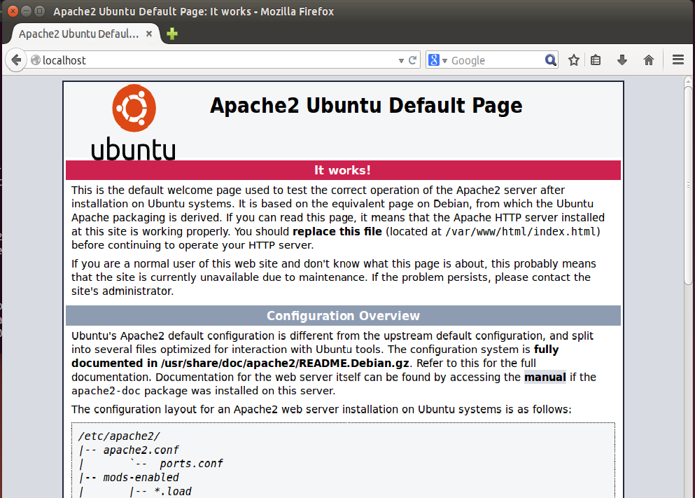
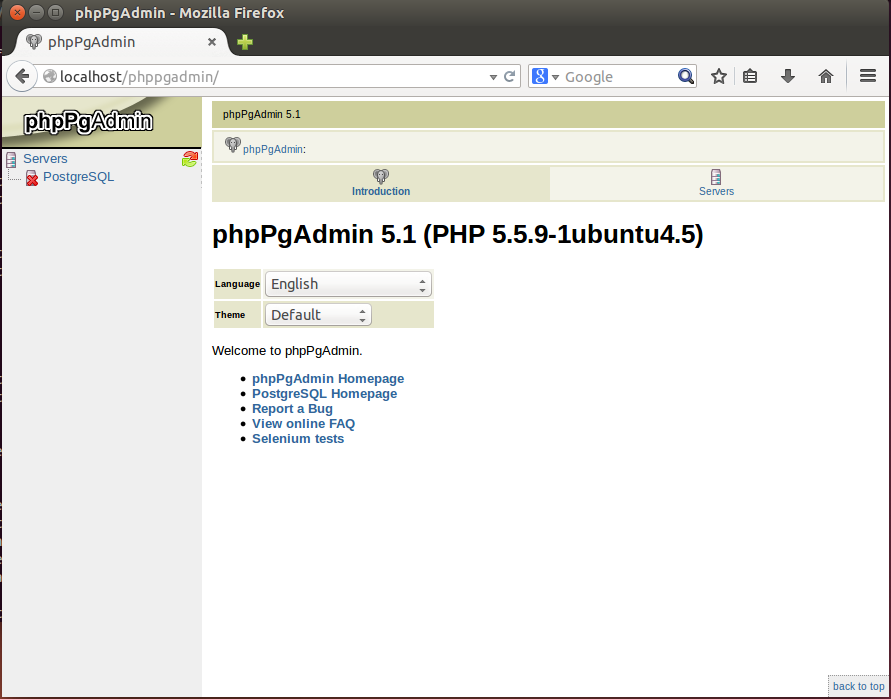

Server Setup (Ubuntu 18.04 LTS)
===============================

.. note::

  Tripal can be installed on multiple UNIX/Linux based systems. These instructions are for just Ubuntu 18.04.  However, this guide provides
  instructions for a several systems. Please choose the one that best suits your needs.  If you install on a different platform please consider sharing your notes and experience to add to this guide!

The following instructions are for setup of Tripal on an Ubuntu version 18.04 LTS Desktop edition. Ubuntu v18.04 is a long-term support version of Ubuntu, meaning that Ubuntu guarantees patches and security fixes for up to five years.  These instructions do not provide guidance for proper configuration settings for the server to handle load, nor for security settings.   Consult the software documentation for proper load handling and security settings before your site is made public.

Ubuntu Installation
-------------------

Please follow the online instructions for download and installation of Ubuntu 18.04 Desktop edition.   Please be sure to install the 'Desktop' edition rather than the 'Server' edition.  The tutorial below will provide the necessary steps to install the server components needed.   If you are using this tutorial to test Tripal you can use a virtual machine such as the `Oracle VirtualBox <https://www.virtualbox.org/>`_ or `VMWare <http://www.vmware.com/>`_.  The virtual machine allows you to install Ubuntu as a "guest" operating system within your existing "host" operating system (e.g. Windows).

Apache Setup
------------

Apache is the web server software.  Ubuntu simplifies the installation of Apache using the 'apt-get' utility.  To do so, simply issue the following command:

.. code-block:: bash

   sudo apt-get install apache2

Apache should now be installed. On the Ubuntu server, navigate to your new website using this address: http://localhost/. You should see the following page:

Drupal works best with the Apache rewrite module enabled. Within the Ubuntu server,  pluggable modules are available in the Apache configuration directory named /etc/apache2/mods-available. Only those modules that are also available in the /etc/apache2/mods-enabled directory will be loaded and used by Apache.  Therefore, we want to create a symbolic link for the rewrite module that essentially adds it to the /etc/apache2/mods-enabled directory.  To do this execute the following on the command-line:

.. code-block:: bash

   cd /etc/apache2/mods-enabled
   sudo ln -s ../mods-available/rewrite.load

Next we need to edit the web site configuration file.  The configuration file specific for the default website is found here: /etc/apache2/sites-available/000-default.conf. Drupal needs permission to override some default restrictions set by the Apache web server, but it only needs to do so in the directory where it will be installed.  By default in Ubuntu 18.04, the web document root is the /var/www/html directory.  This is where all web files will be placed.  Therefore, we need to adjust the default settings for that directory for Drupal.  To do so, edit this file using the 'gedit' graphical text editor that comes with Ubuntu. Because this file is owned by the 'root' user, we must use the 'sudo' command to run 'gedit' with administrative privileges:

.. code-block:: bash

   sudo gedit /etc/apache2/sites-available/000-default.conf

Add the following Directory inside the VirtualHost stanza.

.. code-block:: bash

   <Directory /var/www/html>
      Options Indexes FollowSymLinks MultiViews
      AllowOverride All
      Order allow,deny
      allow from all
   </Directory>

Now restart your Apache again.

.. code-block:: bash

  sudo service apache2 restart

Setup PHP
---------

Drupal uses PHP.   In Ubuntu 18.04 there are two different instances of PHP that will be installed: a version for apache and another for use on the command-line. To install PHP we can use Ubuntu's apt-get utility.

.. code-block:: bash

  sudo apt-get install php php-dev php-cli libapache2-mod-php php7.2-mbstring

You may notice that installing the libapach2-mod-php module will automatically restart the Apache web server which will allow it to parse PHP files.  Next, we need a few additional extension modules for PHP that support connection to a PostgreSQL database server, JSON and the GD graphics library:

.. code-block:: bash

  sudo apt-get install php-pgsql php-gd php-xml

PHP is now installed both for Apache and for use on the command-line.  Before  continuing we must make a few changes to the PHP configuration files.  PHP will limit the amount of memory that a script can consume.  By default this limit is too low the Apache configuration of PHP.  For Tripal we need that limit to be higher.  To change it, edit the /etc/php5/apache2/php.ini configuration file:

.. code-block:: bash

  sudo gedit /etc/php/7.2/apache2/php.ini

Within that file, find the setting titled,  memory_limit, and change it to something larger than 128M.  For this tutorial we will set the limit to be 2048M, but be sure not to exceed physical memory of your machine:

.. code-block:: php

  memory_limit = 2048M

Now, restart the webserver so that it picks up the new changes to the PHP settings.

.. code-block:: bash

  sudo service apache2 restart

PostgreSQL Server
-----------------

PostgreSQL is the database software that will be used to house both the Drupal and Tripal databases.  PostgreSQL can be installed on Ubuntu 18.04 simply by issuing the following command.

.. code-block:: bash

  sudo apt-get install postgresql

PostgreSQL database server is now installed and setup with default options.

Install phpPgAdmin (Optional)
-----------------------------

phpPgAdmin is a web-based utility for easy administration of a PostgreSQL database.  PhpPgAdmin is not required for successful operation of Tripal but is very useful.  It can be easily installed with an 'apt-get' command:

.. code-block:: bash

  sudo apt-get install phppgadmin

Now navigate to the URL http://localhost/phppgadmin and you should see the following:

Now, phpPgAdmin is available for access only on the local installation of the machine. It will not be available via remote connections.
