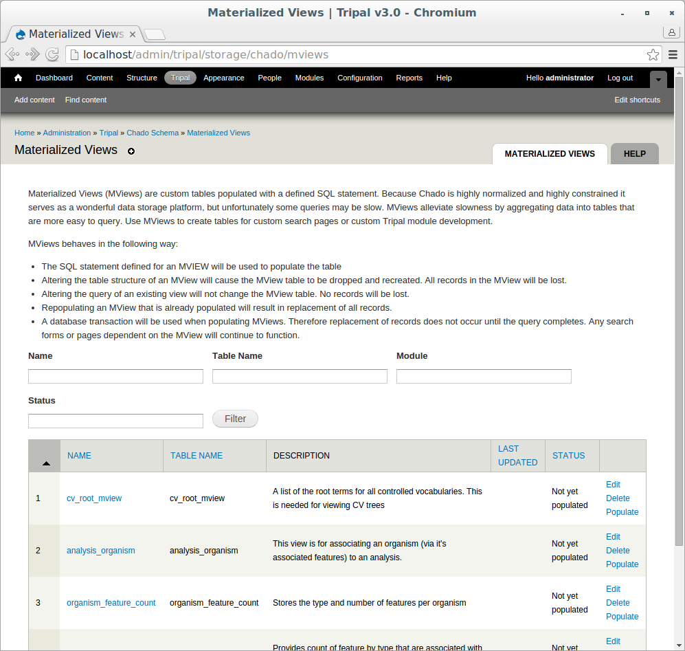

Materialized Views
==================

.. note::

  Remember you must set the ``$DRUPAL_HOME`` environment variable if you want to cut-and-paste the commands below. See :doc:`./install_tripal/drupal_home`

Chado is efficient as a data warehouse but queries can become slow depending on the type of query. To help simplify and speed up these queries, materialized views can be employed. For a materialized view, a new database table is created and then populated with the results of a pre-defined SQL query. This allows you to execute a much simpler and faster query on the materialized view when producing user pages. A side effect, however is redundant data, with the materialized view becoming stale if not updated regularly.

Tripal provides a mechanism for populating and updating these materialized views. These can be found on the **Tripal → Data Storage → Chado -> Materialized Views** page.

Here we see several materialized views. These were installed automatically by the Tripal Chado module. To update these views, click the **Populate** link for each one.

This will submit jobs to populate the views with data. Now, run the jobs:

.. code-block:: shell

  cd $DRUPAL_HOME
  drush trp-run-jobs --user=administrator

You can now see that all views are up-to-date on the **Materialized Views Page**. The number of rows in the view table is shown.
