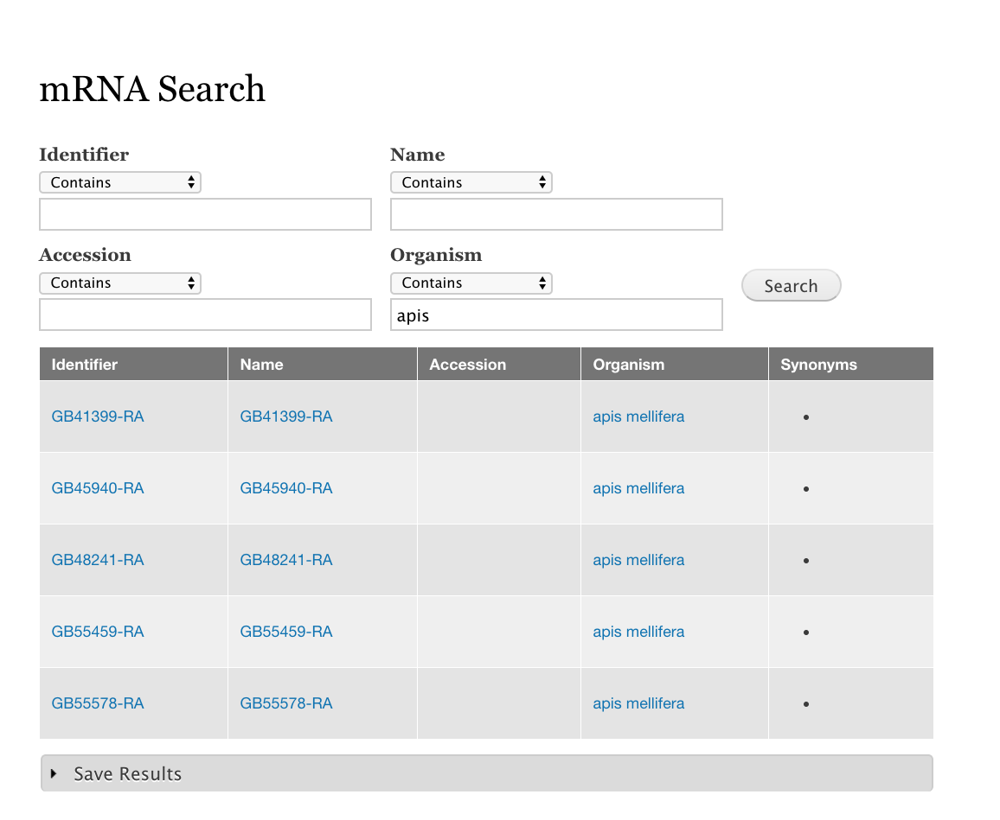

Tripal Content-Specific Search Tools
========================================

By default, Tripal will provide a search tool for every Tripal content type.  When a new content type is created, a new search tool is automatically created for that tool.

These search tools will be available at ``/data_search/[content label]``, such as ``/data_search/mrna``.

If you have the ``view_ui`` module enabled, you can find a list of all search views under **Structure --> Views**.

  An example search with the default mRNA content type.  Results are sortable by clicking the column name.
