Search API Module: Site-Wide Searching
========================================

Installing Drupal Search API
----------------------------

- `Search API <https://www.drupal.org/project/search_api>`_: This module provides an interface for much more powerful, efficient searching than the Drupal core search module. Specifically, it allows you to use more powerful engines such as `Elastic Search <https://www.drupal.org/project/search_api_elasticsearch>`_ and `Apache Solr <https://www.drupal.org/project/search_api_solr>`_, as well as, advanced features such as facets (for narrowing down search results based on fields or entity type), fuzzy search, etc.
- `Search API Database Service <https://www.drupal.org/project/search_api_db>`_: This module provides a Search Backend/Server defining how your search index should be stored. Specifically, it just stores the index in your current drupal database.

Install the **Search API** and **Database search** modules as you would any other Drupal module. This can be done using Drupal's module installation page as shown in the screenshot below. For installation instructions reference the `Drupal.org Tutorial <https://www.drupal.org/documentation/install/modules-themes/modules-7>`_.

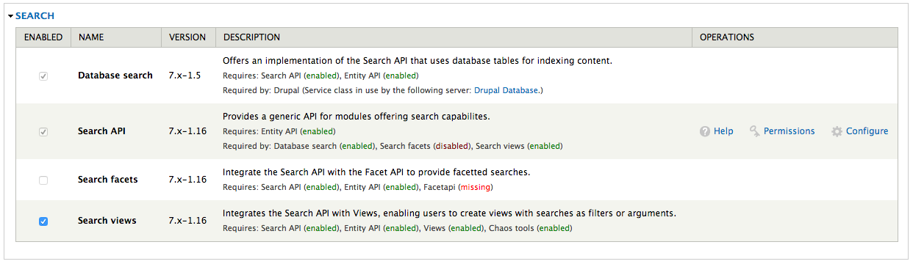

  Screenshot Modules enable page with Database Search, Search API and Search views enabled.

Alternatively, installation can be accomplished on the command-line by executing the following drush commands inside of the Drupal directory:

.. code-block:: shell

  drush pm-enable search_api
  drush pm-enable search_api_db
  drush pm-enable search_api_views

Define your Search Backend/Server
---------------------------------

This tutorial covers using a basic Drupal database storage backend for your search. For large sites, it is recommended to use Elastic Search or Apache Solr. First, we need to tell the Search API where we want our index stored.  Navigate, to the configuration page for the Search API. You can either click on the **Configure** link shown in the above screenshot or navigate to ``Configuration > Search API`` through the administrative toolbar. You should see the following screen:

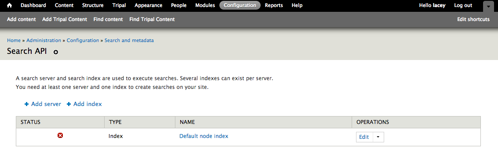

Before proceeding, consider deleting the "Default node index". We don't need it.  Next, click the **Add Server link**.  We are configuring a basic drupal database search server we do not need to install any third-part software or set-up an external server. Instead, fill out the configuration form to tell the Search API to use its own database to store the search index.  Give this server the name "Drupal Database" and select "Database service" from the **Service Class** drop down.  In the **Database Service** section, select  "Search on parts of a word." If the search is slow due to this feature, then it is an indicator that your site should use a different service class (ie: Elastic Search or Apache Solr). Click "Create Server" to finish configuring the Search backend.

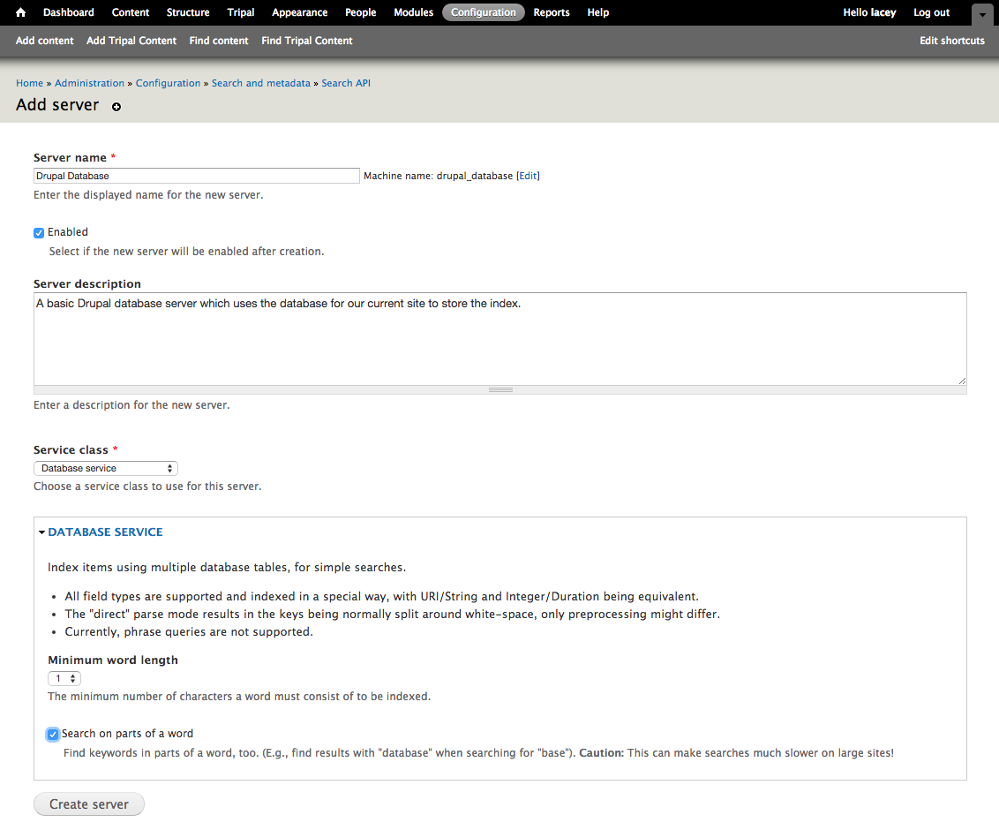

You should see the following screen--assuming all went well. Click on Search API link at the top of the screen (circled in the screenshot below) to return to the **Search API** configuration screen.

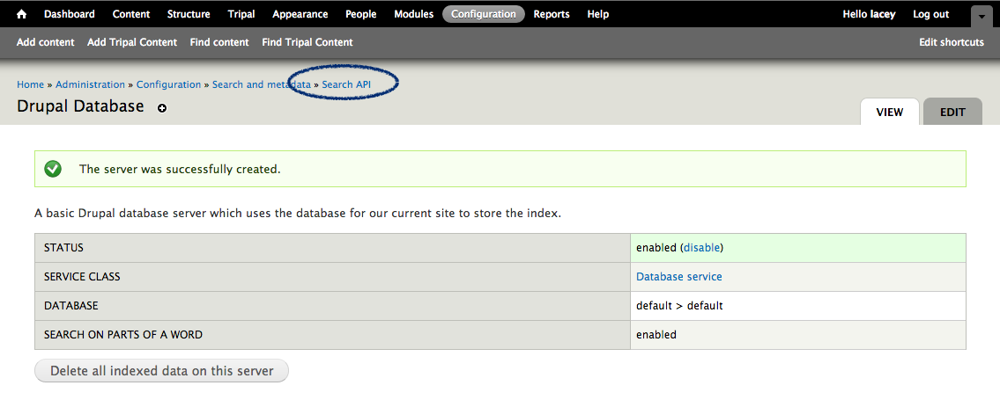

Define a Search Index
---------------------

Now that we have created a server where the Search API will store our index, we have to define the index itself.  On the Search API Configuration page click on the **Add index** link. The resulting page appears in the following screenshot. Name your index something descriptive. Consider including the word "search" somewhere in the name as this name will be used when setting up the search form/listing (view). For example, enter the name "Tripal Content Search." Next, select "Tripal Content" as the **Item Type**. The item type defines what content types should be indexed. One thing to keep in mind, is that the Search API currently does not support multi-entity (ie: Both Tripal and Node content) search in the same index without the `Search API Multi-index Search <https://www.drupal.org/project/search_api_multi>`_ extension module. Notice that we didn't check any of the **Bundles**. By not selecting bundles, this ensures that all Tripal Content will be indexed by the search. Finally, select from the Server dropdown the server created in the previous step and click the Create Index button.

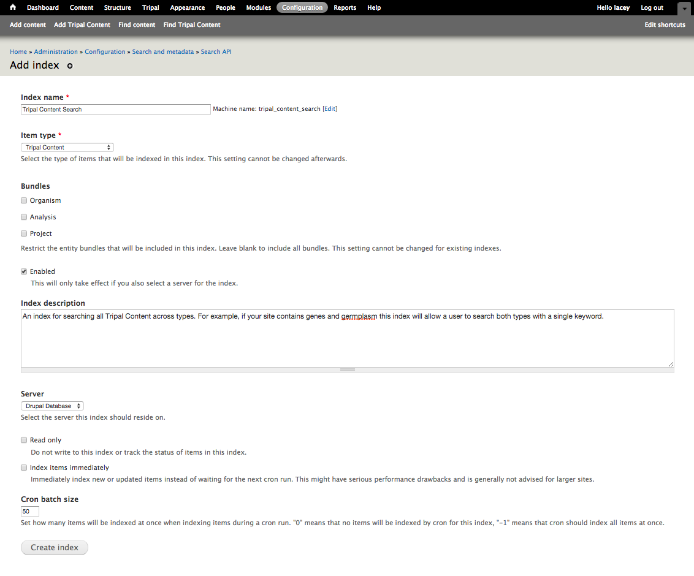

Next we need to configure which fields should be indexed. You will be presented with a very long list of fields (the length is dependent on how many Tripal Content types you have). First, scroll to the bottom of the list and expand the **Add Related Fields** fieldset. If you are interested, add any additional fields first before checking boxes of fields above.  Otherwise it may cause you to lose selection you've already made.  Next, check the box beside each field you would like to be searched.  Unfortunately, the interface does not indicate which fields are used per content type.  Save your selection.

The first few fields will be present for all Tripal Content Types (ie: Content Id, Type, Bundle, etc, as shown in the blue box of the screenshot below), Notice, that for some checked fields there is a boost drop-down. The **boost** drop-down influences the "relevance" that a search result will have. By increasing the boost for the title indicates "if the user's keywords are in the title it is more likely this content is the one they're looking for". Because we want titles and contnet types (i.e. bundles) highly searchable, set the boost 5 for these (see screenshot below).

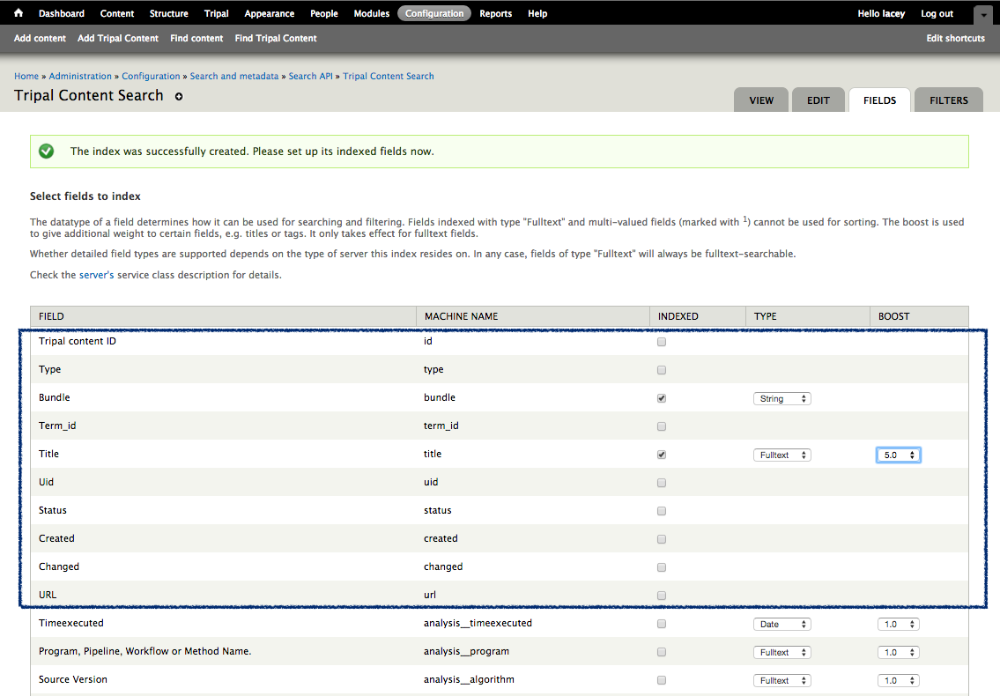

After the first set of general fields, we see the list of content type specific fields.  Select fields that are appropriate for your own site and content. For full searchability, select most (if not all) of these fields. Keep in mind the number of fields selected affects the size of your index. If you know there is no useful information in a given field then do not select it. You can return later and edit the selected fields at a later date (although it does require re-indexing your site). The most important consideration at this point is what boost to apply to the various fields. As a rule of thumb, give a modest boost (but not as high as the title; e.g. set a boost of 3) for name fields and a default boost otherwise. You may want to apply a negative boost to fields users are extremely unlikely to search (but that you may want to use in facets) or that are likely to produce false positives (e.g.: analysis program version). Once you are done, click on "Save Changes".

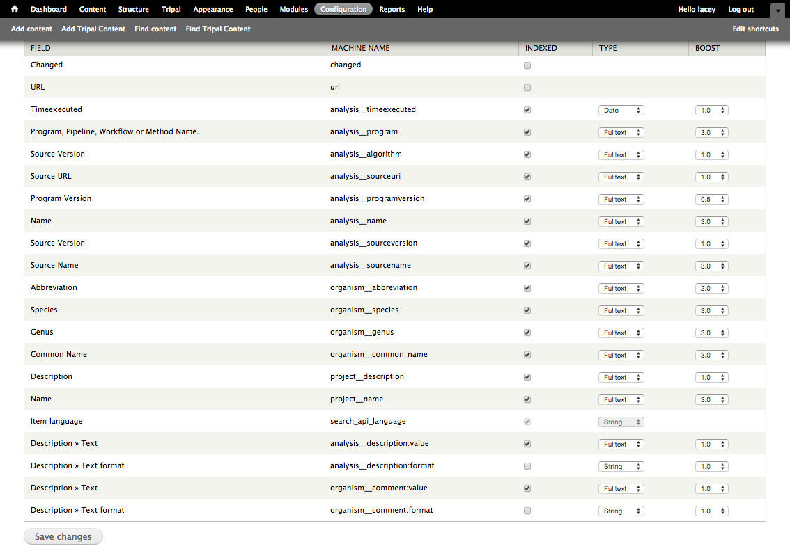

After saving our fields we are redirected to the **Filters** tab.  Finally, (last step for creating the index!), pick the extra features you would like supported.  For now we will ignore the **Data Alterations** section.  However, we will set some items in the **Processors** section. Keep in mind that the order you select processors is important (i.e.: if you have html filter after highlighting then it will remove your highlighting). We would like to provide case-insensitive searching with searched words highlighted.  To do this, select **Ignore case**, **HTML Filter** and **Highlighting** in that order.  You may want to add **Tokenizer** if you are indexing any long text fields because errors can occur if the default tokenize can sometimes fail with long words.  Click "Save Configuration".

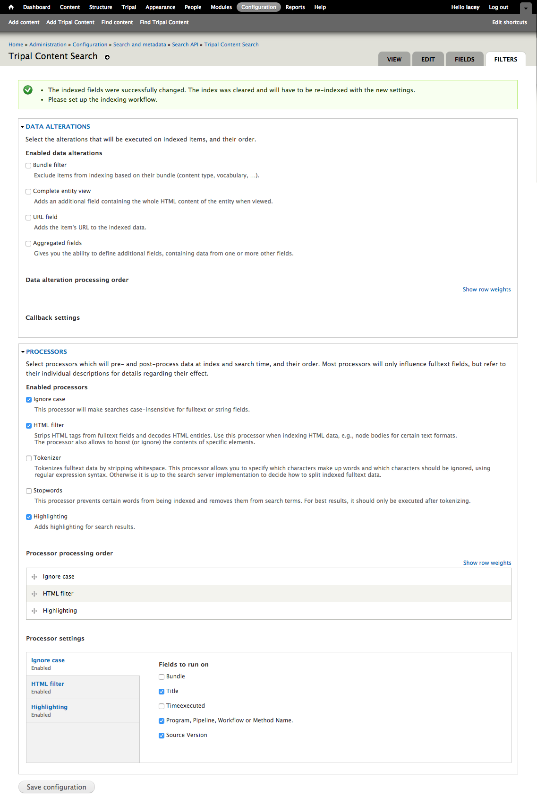

Your index is now scheduled for building! Depending upon the amount of content you have, this could take awhile as it will only index 50 pages of Tripal content per `Drupal Cron <http://tripal.info/tutorials/v3.x/installation/job-automation>`_ run. If you click the view tab you can see the progress on the indexing process. You can return to this screen in the future from the main Search API configuration page and clicking on the name of the index.

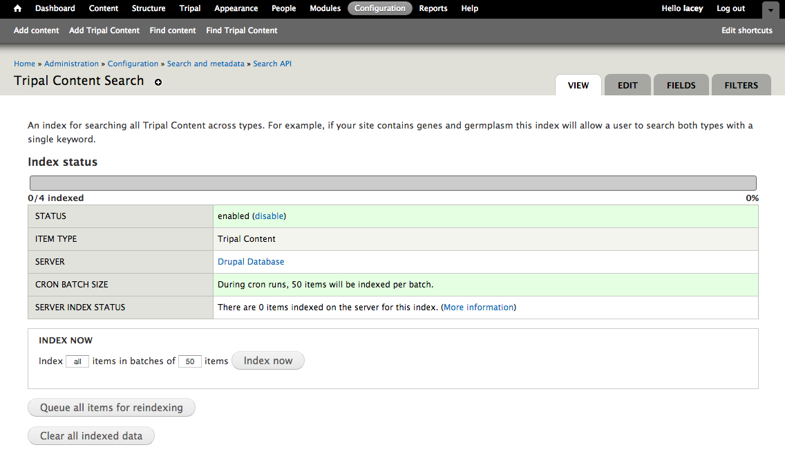

Creating a Search Interface for your users
------------------------------------------

At this point you should have an index for your Tripal Content. However, you still have not created any functionality for end users—the data might be indexed, but they can't search it, yet. To create the Search page we are going to use views. Start by going to the Views Administration UI (**Structure > Views**) and click on **Add new view.**

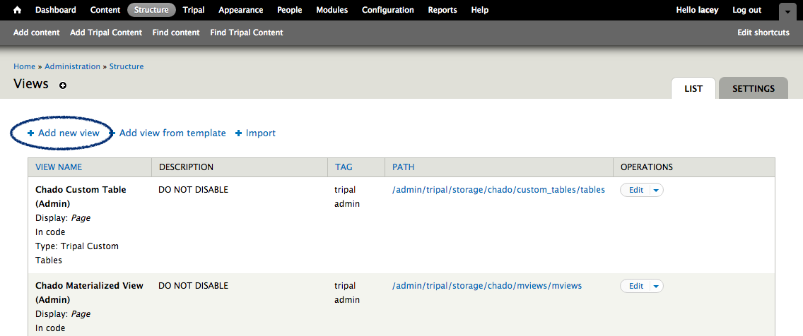

Name it something descriptive (e.g. Search Biological Data) as this will show up in the administrative listing. For the view type (the drop-down beside **Show**) select the name of the index you created in the last step (e.g.: Tripal Content Search). Name the page something helpful to the user (avoid the word Tripal and describe the data instead; e/g.: "Search Biological Data") and then change the path (e.g. ``search/biological-data``). Click **Continue & edit.**

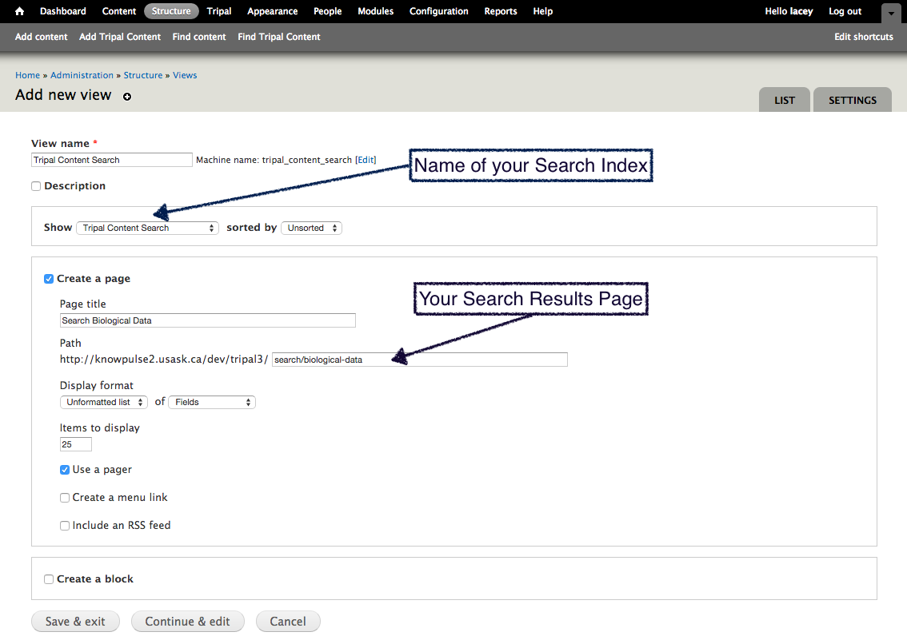

Next,  will appear is the Edit Views UI which can be intimidating, even if you've been introduced to it before. With that in mind the following screenshot attempts to orient you to the parts of the UI we will use in reference to a search form/results.  This tutorial  will address **Fields**, **Filters** and **Sort Criteria**.  It is not necessary to understand more except to point out that you should focus on the left side of the UI when looking for the sections discussed below.

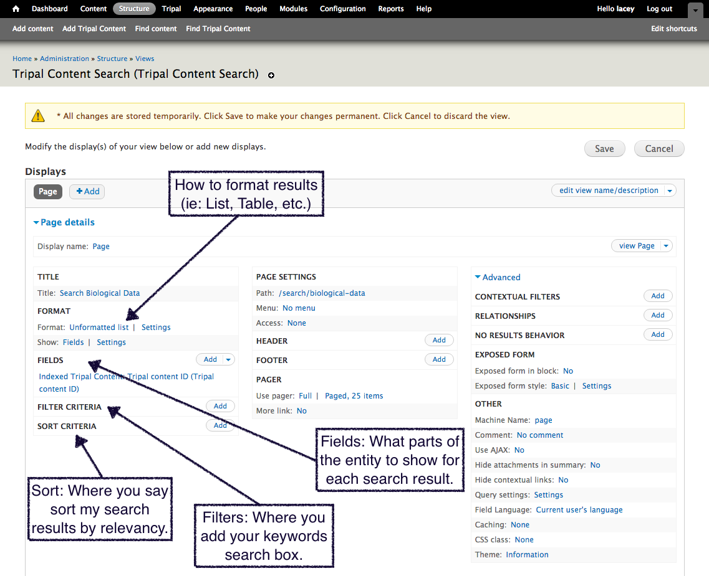

.. note::

  Make sure to save your view periodically by clicking on the "Save" button at the top of the page.

Configuring What is displayed for each Search Result
----------------------------------------------------
 
First, we are going to change what is displayed for each result. By default just the unique identifier is displayed which of course is not useful to the user. We want to hide that field by clicking on its name, **Indexed Tripal Content: Tripal content id** which opens the configuration pop-up and then checking **Exclude from display**. Since we will be using this field to create our link, we also want to change the **Thousands marker** to **-None-**.  Click **Apply (all displays)** to save these changes.

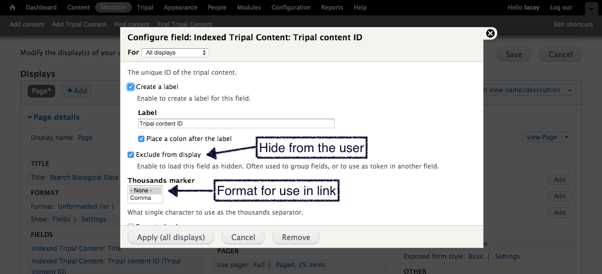

Next, click on the **Add** button beside the fields title to open the **Add Fields** pop-up shown in the next screenshot. For this tutorial our search results are going to include the title linked to the content and the highlighted "context" of the search. To add the title, scroll through  the fields and click the checkbox beside **Indexed Tripal Content: Title**.  Be sure the item description reads **Tripal content "title" property** as there may be other title fields (e.g. for publications).  Click **Apply (all displays)** to add this field to the view.

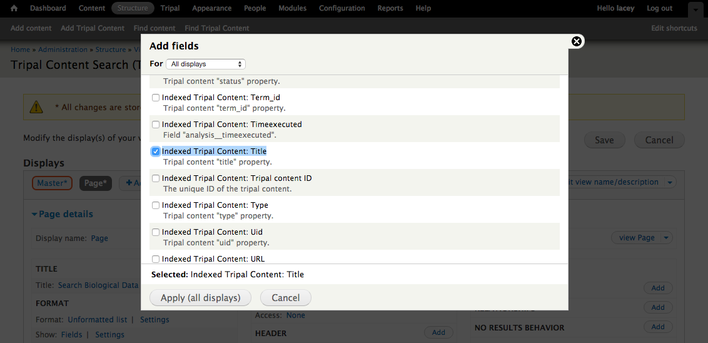

Next, the configuration form for the field is shown. We do not want a label so uncheck the box titled **Create a label**. We want our title to appear as a link to the content, so expand the **Rewrite Results** field set, check **Output this field as a link** and set the link path to ``bio_data/[id]``. This uses tokens to fill in the unique identifier and use it to create the path to the entity for each search result.  Click the **Apply (all displays)** button to save these settings.

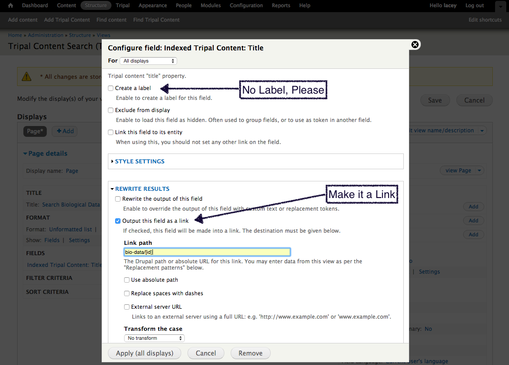

Next, we want to add the highlighted search context. To do this click on the **Add** button again but this time set the **Fields** drop-down to **Search** and check **Search: Excerpt**.  Again, click the **Apply (all displays)** button to continue to the configuration pane. On configuration, again, remove the label and apply the settings.

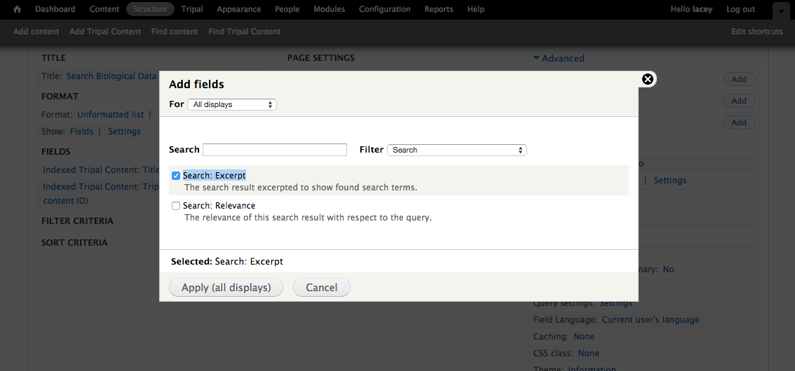

On the resulting page, be sure to uncheck the box **Create** a label just as you did for the Title.

Now that we have a title and excerpt in our Fields section, if you click on the **Update Preview** button you will see a list of titles for your content and then emptiness underneath each title since there was no keyword entered yet so an excerpt could not be generated.

Adding the Keywords Search Box
------------------------------

Click on the **Add** button beside **Filter Criteria** and in the resulting pop-up, select **Search** for the filter and then check **Search: Fulltext Search**. Click the **Apply (all displays)** button to add the filter.

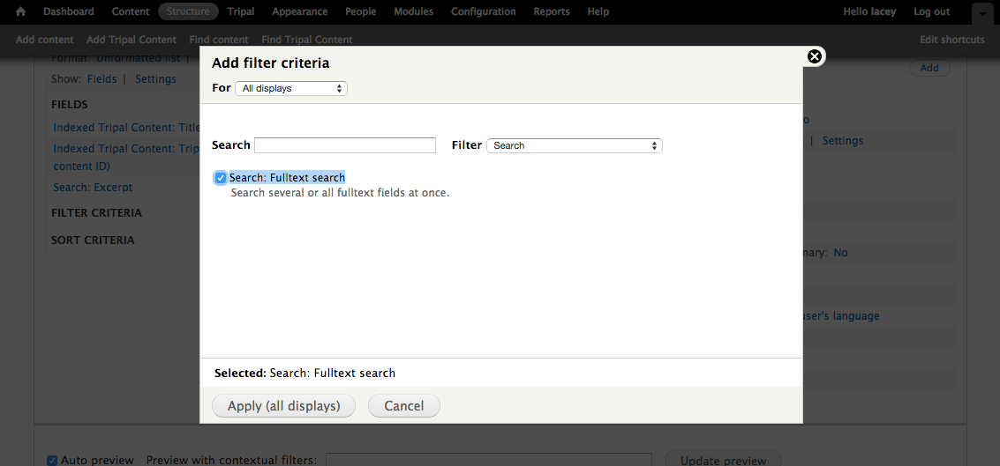

In order to let the users see a field for searching, we need to expose this filter. We do that by clicking the checkbox beside **Expose this filter to visitors...** on the filter configuration form. We also want to change the **Label** to **Keywords**. Other then those two changes, the defaults will work so click the **Apply (all displays)**.

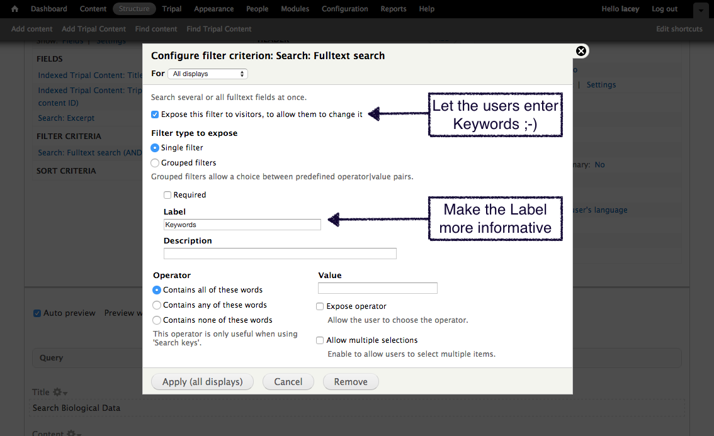

Save your view and navigate go to the new search page you created with this new view.  The page will be accessible at the URL ``http://[your-site-url]/search/biological-data``. You will see a text box titled **Keywords** and if you enter a valid keyword and click **Apply** then filtered results with context highlighting will appear!

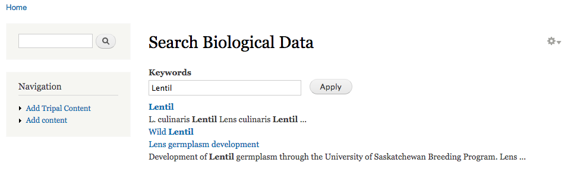

Sort by "Relevance"
-------------------

Next, we want to sort our results.  To do this, return to the view configuration page.  Click on the **Add** button beside **Sort Criteria** and in the pop-up select **Search** in the **Filter** drop-down.  Next, check the **Search: Relevance** field. Apply it and configure it to **Sort descending** so that higher scoring results are shown first.  Apply the the configuration settings.

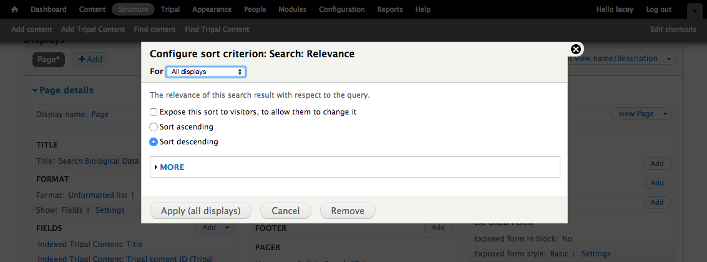

Only Show results when user clicks Search
-----------------------------------------

Finally, we do not want search results to automatically appear. We want the user to click the **Apply** button on the search form first. To do this use the right-side of the Views UI to expand the **Advanced** field set and under **Exposed Form** click on **Exposed form Style: Basic**. Change the setting  to **Input Required** and click **Apply**. In the following configuration page change the **Submit button** text to "Search", and uncheck **Expose Sort** order.

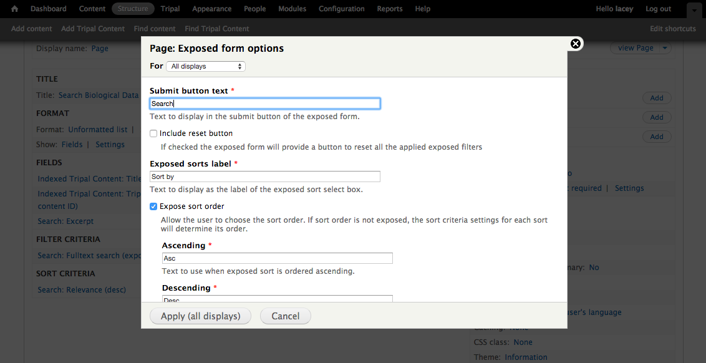

Now Save your view -You're Done!

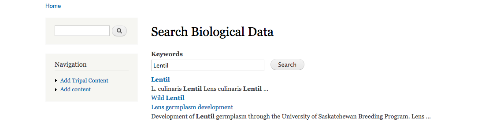
