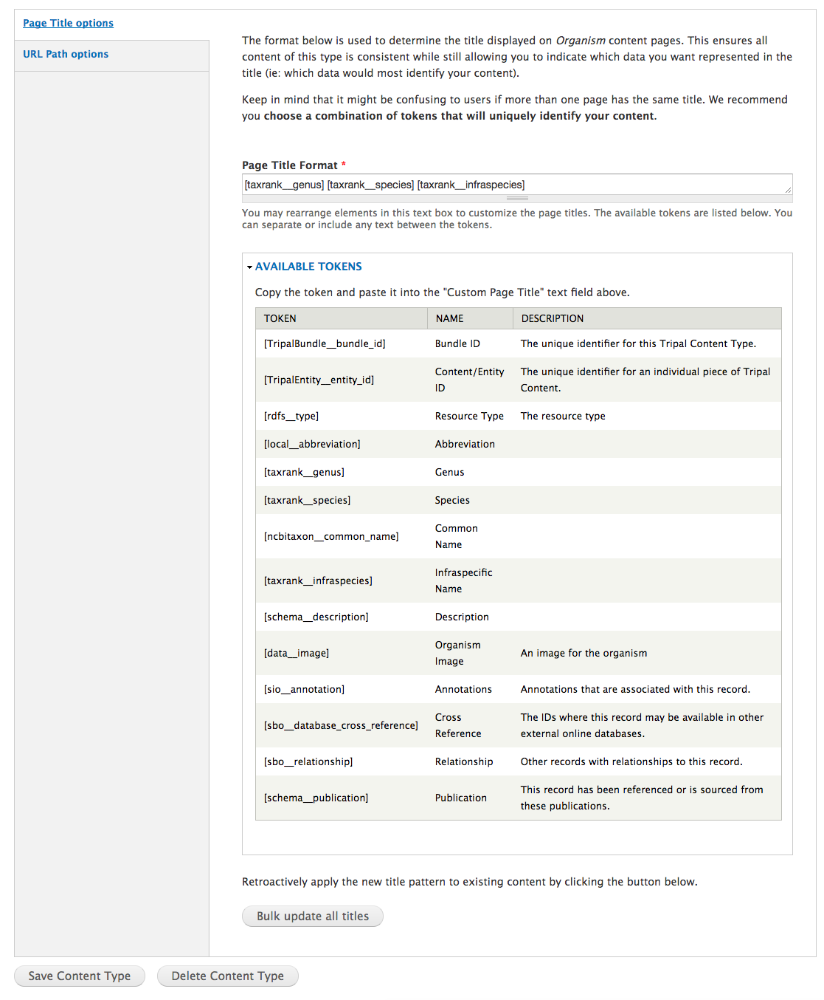
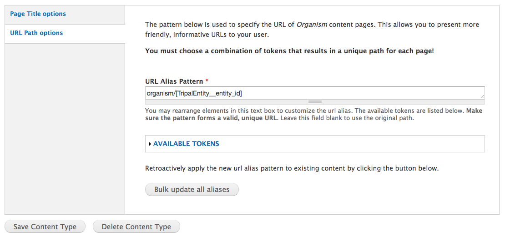

Setting Page Titles and URLs
=============================

Tripal allows for Page Titles and URLs to be set within the Tripal Content type editing interface. This provides the ability to construct consistent url patterns and titles across your site.

Setting Page Titles
-------------------

Page titles can be set within the edit mechanism of the Tripal Content type. This can be found on the **Structure → Tripal Content Types** and click the **edit** link for the desired content type. Scroll to the bottom of the page to the **Page Title options** tab.

The page title format can be generated using a combination of token. When titles are generated for a new page, the tokens are replaced with the appropriate field values to which they refer. A list of available tokens can be found under the **Available Tokens** link.

.. note::

	We recommend you choose a combination of tokens that will uniquely identify your content.

If you already have content within your site and need to update all page titles you can choose to **Bulk update all titles**. This will update all titles for the existing content that belong to this type. If your title is used to build your alias you will also need to **Bulk update all aliases**.

Setting URLs
------------

URLs, also known as aliases, can be found just by selecting the **Page Title options** tab. The URL pattern can be generated using a combination of token. The tokens can be found under the **Available Tokens** link. If you already have content within your site and need to update all URLs you can choose to **Bulk update all aliases**. This will update all existing URLs for all pages of the content type . It will also create redirects from the old URL to the new URL to ensure 404s and broken links are not created.

