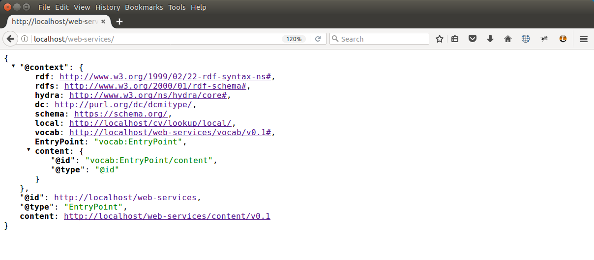
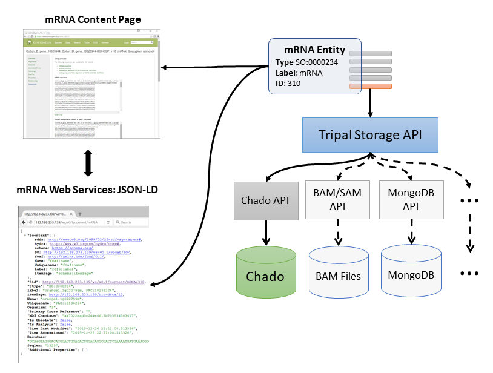
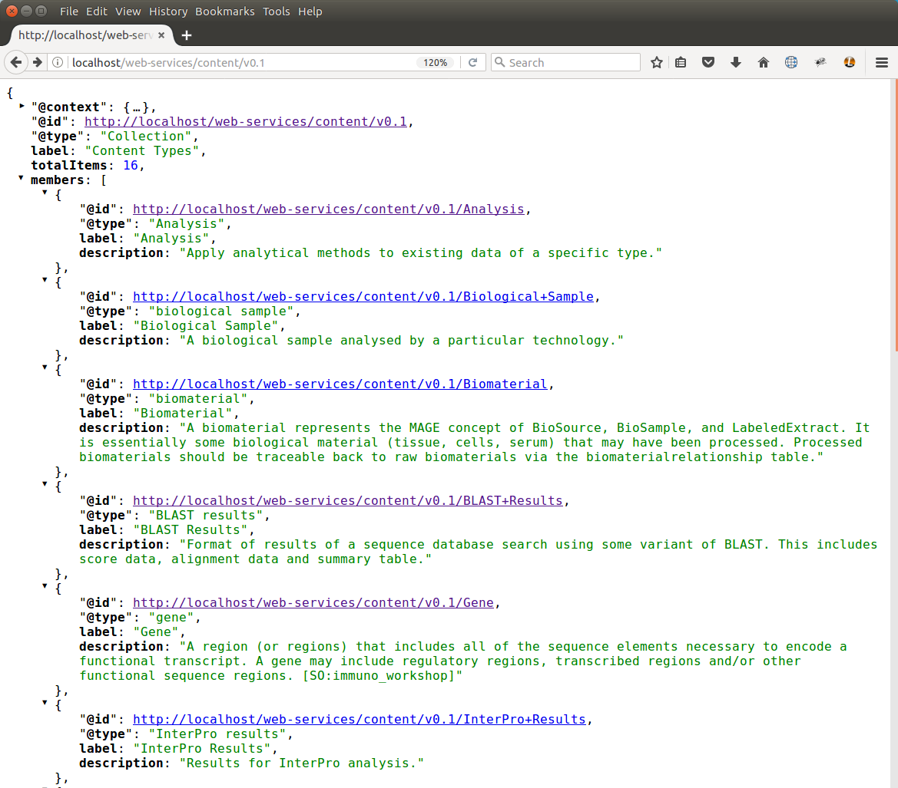
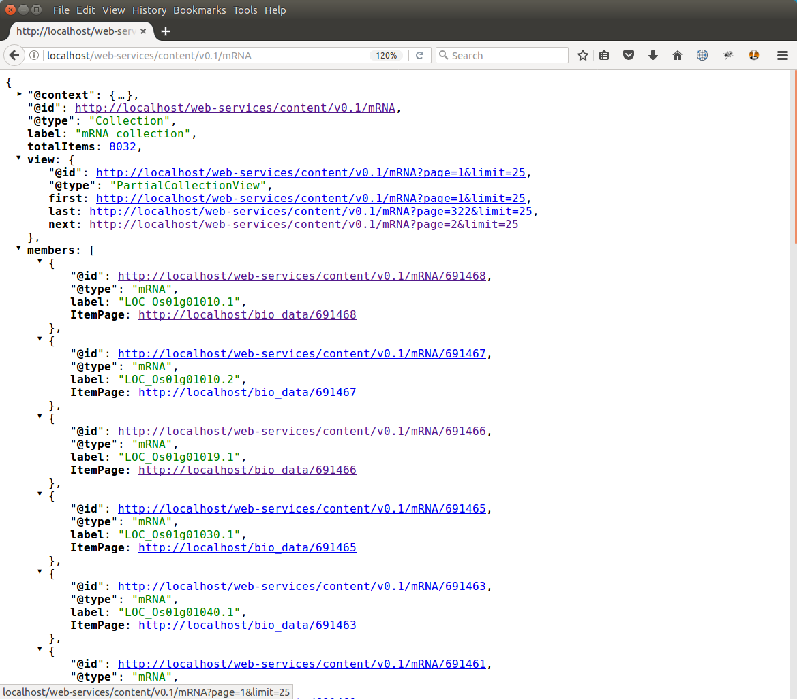
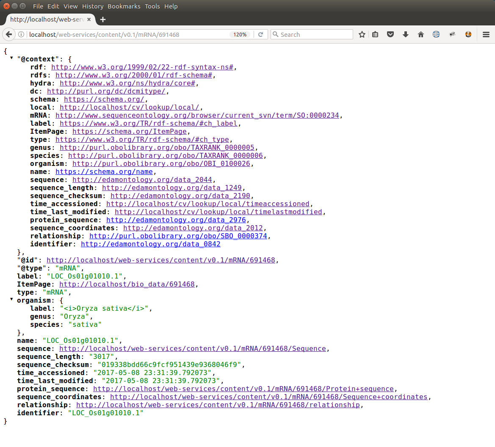
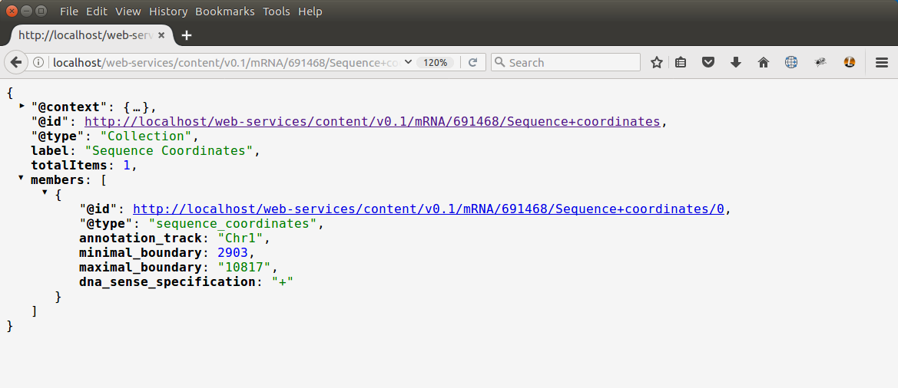

Web Services
============

.. note::

  Remember you must set the ``$DRUPAL_HOME`` environment variable if you want to cut-and-paste the commands below. See :doc:`./install_tripal/drupal_home`

Overview
--------

New in Tripal v3 are `RESTful web <https://en.wikipedia.org/wiki/Representational_state_transfer>`_ services.  These web-services are designed to support the following:

1. Allow end-users to access data programmatically using any language of their choice.
2. Allow Tripal sites to share data among themselves.

Tripal v3 now comes with a **tripal_ws** module that provides web services.  Once enabled, any Tripal v3 site instantly provides a RESTful web service that can access all publicly available data.  Additionally, web services for Tripal are meant to be:

1. Fully discoverable
2. Searchable
3. Provide access to the same data as that which appears on the visible content pages.
4. Adjustable via Drupal's content management interface (i.e. no programming required for existing content)
5. Provide a programmers API for easy addition of new content.
6. Share data the way scientists expect to see it.
7. Use controlled vocabularies to ensure maximal interoperability.

Within the current v3.0 release of Tripal web services are limited to read-only access of already publicly available content.  For the future the following is planned for  web services:

1. Authenticated data management: creation, deletion and editing of resources via the API.
2. Full implementation of the `Hyrda Core Vocabulary <https://www.hydra-cg.com/spec/latest/core/>`_ specification to provide full discover-ability.

Enable Web Services
-------------------

To enable web services, simply install the ``tripal_ws`` module, either using the module installation interface within Drupal's administrative pages, or on the command-line using Drush:

.. code-block:: shell

  cd $DRUPAL_HOME
  drush pm-enable tripal_ws

Exploring Web Services
----------------------

Once enabled, web services are immediately available on your site at the URL  ``http://[your.site.name]/web-services/`` (replace [your.site.name] with the address and path of your Tripal site). Web services are meant to be accessed programmatically, but they can be easily explored using a web browser such as with the `Firefox browser <https://www.mozilla.org/en-US/firefox/>`_ and `JSONView <https://jsonview.com/>`_ extension enabled.  For example, the following screen shot shows an example Tripal site with the data loaded following the Setup of an Example Genomics Site instructions of this User's Guide.

This initial resource "home page" of the web services returns results in `JSON format <http://www.json.org/>`_.  When using the JSONView extension within Firefox you can explore web services by clicking the links that are present in the browser.

Structure of a Web Service Response
-----------------------------------

The initial response in JSON is in the `JSON-LD format <https://json-ld.org/>`_ where the LD means Linked Data.   For example:

.. code-block:: json

    {
    "@context": {,
      "rdf": "http://www.w3.org/1999/02/22-rdf-syntax-ns#",
      "rdfs": "http://www.w3.org/2000/01/rdf-schema#",
      "hydra": "http://www.w3.org/ns/hydra/core#",
      "dc": "http://purl.org/dc/dcmitype/",
      "schema": "https://schema.org/",
      "local": "http://localhost/cv/lookup/local/",
      "vocab": "http://localhost/web-services/vocab/v0.1#",
      "EntryPoint": "vocab:EntryPoint",
      "content": {
        "@id": "vocab:EntryPoint/content",
        "@type": "@id"
      }
    }
    "@id": "http://localhost/web-services",
    "@type": "EntryPoint",
    "content": "http://localhost/web-services/content/v0.1"
  }

A notable component of JSON-LD is the **@context** sub array.  It is within this **@context** section that the "meaning" of the data becomes apparent and where the Linked Data is implemented.  Tripal's use of linked data is to take advantage of controlled vocabularies or otologies to unambiguously identify the meaning of each element of the response.  By using controlled vocabularies to qualify all data, it  becomes possible to exchange data between sites or within a client program while limiting confusion as to the meaning of the data.  Therefore, words that are used as the keys key/value pairs will always be defined in the @context section.  For example, all of the vocabularies whose terms are used to qualify data on the site are identified in the **@context** section with URLs.  Some of these vocabularies include:  rdf, rdfs, hydra, schema, etc.

There are two other special keys used in the JSON-LD response.  These are the **@id** and **@type** keys.  The **@id** indicates the unique URL for this resource and becomes a unique name for the resource.  In the example screenshot above, the **@id** of the initial page of web services is ``http://localhost/web-services``.  This URL will always refer to the initial page for Tripal web services on the given site.  The **@type** identifier specifies what type of resource this URL provides.  In this example, the type is **EntryPoint**.  If a client program is unsure as to what an **EntryPoint** is, then that information is provided in the @context section.  The following line indicates that the term **EntryPoint** expands to the vocabulary term:  vocab:EntryPoint

.. code-block:: json

  "EntryPoint": "vocab:EntryPoint",

Here we learn tha the term **EntryPoint** belongs to the vocab resource.  If we look at the vocab entry in the **@context** array then we can find a link to that resource.  A human can follow that link to examine the vocab resource and find the term that it provides.  A client program can use that information to uniquely identify the term.  By default, Tripal provides the **vocab** vocabulary which uses an implementation of the `Hydra Vocabulary <https://www.hydra-cg.com/spec/latest/core/>`_.

Finally, all other entries in the JSON-LD response are key/value pairs that provide **properties** about the resource.  In the example above, only the **content** property is available.  A property can be a scalar value (i.e. number, character string) or a link to another resource.

Primary Services
----------------

By default, the only resource that Tripal provides at the initial response level is the content resource.  Any resource at this level is hereafter referred to as primary service.  Tripal is design to allow new web-services to be added to it.  These will be more formally described in the Tripal v3 Developer's Handbook.  In short, a primary service provides a variety of data and services for related content and function.   Each primary resource has a version number to help ensure backwards compatibility as new web services are developed and updated.  For example, the default content service currently has a version of v0.1:

.. code-block:: json

  "content": "http://localhost/web-services/content/v0.1"

The Content Service
-------------------

The content service provided by Tripal shares all publicly available content.  The content that appears on a page is the same content that appears in web services.  A major change in the design of Tripal from v2 to v3 is that all data is organized via controlled vocabularies.  The following diagram demonstrates how this is implemented.  For example the mRNA term comes from the `Sequence Ontology <http://www.sequenceontology.org/>`_.  It's unique term accession is SO:0000234.  Every content type in Tripal consists solely of a type (e.g. mRNA or SO:0000234), it's associated label (e.g.  mRNA) and a numeric id unique to each Tripal site.  The ID is what uniquely identifies every content in Tripal.  Each unique content with these three attributes is referred to as an **Entity**.  All other data associated with a given entity are called **Fields**.  Example fields for an mRNA content type may be the name of the mRNA, a unique name, the coding sequence, the coordinates on the reference genome, etc.  In the diagram below, these fields are the rectangular boxes that jut out of the mRNA entity.   These fields can be "attached" to an entity by Tripal and data can come from any storage backend.  The data that appears on a page and the data in the content service is taken from the same entity and therefore end-users and clients have access to the same data.

Content Type Listing
--------------------

When the content service is accessed, the response is always a listing of all available content types on the site.   Site administrators can create new content types by following the Create Content Types section of this tutorial.  By default, Tripal is installed with several commonly used content types, but new ones can be created as needed for the site.  Whenever a new content type is created it immediately is available via the content service, and these content types can be found at the path:  ``/web-services/content/v0.1``.  Below is an example screenshot of the resulting JSON from an example site:

Note that the **@type** for this listing is a Collection and the label is **Content Types**.  Each content type has a unique **@id**, a **@type** indicating the term that describes it and a brief description.  The **@id** serves as a URL to obtain further details about that content type.   Also, notice in the above screenshot that the **@context** section is minimized, but as usual, each of the terms used in the key/value pairs are fully qualified in that section.   This JSON-LD response also indicates the total number of content types available.

Content Type Members (Entities)
-------------------------------

The members or entities that belong to a content type are found at the path:  ``/web-services/content/v0.1/{name}`` where {name} is the name of the content type.  The {name} field must be identical to the label field from the content type listing shown previously.   For example, the mRNA content type  path would be   ``/web-services/content/v0.1/mRNA``.  This resource provides a listing of all members for that content type.   The following shows the response for an mRNA listing:

Note that the **@type** is also a Collection byt the label is 'mRNA collection'.  To maintain a small response, the results of content member listings is usually paged such that only a subset of members is shown.  In this example, there are 8032 mRNA entities available, but only 25 are shown.  Notice the view term.  It contains several sub elements named first, last and next. These provide navigation links that can be used by a client application to iterate through all entities.  The structure of these links is as follows:

``/web-servies/content/v0.1/{name}?page={page}&limit={limit}``

A client application can therefore navigate through the list of entities by substituting the {name} of the content type, the desired {page} to show (the first page is always 1) and the number of records to show as specified by {limit}.  If a client wanted to retrieve the IDs of all 8032 mRNA of this example, then the following path could be used:

``/web-servies/content/v0.1/mRNA?page=1&limit=8032``

Content (Entity) Resource
-------------------------

Each entity is accessible via the path: ``/web-services/content/v0.1/{name}/{id}``.   Here {name} continues to refer to the name of the content type (e.g. mRNA) and {id} refers to the unique numeric ID for the entity.  In this example an mRNA entity would result in a JSON-LD response like the following:

In the JSON shown above, note that all of the key/value pairs used are referenced in the **@context** section  Also, notice that some key/value pairs contain data while others contain URLs.  Tripal is optimized to not load every attribute.  For example, sequence data for some content type may be large.  By providing a URL for the data, it keeps the response small but allows clients to access that information via the provided URL.   For example, if the URL for the **sequence_coordinate** attribute were followed the following response could be seen:

Here the client can obtain the necessary information about the coordinates on the genome for this particular mRNA entity.

Searching for Content
---------------------

Currently, Tripal provides the ability to search for content via web services by crafting URLs on content type members pages.   By default, the path for content type listings is:

``/web-services/content/v0.1/{name}``

Where {name} is the label assigned to the content type (See the Content Type Members section above).   Using this path, clients filter content to a specific content type.  But further refinement is possible.  As a reminder, each member (or entity) on the content type members collection appears similar to the following:

.. code-block:: json

  {
    "@id": "http://localhost/web-services/content/v0.1/mRNA/691468",
    "@type": "mRNA",
    "label": "LOC_Os01g01010.1",
    "ItemPage": "http://localhost/bio_data/691468"
  },

When retrieving the data for a specific entity something similar to the following (for our mRNA example) may be seen:

.. code-block:: json

  "label": "LOC_Os01g01010.1",
  "ItemPage": "http://localhost/bio_data/691468",
  "type": "mRNA",
  "organism": {
      "label": "<i>Oryza sativa</i>",
      "genus": "Oryza",
      "species": "sativa"
  },
  "name": "LOC_Os01g01010.1",
  "sequence": "http://localhost/web-services/content/v0.1/mRNA/691468/Sequence",
  "sequence_length": "3017",
  "sequence_checksum": "019338bdd66c9fcf951439e9368046f9",
  "time_accessioned": "2017-05-08 23:31:39.792073",
  "time_last_modified": "2017-05-08 23:31:39.792073",
  "protein_sequence": "http://localhost/web-services/content/v0.1/mRNA/691468/Protein+sequence",
  "sequence_coordinates": "http://localhost/web-services/content/v0.1/mRNA/691468/Sequence+coordinates",
  "relationship": "http://localhost/web-services/content/v0.1/mRNA/691468/relationship",
  "identifier": "LOC_Os01g01010.1"

As another reminder, when any of these attributes have a URL then further information about that attribute is obtained by following the URL. In the example below, the relationship term yields results similar to the following:

.. code-block:: json

  {
      "@id": "http://localhost/web-services/content/v0.1/mRNA/691468/relationship/0",
      "@type": "relationship",
      "clause_subject": {
          "type": "mRNA",
          "name": "LOC_Os01g01010.1",
          "identifier": "LOC_Os01g01010.1"
      },
      "relationship_type": "part_of",
      "clause_predicate": {
          "type": "gene",
          "name": "LOC_Os01g01010",
          "identifier": "LOC_Os01g01010"
      },
      "clause": "The mRNA, LOC_Os01g01010.1, is a part of the gene, LOC_Os01g01010."
  },

Here we see information that describes the relationship of the mRNA with its parent gene.  Almost all of the key value pairs shown in the responses above can be used to filter results.  But, attention must be paid as to the level that each attribute appears.  For example,  in the initial entity response above, the organism attribute has several sub terms that include genus, species and label.  The organism term appears as a first-level term and genus, species and label appear as a second-level term.  For relationships, the relationship is the first-level term but that term has a URL!  Tripal does not support filter by URLs.  However, we can use the terms from the results of that URL in our filter.  Thus, the clause_subject, relationship_type and clause_predicate  becomes a second-level terms, and within the clause_subject, the type, name and identifier become third-level terms.

You can easily search for specific entities by knowing these first, second, third, etc. -level terms.  The path for searching is as follows:

``/web-services/content/v0.1/{name}?{first-level}[,{second-level},...,{n-th level}]={value}[;{operator}]``

Here, {name} again refers to the content type name (e.g. mRNA).  The {first-level} placeholder refers to any term that appears at the first level.  Refinement can occur if a term has multiple sublevels by separating those terms with a comma.  The {value} placeholder should contain the search word.   The {operator} placeholder lets you specify the operator to use (e.g. greater than, less than, starts with, etc.).  The {operator} is optional and if not included all searches default to exact matching.   As an example, the organism term has sever second-level terms.  If we wanted to filter all mRNA to include only those from the genus Oryza we could construct the following URL:

``/web-services/content/v0.1/mRNA?organism,genus=Oryza``

Multiple search criteria can be provided at one time, by repeating the search construct as many times as needed and separating with an ampersand character:  &.  For example, to filter the mRNA to only those from Oryza sativa the following URL would be constructed:

``/web-services/content/v0.1/mRNA?organism,genus=Oryza&organism,species=sativa``

The examples provided thus far expect that you are searching for exact values.  However, you can specify different search operators such as the following:

* Numeric Values
    * equals: eq
    * greater than: gt
    * greater than or equal to:  gte
    * less than: lt
    * less than or equal to: lte
    * not equal to: ne
* Text values
    * equals: eq
    * contains: contains
    * starts with:  starts

Following the path format specified above we set the operator.  For example,   We can use the label as our second-level search term and require that it start with Oryza to find all of the mRNA that belong to the genus Oryza:

``/web-services/content/v0.1/mRNA?organism,label=Oryza;starts``

Finally, you can control ordering of the results by constructing a PATH following this format:

``/web-services/content/{name}?{search filter}&order={term}|{dir}[;{term}|{dir}...]``

Here {search filter} represents the filtering criteria as defined above (keeps the path format from getting extremely long in this document), {term} represents the full term "path" which if it has multi-level terms those levels are separated by a comma (e.g. organism,genus); and {dir} represents the direction of the order and can be **ASC** or **DESC** for ascending and descending sorting respectively.  You may order results by as many terms as needed by separating them with a semicolon.  The order in which the terms are provided will dictate which term gets sorted first.  For example, supposed we want to search for all mRNA within the genus Oryza but order them by the species name.  The following URL construct would suffice:

``/web-services/content/mRNA?organism,genus=Oryza&order=organism,species|ASC``

To demonstrate multi term sorting, we could try to sort by the Genus as well, although, because we filtered by the genus that would be a useless sort, but it demonstrates use of multiple sort criteria:

``/web-services/content/mRNA?organism,genus=Oryza&order=organism,genus|ASC;organism,species|ASC``

Searching Limitations
---------------------

The ability to search by any term for any content type creates a powerful mechanism to find almost entity.  However there are two primary limitations:

1. Not all fields attached to an entity are conducive for searching. Images can be attached to entities, references to other websites, etc.  In these cases the search functionality for those fields has not been implemented.  Unfortunately, Tripal v3 does not yet provide a listing of which fields are not searchable.   That support will be coming in the future.
2. The format for constructing a search URL is  equivalent to  an AND operation.  For example, you can filter by genus and species but not by genus or species.  The addition of search criteria adds additional AND filters.

Hiding or Adding Content
------------------------

It is relatively easy to hide or add content to web services.  The 'Configuring Page Display' tutorial walks the user through the steps for adding fields to a page for display, removing them and organizing the placement of those fields on the entity's page.  That same interface is used for indicating which fields are present in web services.  When a field is hidden from a page it is likewise hidden from web services.  When a new field is added to a page it is  added to web services.  Folks who develop new fields for custom modules and share those with others should ensure that their fields implementations follow the design specifications.  If followed correctly then all fields will behave in this way.
